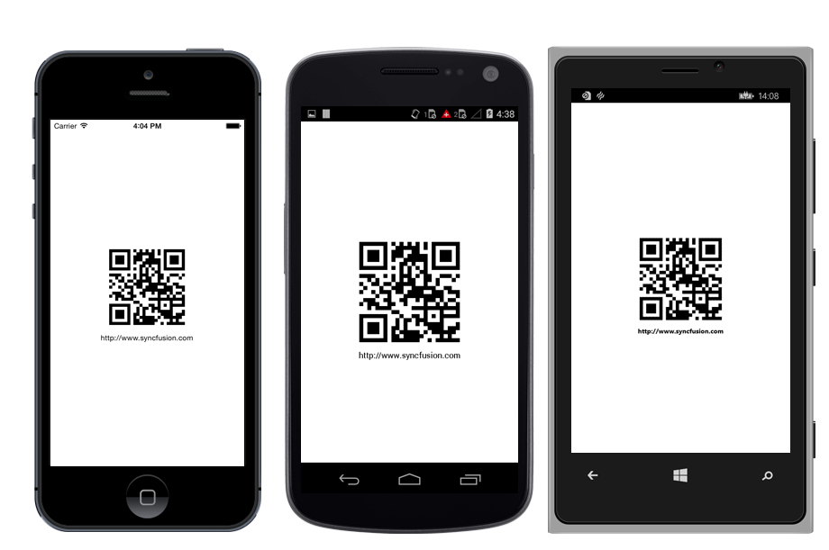
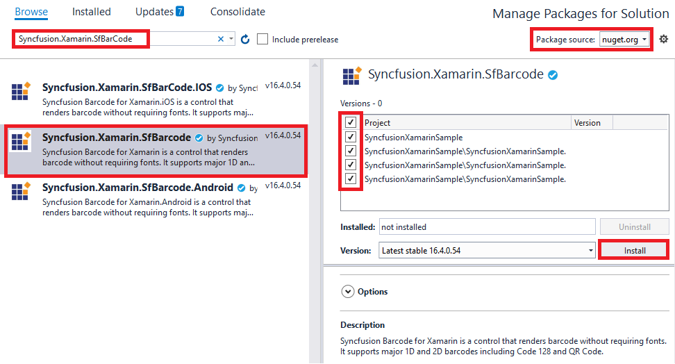

---

layout: post
title: Syncfusion SfBarcode control Getting Started for Xamarin.Forms
description: A quick tour to initial users on Syncfusion SfBarcode control for Xamarin.Forms platform
platform: xamarin
control: SfBarcode
documentation: ug

---

# Getting Started 

This section explains how to configure a Barcode for Xamarin.Forms application. The following screenshot illustrates the final output of barcode on iOS, Android and Windows Phone devices.

To get started with Essential Barcode, go through the following steps.

## Adding SfBarcode reference

You can add SfBarcode reference using one of the following methods:

**Method 1: Adding SfBarcode reference from nuget.org**

Syncfusion Xamarin components are available in [nuget.org](https://www.nuget.org/). To add SfBarcode to your project, open the NuGet package manager in Visual Studio, search for [Syncfusion.Xamarin.SfBarCode](https://www.nuget.org/packages/Syncfusion.Xamarin.SfBarCode), and then install it.

N> Install the same version of SfBarcode NuGet in all the projects.

**Method 2: Adding SfBarcode reference from toolbox**

Syncfusion also provides Xamarin Toolbox. Using this toolbox, you can drag the SfBarcode control to the XAML page. It will automatically install the required NuGet packages and add the namespace to the page. To install Syncfusion Xamarin Toolbox, refer to [Toolbox](https://help.syncfusion.com/xamarin/utility#toolbox).

**Method 3: Adding SfBarcode assemblies manually from the installed location**

If you prefer to manually reference the assemblies instead referencing from NuGet, add the following assemblies in respective projects.

Location: {Installed location}/{version}/Xamarin/lib

<table>
<tr>
<td>PCL</td>
<td>Syncfusion.SfBarcode.XForms.dll Syncfusion.Core.XForms.dll Syncfusion.Licensing.dll </td>
</tr>
<tr>
<td>Android</td>
<td>Syncfusion.SfBarcode.Android.dll Syncfusion.SfBarcode.XForms.Android.dll Syncfusion.SfBarcode.XForms.dll Syncfusion.Core.XForms.dll Syncfusion.Core.XForms.Android.dll Syncfusion.Licensing.dll </td>
</tr>
<tr>
<td>iOS</td>
<td>Syncfusion.SfBarcode.iOS.dll Syncfusion.SfBarcode.XForms.iOS.dll Syncfusion.SfBarcode.XForms.dll Syncfusion.Core.XForms.dll Syncfusion.Core.XForms.iOS.dll Syncfusion.Licensing.dll </td>
</tr>
<tr>
<td>UWP</td>
<td>Syncfusion.SfBarcode.UWP.dll Syncfusion.SfBarcode.XForms.UWP.dll Syncfusion.SfBarcode.XForms.dll Syncfusion.Core.XForms.dll Syncfusion.Core.XForms.UWP.dll Syncfusion.Licensing.dll </td>
</tr>
</table>

N> To know more about obtaining our components, refer to these links for [Mac](https://help.syncfusion.com/xamarin/introduction/download-and-installation/mac/) and [Windows](https://help.syncfusion.com/xamarin/introduction/download-and-installation/windows/).

I> Starting with v16.2.0.x, if you reference Syncfusion assemblies from the trial setup or from the NuGet feed, you also have to include a license key in your projects. Please refer to [Syncfusion license key](https://help.syncfusion.com/common/essential-studio/licensing/license-key/) to know about registering Syncfusion license key in your Xamarin application to use our components.

N> If you are adding the references from toolbox, this step is not needed.

Currently an additional step is required for Windows Phone and iOS projects. Create an instance of the Barcode custom renderer as mentioned.

Create an instance of `SfBarcodeRenderer` in MainPage constructor in of the Windows Phone project as shown



    public MainPage ()
    {
    ...
    new SfBarcodeRenderer();
    InitializeComponent();
    ...
    }



Similarly, create an instance of `SfBarcodeRenderer` in Finished Launching overridden method of `AppDelegate` class in iOS Project as follows.


    
    public override bool Finished Launching (UIApplication app, NSDictionary options)
    {
    ... 
    new SfBarcodeRenderer ();
    return base.FinishedLaunching(app, options);
    ...



## Configure the Barcode control

You can configure the Barcode control entirely in C# code or by using the XAML markup.

Here, the following steps illustrates how to create and configure a barcode.

1. Add reference to SfBarcode such as follows.




    xmlns:syncfusion="clr-namespace:Syncfusion.SfBarcode.XForms;assembly=Syncfusion.SfBarcode.XForms"




    
   
    using Syncfusion.SfBarcode.XForms;
    



2. Create an instance of `SfBarcode` in XAML or code-behind using the reference of `SfBarcode`.




    <syncfusion:SfBarcode/>





    SfBarcode barcode = new SfBarcode();
    



3. Then, you can assign the text that you want to encode.




    <syncfusion:SfBarcode Text="http://www.syncfusion.com"/>





    barcode.Text = " http://www.syncfusion.com ";




4. Specify the required `Symbology` to encode the given text. By default, the given text is encoded using Code 39 `Symbology`.




    <syncfusion:SfBarcode Text="http://www.syncfusion.com" Symbology="QRCode"/>



    
    barcode.Symbology = BarcodeSymbolType.QRCode;




5. For customizing the barcode, initialize the settings of corresponding barcode symbology.




    <syncfusion:SfBarcode Text="http://www.syncfusion.com" Symbology="QRCode">

    <syncfusion:SfBarcode.SymbologySettings> 

    <Syncfusion:SfQRBarcodeSettings XDimension="6"/> 

    </syncfusion:SfBarcode.SymbologySettings> 

    </syncfusion:SfBarcode>





    SfQRBarcodeSettings settings = new SfQRBarcodeSettings(); 

    settings.XDimension = 6; 

    barcode.SymbologySettings = settings;




6. Finally, the barcode is generated as displayed in the following screenshot for the following code example.




    <ContentPage xmlns="http://xamarin.com/schemas/2014/forms"

    xmlns:x="http://schemas.microsoft.com/winfx/2009/xaml"

    xmlns:syncfusion="clr-namespace:Syncfusion.SfBarcode.XForms;assembly=Syncfusion.SfBarcode.XForms"

    x:Class="BarcodeGettingStarted.SamplePage"> 

    <syncfusion:SfBarcode BackgroundColor="Gray" Text="www.wikipedia.org" Symbology="QRCode">

    <syncfusion:SfBarcode.SymbologySettings>

    <syncfusion:QRBarcodeSettings XDimension="6"/> 

    </syncfusion:SfBarcode.SymbologySettings>

    </syncfusion:SfBarcode> </ContentPage>




    public SamplePage() 

    { 

    InitializeComponent(); 

    SfBarcode barcode = new SfBarcode(); 

    barcode.BackgroundColor = Color.Gray; 

    barcode.Text = "http://www.syncfusion.com"; 

    barcode.Symbology = BarcodeSymbolType.QRCode;

    QRBarcodeSettings settings = new QRBarcodeSettings(); 

    settings.XDimension = 6; 

    barcode.SymbologySettings = settings; 

    this.Content = barcode; 

    }




