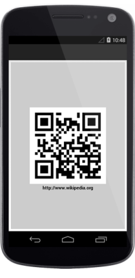
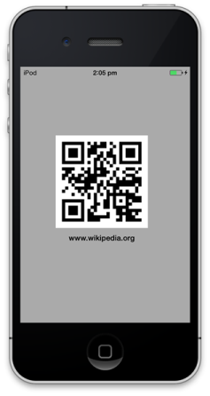

# Getting Started

This section explains how to configure a Barcode for Xamarin Forms application. 
The following screenshot illustrates the final output of barcode on iOS, Android and Windows 
Phone devices. 

To get started with Essential Barcode, go through the following steps.

## Referencing Essential Studio components in your solution

When you acquire Essential Studio components through the Xamarin Component Store interface from your IDE, after adding the components to your Xamarin.iOS, Xamarin.Android and WindowsPhone projects through the Component Manager, you have to manually reference the PCL (Portable Class Library) assemblies in the Xamarin.Forms PCL Project in your solution. You can do this manually by adding the relevant PCL assembly references to your PCL project contained in the following path inside your solution folder: 

Components/syncfusionessentialstudio-version/lib/pcl/

Alternatively, when you download Essential Studio from Syncfusion.com or through the Xamarin Store web interface, add all the assembly references manually.  

After installing Essential Studio for Xamarin, you can find all the required assemblies in the installation folders, typically:

{Syncfusion Installed location}\Essential Studio\12.2.0.40\lib

Example: C:\Program Files (x86)\Syncfusion\Essential Studio\12.2.0.40\lib

Otherwise, after downloading through the Xamarin Store web interface, you can find all the required assemblies in the following folder:

{download location}\syncfusionessentialstudio-version\lib

Then, you can add the assembly references to the respective projects as follows.

### PCL project

XForms\Syncfusion.SfBarcode.XForms.dll  

### Android project

Android\Syncfusion.SfBarcode.Andriod.dll

Android\Syncfusion.SfBarcode.XForms.Andriod.dll 

### iOS project

iOS\Syncfusion.SfBarcode.iOS.dll   

iOS\Syncfusion.SfBarcode.XForms.iOS.dll

### Windows Phone project

WinPhone\Syncfusion.SfBarcode.WP8.dll

WinPhone\Syncfusion.SfBarcode.XForms.WinPhone.dll

N> Essential Barcode for Xamarin is compatible with Xamarin. Forms 1.3.4.6332.

Currently an additional step is required for Windows Phone and iOS projects. Create an instance of the Barcode custom renderer as mentioned.

Create an instance of SfBarcodeRenderer in MainPage constructor in Windows Phone project as follows.

 

public MainPage()

{

    new SfBarcodeRenderer();

    InitializeComponent();

}



Similarly, create an instance of SfBarcodeRenderer in FinishedLaunching overridden method of AppDelegate class in iOS Project as follows.

  

public override bool FinishedLaunching(UIApplication app, NSDictionary options)

{

     new SfBarcodeRenderer ();

     return base.FinishedLaunching (app, options);

}



## Configure the Barcode control

You can configure the Barcode control entirely in C# code or by using the XAML markup.

Here, the following steps illustrates how to create and configure a barcode.

1.Add reference to SFBarcode such as follows.

 
      
xmlns:syncfusion="clr-namespace:Syncfusion.SfBarcode.XForms;assembly=Syncfusion.SfBarcode.XForms"
	


  
        
using Syncfusion.SfBarcode.XForms;
	


2.Create an instance of SfBarcode in XAML or code-behind using the reference of SfBarcode.

  

        

<syncfusion:SfBarcode/>
	


       

SfBarcode barcode = new SfBarcode();
	


3.Then, you can assign the text that you want to encode.

  

 
      
<syncfusion:SfBarcode Text="www.wikipedia.org"/>
	


        

barcode.Text = "www.wikipedia.org";
	


  

4.Specify the required symbology to encode the given text. By defau<, the given text is encoded using Code 39 symbology.

  

 

<syncfusion:SfBarcode Text="www.wikipedia.org" Symbology="QRCode"/>
	


   
         

barcode.Symbology = BarcodeSymbo<ype.QRCode;
	


5.For customizing the barcode, initialize the settings of corresponding barcode symbology.

  

      

<syncfusion:SfBarcode Text="www.wikipedia.org" Symbology="QRCode">

<syncfusion:SfBarcode.SymbologySettings>

<syncfusion:SfQRBarcodeSettings XDimension="6"/>

</syncfusion:SfBarcode.SymbologySettings>

</syncfusion:SfBarcode>
	

   
   

    

SfQRBarcodeSettings settings = new SfQRBarcodeSettings();

settings.XDimension = 6;

barcode.SymbologySettings = settings;
	


6.Finally, the barcode is generated as displayed in the following screenshot for the following code example.

  

 
       
<ContentPage xmlns="http://xamarin.com/schemas/2014/forms"

xmlns:x="http://schemas.microsoft.com/winfx/2009/xaml"

xmlns:syncfusion="clr-namespace:Syncfusion.SfBarcode.XForms;assembly=Syncfusion.SfBarcode.XForms"

x:Class="BarcodeGettingStarted.SamplePage">

<syncfusion:SfBarcode BackgroundColor="Gray" Text="www.wikipedia.org" Symbology="QRCode">

<syncfusion:SfBarcode.SymbologySettings>

<syncfusion:SfQRBarcodeSettings XDimension="6"/>

</syncfusion:SfBarcode.SymbologySettings>

</syncfusion:SfBarcode>

</ContentPage>
	


          

public SamplePage()

{

	InitializeComponent();

	SfBarcode barcode = new SfBarcode();

	barcode.BackgroundColor = Color.Gray;

	barcode.Text = "www.wikipedia.org";

	barcode.Symbology = BarcodeSymbo < ype.QRCode;

	SfQRBarcodeSettings settings = new SfQRBarcodeSettings();

	settings.XDimension = 6;

	barcode.SymbologySettings = settings;

	this.Content = barcode;

}
	


   

## Create your first Barcode in Xamarin.Android

This section explains how to configure a Barcode for Xamarin.Android application by using C#. To get started with the Essential Barcode, refer to the following steps and in result, you get the output on Android devices as follows.

### Reference Essential Studio components in your solution

After installing the Essential Studio for Xamarin, you can find all the required assemblies in the installation folders,

{Syncfusion Installed location}\Essential Studio\12.4.0.24\lib

N> Assemblies are available in unzipped package location in Mac

Add the following assembly references to the Android project,

[android\Syncfusion.SfBarcode.Andriod.dll]

### Configure the Barcode control

The following steps explain how to create and configure a Barcode.

1.Add reference to the SfBarcode as follows.

       

using Com.Syncfusion.Barcode
	


   

2.Create a SfBarcode instance in Main Activity and set the sfBarcode as a ContentView in onCreate() overridden method.

   
   
public class MainActivity: Activity

{

	protected override void OnCreate(Bundle bundle)

	{

		base.OnCreate(bundle);

		SfBarcode sfBarcode = new SfBarcode(this);

		SetContentView(sfBarcode);

	}
            


   

3.Then you can set the text that you want to encode.

        

sfBarcode.Text = "http://www.wikipedia.org";
	


 

4.Set the required symbology to encode the given text. By default, the given text is encoded by using the Code 39 symbology.

         

sfBarcode.Symbology = BarcodeSymbolType.QRBarcode;
	

 

5.To customize the Barcode, initialize the settings of the corresponding Barcode symbology.

      

QRBarcodeSettings setting = new QRBarcodeSettings();

setting.XDimension = 15;

sfBarcode.SymbologySettings = setting;    
	


 

6.Finally, the Barcode is generated as shown in the screenshot for the following code example.

         

public class MainActivity: Activity

{

	protected override void OnCreate(Bundle bundle)

	{

		base.OnCreate(bundle);

		SfBarcode sfBarcode = new SfBarcode(this);

		sfBarcode.Text = "http://www.wikipedia.org";

		sfBarcode.Symbology = BarcodeSymbolType.QRBarcode;

		QRBarcodeSettings setting = new QRBarcodeSettings();

		setting.XDimension = 15;

		sfBarcode.SymbologySettings = setting;

		SetContentView(sfBarcode);

	}

}    
	

 

   

## Create your first Barcode in Xamarin.iOS

This section explains how to configure a Barcode for Xamarin.iOS application by using C#. To get started with the Essential Barcode, refer to the following steps and in result, you get the output on iOS devices as follows.

### Add framework reference to the project

#### Reference Essential Studio Components in your Solution

After installing Essential Studio for Xamarin, you can find all the required assemblies in the installation folders, typically:

{Syncfusion Installed location}\Essential Studio\{version number}\lib\iOS

N> Assemblies are available in unzipped package location in Mac.

From the specified folder, the assembly reference of the SfBarcode that is, Syncfusion.SfBarcode.iOS.dll is added to the Xamarin.iOS project.

### Configure the Barcode control

The following steps explain how to create and configure a Barcode.

1.Add reference to the SfBarcode in view controller as follows

        

using Syncfusion.SfBarcode.iOS;
	

 

2.Then, create an instance of the SfBarcode and add it as sub view in viewDidLoad override function.

        

public override void ViewDidLoad  ()

{
	base.ViewDidLoad  ();

	SFBarcode barcode  =  new SFBarcode();

	this.View.AddSubview  (barcode);

}           
	

 

3.Then you can assign the text that you want to encode.

  
        
barcode.Text = (NSString)"www.wikipedia.org";
	

 

4.Specify the required symbology to encode the given text. By default, the given text is encoded by using the Code 39 symbology.

       

barcode.Symbology = SFBarcodeSymbolType.SFBarcodeSymbolTypeQRCode;
	

 

5.To customize the Barcode, initialize the settings of the corresponding Barcode symbology.

       

SFQRBarcodeSettings settings  =  new SFQRBarcodeSettings  ();

settings.XDimension  =  6;

barcode.SymbologySettings  =  settings;
	


 

6.Finally, the Barcode is generated as shown in the screenshot for the following code example.

 
        
public override void ViewDidLoad  ()

{

	base.ViewDidLoad  ();

	SFBarcode barcode  =  new SFBarcode();

	barcode.Text  =   (NSString)"www.wikipedia.org";
	

	barcode.Symbology  =  SFBarcodeSymbolType.SFBarcodeSymbolTypeQRCode;

	SFQRBarcodeSettings settings  =  new SFQRBarcodeSettings  ();

	settings.XDimension  =  6;

	barcode.SymbologySettings  =  settings;

	this.View.AddSubview  (barcode);

}            
	

 

