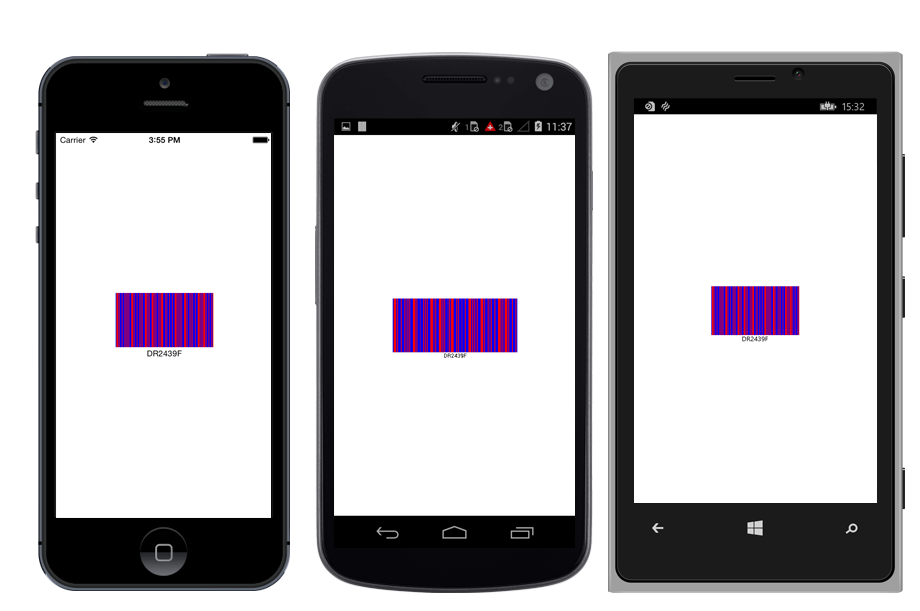
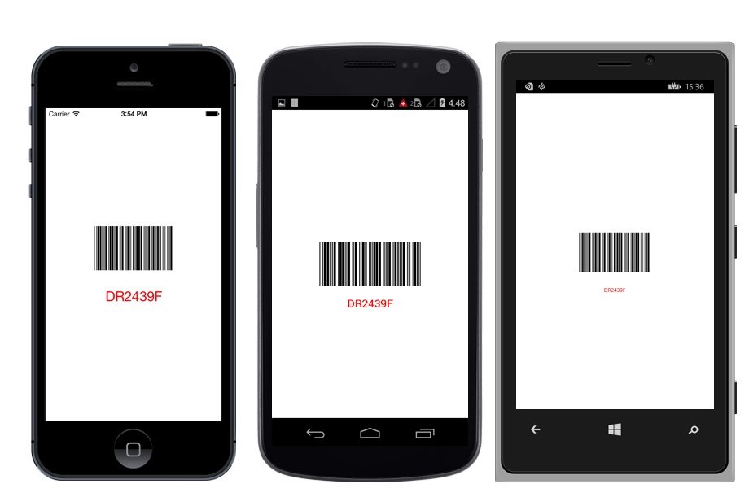

---

layout: post
title: Barcode Customization in Syncfusion SfBarcode control for Xamarin.Forms
description: Learn how to Customize Barcode in SfBarcode control
platform: xamarin
control: SfBarcode
documentation: ug

---

# BARCODE CUSTOMIZATION

## Bar Customization

The color of the Barcode can be customized by using the properties of `DarkBarBrush` and `LightBarBrush` in the `SfBarcode`.

The DarkBarBrush represents the Color of the dark bar (Black color by default) and the LightBarBrush represents the color of the gap between two adjacent black bars (White color by default).



    //Changes the color of darker area of Barcode. 

    barcode.DarkBarColor = Color.Blue;

    //Changes the color of lighter area of Barcode.

    barcode.LightBarColor = Color.Red;
    


  _Barcode_ _with_ _bar_ _color_ _customization_

>**NOTE**:
    The `DarkBarBrush` and `LightBarBrush` customizations are applicable only for one dimensional Barcodes. In order, to recognize a Barcode symbol by a scanner, there must be an adequate contrast between the dark bars and the light spaces. All the Barcode scanners do not have support for colored Barcodes.

## Text Customization

The text representing the Barcode can be customized by using the following properties.

* The color of text can be altered by using the `TextColor` property.
* The size of text can be altered by using the `TextSize` property.
* The horizontal alignment of text can be customized with the help of the `TextPosition` property.
* The gap between Barcode and text can be adjusted by setting the property of `TextGapHeight`.
* To change the location of text vertically, you can make use of the `TextLocation` property with options of top and bottom location.



    //Changes the color of text.

    barcode.TextColor = Color.Red;

    //Changes the size of text.

    barcode.TextFont = Font.SystemFontOfSize(25);

    //Changes the font style of text.

    Typeface textStyle = Typeface.create("Times new roman",1); 

    barcode.TextFont = textStyle**;** 

    //Changes the height of gap between text and Barcode. 

    barcode.TextGapHeight = 30;

    //Changes the location of text.

    barcode.TextLocation = BarcodeTextLocation.Bottom;

    //Changes the alignment of text.

    barcode.TextAlignment = BarcodeTextAlignment.Center;



  _Barcode_ _with_ _text_ _customization_

