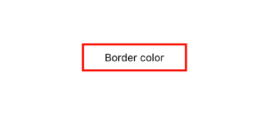
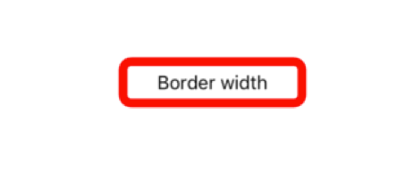
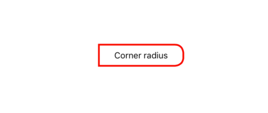

# Customization

The border control supports customizing the border color, width, corner radius, background color, and more. The border can be customized using the following properties.

## Border color

You can customize the color of the border using the `BorderColor` property.




<border:SfBorder x:Name="border" BorderColor = "Red"/>




SfBorder border = new SfBorder();
border.BorderColor = Color.Red;




## Background color

The background color of the border control can be customized using the `BackgroundColor` property.




<border:SfBorder x:Name="border" BackgroundColor = "Green"/>




SfBorder border = new SfBorder();
border.BackgroundColor = Color.Green;




## Border width

You can customize the thickness of the border using the `BorderWidth` property.




<border:SfBorder x:Name="border" BorderWidth = "12"/>




SfBorder border = new SfBorder();
border.BorderWidth = 12;




## Corner radius

You can customize the corner radius of the border on four sides using the `CornerRadius` property with type as `Thickness`.

% tabs %}


<border:SfBorder x:Name="border" CornerRadius="0,10,10,0"/>




SfBorder border = new SfBorder();
border.CornerRadius =  new Thickness (0,10,10,0);




