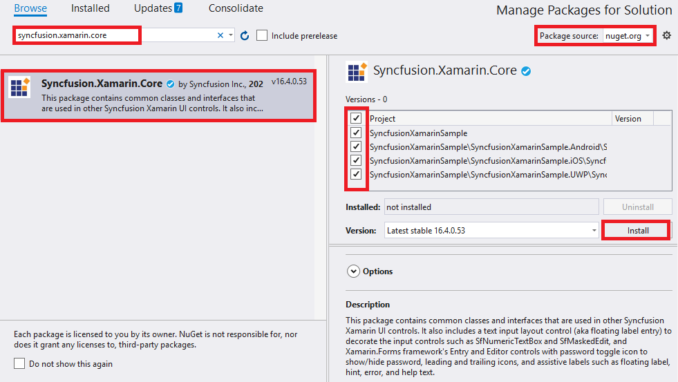
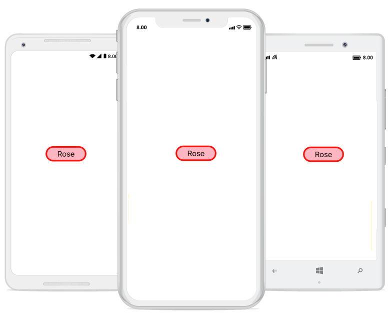

# Getting Started

This section provides an overview for working with the SfBorder control for Xamarin.Forms and explains the entire process of creating a real-world application.

## Adding SfBorder reference

You can add SfBorder reference using one of the following methods:

**Method 1: Adding SfBorder reference from nuget.org**

Syncfusion Xamarin components are available in [nuget.org](https://www.nuget.org/). To add SfBorder to your project, open the NuGet package manager in Visual Studio, search for [Syncfusion.Xamarin.Core](https://www.nuget.org/packages/Syncfusion.Xamarin.Core), and then install it.

N> 
* Install the same version of SfBorder NuGet in all the projects.
* In addition, you need to install the [Syncfusion.Xamarin.Core.WPF]() package for Xamarin.Forms WPF platform only.

**Method 2: Adding SfBorder reference from toolbox**

Syncfusion also provides Xamarin Toolbox. Using this toolbox, you can drag the SfBorder control to the XAML page. It will automatically install the required NuGet packages and add the namespace to the page. To install Syncfusion Xamarin Toolbox, refer to [Toolbox](https://help.syncfusion.com/xamarin/utility#toolbox).

**Method 3: Adding SfBorder assemblies manually from the installed location**

If you prefer to manually reference the assemblies instead referencing from NuGet, add the following assemblies in respective projects.

Location: {Installed location}/{version}/Xamarin/lib

<table>
<tr>
<td>PCL</td>
<td>Syncfusion.Core.XForms.dll Syncfusion.Licensing.dll </td>
</tr>
<tr>
<td>Android</td>
<td>Syncfusion.Core.XForms.dll Syncfusion.Core.XForms.Android.dll Syncfusion.Licensing.dll </td>
</tr>
<tr>
<td>iOS</td>
<td>Syncfusion.Core.XForms.dll Syncfusion.Core.XForms.iOS.dll Syncfusion.Licensing.dll </td>
</tr>
<tr>
<td>UWP</td>
<td>Syncfusion.Core.XForms.dll Syncfusion.Core.XForms.UWP.dll Syncfusion.Licensing.dll </td>
</tr>
<tr>
<td>WPF</td>
<td>Syncfusion.Core.XForms.dll Syncfusion.Core.XForms.WPF.dll Syncfusion.Licensing.dll </td>
</tr>
</table>

N> To know more about obtaining our components, refer to these links for [Mac](https://help.syncfusion.com/xamarin/introduction/download-and-installation/mac/) and [Windows](https://help.syncfusion.com/xamarin/introduction/download-and-installation/windows/).

I> Starting with v16.2.0.x, if you reference Syncfusion assemblies from the trial setup or from the NuGet feed, you also have to include a license key in your projects. Please refer to [Syncfusion license key](https://help.syncfusion.com/common/essential-studio/licensing/license-key/) to know about registering Syncfusion license key in your Xamarin application to use our components.

## Launching an application on each platform with SfBorder.

To use the SfBorder control inside an application, each platform application must initialize the SfBorder renderer. This initialization step varies from platform to platform and is discussed in the following sections:

N> If you are adding the references from toolbox, below steps are not needed.

### Android and UWP

The Android and UWP launches the SfBorder without any initialization, and it is enough to only initialize the Xamarin.Forms Framework to launch the application.

### iOS

To launch the SfBorder in iOS, call the `SfBorderRenderer.Init()` in the `FinishedLaunching` overridden method of the AppDelegate class after the Xamarin.Forms Framework has been initialized and before the LoadApplication is called, as demonstrated in the following code example.


public override bool FinishedLaunching(UIApplication app, NSDictionary options)
{
    …
    global::Xamarin.Forms.Forms.Init ();
    Syncfusion.XForms.iOS.Border.SfBorderRenderer.Init();
    LoadApplication (new App ());
    …
}
 

### Release mode issue in UWP platform

The known Framework issue in UWP platform is that the custom controls will not be rendered when deployed an application in `Release Mode`. It can be resolved by initializing the SfBorder assemblies in the `App.xaml.cs` file in the UWP project, as demonstrated in the following code example.


// In App.xaml.cs

protected override void OnLaunched(LaunchActivatedEventArgs e)
    {
        …
    	    rootFrame.NavigationFailed += OnNavigationFailed;
    
        // you'll need to add `using System.Reflection;`
        List<Assembly> assembliesToInclude = new List<Assembly>();
    
        //Now, add all the assemblies your app uses                 
        assembliesToInclude.Add(typeof(Syncfusion.XForms.UWP.Border.SfBorderRenderer).GetTypeInfo().Assembly);
    
        // replaces Xamarin.Forms.Forms.Init(e);        
        Xamarin.Forms.Forms.Init(e, assembliesToInclude);	
        …     
    }



### Windows Presentation Foundation (WPF)

To launch the border in WPF, call the SfBorderRenderer.Init() method in the MainWindow constructor of the MainWindow class after the Xamarin.Forms framework has been initialized and before the LoadApplication method is called as demonstrated in the following code sample.

 

public partial class MainWindow : FormsApplicationPage
{
     public MainWindow()
     { 
            InitializeComponent();

            Forms.Init();

            Syncfusion.XForms.WPF.Border.SfBorderRenderer.Init();

            LoadApplication(new App());
     }
}



## Creating SfBorder control

The `SfBorder` control is configured entirely in C# code or in XAML markup. The following steps explain how to create a `SfBorder` and configure its elements.

### Adding namespace for referred assemblies

 

 

xmlns:border="clr-namespace:Syncfusion.XForms.Border;assembly=Syncfusion.Core.XForms" 



 

using Syncfusion.XForms.Border; 





### Add the SfBorder control as the content of ContentPage.




<Grid>
<border:SfBorder 
   BorderColor="Red"
   BackgroundColor="#ffb6c1" 
   HorizontalOptions="Center" 
   VerticalOptions="Center"
   BorderWidth="3">
<Label 
  Text="Rose" 
  Margin="10" 
  Font="15"  />
</border:SfBorder>
</Grid>




using System;
using Syncfusion.XForms.Border;
using Xamarin.Forms;

namespace BorderGettingStarted
{
    public partial class MainPage : ContentPage
    {
        public MainPage()
        {
            InitializeComponent();

            Grid mainGrid = new Grid();

            // Create Border control
            SfBorder border = new SfBorder();
            border.VerticalOptions = LayoutOptions.Center;
            border.HorizontalOptions = LayoutOptions.Center;
            border.BorderColor = Color.Red;
            border.BackgroundColor = Color.FromHex("#ffb6c1");

            //Create Label control
            Label label = new Label();
            label.Text = "Rose";
            label.FontSize = 15;

            border.Content = label;
            mainGrid.Children.Add(border);
            this.Content = stack;
        }
    }
}
 



The complete Getting Started sample is available in [this](http://www.syncfusion.com/downloads/support/directtrac/general/ze/GettingStarted828010295.zip) link.
