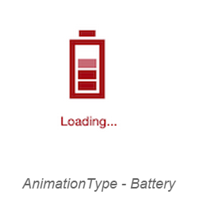
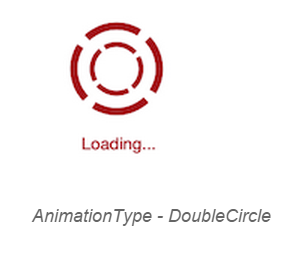
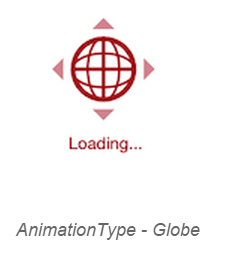
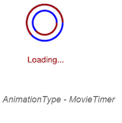
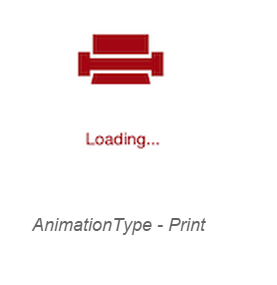
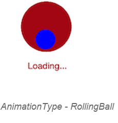
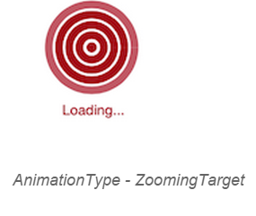

# AnimationType

The `AnimationType` property allows you to choose one of the animation from the built-in animations supported.





	SfBusyIndicator busyindicator = new SfBusyIndicator();
	busyindicator.AnimationType=AnimationTypes.ECG;
	




	<busyindicator:SfBusyIndicator x:Name="busyindicator" AnimationType="ECG" />





 

AnimationType - Ball
{:.caption}

 

AnimationType - Battery
{:.caption}

AnimationType - DoubleCircle
{:.caption}

 

AnimationType - ECG
{:.caption}

 

AnimationType - Globe
{:.caption}

 

AnimationType - HorizontalPulsingBox
{:.caption}

 

AnimationType - MovieTimer
{:.caption}

AnimationType - Print
{:.caption}

 

AnimationType - Rectangle
{:.caption}

AnimationType - RollingBall
{:.caption}

 

AnimationType - SingleCircle
{:.caption}

AnimationType - SlicedCircle
{:.caption}

AnimationType - ZoomingTarget 
{:.caption}

