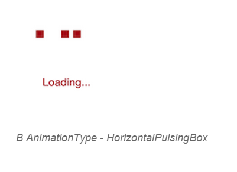
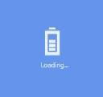
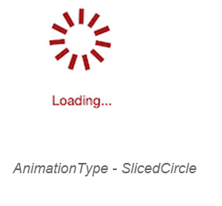
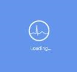

# Animation Type

The `AnimationType` property for the SfBusyIndicator allows the user to set one of the 10 animations from the built-in animations.





	<busyindicator:SfBusyIndicator x:Name="busyindicator" AnimationType="Ball" Title="Loading..." BackgroundColor="Color.Blue"/>





	SfBusyIndicator busyindicator = new SfBusyIndicator();
	busyindicator.AnimationType=AnimationTypes.Ball;
	busyindicator.Title ="Loading…";
	busyindicator.BackgroundColor= Color.Blue;
	




Busy Indicator with Ball type animation 
{:.caption}

 

Busy Indicator with HorizontalPulsingBox type animation 
{:.caption}

 

Busy Indicator with Rectangle type animation 
{:.caption}
 
 

Busy Indicator with Battery type animation 
{:.caption}
 
 

Busy Indicator with Globe type animation 
{:.caption}
 
 

Busy Indicator with SingleCircle type animation 
{:.caption}

 

Busy Indicator with SlicedCircle type animation 
{:.caption}
 
 

Busy Indicator with DoubleCircle type animation 
{:.caption}
 
 

Busy Indicator with ECG type animation 
{:.caption}
 
 

Busy Indicator with Print type animation 
{:.caption}

 
