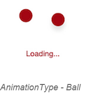

# Animation Type

The `AnimationType` property allows you to choose anyone of the 10 predefined animation types.

* Ball





	<busyindicator:SfBusyIndicator x:Name="busyindicator" AnimationType="Ball" />





	SfBusyIndicator busyindicator = new SfBusyIndicator();
	busyindicator.AnimationType=AnimationTypes.Ball;
	




* HorizontalPulsingBox





	<busyindicator:SfBusyIndicator x:Name="busyindicator" AnimationType="HorizontalPulsingBox" />





	SfBusyIndicator busyindicator = new SfBusyIndicator();
	busyindicator.AnimationType=AnimationTypes.HorizontalPulsingBox;
	




* Rectangle





	<busyindicator:SfBusyIndicator x:Name="busyindicator" AnimationType="Rectangle" />





	SfBusyIndicator busyindicator = new SfBusyIndicator();
	busyindicator.AnimationType=AnimationTypes.Rectangle;
	




* Battery





	<busyindicator:SfBusyIndicator x:Name="busyindicator" AnimationType="Battery" />





	SfBusyIndicator busyindicator = new SfBusyIndicator();
	busyindicator.AnimationType=AnimationTypes.Battery;
	




* Globe





	<busyindicator:SfBusyIndicator x:Name="busyindicator" AnimationType="Globe" />





	SfBusyIndicator busyindicator = new SfBusyIndicator();
	busyindicator.AnimationType=AnimationTypes.Globe;
	




* SingleCircle





	<busyindicator:SfBusyIndicator x:Name="busyindicator" AnimationType="SingleCircle" />





	SfBusyIndicator busyindicator = new SfBusyIndicator();
	busyindicator.AnimationType=AnimationTypes.SingleCircle;
	




* SlicedCircle





	<busyindicator:SfBusyIndicator x:Name="busyindicator" AnimationType="SlicedCircle" />





	SfBusyIndicator busyindicator = new SfBusyIndicator();
	busyindicator.AnimationType=AnimationTypes.SlicedCircle;
	




* DoubleCircle





	<busyindicator:SfBusyIndicator x:Name="busyindicator" AnimationType="DoubleCircle" />





	SfBusyIndicator busyindicator = new SfBusyIndicator();
	busyindicator.AnimationType=AnimationTypes.DoubleCircle;
	




* ECG





	<busyindicator:SfBusyIndicator x:Name="busyindicator" AnimationType="ECG" />





	SfBusyIndicator busyindicator = new SfBusyIndicator();
	busyindicator.AnimationType=AnimationTypes.ECG;
	




* Print





	<busyindicator:SfBusyIndicator x:Name="busyindicator" AnimationType="Print" />





	SfBusyIndicator busyindicator = new SfBusyIndicator();
	busyindicator.AnimationType=AnimationTypes.Print;
	




 
