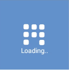
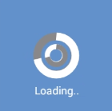
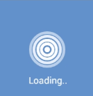
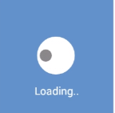

# Animation Type

The `AnimationType` property for the SfBusyIndicator allows the user to set one of the 15 animations from the built-in animations.





<?xml version="1.0" encoding="utf-8"?>
<ContentPage xmlns="http://xamarin.com/schemas/2014/forms" xmlns:x="http://schemas.microsoft.com/winfx/2009/xaml" xmlns:local="clr-namespace:GettingStarted" 
	xmlns:syncfusion="clr-namespace:Syncfusion.SfBusyIndicator.XForms;assembly=Syncfusion.SfBusyIndicator.XForms"
	x:Class="GettingStarted.BusyIndicatorPage">
<ContentPage.Content>
 <syncfusion:SfBusyIndicator x:Name="busyindicator" AnimationType="Ball" Title="Loading..." BackgroundColor="Blue" TextColor="White" />	
</ContentPage.Content>
</ContentPage>





using Syncfusion.SfBusyIndicator.XForms;
using Xamarin.Forms;

namespace GettingStarted
{
	public partial class BusyIndicatorPage : ContentPage
	{
		public BusyIndicatorPage()
		{
			InitializeComponent();

			SfBusyIndicator busyindicator = new SfBusyIndicator();
			busyindicator.AnimationType = AnimationTypes.Ball;
			busyindicator.BackgroundColor = Color.Blue;
			busyindicator.TextColor = Color.White;
			busyindicator.Title ="Loading…";
			this.Content = busyindicator;
		}
	}
}
	




Busy Indicator with Ball type animation 
{:.caption}

 

Busy Indicator with HorizontalPulsingBox type animation 
{:.caption}

 

Busy Indicator with Rectangle type animation 
{:.caption}
 
 

Busy Indicator with Battery type animation 
{:.caption}
 
 

Busy Indicator with Globe type animation 
{:.caption}
 
 

Busy Indicator with SingleCircle type animation 
{:.caption}

 

Busy Indicator with SlicedCircle type animation 
{:.caption}
 
 

Busy Indicator with DoubleCircle type animation 
{:.caption}
 
 

Busy Indicator with ECG type animation 
{:.caption}
 
 

Busy Indicator with Print type animation 
{:.caption}

 

Busy Indicator with Box type animation 
{:.caption}

 

Busy Indicator with Gear type animation 
{:.caption}

 

Busy Indicator with MovieTimer type animation 
{:.caption}

 

Busy Indicator with ZoomingTarget type animation 
{:.caption}

 

Busy Indicator with RollingBall type animation 
{:.caption}

 
