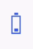

# Animation speed

The `Duration` property of SfBusyIndicator indicates timeline for completing one animation cycle. Setting smaller duration value accelerates animation speed.





<?xml version="1.0" encoding="utf-8"?>
<ContentPage xmlns="http://xamarin.com/schemas/2014/forms" xmlns:x="http://schemas.microsoft.com/winfx/2009/xaml" xmlns:local="clr-namespace:GettingStarted" 
	xmlns:syncfusion="clr-namespace:Syncfusion.SfBusyIndicator.XForms;assembly=Syncfusion.SfBusyIndicator.XForms"
	x:Class="GettingStarted.BusyIndicatorPage">
<ContentPage.Content>
 <syncfusion:SfBusyIndicator x:Name="busyindicator" AnimationType="SlicedCircle"  ViewBoxWidth = "20" ViewBoxHeight="20" Duration="25" TextColor="Maroon" />	
</ContentPage.Content>
</ContentPage>
	




using Syncfusion.SfBusyIndicator.XForms;
using Xamarin.Forms;
namespace GettingStarted
{
	public partial class BusyIndicatorPage : ContentPage
	{
		public BusyIndicatorPage()
		{
			InitializeComponent();

			SfBusyIndicator busyIndicator = new SfBusyIndicator();
			busyIndicator.AnimationType = AnimationTypes.SlicedCircle;
			busyIndicator.ViewBoxWidth = 20;
			busyIndicator.ViewBoxHeight = 20;
			busyIndicator.Duration = 25;
			busyIndicator.TextColor = Color.Maroon;
			this.Content = busyIndicator;
		}
	}
}
    




N> `Android`
The minimum duration for the animation is [`0.1 seconds`] and the maximum duration is [`25 seconds`]. The default duration is [`one second`].

`UWP`
The minimum duration for the animation is [`10 seconds`] and the maximum duration is [`500 seconds`]. The default duration is [`115 seconds`].

