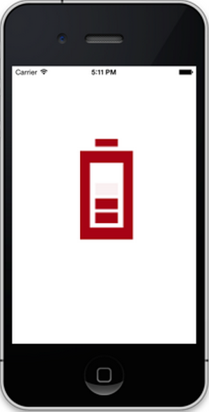

# Getting Started

## Create your first BusyIndicator control in Xamarin.Forms

This section provides overview for working with Essential BusyIndicator for Xamarin.Forms. You can walk through the entire process of creating an BusyIndicator.

### Referencing Essential Studio Components in Your Solution	

If you had acquired Essential Studio components through the Xamarin component store interface from within your IDE, then after adding the components to your Xamarin.iOS, Xamarin.Android and Windows Phone projects through the Component manager, you will still need to manually reference the PCL (Portable Class Library) assemblies in the Xamarin.Forms PCL project in your solution. You can do this by manually adding the relevant PCL assembly references to your PCL project contained in the following path inside of your solution folder.
Components/syncfusionessentialstudio-version/lib/pcl/
Alternatively, if you had downloaded Essential Studio from Syncfusion.com or through the Xamarin store web interface then all assembly references need to be added manually.
After installing Essential Studio for Xamarin, all the required assemblies found in the installation folders, typically
{Syncfusion Installed location}\Essential Studio\12.2.0.40\lib
Eg: C:\Program Files (x86)\Syncfusion\Essential Studio\12.2.0.40\lib
Or after downloading through the Xamarin store web interface, all the required assemblies can be found in the below folder
{download location}\syncfusionessentialstudio-version\lib
You can then add the assembly references to the respective projects as shown below

** PCL Project**

pcl\Syncfusion.SfBusyIndicator.XForm.dll

** Android Project**

android\Syncfusion.SfBusyIndicator.Andriod.dll

android\Syncfusion.SfBusyIndicator.xForms.Andriod.dll

** IOS (Classic) Project**

ios\Syncfusion.SfBusyIndicator.iOS.dll

ios\Syncfusion.SfBusyIndicator.xForms.iOS.dll

ios\Syncfusion.SfBusyIndicator.XForm.dll

**IOS (Unified) Project**

ios-unified\Syncfusion.SfBusyIndicator.iOS.dll

ios-unified\Syncfusion.SfBusyIndicator.xForms.iOS.dll

ios-unified\Syncfusion.SfBusyIndicator.XForm.dll

** Windows Phone Project**

wp8\Syncfusion.SfBusyIndicator.WP8.dll

wp8\Syncfusion.SfBusyIndicator.xForms.WinPhone.dll

### Add and Configure the BusyIndicator

The BusyIndicator control configured entirely in C# code or by using XAML markup.The following steps explain on how to create an BusyIndicator and configure its elements,

* Create an instance of SfBusyIndicator.

	SfBusyIndicator sfBusyIndicator=new SfBusyIndicator();

* Configure the properties of BusyIndicator.

	SfBusyIndicator sfBusyIndicator=new SfBusyIndicator();
	sfBusyIndicator.AnimationType=AnimationTypes.Ball;
	sfBusyIndicator.TextColor=Color.RED;
	sfBusyIndicator.ViewBoxHeight=20;
	sfBusyIndicator.ViewBoxWidth=20;
	sfBusyIndicator.IsBusy=True;

## Creating your first BusyIndicator in Xamarin.Android.

This section provides a quick overview for working with Essential BusyIndicator for Xamarin.Android. It guides you to the entire process of creating an BusyIndicator in your Application.

 

### Referencing Essential Studio Components in Your Solution

After installing Essential Studio for Xamarin, you can find all the required assemblies in the installation folders,

{Syncfusion Installed location}\Essential Studio\12.4.0.24\lib

Add the following assembly references to the Android project,

android\Syncfusion.SfBusyIndicator.Andriod.dll

### And and Configure the BusyIndicator

The following steps explain on how to create an BusyIndicator and configure its elements,

* Create an instance of SfBusyIndicator.

	SfBusyIndicator sfBusyIndicator = new SfBusyIndicator(this);
	setContentView(sfBusyIndicator);

* Configure the Properties in BusyIndicator

	sfBusyIndicator.AnimationType=AnimationTypes.Ball;
	sfBusyIndicator.TextColor=Color.RED;
	sfBusyIndicator.ViewBoxHeight=20;
	sfBusyIndicator.ViewBoxWidth=20;
	sfBusyIndicator.IsBusy=True;

##Creating your first BusyIndicator in Xamarin.iOS.

This section provides a quick overview to work with the BusyIndicator in Objective C. This example explains how to create an BusyIndicator with different BusyIndicatorModes and SuggestionModes.

### Referencing Essential Studio Components in Your Solution

After installing Essential Studio for Xamarin, you can find all the required assemblies in the installation folders, typically:
{Syncfusion Installed location}\Essential Studio {version number}\lib
You have to add the following assembly reference to the iOS classic project
ios\Syncfusion.SfBusyIndicator.iOS.dll
And below assembly reference to the iOS unified project.
ios-unifed\Syncfusion.SfBusyIndicator.iOS.dll

 

### And and Configure the BusyIndicator

The following steps explain on how to create an BusyIndicator and configure its elements,

*Create an instance of SfBusyIndicator

	@interface ViewController ()
	{     SFBusyIndicator *sfBusyIndicator;
	} 
	- (void)viewDidLoad 
	{     
	[super viewDidLoad];   
	BusyIndicator=[[ SFBusyIndicator alloc]init];  
	[self.view addSubview:sfBusyIndicator]; 
	}
*Configure the properties for BusyIndicator. 

	_sfBusyIndicator.AnimationType=SFBusyIndicatorAnimationType.SFBusyIndicatorAnimationTypeBall;
	_sfBusyIndicator.TextColor=UIColor.Red;
	_sfBusyIndicator.ViewBoxHeight=20;
	_sfBusyIndicator.ViewBoxWidth=20;
	_sfBusyIndicator.IsBusy=True;

    
                                    
