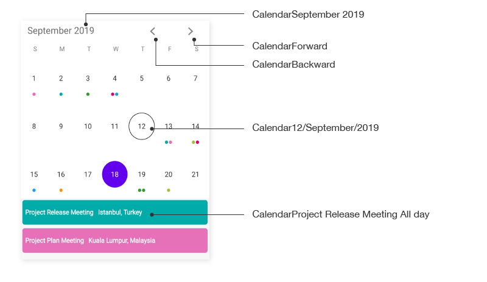
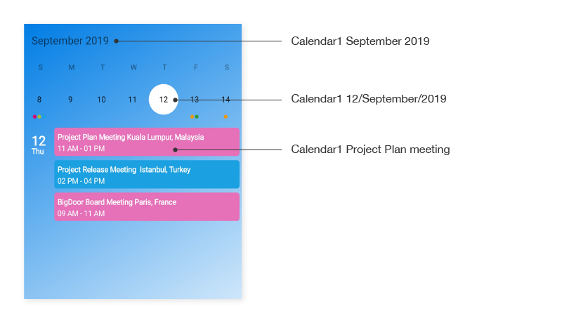
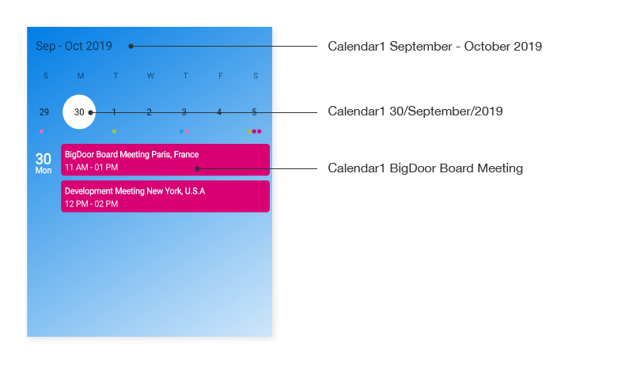
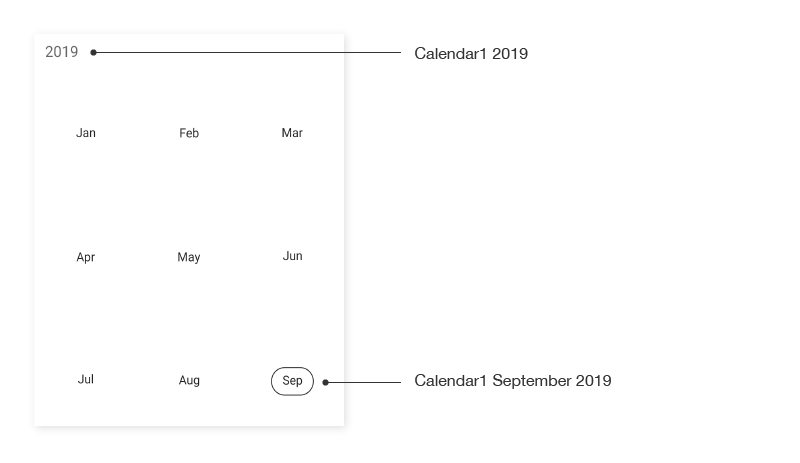
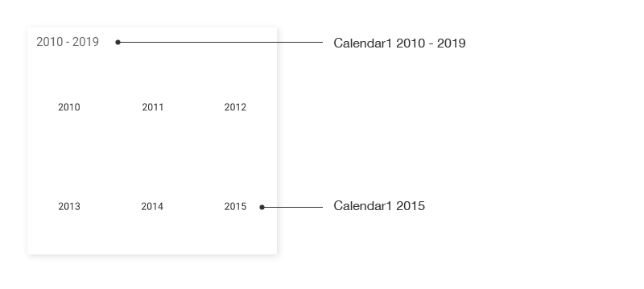
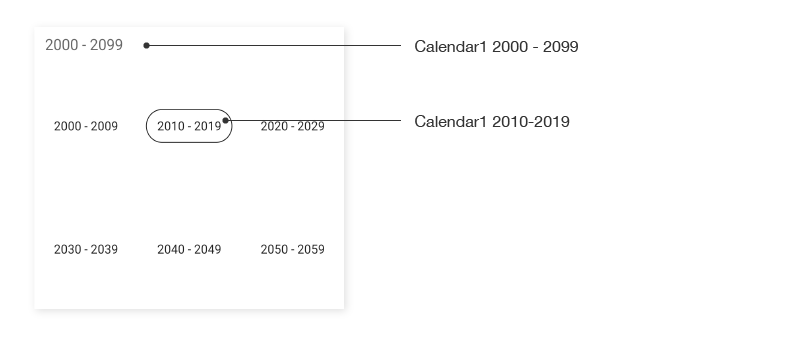

## AutomationId

The `SfCalendar` control has built-in `AutomationId` for inner elements. Please find the following table of Automation IDs for inner elements.

<table>
<tr>
<th align="center" >View</th>
<th align="center" >AutomationId Format</th>
<th align="center" >Example</th>
</tr>

<tr>
<td>MonthCell</td>
<td>dddd dd/MMMM/yyyy</td>
<td>Tuesday 27/May/2018   </td>
</tr>

<tr>
<td>Month Header - Month view</td>
<td>MMMM yyyy</td>
<td>May 2018</td>
</tr>

<tr>
<td>Month Header - Week view</td>
<td>MMMM – MMMM yyyy</td>
<td>November – December 2018 </td>
</tr>

<tr>
<td>Left Arrow</td>
<td>string</td>
<td>Backward</td>
</tr>

<tr>
<td>Right Arrow</td>
<td>string</td>
<td>Forward</td>
</tr>

<tr>
<td>Inline View , Agenda View</td>
<td>subject text</td>
<td>Meeting</td>
</tr>

<tr>
<td>Year View - Header</td>
<td>yyyy</td>
<td>2018</td>
</tr>

<tr>
<td>Year View - Year Cell</td>
<td>MMMM yyyy</td>
<td>January 2018</td>
</tr>

<tr>
<td>Decade View - Header</td>
<td>yyyy - yyyy</td>
<td>2020 – 2029</td>
</tr>

<tr>
<td>Decade View - Year Cell</td>
<td>yyyy</td>
<td>2020</td>
</tr>

<tr>
<td>Century View - Header</td>
<td>yyyy - yyyy</td>
<td>2000 – 2099</td>
</tr>

<tr>
<td>Century View - Year Cell</td>
<td>yyyy</td>
<td>2070 – 2079</td>
</tr>

</table>

To keep unique `AutomationId`, these inner elements’ AutomationIds are updated based on the control’s `AutomationId`. For example, if you set `SfCalendar` AutomationId as `SfCalendar.AutomationId = Calendar`, then the Automation framework will interact with the `RightArrow` button as `CalendarForward`. The following screenshots denote the AutomationIds for inner elements.

### Month view

### Week view

### Year view

### Decade view

### Century view

