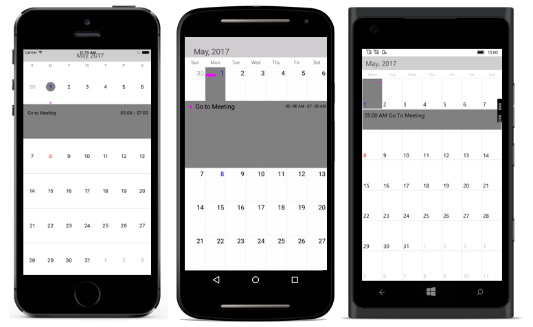

# Events(Appointments)

SfCalendar control provides support to add appointments on calendar's dates. By the way of adding collection of appointments, it will show the event with indicator on the desired dates.

Calendar's events can be added to SfCalendar using the following ways. `CalendarEventCollection` holds the details about the events to be rendered in calendar. Events contains the following attributes

1. StartTime

2. EndTime

3. Subject

4. Color

Finally add this collection of CalendarInlineEvents into `DataSource` of SfCalendar. The following code example will help to create an appointments on Calendar's date. For events to be listed for a particular day, enable the inline feature in month view cell.

I> Inline event support can be toggled on / off with `ShowInlineEvents` property.


		   
SfCalendar calendar = new SfCalendar();
calendar.ShowInlineEvents = true;

CalendarInlineEvent events = new CalendarInlineEvent();
events.StartTime = new DateTime(2017, 5, 1,5,0,0);
events.EndTime = new DateTime(2017, 5, 1,7,0,0);
events.Subject = "Go to Meeting";
events.Color = Color.Fuchsia;

CalendarEventCollection collection = new CalendarEventCollection();
collection.Add(events);

calendar.DataSource = collection;

this.Content = calendar;
		   


N> The Inline function will be available only in MonthView with Single selection mode.

## Inline / Agenda View Template

The default appearance of the Appointment can be customized by using the [InlineItemTemplate](https://help.syncfusion.com/cr/cref_files/xamarin/Syncfusion.SfCalendar.XForms~Syncfusion.SfCalendar.XForms.MonthViewSettings~InlineItemTemplate.html) property of the [MonthViewSettings](https://help.syncfusion.com/cr/cref_files/xamarin/Syncfusion.SfCalendar.XForms~Syncfusion.SfCalendar.XForms.MonthViewSettings.html).



    <syncfusion:SfCalendar x:Name="calendar" ShowInlineEvents="true">
        <syncfusion:SfCalendar.MonthViewSettings>
            <syncfusion:MonthViewSettings>
                <syncfusion:MonthViewSettings.InlineItemTemplate>
                    <DataTemplate>
                        <Button BackgroundColor="Purple" Text="{Binding Subject}" TextColor="White" />
                    </DataTemplate>
                </syncfusion:MonthViewSettings.InlineItemTemplate>
            </syncfusion:MonthViewSettings>
        </syncfusion:SfCalendar.MonthViewSettings>
    </syncfusion:SfCalendar> 



## Inline / Agenda View Template Selector

InlineTemplateSelector can be used to choose a DataTemplate at runtime based on the value of a data-bound to inline appointment property through `InlineItemTemplate`. It lets you choose a different data template for each appointment, customizing the appearance of a particular inline appointment based on certain conditions. DataTemplateSelector for inline appointment as object and Calendar as bindable object.



    <ContentPage.Resources>
        <ResourceDictionary>
            <local:AppointmentSelector x:Key="TemplateSelector" />
        </ResourceDictionary>
    </ContentPage.Resources>
    <syncfusion:SfCalendar x:Name="calendar"  ShowInlineEvents="true">
        <syncfusion:SfCalendar.MonthViewSettings>
            <syncfusion:MonthViewSettings InlineItemTemplate="{StaticResource TemplateSelector}" />
        </syncfusion:SfCalendar.MonthViewSettings>
    </syncfusion:SfCalendar> 



### Creating a DataTemplateSelector



    public class AppointmentSelector : DataTemplateSelector
    {
        public DataTemplate AppointmentTemplate { get; set; }
        public DataTemplate AllDayAppointmentTemplate { get; set; }
        public AppointmentSelector()
        {
            AppointmentTemplate = new DataTemplate(typeof(AppointmentTemplate));
            AllDayAppointmentTemplate = new DataTemplate(typeof(AllDayAppointmentTemplate));
        }
        protected override DataTemplate OnSelectTemplate(object item, BindableObject container)
        {
            var calendar = (container as SfCalendar);
            if (calendar == null)
            {
                return null;
            }
            if ((item as CalendarInlineEvent).IsAllDay)
            {
                return AllDayAppointmentTemplate;
            }
            else
            {
                return AppointmentTemplate;
            }
        }
    } 





    <!--<Button as Template for inline Appointment>-->
    <Button xmlns="http://xamarin.com/schemas/2014/forms" 
            xmlns:x="http://schemas.microsoft.com/winfx/2009/xaml" 
            x:Class="Calendar_Sample.AppointmentTemplate" 
            HorizontalOptions="FillAndExpand"
            VerticalOptions="FillAndExpand" 
            BackgroundColor="{Binding Color}" 
            Text="{Binding Subject}" 
            FontAttributes="Bold" 
            TextColor="White" /> 
            
    <!--<Button as Template for all day Appointment>-->
    <Button xmlns="http://xamarin.com/schemas/2014/forms"
            xmlns:x="http://schemas.microsoft.com/winfx/2009/xaml"
            x:Class="Calendar_Sample.AllDayAppointmentTemplate"
            HorizontalOptions="FillAndExpand" 
            VerticalOptions="FillAndExpand" 
            BackgroundColor="{Binding Color}" 
            Text="{Binding Subject}" 
            FontAttributes="Bold" 
            TextColor="Black" /> 

 

	

	
