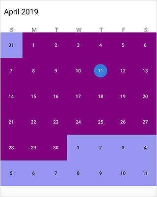
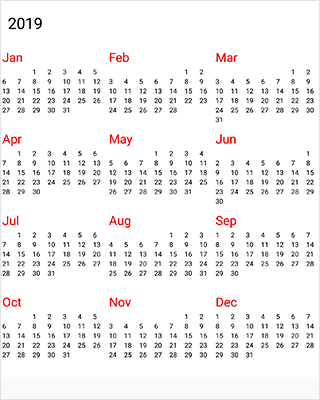
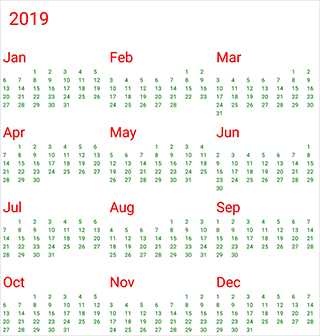

# View of SfCalendar

`SfCalendar` control provides 4 different types of views such month, year, decade and century.It can be assigned to the `SfCalendar` control by using [ViewMode](https://help.syncfusion.com/cr/xamarin/Syncfusion.SfCalendar.XForms~Syncfusion.SfCalendar.XForms.SfCalendar~ViewMode.html) property.

N> By default SfCalendar control is assigned with month view. 

## Month view

This displays entire dates of a particular month, by default current month will be displayed on loading. The current date is provided with separate color different from the rest of the dates color in a month. The events availability will be denoted within the cell based on its duration.

The dates in month view can be selected by three ways such as single, multiple and range which can be modified using [SelectionMode](https://help.syncfusion.com/cr/xamarin/Syncfusion.SfCalendar.XForms~Syncfusion.SfCalendar.XForms.SfCalendar~SelectionMode.html)

## Trailing and leading days

The `SfCalendar` allows you hide the days of the next month and previous month in calendar to enhance the appearance. This can be achieved by enabling the [ShowLeadingAndTrailingDays](https://help.syncfusion.com/cr/xamarin/Syncfusion.SfCalendar.XForms~Syncfusion.SfCalendar.XForms.SfCalendar~ShowLeadingAndTrailingDays.html) property. The following code demonstrates how to hide the leading and trailing dates in calendar.





<syncfusion:SfCalendar  x:Name="calendar" ViewMode="MonthView" ShowLeadingAndTrailingDays="True"/>





SfCalendar calendar = new SfCalendar();
calendar.ViewMode = ViewMode.MonthView;
calendar.ShowLeadingAndTrailingDays = true;
this.Content = calendar;
 




N>
* The OnMonthCellLoaded event is triggered for the current month dates.
* The VisibleDates in the MonthChanged event will return the current month dates.

## Month view customization

You can customize the calendar month view by using [MonthViewSettings](https://help.syncfusion.com/cr/xamarin/Syncfusion.SfCalendar.XForms~Syncfusion.SfCalendar.XForms.MonthViewSettings.html). 

* Current day text color can be modified using [TodayTextColor](https://help.syncfusion.com/cr/xamarin/Syncfusion.SfCalendar.XForms~Syncfusion.SfCalendar.XForms.MonthViewSettings~TodayTextColor.html).
* The day header format, day font size, day header font size can be modified using [DayHeaderFormat](https://help.syncfusion.com/cr/xamarin/Syncfusion.SfCalendar.XForms~Syncfusion.SfCalendar.XForms.MonthViewSettings~DayHeaderFormat.html), [DayFontSize](https://help.syncfusion.com/cr/xamarin/Syncfusion.SfCalendar.XForms~Syncfusion.SfCalendar.XForms.MonthViewSettings~DayFontSize.html), [DayHeaderFontSize](https://help.syncfusion.com/cr/xamarin/Syncfusion.SfCalendar.XForms~Syncfusion.SfCalendar.XForms.MonthViewSettings~DayHeaderFontSize.html)
* The background color of the inline view can be modified using [InlineBackgroundColor](https://help.syncfusion.com/cr/xamarin/Syncfusion.SfCalendar.XForms~Syncfusion.SfCalendar.XForms.MonthViewSettings~InlineBackgroundColor.html) property.





<syncfusion:SfCalendar x:Name="calendar">
            <syncfusion:SfCalendar.MonthViewSettings>
                  <syncfusion:MonthViewSettings 
                        CurrentMonthBackgroundColor="#800080"
                        CurrentMonthTextColor="#ffffff"
                        PreviousMonthBackgroundColor="#9895F0"
                        PreviousMonthTextColor="#000000"
                        DateSelectionColor="#ffffff"
                        SelectedDayTextColor="#000000"
                        DayHeaderFormat="EEEEE"
						DayFontSize="12"
						DayHeaderFontSize="14"
						TodaySelectionBackgroundColor="Green"/>
           </syncfusion:SfCalendar.MonthViewSettings>
</syncfusion:SfCalendar>  




	
SfCalendar calendar = new SfCalendar();    

MonthViewSettings monthViewSettings = new MonthViewSettings();
monthViewSettings.CurrentMonthBackgroundColor = Color.FromHex("#800080");
monthViewSettings.CurrentMonthTextColor = Color.FromHex("#ffffff");
monthViewSettings.PreviousMonthBackgroundColor = Color.FromHex("#9895F0");
monthViewSettings.PreviousMonthTextColor = Color.FromHex("#000000");
monthViewSettings.DateSelectionColor = Color.FromHex("#ffffff");
monthViewSettings.SelectedDayTextColor = Color.FromHex("#000000");
monthViewSettings.DayHeaderFormat = "EEEEE";
monthViewSettings.DayFontSize = 12;
monthViewSettings.DayHeaderFontSize = 20;
monthViewSettings.SelectionRadius = 15;
monthViewSettings.TodaySelectionTextColor= Color.Black;
monthViewSettings.TodaySelectionBackgroundColor= Color.Green;

calendar.MonthViewSettings = monthViewSettings;
this.Content = calendar;





N> Similar way there are many settings available to modify Text and Background colors of month view in `MonthViewSettings` class.
N> To disable the current day selection, use `TodaySelectionBackgroundColor` color as Transparent.

### Month cell border color customization

You can customize the border color of calendar month cell using [MonthViewSettings](https://help.syncfusion.com/cr/xamarin/Syncfusion.SfCalendar.XForms~Syncfusion.SfCalendar.XForms.MonthViewSettings.html).

* The border color of month cells can be customized using the [BorderColor](https://help.syncfusion.com/cr/xamarin/Syncfusion.SfCalendar.XForms~Syncfusion.SfCalendar.XForms.MonthViewSettings~BorderColor.html) property, and the lines of month cells can be enabled using the [CellGridOptions](https://help.syncfusion.com/cr/xamarin/Syncfusion.SfCalendar.XForms~Syncfusion.SfCalendar.XForms.MonthViewSettings~CellGridOptions.html) property.

	
	


<syncfusion:SfCalendar x:Name="calendar">
            <syncfusion:SfCalendar.MonthViewSettings>
                  <syncfusion:MonthViewSettings 
	                   BorderColor ="#ff0000" CellGridOptions="Both"/>                      
           </syncfusion:SfCalendar.MonthViewSettings>
</syncfusion:SfCalendar>  




	
SfCalendar calendar = new SfCalendar();    
MonthViewSettings monthViewSettings = new MonthViewSettings();
monthViewSettings.BorderColor = Color.FromHex("#ff0000");
monthViewSettings.CellGridOptions = CellGridOptions.Both;
calendar.MonthViewSettings = monthViewSettings;
this.Content = calendar;





### Today border color customization

You can customize the today border color of calendar month cell using [MonthViewSettings](https://help.syncfusion.com/cr/xamarin/Syncfusion.SfCalendar.XForms~Syncfusion.SfCalendar.XForms.MonthViewSettings.html).

* The border color of current day can be customized using the [TodayBorderColor](https://help.syncfusion.com/cr/xamarin/Syncfusion.SfCalendar.XForms~Syncfusion.SfCalendar.XForms.MonthViewSettings~TodayBorderColor.html) property, and it is applicable for both Fill and Circle SelectionShape.

	
	


<syncfusion:SfCalendar x:Name="calendar">
            <syncfusion:SfCalendar.MonthViewSettings>
                  <syncfusion:MonthViewSettings 
                       TodayBorderColor="#ff0000"/>
           </syncfusion:SfCalendar.MonthViewSettings>
</syncfusion:SfCalendar>  




	
SfCalendar calendar = new SfCalendar();    
MonthViewSettings monthViewSettings = new MonthViewSettings();
monthViewSettings.TodayBorderColor = Color.FromHex("#ff0000");
calendar.MonthViewSettings = monthViewSettings;
this.Content = calendar;





## Week view

The number of weeks in the month view can be changed by setting the [NumberOfWeeksInView](https://help.syncfusion.com/cr/xamarin/Syncfusion.SfCalendar.XForms~Syncfusion.SfCalendar.XForms.SfCalendar~NumberOfWeeksInView.html) property in SfCalendar. By default, `NumberOfWeeksInView` starts from current week, and this can be modified using the [MoveToDate](https://help.syncfusion.com/cr/xamarin/Syncfusion.SfCalendar.XForms~Syncfusion.SfCalendar.XForms.SfCalendar~MoveToDate.html) property of calendar. It also supports all existing features such as [FirstDayOfWeek](https://help.syncfusion.com/cr/xamarin/Syncfusion.SfCalendar.XForms~Syncfusion.SfCalendar.XForms.SfCalendar~FirstDayOfWeek.html), [MinDate](https://help.syncfusion.com/cr/xamarin/Syncfusion.SfCalendar.XForms~Syncfusion.SfCalendar.XForms.SfCalendar~MinDate.html), [MaxDate](https://help.syncfusion.com/cr/xamarin/Syncfusion.SfCalendar.XForms~Syncfusion.SfCalendar.XForms.SfCalendar~MaxDate.html), and [SelectionMode](https://help.syncfusion.com/cr/xamarin/Syncfusion.SfCalendar.XForms~Syncfusion.SfCalendar.XForms.SfCalendar~SelectionMode.html).

N>
* Week number ranges from 1 to 6. If lesser or greater than these range is considered, `NumberOfWeeksInView` will be displayed as 6.
* Inline view considers  `NumberOfWeeksInView` as only 6. For other count, only agenda view will be displayed in calendar.
* Dynamically changing `NumberOfWeeksInView` shows the first row of month view dates. It can be handled using the `MoveToDate` property of calendar
* [ShowLeadingAndTrailingDays](https://help.syncfusion.com/cr/xamarin/Syncfusion.SfCalendar.XForms~Syncfusion.SfCalendar.XForms.SfCalendar~ShowLeadingAndTrailingDays.html) is not applicable if the `NumberOfWeeksInView` is lesser than 6.





<syncfusion:SfCalendar x:Name="calendar" NumberOfWeeksInView=3/>





SfCalendar calendar = new SfCalendar();
calendar.NumberOfWeeksInView = 3;





N>
* The OnMonthCellLoaded event is triggered for the current month dates.
* The VisibleDates in the MonthChanged event will return the current month dates.

## Year view

This displays entire dates/month of a particular year, by default current year will be displayed on loading. The Years can be changed by swiping back and forth or [Forward](https://help.syncfusion.com/cr/xamarin/Syncfusion.SfCalendar.XForms~Syncfusion.SfCalendar.XForms.SfCalendar~Forward.html) and [Backward](https://help.syncfusion.com/cr/xamarin/Syncfusion.SfCalendar.XForms~Syncfusion.SfCalendar.XForms.SfCalendar~Backward.html) methods. The Months can be navigated quickly by selecting on the particular month in year view.





<syncfusion:SfCalendar  x:Name="calendar" ViewMode="YearView"/>





SfCalendar calendar = new SfCalendar();
calendar.ViewMode=ViewMode.YearView;
this.Content = calendar;
 



 

## Year view customization

We can customize the calendar view in yearView mode by using [YearViewSettings](https://help.syncfusion.com/cr/xamarin/Syncfusion.SfCalendar.XForms~Syncfusion.SfCalendar.XForms.YearViewSettings.html). 

*  date text color can be modified using [DateTextColor](https://help.syncfusion.com/cr/xamarin/Syncfusion.SfCalendar.XForms~Syncfusion.SfCalendar.XForms.YearViewSettings~DateTextColor.html).

* We can also customize the header, monthLayout in yearView 's textColor and background color.





<syncfusion:SfCalendar x:Name="calendar">
             <syncfusion:SfCalendar.YearViewSettings>
                    <syncfusion:YearViewSettings 
                        LayoutBackground="#ffe4b5"
                        DateTextColor="#E6E6FA"
                        HeaderBackground="#8B4513"
                        YearHeaderTextColor="#FFFFFF"
                    />
                </syncfusion:SfCalendar.YearViewSettings>
</syncfusion:SfCalendar>    




	
SfCalendar calendar = new SfCalendar();        
YearViewSettings yearViewSettings = new YearViewSettings();
yearViewSettings.LayoutBackground = Color.FromHex("#ffe4b5");
yearViewSettings.DateTextColor = Color.FromHex("#008000");
yearViewSettings.YearHeaderTextColor = Color.FromHex("#ff0000");
calendar.YearViewSettings = yearViewSettings;
this.Content = calendar;





