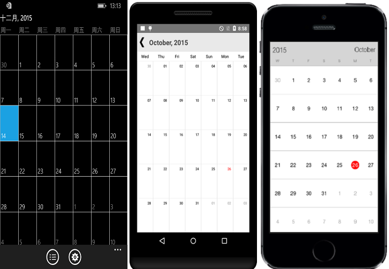

# First Day of Week

By default, the starting day will be Sunday. This can be modified using `FirstDayofWeek` property. Changing the first day of week will be applied to both month and year view.


	
	sfCalendar.FirstDayofWeek= 4;
	

	
