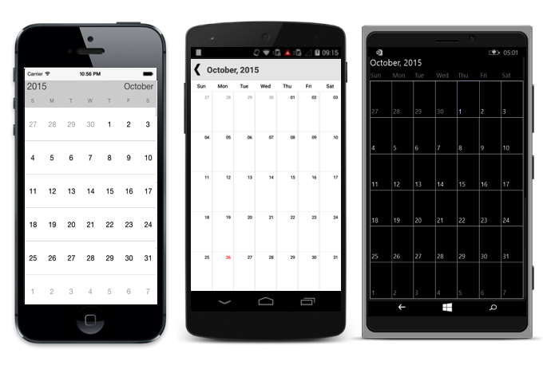

# Getting Started

This section explains you the steps to configure a Calendar control in a real-time scenario and also provides a walk-through on some of the customization features available in Calendar control.

## Referencing Essential Studio components in your solution

If you had acquired Essential Studio components through the Xamarin component store interface from within your IDE, then after adding the components to your Xamarin.iOS, Xamarin.Android and Windows Phone projects through the Component manager, you will still need to manually reference the PCL (Portable Class Library) assemblies in the Xamarin.Forms PCL project in your solution. You can do this by manually adding the relevant PCL assembly references to your PCL project contained in the following path inside of your solution folder.

Components/syncfusionessentialstudio-version/lib/pcl/

Alternatively if you had downloaded Essential Studio from Syncfusion.com or through the Xamarin store web interface then all assembly references need to be added manually.

After installing Essential Studio for Xamarin, all the required assemblies can be found in the installation folders, typically

{Syncfusion Installed location}\Essential Studio\syncfusionessentialstudio-version\lib

Eg: C:\Program Files (x86)\Syncfusion\Essential Studio\{{ site.releaseversion }}\lib

Or after downloading through the Xamarin store web interface, all the required assemblies can be found in the below folder

{Download location}\syncfusionessentialstudio-version\lib

You can then add the assembly references to the respective projects as shown below

<table>
<tr>
<th>Project</th>
<th>Required assemblies</th>
</tr>
<tr>
<td>PCL</td>
<td>pcl\Syncfusion.SfCalendar.XForms.dll</td>
</tr>
<tr>
<td>Android</td>
<td>android\Syncfusion.SfCalendar.Android.dll android\Syncfusion.SfCalendar.XForms.Android.dll</td>
</tr>
<tr>
<td>iOS (Unified)</td>
<td>ios-unified\Syncfusion.SfCalendar.iOS.dll ios-unified\Syncfusion.SfCalendar.XForms.iOS.dll ios-unified\Syncfusion.SfCalendar.XForms.dll</td>
</tr>
<tr>
<td>WindowsPhone</td>
<td>wp8\Syncfusion.SfInput.WP8.dll wp8\Syncfusion.SfShared.WP8.dll wp8\Syncfusion.SfCalendar.XForms.dll wp8\Syncfusion.SfCalendar.XForms.WinPhone.dll</td>
</tr>
<tr>
<td>WindowsPhone 8.1</td>
<td>wp81\Syncfusion.SfInput.WP.dll wp81\Syncfusion.SfShared.WP.dll wp81\Syncfusion.SfCalendar.XForms.dll wp81\Syncfusion.SfCalendar.XForms.WinPhone.dll</td>
</tr>
<tr>
<td>WinRT</td>
<td>winrt\Syncfusion.SfInput.WinRT.dll winrt\Syncfusion.SfShared.WinRT.dll winrt\Syncfusion.SfCalendar.XForms.dll winrt\Syncfusion.SfCalendar.XForms.WinRT.dll</td>
</tr>
<tr>
<td>UWP</td>
<td>uwp\Syncfusion.SfCalendar.UWP.dll uwp\Syncfusion.SfCalendar.XForms.dll uwp\Syncfusion.SfCalendar.XForms.UWP.dll</td>
</tr>
</table>

Currently an additional step is required for Windows Phone, WindowsPhone 8.1 and iOS projects. We need to create an instance of the calendar custom renderer as shown below. 

Create an instance of SfCalendarRenderer in MainPage constructor of the Windows Phone and WindowsPhone 8.1  project as shown 



public MainPage()

{

    new SfCalendarRenderer();

    ...    

}



Create an instance of SfCalendarRenderer in FinishedLaunching overridden method of AppDelegate class in iOS Project as shown below



public override bool FinishedLaunching(UIApplication app, NSDictionary options)

{

    ...

    new SfCalendarRenderer ();

    ...

}	



## Add and Configure the Calendar

* Adding reference to calendar.



	using Syncfusion.SfCalendar.XForms;



* Create an instance of SfCalendar.



	SfCalendar sfCalendar=new SfCalendar();
	


## Enabling Multiple Selection 

To enable multiple selection, Change the selection type using `SelectionMode` property. Check the [Selection Mode](http://help.syncfusion.com/android/sfcalendar/selectionmode)  section for more details.



	SfCalendar calendar = new SfCalendar (this);
	calendar.SelectionMode=SelectionMode.MultiSelection;



## Setting blackout dates

Add the dates into `BlackOutDates` property, that needs to be disabled among visible dates. Check the [BlackOutDates](http://help.syncfusion.com/android/sfcalendar/blackoutdates) section for more details.

For instance add all the holiday dates to blackout dates property.



	SfCalendar  calendar = new SfCalendar (this);
	List<DateTime> black_dates = new List<DateTime>();
	for (int i = 0; i < 5; i++)
	{
		DateTime date = DateTime.Now.Date.AddDays(i+7);
		black_dates.Add(date);
    }
	calendar.BlackoutDates = black_dates;



## Restricting Dates

Set `MinDate` and `MaxDate` property to limit visible dates range. Check the [Min Max dates](http://help.syncfusion.com/android/sfcalendar/datenavigation-and-gesture#min-max-dates) section for more details.



	SfCalendar  calendar = new SfCalendar (this);
	calendar.MinDate = new DateTime(2014,4,1);
	calendar.MaxDate = new DateTime(2018,4,1);

