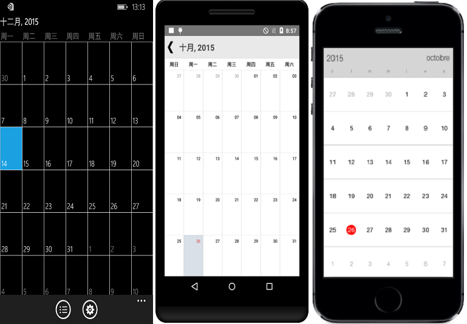

# Localization

SfCalendar control is available with complete localization support.
 
Localization can be specified by setting the `Locale` property of the control using the format of Language code followed by Country code. Based on the locale specified, the strings in the control are localized accordingly.
 
N> By default, SfCalendar control is available with en-US locale. 
     
	 
	 


	sfCalendar.Locale= new System.Globalization.CultureInfo("zh-CN");
	




	<CalendarSample:SfCalendar  x:Name="calendar" Locale="zh-CN"/>





