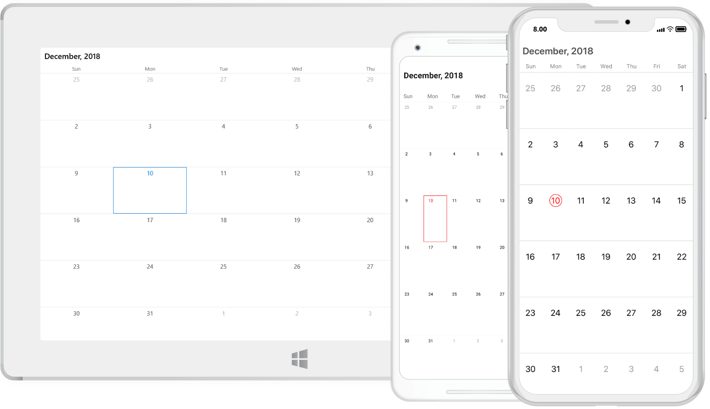

# Overview

The Essential Xamarin Calendar widget provides the multi-view representation to display and select one or more dates within specified ranges. Also provides a gesture friendly UI to perform operations like navigations, events, etc.

Essential Calendar can be used in various scenarios like ticket booking, events notifying, display working days etc.

## Key Features

* `Built-in Views` – A multi-view representation to display dates in month or year view layout.

* `Selection` – Enables users to select one or multiple dates.

* `Min Max dates` – Visible dates can be limited using the specified Minimum and Maximum dates.

* `Blackout dates` – A collection of dates with cross mark representation that cannot be interacted.

