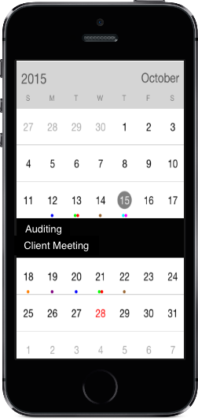

#Populating Events

Calendar control has an inbuilt capability to display the events based on the calendar events collection provided to `DataSource` property. For events to be listed for a particular day, enable the inline feature in month view cell.

The default UI of the inline view with events will be like list of events with a Gray background

Inline event support can be toggled on / off with `ShowInLineEvent` property.
    
	
	sfcalendar.showInLineEvent=True;
	
	
	
N> The Inline function will be available only in MonthView with Single selection mode
	
##Adding events using collection

Calendar Events collection can be provided to calendar using the following steps. `CalendarEventCollection` is a class, which holds the details about the events to be rendered in calendar. 

`CalendarInlineEvent` has some basic properties such as `StartTime`, `EndTime` and `Subject`.

	       
		   
           CalendarInlineEvent event=new CalendarInlineEvent();
           DateTime d=new DateTime(2015,1,1);
           DateTime d1=new DateTime(2015,1,1);
           event.StartTime=d;
           event.EndTime=d1;
           event.Subject=”Go to Meeting”;
           event.Color=Color.RED;
		   
		   

	

	
