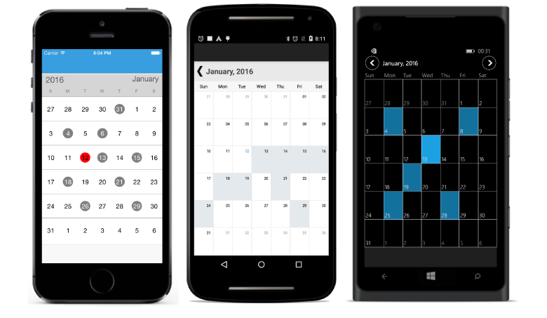
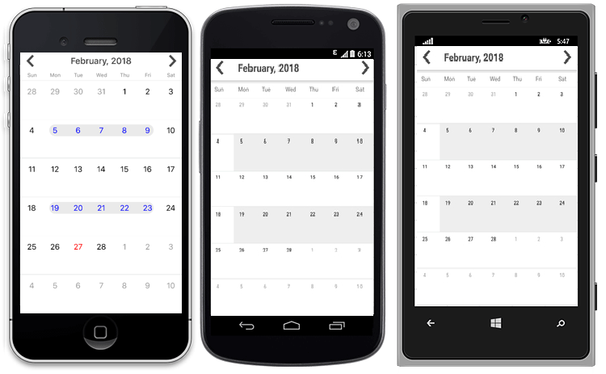

# Select Multiple Dates

Dates can be selected by making a touch on month view cells. The default Selection mode is Single which allows user to select one date at a time. [SfCalendar](https://help.syncfusion.com/cr/xamarin/Syncfusion.SfCalendar.XForms~Syncfusion.SfCalendar.XForms.SfCalendar.html) provides support to select dates in two modes such as Single and Multiple selection.

* `SingleSelection` – A single date can be selected in a month view which can be equipped when user needs to select one date at a time / to view events.

* `MultiSelection` – More than one date can be selected in a random manner. Clicking again on selected dates can do deselection.

* `RangeSelection` – It allows us to select a single date range in SfCalendar month view.

* `MultiRangeSelection` – More than one date range can be selected in a month view.

The selected dates can be retrieved through `OnSelectionChanged` event which is raised on selecting.





<syncfusion:SfCalendar  x:Name="calendar" SelectionMode="MultiSelection"/>




	
SfCalendar calendar = new SfCalendar();	
calendar.SelectionMode=SelectionMode.MultiSelection;
this.Content = calendar;
	




N> In range selection, navigation through swipe will be restricted and moving between months can be done by clicking on navigation button available at the top corner of `SfCalendar` control.





<syncfusion:SfCalendar  x:Name="calendar" SelectionMode="RangeSelection"/>





SfCalendar calendar = new SfCalendar();	
calendar.SelectionMode=SelectionMode.RangeSelection;
this.Content = calendar;
	








<syncfusion:SfCalendar  x:Name="calendar" SelectionMode="MultiRangeSelection"/>




	
SfCalendar calendar = new SfCalendar();	
calendar.SelectionMode=SelectionMode.MultiRangeSelection;
this.Content = calendar;
	




