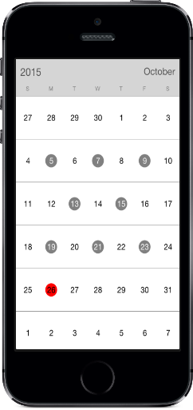

# Selection

Dates can be selected by making a touch on month view cells. The default Selection mode is Single which allows user to select one date at a time. Calendar provides support to select dates in two modes such as single and multiple selection.

* `SingleSelection` – A single date can be selected in a month view which can be equipped when user needs to select one date at a time / to view events.

* `MultiSelection` – More than one date can be selected in a random manner. Clicking again on selected dates can do deselection.

The selected dates can be retrieved through `OnCalendarTapped` event which is raised on selecting.


	
	sfCalendar.SelectionMode=SelectionMode.MultiSelection;
	


N>In range selection, navigation through swipe will be restricted and moving between months can be done by clicking on navigation button available at top corners of calendar control.

