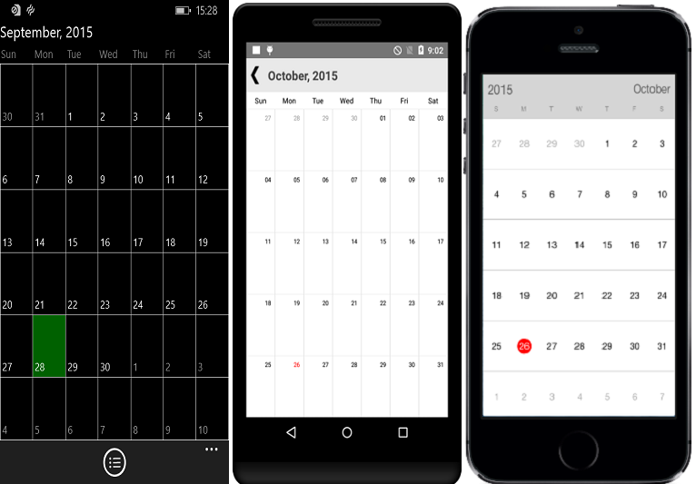
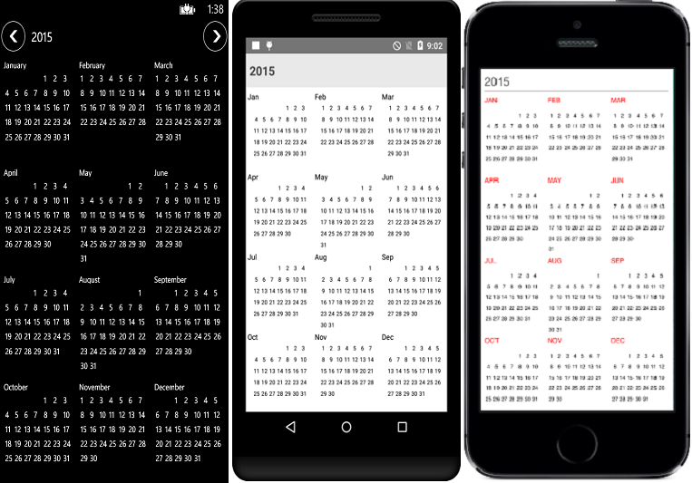

---
layout: post
title: Accessing View modes in Syncfusion Calendar control for Xamarin.Forms
description: Learn how to set month view and year view in Calendar
platform: Xamarin.Forms
control: Calendar
documentation: ug
---

# Built-in Views

Calendar control provides two types of views to display dates such as month view and year view. It can be assigned to the calendar control by using view mode property.

By default calendar control is assigned with month view. Based on the user’s preference calendar viewed in any of the available two type.

## Month View

This displays entire dates of a particular month, by default current month will be displayed on loading. The current date is provided with separate color different from the rest of the dates color in a month. The events availability will be denoted within the cell based on its duration.

The dates in month view can be selected by three ways such as single, multiple and range which can be modified using `SelectionMode`





	sfCalendar.ViewMode=ViewMode.MonthView;
 




	<CalendarSample:SfCalendar  x:Name="calendar" ViewMode="MonthView"/>




 

 
### Month view Settings

* Current day text color can be modified using `TodayTextColor`.

* The month view label settings class has the APIs to change date text size, day text size and format options are available.

* The background color of the inline view can be modified using `InlineBackgroundColor` property.

* The BlackOutDate color can be modified with `BlackOutColor` property.




	
	MonthLabelSettings labelsettings = new MonthLabelSettings();
	labelSettings.DateFormat = “dd”;
	labelSettings.DayLabelSize = 20;
	labelSettings.DayFormat = "EEE";
	labelSettings.DateLabelSize =  12;
	MonthViewSettings monthViewSettings = new MonthViewSettings();
	monthViewSettings.TodayTextColor=Color.ParseColor("#1B79D6");
	monthViewSettings.InlineBackgroundColor=Color.ParseColor("#E4E8ED");
	monthViewSettings.WeekDayBackGroundColor(Color.ParseColor("#F7F7F7"));
	monthviewSettings.MonthLabelSettings = labelSettings;
	sfCalendar.MonthViewSettings=monthViewSettings;
	




	<CalendarSample:SfCalendar  x:Name="monthviewSettings" TodayTextColor="Red" InlineBackgroundColor="Blue" WeekDayBackGroundColor="Yellow" MonthViewSettings="monthviewSettings"/>





N> Similar way there are many settings available to modify Text and Background colors of month view in `MonthViewSettings` class.

## YearView

This displays entire dates/month of a particular year, by default current year will be displayed on loading. The Years can be changed by swiping back and forth or `forward` and `backward` methods can be used. The Months can be navigated quickly by selecting on the particular month in year view.





	calendar.ViewMode=ViewMode.YearView;
	




	<CalendarSample:SfCalendar  x:Name="calendar" ViewMode="YearView"/>





  

### Year View Settings

* The Month header color can be modified using `MonthHeaderTextColor` property in similar way, year header and date text color can be changed using `YearTextColor` and `DateTextColor` properties respectively. 
* The gravity of the month name can be modified using `LabelAlignment` property, to position it to Left, Right or Center. 
* The complete layout’s background color can be modified using `YearLayoutBackground` property.   





	SfCalendar calendar = new SfCalendar(this);
	YearViewSettings yearViewSettings = new YearViewSettings();
	yearViewSettings.YearHeaderTextColor=Color.parseColor("#1B79D6");
	yearViewSettings.MonthHeaderBackground=Color.parseColor("#E4E8ED");
	yearViewSettings.DateTextColor=Color.RED;
	yearViewSettings.HeaderLabelAlignment=LabelAlignment.Center;
	calendar.YearViewSettings=yearViewSettings;

    



	<CalendarSample:SfCalendar  x:Name="calendar" YearHeaderTextColor="Red" MonthHeaderBackground="Green" DateTextColor="Blue" HeaderLabelAlignment="Center" YearViewSettings="yearViewSettings" />



                               

