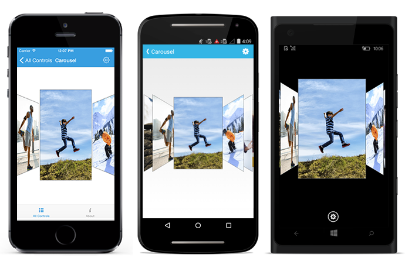
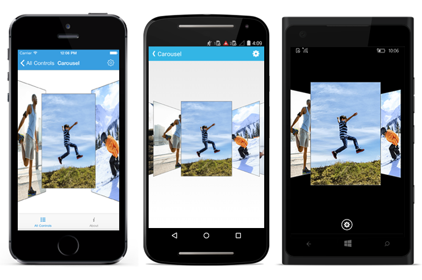

# Transformation

## Rotation Angle

The `RotationAngle` property in the SfCarousel control is used to rotate all the unselected items in a specified angle. 

N> If the angle value is positive, then the rotation is in the clockwise direction. If the angle value is negative, the rotation is in the counterclockwise direction. 





	carousel.RotationAngle=40;





	<carousel:SfCarousel x:Name="carousel" RotationAngle="45" />
	




## Offset

### Offset between items

The `Offset` property is used to specify the accurate distance between unselected items in SfCarousel panel.  

N> The default value is 20.





	carousel.Offset=30;





	<carousel:SfCarousel x:Name="carousel" Offset="30" />
	




### Offset around selected item

Distance between the selected item and other items can be customized by using `SelectedItemOffset` property of the SfCarousel control.





	carousel.SelectedItemOffset=5;





	<carousel:SfCarousel x:Name="carousel" SelectedItemOffset="5" />
	




### Scale Offset

The `ScaleOffset` property in the SfCarousel control is used to scale all the items to the specified scale value.




	
	carousel.ScaleOffset=0.7f;





	<carousel:SfCarousel x:Name="carousel" ScaleOffset="0.7f" />
	




