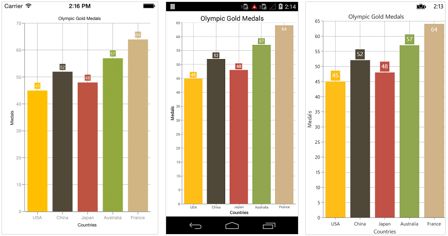

# Color Palette

## Apply palette for Chart

[`ColorModel`](http://help.syncfusion.com/cr/cref_files/xamarin/sfchart/Syncfusion.SfChart.XForms~Syncfusion.SfChart.XForms.ChartColorModel.html) property of [`SfChart`](http://help.syncfusion.com/cr/cref_files/xamarin/sfchart/Syncfusion.SfChart.XForms~Syncfusion.SfChart.XForms.SfChart.html) is used to define the colors for each series. ColorModel contains the following color palettes.

**Predefined Palettes**

Currently, Chart supports only Metro palette and it is the default palette for SfChart. The following screenshot shows the default appearance of multiple series.

**Custom Palette**

Chart will use the colors from [`CustomBrushes`](http://help.syncfusion.com/cr/cref_files/xamarin/sfchart/Syncfusion.SfChart.XForms~Syncfusion.SfChart.XForms.ChartColorModel~CustomBrushes.html) property if [`ColorModel.Palette`](http://help.syncfusion.com/cr/cref_files/xamarin/sfchart/Syncfusion.SfChart.XForms~Syncfusion.SfChart.XForms.ChartColorModel~Palette.html) is set to [`Custom`](http://help.syncfusion.com/cr/cref_files/xamarin/sfchart/Syncfusion.SfChart.XForms~Syncfusion.SfChart.XForms.ChartColorPalette.html).

Following code illustrates how to set the custom colors.

 



<chart:SfChart HorizontalOptions="FillAndExpand" VerticalOptions="FillAndExpand">

	<chart:SfChart.ColorModel>

		<chart:ChartColorModel Palette="Custom" CustomBrushes="{Binding Colors}"/>

	</chart:SfChart.ColorModel>

...

</chart:SfChart>





SfChart sfChart = new SfChart();
...

List<Color> colors = new List<Color>(){

	Color.Yellow,

	Color.Silver,

	Color.Maroon,                             

};

sfChart.ColorModel.Palette = ChartColorPalette.Custom;

sfChart.ColorModel.CustomBrushes = colors; 





**None Palette**

None palette will not apply any color to the series. So in order to define the color for any series, you can use the Color property or the ColorModel property of ChartSeries (The ColorModel of Series will be explained later in this document).

## Apply palette for Series

[`ColorModel`](http://help.syncfusion.com/cr/cref_files/xamarin/sfchart/Syncfusion.SfChart.XForms~Syncfusion.SfChart.XForms.ChartColorModel.html) property of [`ChartSeries`](http://help.syncfusion.com/cr/cref_files/xamarin/sfchart/Syncfusion.SfChart.XForms~Syncfusion.SfChart.XForms.ChartSeries.html) is used to define the colors for each data point. Following palettes are used to define the colors.

**Predefined Palettes**

Currently, Chart supports only Metro palette.

 



<chart:SfChart>
...

	<chart:ColumnSeries ItemsSource ="{Binding Data}" XBindingPath="Country" YBindingPath="Value">

		<chart:ColumnSeries.ColorModel>

			<chart:ChartColorModel Palette="Metro"/>

		</chart:ColumnSeries.ColorModel>

	</chart:ColumnSeries>

</chart:SfChart>





SfChart chart = new SfChart();
...

ColumnSeries columnSeries = new ColumnSeries() { 

	ItemsSource = Data, 
	XBindingPath = "Country", 
	YBindingPath = "Value" 
	
};

columnSeries.ColorModel.Palette = ChartColorPalette.Metro;

chart.Series.Add(columnSeries);





**Custom Palette**

Series will use the colors from `CustomBrushes` property if the `ColorModel.Palette` property of series is set to `Custom`.

Following code illustrates how to set the custom colors.

 



<chart:SfChart>
...

	<chart:ColumnSeries ItemsSource ="{Binding Data}" XBindingPath="Country" YBindingPath="Value">

		<chart:ColumnSeries.ColorModel>

			<chart:ChartColorModel Palette="Custom" CustomBrushes="{Binding Colors}"/>

		</chart:ColumnSeries.ColorModel>

	</chart:ColumnSeries>

</chart:SfChart>





SfChart chart = new SfChart();
...

ColumnSeries columnSeries = new ColumnSeries() { 

	ItemsSource = Data, 
	XBindingPath = "Country", 
	YBindingPath = "Value" 

};

List<Color> colors = new List<Color>(){

	Color.Red,
	Color.Gray,
	Color.Blue,
	Color.Maroon,
	Color.Pink,               

};

columnSeries.ColorModel.Palette = ChartColorPalette.Custom;

columnSeries.ColorModel.CustomBrushes = colors;

chart.Series.Add(columnSeries);





**None Palette**

None palette will not apply any color to the data points. So in order to define the color for the data points, you can use the [`Color`](http://help.syncfusion.com/cr/cref_files/xamarin/sfchart/Syncfusion.SfChart.XForms~Syncfusion.SfChart.XForms.ChartSeries~ColorProperty.html) property of [`ChartSeries`](http://help.syncfusion.com/cr/cref_files/xamarin/sfchart/Syncfusion.SfChart.XForms~Syncfusion.SfChart.XForms.ChartSeries.html).