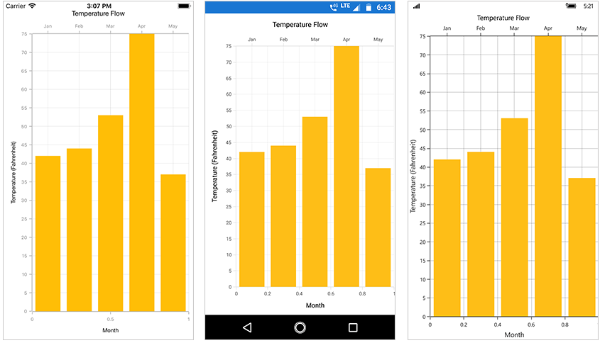
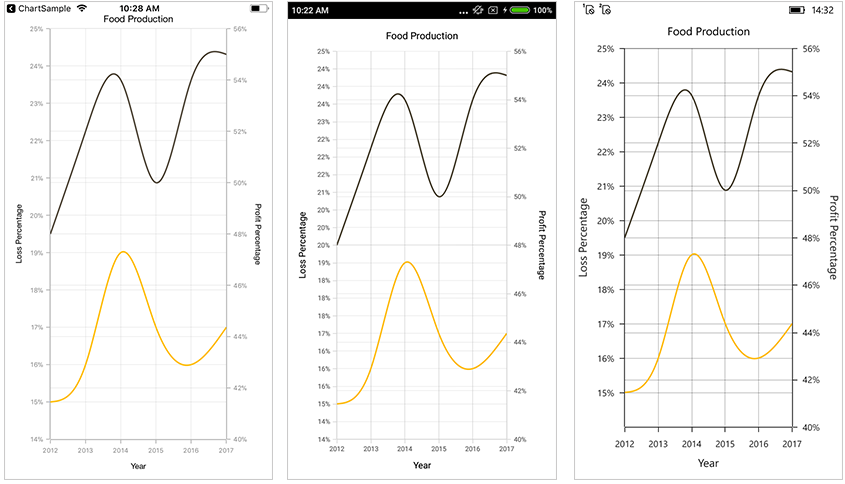

# Chart Series

## Multiple Series

You can add multiple series to [`Series`](http://help.syncfusion.com/cr/cref_files/xamarin/sfchart/Syncfusion.SfChart.XForms~Syncfusion.SfChart.XForms.ChartSeries.html) property of [`SfChart`](http://help.syncfusion.com/cr/cref_files/xamarin/sfchart/Syncfusion.SfChart.XForms~Syncfusion.SfChart.XForms.SfChart.html) class.

 



<chart:SfChart>
...

	<chart:ColumnSeries ItemsSource ="{Binding Data }" XBindingPath="Country"
	 YBindingPath="Value"/>
 
	<chart:ColumnSeries ItemsSource ="{Binding Data1}" XBindingPath="Country"
	 YBindingPath="Value"/>

	<chart:ColumnSeries ItemsSource ="{Binding Data2}" XBindingPath="Country"
	 YBindingPath="Value"/>

</chart:SfChart>





SfChart chart = new SfChart();
...

ColumnSeries columnSeries = new ColumnSeries() { 
	
	ItemsSource = Data, 
	XBindingPath = "Country", 
	YBindingPath = "Value" 

};

ColumnSeries columnSeries1 = new ColumnSeries() { 

	ItemsSource = Data1, 
	XBindingPath = "Country", 
	YBindingPath = "Value" 
	
};

ColumnSeries columnSeries2 = new ColumnSeries() { 

	ItemsSource = Data2, 
	XBindingPath = "Country", 
	YBindingPath = "Value" 
	
};

chart.Series.Add(columnSeries);

chart.Series.Add(columnSeries1);

chart.Series.Add(columnSeries2);





## Combination Series

[`SfChart`](http://help.syncfusion.com/cr/cref_files/xamarin/sfchart/Syncfusion.SfChart.XForms~Syncfusion.SfChart.XForms.SfChart.html) allows you to render the combination of different types of series.

 



<chart:SfChart>
...

	<chart:ColumnSeries ItemsSource ="{Binding Data}" XBindingPath="Month" YBindingPath="Value"/>

	<chart:LineSeries ItemsSource ="{Binding Data1}" XBindingPath="Month" YBindingPath="Value"/>

</chart:SfChart>





SfChart chart = new SfChart();

...

ColumnSeries columnSeries = new ColumnSeries() { 
	
	ItemsSource = Data, 
	XBindingPath = "Month",
	YBindingPath = "Value" 
	
};

LineSeries lineSeries = new LineSeries() { 
	
	ItemsSource = Data1, 
	XBindingPath = "Month", 
	YBindingPath = "Value" 
	
}; 

chart.Series.Add(columnSeries);

chart.Series.Add(lineSeries);





**Limitation of Combination Chart**

* Bar, StackingBar, and StackingBar100 cannot be combined with the other Cartesian type series.
* Cartesian type series cannot be combined with Accumulation series (pie, doughnut, funnel, and pyramid).

When the combination of Cartesian and Accumulation series types are added to the [`Series`](http://help.syncfusion.com/cr/cref_files/xamarin/sfchart/Syncfusion.SfChart.XForms~Syncfusion.SfChart.XForms.ChartSeries.html) property, the series which are similar to the first series will be rendered and other series will be ignored. Following code snippet illustrates this.

 



<chart:SfChart>
...

	<chart:LineSeries ItemsSource ="{Binding Data}" XBindingPath="Month" 
	YBindingPath="Value"/>

	<chart:PieSeries ItemsSource ="{Binding Data1}" XBindingPath="Month" 
	YBindingPath="Value"/>

</chart:SfChart>





SfChart chart = new SfChart();
...

LineSeries lineSeries = new LineSeries() { 

	ItemsSource = Data, 
	XBindingPath = "Month", 
	YBindingPath = "Value" 
	
};

PieSeries pieSeries = new PieSeries() { 

	ItemsSource = Data1, 
	XBindingPath = "Month", 
	YBindingPath = "Value" 
	
};

chart.Series.Add(lineSeries);

chart.Series.Add(pieSeries);





## Grouping Stacked Series

You can group and stack the similar stacked series types using [`GroupingLabel`](http://help.syncfusion.com/cr/cref_files/xamarin/sfchart/Syncfusion.SfChart.XForms~Syncfusion.SfChart.XForms.StackingSeriesBase~GroupingLabel.html) property of stacked series. The stacked series which contains the same [`GroupingLabel`](http://help.syncfusion.com/cr/cref_files/xamarin/sfchart/Syncfusion.SfChart.XForms~Syncfusion.SfChart.XForms.StackingSeriesBase~GroupingLabel.html) will be stacked in a single group.

 



<chart:SfChart>
...

	<chart:StackingColumnSeries ItemsSource ="{Binding Data1}" GroupingLabel="GroupOne" 
	Label="Google" XBindingPath="Month" YBindingPath="Value"/>

	<chart:StackingColumnSeries ItemsSource ="{Binding Data2}" GroupingLabel="GroupTwo" 
	Label="Bing" XBindingPath="Month" YBindingPath="Value"/>

	<chart:StackingColumnSeries ItemsSource ="{Binding Data3}" GroupingLabel="GroupOne" 
	Label="Yahoo" XBindingPath="Month" YBindingPath="Value"/>
	
	<chart:StackingColumnSeries ItemsSource ="{Binding Data4}" GroupingLabel="GroupTwo" 
	Label="Ask" XBindingPath="Month" YBindingPath="Value"/>

</chart:SfChart>





SfChart chart = new SfChart();
...

StackingColumnSeries stackingColumnSeries1 = new StackingColumnSeries() 
{ 
	ItemsSource = Data1, 
	GroupingLabel = "GroupOne",
	Label = "Google",
	XBindingPath = "Month", 
	YBindingPath = "Value" 
};

StackingColumnSeries stackingColumnSeries2 = new StackingColumnSeries() 
{ 
	ItemsSource = Data2, 
	GroupingLabel = "GroupTwo",
	Label = "Bing",
	XBindingPath = "Month", 
	YBindingPath = "Value" 
};

StackingColumnSeries stackingColumnSeries3 = new StackingColumnSeries() 
{ 
	ItemsSource = Data3,
	GroupingLabel = "GroupOne",
	Label = "Yahoo",
	XBindingPath = "Month", 
	YBindingPath = "Value" 
};

StackingColumnSeries stackingColumnSeries4 = new StackingColumnSeries() 
{ 
	ItemsSource = Data4,
	GroupingLabel = "GroupTwo",
	Label = "Ask",
	XBindingPath = "Month", 
	YBindingPath = "Value" 
};

chart.Series.Add(stackingColumnSeries1);
chart.Series.Add(stackingColumnSeries2);
chart.Series.Add(stackingColumnSeries3);
chart.Series.Add(stackingColumnSeries4);





## Multiple horizontal axis

You can set an additional horizontal axis for an individual series by using the [`XAxis`](http://help.syncfusion.com/cr/cref_files/xamarin/sfchart/Syncfusion.SfChart.XForms~Syncfusion.SfChart.XForms.CartesianSeries~XAxis.html) property of [`CartesianSeries`](http://help.syncfusion.com/cr/cref_files/xamarin/sfchart/Syncfusion.SfChart.XForms~Syncfusion.SfChart.XForms.CartesianSeries.html).

 



<chart:SfChart>
...

    <chart:SfChart.Series>

        <chart:SplineSeries ItemsSource="{Binding Data}" XBindingPath="Month" YBindingPath="Value">

            <chart:SplineSeries.XAxis>

                 <chart:CategoryAxis OpposedPosition="true" >

                    <chart:CategoryAxis.Title>

                        <chart:ChartAxisTitle Text="Year" /> 

                    </chart:CategoryAxis.Title>

                </chart:CategoryAxis>

            </chart:SplineSeries.XAxis>

        </chart:SplineSeries>

    </chart:SfChart.Series>

</chart:SfChart>





SfChart chart = new SfChart();
...

SplineSeries series = new SplineSeries();  

series.ItemsSource = Data;

series.XBindingPath = "Month";

series.YBindingPath = "Value";

CategoryAxis seriesAxis = new CategoryAxis();

seriesAxis.OpposedPosition = true;

seriesAxis.Title.Text = "Year";

series.XAxis = seriesAxis;

chart.Series.Add(series);





## Multiple vertical axis

You can set an additional vertical axis for an individual series by using the [`YAxis`](http://help.syncfusion.com/cr/cref_files/xamarin/sfchart/Syncfusion.SfChart.XForms~Syncfusion.SfChart.XForms.CartesianSeries~YAxis.html) property of [`CartesianSeries`](http://help.syncfusion.com/cr/cref_files/xamarin/sfchart/Syncfusion.SfChart.XForms~Syncfusion.SfChart.XForms.CartesianSeries.html).

 



<chart:SfChart>
...

    <chart:SfChart.Series>

        <chart:SplineSeries ItemsSource="{Binding Data}" XBindingPath="Month" YBindingPath="Value">

            <chart:SplineSeries.YAxis>

                <chart:NumericalAxis OpposedPosition="true" >

                    <chart:NumericalAxis.Title>

                        <chart:ChartAxisTitle Text="Profit Percentage" /> 

                    </chart:NumericalAxis.Title>

                </chart:NumericalAxis>

            </chart:SplineSeries.YAxis>

        </chart:SplineSeries>

    </chart:SfChart.Series>

</chart:SfChart>





SfChart chart = new SfChart();
...

SplineSeries series = new SplineSeries();  

series.ItemsSource = Data;

series.XBindingPath = "Month";

series.YBindingPath = "Value";

NumericalAxis seriesAxis = new NumericalAxis();

seriesAxis.OpposedPosition = true;

seriesAxis.Title.Text = "Profit Percentage";

series.YAxis = seriesAxis;

chart.Series.Add(series);





