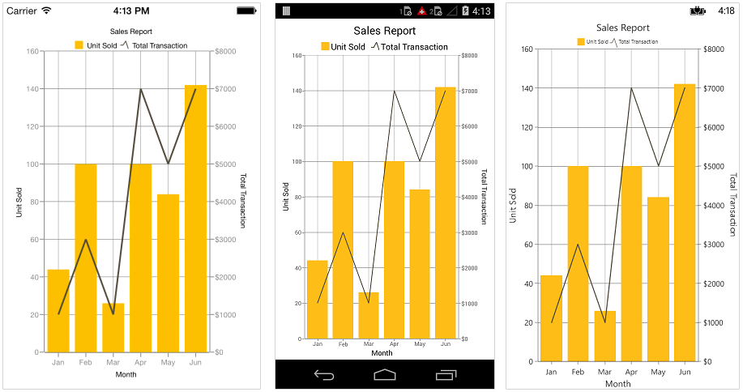
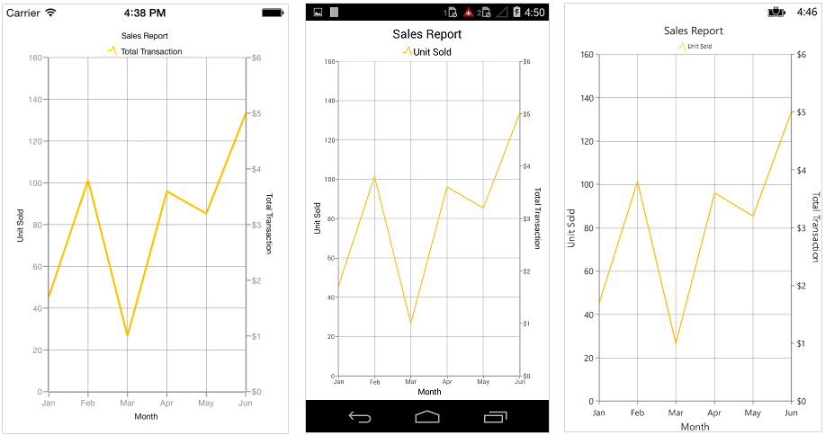
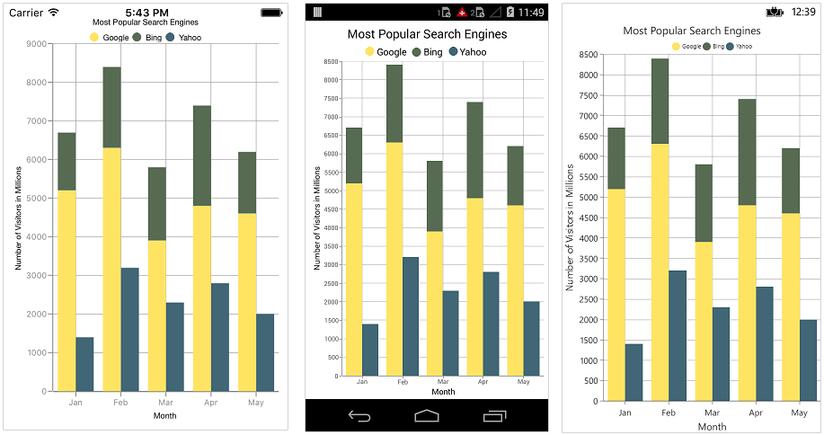
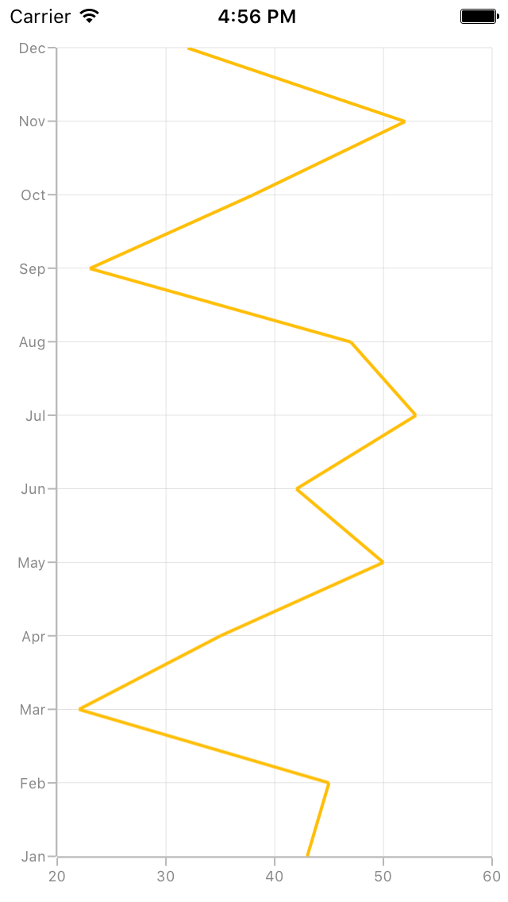

# Chart Series

## Multiple Series

You can add multiple series to [`Series`](http://help.syncfusion.com/cr/cref_files/xamarin/sfchart/Syncfusion.SfChart.XForms~Syncfusion.SfChart.XForms.ChartSeries.html) property of [`SfChart`](http://help.syncfusion.com/cr/cref_files/xamarin/sfchart/Syncfusion.SfChart.XForms~Syncfusion.SfChart.XForms.SfChart.html) class. By default, all the series rendered based on the [`PrimaryAxis`](https://help.syncfusion.com/cr/cref_files/xamarin/sfchart/Syncfusion.SfChart.XForms~Syncfusion.SfChart.XForms.SfChart~PrimaryAxis.html) and [`SecondaryAxis`](https://help.syncfusion.com/cr/cref_files/xamarin/sfchart/Syncfusion.SfChart.XForms~Syncfusion.SfChart.XForms.SfChart~SecondaryAxis.html) of [`SfChart`](http://help.syncfusion.com/cr/cref_files/xamarin/sfchart/Syncfusion.SfChart.XForms~Syncfusion.SfChart.XForms.SfChart.html). But if you want to plot different unit or value that is specific to particular series, you can specify the separate axis for that series using [`XAxis`](https://help.syncfusion.com/cr/cref_files/xamarin/sfchart/Syncfusion.SfChart.XForms~Syncfusion.SfChart.XForms.CartesianSeries~XAxis.html) and [`YAxis`](https://help.syncfusion.com/cr/cref_files/xamarin/sfchart/Syncfusion.SfChart.XForms~Syncfusion.SfChart.XForms.CartesianSeries~YAxis.html) properties of [`ChartSeries`](http://help.syncfusion.com/cr/cref_files/xamarin/sfchart/Syncfusion.SfChart.XForms~Syncfusion.SfChart.XForms.ChartSeries.html).

 



<chart:SfChart>
...

	<chart:ColumnSeries ItemsSource ="{Binding Data }" XBindingPath="Country"
	 YBindingPath="Value"/>
 
	<chart:ColumnSeries ItemsSource ="{Binding Data1}" XBindingPath="Country"
	 YBindingPath="Value"/>

	<chart:ColumnSeries ItemsSource ="{Binding Data2}" XBindingPath="Country"
	 YBindingPath="Value"/>

</chart:SfChart>





SfChart chart = new SfChart();
...

ColumnSeries columnSeries = new ColumnSeries() { 
	
	ItemsSource = Data, 
	XBindingPath = "Country", 
	YBindingPath = "Value" 

};

ColumnSeries columnSeries1 = new ColumnSeries() { 

	ItemsSource = Data1, 
	XBindingPath = "Country", 
	YBindingPath = "Value" 
	
};

ColumnSeries columnSeries2 = new ColumnSeries() { 

	ItemsSource = Data2, 
	XBindingPath = "Country", 
	YBindingPath = "Value" 
	
};

chart.Series.Add(columnSeries);

chart.Series.Add(columnSeries1);

chart.Series.Add(columnSeries2);





Following code snippet and screenshot shows how to apply the Y axis to individual series to plot different values.

 



<chart:SfChart.Series>

    <chart:ColumnSeries Label="Revenue" ItemsSource="{Binding Demands}" XBindingPath="XValue" YBindingPath="YValue" />

    <chart:LineSeries Label="Customers" ItemsSource="{Binding Demands}" XBindingPath="XValue" YBindingPath="YValue" >

        <chart:LineSeries.YAxis>

            <chart:NumericalAxis OpposedPosition="true" >

                <chart:NumericalAxis.Title>

                    <chart:ChartAxisTitle Text = "Number of Customers" />

                </chart:NumericalAxis.Title>

            </chart:NumericalAxis>

        </chart:LineSeries.YAxis>

     </chart:LineSeries>

</chart:SfChart.Series>





ColumnSeries series = new ColumnSeries();

series.ItemsSource = model.Demands;

series.XBindingPath = "XValue";

series.YBindingPath = "YValue";

series.Label = "Revenue";

chart.Series.Add(series);

LineSeries lineSeries = new LineSeries();

lineSeries.ItemsSource = model.Demands;

lineSeries.XBindingPath = "XValue";

lineSeries.YBindingPath = "YValue";

lineSeries.Label = "Customers";

NumericalAxis yAxis = new NumericalAxis();

yAxis.OpposedPosition = true;

yAxis.Title.Text = "Number of Customers";

lineSeries.YAxis = yAxis;

chart.Series.Add(lineSeries);





## Combination Series

[`SfChart`](http://help.syncfusion.com/cr/cref_files/xamarin/sfchart/Syncfusion.SfChart.XForms~Syncfusion.SfChart.XForms.SfChart.html) allows you to render the combination of different types of series.

 



<chart:SfChart>
...

	<chart:ColumnSeries ItemsSource ="{Binding Data}" XBindingPath="Month" YBindingPath="Value"/>

	<chart:LineSeries ItemsSource ="{Binding Data1}" XBindingPath="Month" YBindingPath="Value"/>

</chart:SfChart>





SfChart chart = new SfChart();

...

ColumnSeries columnSeries = new ColumnSeries() { 
	
	ItemsSource = Data, 
	XBindingPath = "Month",
	YBindingPath = "Value" 
	
};

LineSeries lineSeries = new LineSeries() { 
	
	ItemsSource = Data1, 
	XBindingPath = "Month", 
	YBindingPath = "Value" 
	
}; 

chart.Series.Add(columnSeries);

chart.Series.Add(lineSeries);





**Limitation of Combination Chart**

* Bar, StackingBar, and StackingBar100 cannot be combined with the other Cartesian type series.
* Cartesian type series cannot be combined with Accumulation series (pie, doughnut, funnel, and pyramid).

When the combination of Cartesian and Accumulation series types are added to the [`Series`](http://help.syncfusion.com/cr/cref_files/xamarin/sfchart/Syncfusion.SfChart.XForms~Syncfusion.SfChart.XForms.ChartSeries.html) property, the series which are similar to the first series will be rendered and other series will be ignored. Following code snippet illustrates this.

 



<chart:SfChart>
...

	<chart:LineSeries ItemsSource ="{Binding Data}" XBindingPath="Month" 
	YBindingPath="Value"/>

	<chart:PieSeries ItemsSource ="{Binding Data1}" XBindingPath="Month" 
	YBindingPath="Value"/>

</chart:SfChart>





SfChart chart = new SfChart();
...

LineSeries lineSeries = new LineSeries() { 

	ItemsSource = Data, 
	XBindingPath = "Month", 
	YBindingPath = "Value" 
	
};

PieSeries pieSeries = new PieSeries() { 

	ItemsSource = Data1, 
	XBindingPath = "Month", 
	YBindingPath = "Value" 
	
};

chart.Series.Add(lineSeries);

chart.Series.Add(pieSeries);





## Grouping Stacked Series

You can group and stack the similar stacked series types using [`GroupingLabel`](http://help.syncfusion.com/cr/cref_files/xamarin/sfchart/Syncfusion.SfChart.XForms~Syncfusion.SfChart.XForms.StackingSeriesBase~GroupingLabel.html) property of stacked series. The stacked series which contains the same [`GroupingLabel`](http://help.syncfusion.com/cr/cref_files/xamarin/sfchart/Syncfusion.SfChart.XForms~Syncfusion.SfChart.XForms.StackingSeriesBase~GroupingLabel.html) will be stacked in a single group.

 



<chart:SfChart>
...

	<chart:StackingColumnSeries ItemsSource ="{Binding Data1}" GroupingLabel="GroupOne" 
	Label="Google" XBindingPath="Month" YBindingPath="Value"/>

	<chart:StackingColumnSeries ItemsSource ="{Binding Data2}" GroupingLabel="GroupTwo" 
	Label="Bing" XBindingPath="Month" YBindingPath="Value"/>

	<chart:StackingColumnSeries ItemsSource ="{Binding Data3}" GroupingLabel="GroupOne" 
	Label="Yahoo" XBindingPath="Month" YBindingPath="Value"/>
	
	<chart:StackingColumnSeries ItemsSource ="{Binding Data4}" GroupingLabel="GroupTwo" 
	Label="Ask" XBindingPath="Month" YBindingPath="Value"/>

</chart:SfChart>





SfChart chart = new SfChart();
...

StackingColumnSeries stackingColumnSeries1 = new StackingColumnSeries() 
{ 
	ItemsSource = Data1, 
	GroupingLabel = "GroupOne",
	Label = "Google",
	XBindingPath = "Month", 
	YBindingPath = "Value" 
};

StackingColumnSeries stackingColumnSeries2 = new StackingColumnSeries() 
{ 
	ItemsSource = Data2, 
	GroupingLabel = "GroupTwo",
	Label = "Bing",
	XBindingPath = "Month", 
	YBindingPath = "Value" 
};

StackingColumnSeries stackingColumnSeries3 = new StackingColumnSeries() 
{ 
	ItemsSource = Data3,
	GroupingLabel = "GroupOne",
	Label = "Yahoo",
	XBindingPath = "Month", 
	YBindingPath = "Value" 
};

StackingColumnSeries stackingColumnSeries4 = new StackingColumnSeries() 
{ 
	ItemsSource = Data4,
	GroupingLabel = "GroupTwo",
	Label = "Ask",
	XBindingPath = "Month", 
	YBindingPath = "Value" 
};

chart.Series.Add(stackingColumnSeries1);
chart.Series.Add(stackingColumnSeries2);
chart.Series.Add(stackingColumnSeries3);
chart.Series.Add(stackingColumnSeries4);





## Animation

[`SfChart`](https://help.syncfusion.com/cr/cref_files/xamarin/sfchart/Syncfusion.SfChart.XForms~Syncfusion.SfChart.XForms.SfChart.html) provides animation support for data series. [`Series`](https://help.syncfusion.com/cr/cref_files/xamarin/sfchart/Syncfusion.SfChart.XForms~Syncfusion.SfChart.XForms.SfChart~Series.html) will be animated whenever the items source changes. Animation can be enabled by setting the [`EnableAnimation`](https://help.syncfusion.com/cr/cref_files/xamarin/sfchart/Syncfusion.SfChart.XForms~Syncfusion.SfChart.XForms.ChartSeries~EnableAnimation.html) property to `true`. You can also control the duration of the animation using [`AnimationDuration`](https://help.syncfusion.com/cr/cref_files/xamarin/sfchart/Syncfusion.SfChart.XForms~Syncfusion.SfChart.XForms.ChartSeries~AnimationDuration.html) property.

 



<chart:SfChart>
...

	<chart:ColumnSeries 
    	ItemsSource="{Binding ColumnData}" 
    	EnableAnimation = "true" 
    	AnimationDuration="0.8" 
   		XBindingPath="Name" 
    	YBindingPath="Value"  />

</chart:SfChart>





ColumnSeries column = new ColumnSeries ();
column.ItemsSource = viewModel.ColumnData;
column.XBindingPath = "Name";
column.YBindingPath = "Value";
column.EnableAnimation = true;
column.AnimationDuration = 0.8;





## Transpose the Series

The [`IsTransposed`](https://help.syncfusion.com/cr/cref_files/xamarin/sfchart/Syncfusion.SfChart.XForms~Syncfusion.SfChart.XForms.CartesianSeries~IsTransposed.html) property of [`CartesianSeries`](https://help.syncfusion.com/cr/cref_files/xamarin/sfchart/Syncfusion.SfChart.XForms~Syncfusion.SfChart.XForms.CartesianSeries.html) is used to plot the chart in the vertical direction and this helps to view the data in different perspective.

 



<chart:SfChart.Series>

	<chart:LineSeries ItemsSource="{Binding Data}" XBindingPath="Month"
					  YBindingPath="Value" IsTransposed="True"/>

</chart:SfChart.Series>





SfChart chart = new SfChart();
...	

LineSeries lineSeries = new LineSeries();
lineSeries.XBindingPath = "Month";
lineSeries.YBindingPath = "Value";
]lineSeries.ItemsSource = Data;
lineSeries.IsTransposed = true;
chart.Series.Add(lineSeries);





