# Chart Types

## Line Chart

To render a line chart, create an instance of `LineSeries` and add to the `Series` collection property of `SfChart`. You can use the following properties to customize the appearance.

* `Color` – used to change the color of the line.
* `StrokeWidth` – used to change the stroke width of the line.


[XAML]

<chart:SfChart>
...

	<chart:LineSeries ItemsSource ="{Binding Data}" XBindingPath="Year" YBindingPath="Value"/>

</chart:SfChart>




[C#]

SfChart chart = new SfChart();
...

LineSeries lineSeries = new LineSeries()
{
	ItemsSource = Data,
	XBindingPath = "Year",
	YBindingPath = "Value"
};
chart.Series.Add(lineSeries);



## Area Chart

To render an area chart, create an instance of `AreaSeries` and add to the `Series` collection property of `SfChart`. You can use the following properties to customize the appearance.

* `Color` – used to change the color of the series.
* `StrokeWidth` – used to change the stroke width of the series.
* `StrokeColor` – used to change the stroke color of the series.


[XAML]

<chart:SfChart>
...

	<chart:AreaSeries ItemsSource ="{Binding Data}" XBindingPath="Year" YBindingPath="Value"/>

</chart:SfChart>




[C#]

SfChart chart = new SfChart();
...

AreaSeries areaSeries = new AreaSeries() 
{ 
	ItemsSource = Data, 
	XBindingPath = "Year", 
	YBindingPath = "Value" 
};
chart.Series.Add(areaSeries);



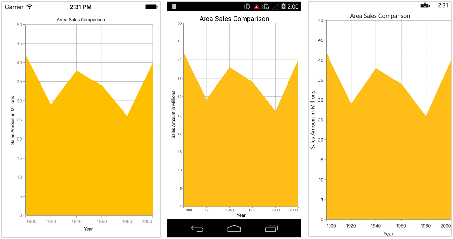

## Spline Area Chart

To render a spline area chart, create an instance of `SplineAreaSeries` and add to the `Series` collection property of `SfChart`. You can use the following properties to customize the spline area appearance.

* `Color` – used to change the color of the series.
* `StrokeWidth` – used to change the stroke width of the series.
* `StrokeColor` – used to change the stroke color of the series.


[XAML]

<chart:SfChart>
...

	<chart:SplineAreaSeries ItemsSource ="{Binding Data}" XBindingPath="Year" YBindingPath="Value"/>

</chart:SfChart>




[C#]

SfChart chart = new SfChart();
...

SplineAreaSeries splineAreaSeries = new SplineAreaSeries() 
{ 
	ItemsSource = Data, 
	XBindingPath = "Year", 
	YBindingPath = "Value" 
};
chart.Series.Add(splineAreaSeries);



## Stacked Area Chart

To render a stacked area chart, create an instance of `StackingAreaSeries` and add to the `Series` collection property of `SfChart`. You can use the following properties to customize the stacked area appearance.

* `Color` – used to change the color of the series.
* `StrokeWidth` – used to change the stroke width of the series.
* `StrokeColor` – used to change the stroke color of the series.


[XAML]

<chart:SfChart>
...

	<chart:StackingAreaSeries ItemsSource ="{Binding Data1}" XBindingPath="Year" YBindingPath="Value"/>

	<chart:StackingAreaSeries ItemsSource ="{Binding Data2}" XBindingPath="Year" YBindingPath="Value"/>

	<chart:StackingAreaSeries ItemsSource ="{Binding Data3}" XBindingPath="Year" YBindingPath="Value"/>

</chart:SfChart>




[C#]

SfChart chart = new SfChart();
...

StackingAreaSeries stackingAreaSeries1 = new StackingAreaSeries() 
{ 
	ItemsSource = Data1, 
	XBindingPath = "Year", 
	YBindingPath = "Value" 
};

StackingAreaSeries stackingAreaSeries2 = new StackingAreaSeries() 
{ 
	ItemsSource = Data2, 
	XBindingPath = "Year", 
	YBindingPath = "Value" 
};

StackingAreaSeries stackingAreaSeries3 = new StackingAreaSeries() 
{ 
	ItemsSource = Data3, 
	XBindingPath = "Year", 
	YBindingPath = "Value" 
};

chart.Series.Add(stackingAreaSeries1);
chart.Series.Add(stackingAreaSeries2);
chart.Series.Add(stackingAreaSeries3);



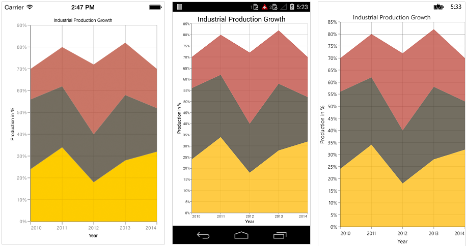

## 100% Stacked Area Chart

To render a 100% stacked area chart, create an instance of `StackingArea100Series` and add to the `Series` collection property of `SfChart`. You can use the following properties to customize the 100% stacked area appearance.

* `Color` – used to change the color of the series.
* `StrokeWidth` – used to change the stroke width of the series.
* `StrokeColor` – used to change the stroke color of the series.


[XAML]

<chart:SfChart>
...

	<chart:StackingArea100Series ItemsSource ="{Binding Data1}" XBindingPath="Year" YBindingPath="Value"/>

	<chart:StackingArea100Series ItemsSource ="{Binding Data2}" XBindingPath="Year" YBindingPath="Value"/>

	<chart:StackingArea100Series ItemsSource ="{Binding Data3}" XBindingPath="Year" YBindingPath="Value"/>

</chart:SfChart>




[C#]

SfChart chart = new SfChart();
...

StackingArea100Series stackingArea100Series1 = new StackingArea100Series() 
{ 
	ItemsSource = Data1, 
	XBindingPath = "Year", 
	YBindingPath = "Value" 
};

StackingArea100Series stackingArea100Series2 = new StackingArea100Series() 
{ 
	ItemsSource = Data2, 
	XBindingPath = "Year", 
	YBindingPath = "Value" 
};

StackingArea100Series stackingArea100Series3 = new StackingArea100Series() 
{ 
	ItemsSource = Data3, 
	XBindingPath = "Year", 
	YBindingPath = "Value" 
};

chart.Series.Add(stackingArea100Series1);
chart.Series.Add(stackingArea100Series2);
chart.Series.Add(stackingArea100Series3);



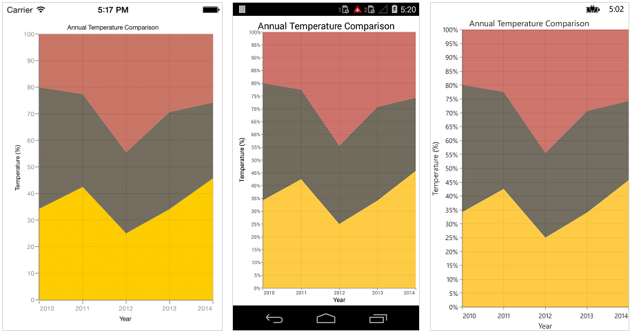

## Column Chart

To render a column chart, create an instance of `ColumnSeries` and add to the `Series` collection property of `SfChart`. You can use the following properties to customize the appearance.

* `Color` – used to change the color of the series.
* `StrokeWidth` – used to change the stroke width of the series.
* `StrokeColor` – used to change the stroke color of the series. 


[XAML]

<chart:SfChart>
...

	<chart:ColumnSeries ItemsSource ="{Binding Data}" XBindingPath="Country" YBindingPath="Value"/>

</chart:SfChart>




[C#]

SfChart chart = new SfChart();
...

ColumnSeries columnSeries = new ColumnSeries() 
{ 
	ItemsSource = Data, 
	XBindingPath = "Country", 
	YBindingPath = "Value" 
};
chart.Series.Add(columnSeries);



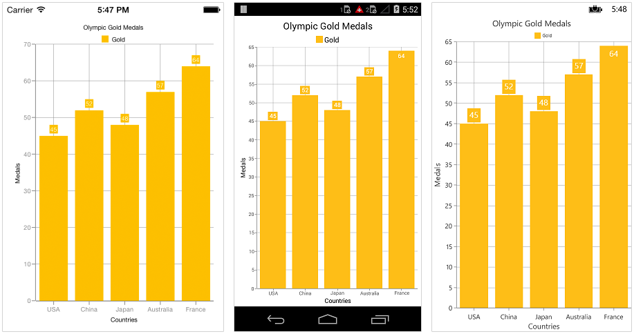

## Range Column Chart

To render a range column chart, create an instance of `RangeColumnSeries` and add to the `Series` collection property of `SfChart`. 

Since the `RangeColumnSeries` requires two Y values for a point, your data should contain high and low values. High and low value specifies the maximum and minimum range of the point. 

There are two ways you can provide data to RangeColumn chart,

1.You can use [ChartDataPoint's](http://help.syncfusion.com/cr/cref_files/xamarin/sfchart/topic654.html#) three parameter constructor to pass x value, high and low values to  `RangeColumnSeries`,


[C#] 

SfChart chart = new SfChart();
...

ObservableCollection<ChartDataPoint> data = new ObservableCollection<ChartDataPoint>()
{    
	new ChartDataPoint("Jan", 1.8, 7.6 ),
	new ChartDataPoint("Feb", 3, 10),
	new ChartDataPoint("Mar", 1.7, 7.5),
	new ChartDataPoint("Apr", 4.5, 7.8),
	new ChartDataPoint("May", 5, 11.4),
	new ChartDataPoint("Jun", 4.2, 10.1),
};
	
RangeColumnSeries rangeColumnSeries = new RangeColumnSeries() 
{ 
	ItemsSource = data 
};
	
chart.Series.Add(rangeColumnSeries);



2.Or else you can use `High` and `Low` properties of `RangeColumnSeries` to map the high and low values from custom object to chart. 


[XAML]

<chart:SfChart>
...

	<chart:RangeColumnSeries ItemsSource ="{Binding Data}" XBindingPath="Month" High="Value1" Low="Value2"/>

</chart:SfChart>




[C#]
   
SfChart chart = new SfChart();
...
   
RangeColumnSeries rangeColumnSeries = new RangeColumnSeries() 
{ 
	ItemsSource = Data,
	XBindingPath = "Month", 
	High = "Value1",
	Low = "Value2" 
};
chart.Series.Add(rangeColumnSeries);



Following properties are used to customize the range column segment appearance,

* `Color` – used to change the color of the series.
* `StrokeWidth` – used to change the stroke width of the series.
* `StrokeColor` – used to change the stroke color of the series.

## Stacked Column Chart

To render a stacked column chart, create an instance of `StackingColumnSeries` and add to the `Series` collection property of `SfChart`. You can use the following properties to customize the stacked column segment appearance.

* `Color` – used to change the color of the series.
* `StrokeWidth` – used to change the stroke width of the series.
* `StrokeColor` – used to change the stroke color of the series.


[XAML]

<chart:SfChart>
...

	<chart:StackingColumnSeries ItemsSource ="{Binding Data1}" XBindingPath="Month" YBindingPath="Value"/>

	<chart:StackingColumnSeries ItemsSource ="{Binding Data2}" XBindingPath="Month" YBindingPath="Value"/>

	<chart:StackingColumnSeries ItemsSource ="{Binding Data3}" XBindingPath="Month" YBindingPath="Value"/>

</chart:SfChart>




[C#]

SfChart chart = new SfChart();
...

StackingColumnSeries stackingColumnSeries1 = new StackingColumnSeries() 
{ 
	ItemsSource = Data1, 
	XBindingPath = "Month", 
	YBindingPath = "Value" 
};

StackingColumnSeries stackingColumnSeries2 = new StackingColumnSeries() 
{ 
	ItemsSource = Data2, 
	XBindingPath = "Month", 
	YBindingPath = "Value" 
};

StackingColumnSeries stackingColumnSeries3 = new StackingColumnSeries() 
{ 
	ItemsSource = Data3, 
	XBindingPath = "Month", 
	YBindingPath = "Value" 
};

chart.Series.Add(stackingColumnSeries1);
chart.Series.Add(stackingColumnSeries2);
chart.Series.Add(stackingColumnSeries3);



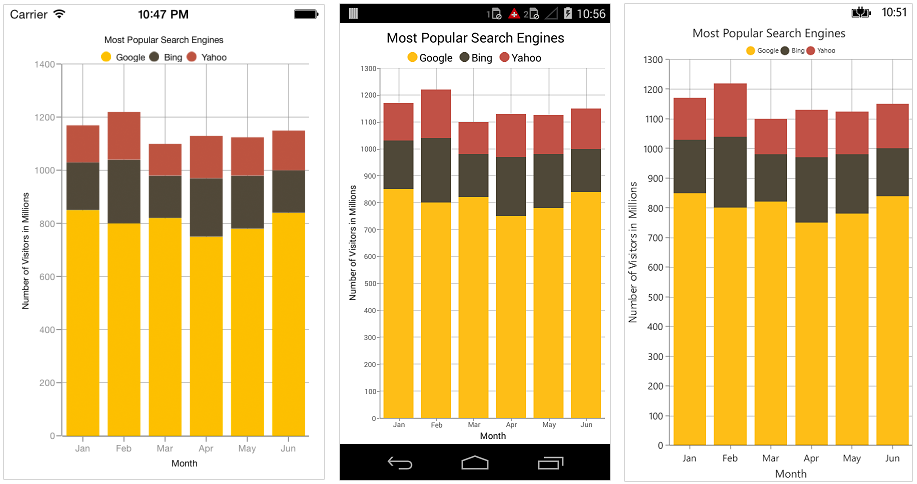

## 100% Stacked Column Chart

To render a 100% stacked column chart, create an instance of `StackingColumn100Series` and add to the `Series` collection property of `SfChart`. You can use the following properties to customize the series appearance.

* `Color` – used to change the color of the series.
* `StrokeWidth` – used to change the stroke width of the series.
* `StrokeColor` – used to change the stroke color of the series.


[XAML]

<chart:SfChart>
...

	<chart:StackingColumn100Series ItemsSource ="{Binding Data1}" XBindingPath="Year" YBindingPath="Value"/>

	<chart:StackingColumn100Series ItemsSource ="{Binding Data2}" XBindingPath="Year" YBindingPath="Value"/>

	<chart:StackingColumn100Series ItemsSource ="{Binding Data3}" XBindingPath="Year" YBindingPath="Value"/>

</chart:SfChart>




[C#]

SfChart chart = new SfChart();
...

StackingColumn100Series stackingColumn100Series1 = new StackingColumn100Series() 
{ 
	ItemsSource = Data1, 
	XBindingPath = "Year", 
	YBindingPath = "Value" 
};

StackingColumn100Series stackingColumn100Series2 = new StackingColumn100Series() 
{ 
	ItemsSource = Data2, 
	XBindingPath = "Year", 
	YBindingPath = "Value"  
};

StackingColumn100Series stackingColumn100Series3 = new StackingColumn100Series() 
{ 
	ItemsSource = Data3, 
	XBindingPath = "Year", 
	YBindingPath = "Value" 
};

chart.Series.Add(stackingColumn100Series1);
chart.Series.Add(stackingColumn100Series2);
chart.Series.Add(stackingColumn100Series3);



## Bar Chart

To render a bar chart, create an instance of `BarSeries` and add to the `Series` collection property of `SfChart`. You can use the following properties to customize the bar segment appearance.

* `Color` – used to change the color of the series.
* `StrokeWidth` – used to change the stroke width of series.
* `StrokeColor` – used to change the stroke color of the series.


[XAML]

<chart:SfChart>
...

	<chart:BarSeries ItemsSource ="{Binding Data}" XBindingPath="Year" YBindingPath="Value"/>

</chart:SfChart>




[C#]

SfChart chart = new SfChart();
...

BarSeries barSeries = new BarSeries () 
{ 
	ItemsSource = Data, 
	XBindingPath = "Year", 
	YBindingPath = "Value" 
};
chart.Series.Add(barSeries);



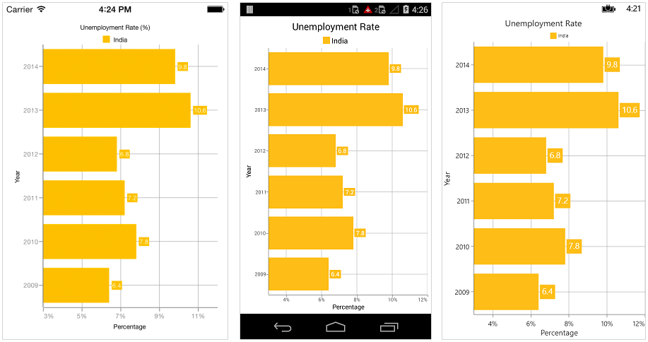

## Stacked Bar Chart

To render a stacked bar chart, create an instance of `StackingBarSeries` and add to the `Series` collection property of `SfChart`. You can use the following properties to customize the stacked bar segment appearance.

* `Color` – used to change the color of the series.
* `StrokeWidth` – used to change the stroke width of the series.
* `StrokeColor` – used to change the stroke color of the series.


[XAML]

<chart:SfChart>
…

	<chart:StackingBarSeries ItemsSource ="{Binding Data1}" XBindingPath="Month" YBindingPath="Value"/>

	<chart:StackingBarSeries ItemsSource ="{Binding Data2}" XBindingPath="Month" YBindingPath="Value"/>

	<chart:StackingBarSeries ItemsSource ="{Binding Data3}" XBindingPath="Month" YBindingPath="Value"/>

</chart:SfChart>




[C#]

SfChart chart = new SfChart();
...

StackingBarSeries stackingBarSeries1 = new StackingBarSeries() 
{ 
	ItemsSource = Data1, 
	XBindingPath = "Month", 
	YBindingPath = "Value" 
};

StackingBarSeries stackingBarSeries2 = new StackingBarSeries() 
{ 
	ItemsSource = Data2, 
	XBindingPath = "Month", 
	YBindingPath = "Value" 
};

StackingBarSeries stackingBarSeries3 = new StackingBarSeries() 
{ 
	ItemsSource = Data3, 
	XBindingPath = "Month", 
	YBindingPath = "Value" 
};

chart.Series.Add(stackingBarSeries1);
chart.Series.Add(stackingBarSeries2);
chart.Series.Add(stackingBarSeries3);



## 100% Stacked Bar Chart

To render a 100% stacked bar chart, create an instance of `StackingBar100Series` and add to the `Series` collection property of `SfChart`. You can use the following properties to customize the series appearance.

* `Color` – used to change the color of the series.
* `StrokeWidth` – used to change the stroke width of the series.
* `StrokeColor` – used to change the stroke color of the series.


[XAML]

<chart:SfChart>
...

	<chart:StackingBar100Series ItemsSource ="{Binding Data1}" XBindingPath="Year" YBindingPath="Value"/>

	<chart:StackingBar100Series ItemsSource ="{Binding Data2}" XBindingPath="Year" YBindingPath="Value"/>

	<chart:StackingBar100Series ItemsSource ="{Binding Data3}" XBindingPath="Year" YBindingPath="Value"/>

</chart:SfChart>




[C#]

SfChart chart = new SfChart();
...

StackingBar100Series stackingBar100Series1 = new StackingBar100Series() 
{ 
	ItemsSource = Data1, 
	XBindingPath = "Year", 
	YBindingPath = "Value" 
};

StackingBar100Series stackingBar100Series2 = new StackingBar100Series() 
{ 
	ItemsSource = Data2, 
	XBindingPath = "Year", 
	YBindingPath = "Value" 
};

StackingBar100Series stackingBar100Series3 = new StackingBar100Series() 
{ 
	ItemsSource = Data3, 
	XBindingPath = "Year", 
	YBindingPath = "Value"  
};

chart.Series.Add(stackingBar100Series1);
chart.Series.Add(stackingBar100Series2);
chart.Series.Add(stackingBar100Series3);



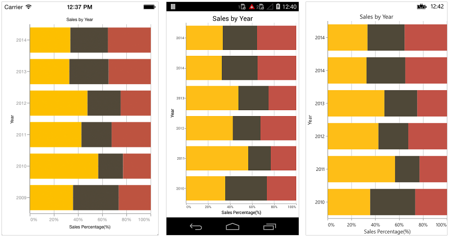

## Spline Chart

To render a spline chart, create an instance of `SplineSeries` and add to the `Series` collection property of `SfChart`. You can use the following properties to customize the spline segment appearance.

* `Color` – used to change the color of the series.
* `StrokeWidth` – used to change the stroke width of the series.


[XAML]

<chart:SfChart>
...

	<chart:SplineSeries ItemsSource ="{Binding Data}" XBindingPath="Month" YBindingPath="Value"/>

</chart:SfChart>




[C#]

SfChart chart = new SfChart();
...

SplineSeries splineSeries = new SplineSeries() 
{ 
	ItemsSource = Data, 
	XBindingPath = "Month", 
	YBindingPath = "Value"  
};
chart.Series.Add(splineSeries);



## Fast Line Chart

`FastLineSeries` is a line chart, but it loads faster than `LineSeries`. You can use this when there are large number of points to be loaded in chart. To render a fast line chart, create an instance of `FastLineSeries` and add to the `Series` collection property of `SfChart`. You can use the following properties to customize the fast line segment appearance.

* `Color` – used to change the color of the series.
* `StrokeWidth` – used to change the stroke width of the series.


[XAML]

<chart:SfChart>
...

	<chart:FastLineSeries ItemsSource ="{Binding Data}" XBindingPath="XValue" YBindingPath="YValue"/>

</chart:SfChart>




[C#]

SfChart chart = new SfChart();
...

FastLineSeries fastLineSeries = new FastLineSeries() 
{ 
	ItemsSource = Data, 
	XBindingPath = "XValue", 
	YBindingPath = "YValue"  
};
chart.Series.Add(fastLineSeries);



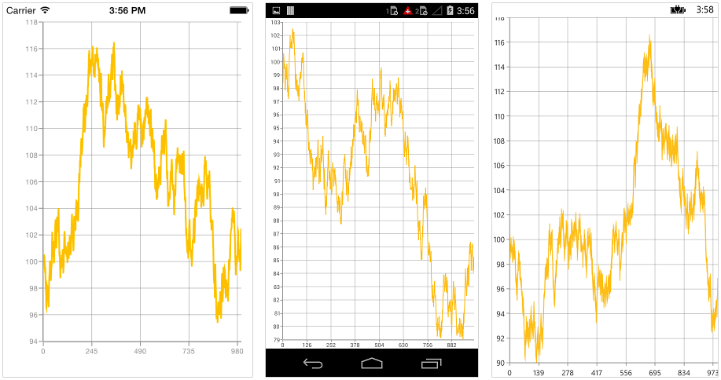

### Dashed Lines

`StrokeDashArray` property of the `FastLineSeries` is used to render fast line series with dashes.


[C#]

...

FastLineSeries fastLineSeries = new FastLineSeries() 
{ 
	ItemsSource = Data, 
	XBindingPath = "Month", 
	YBindingPath = "Value" 
};
fastLineSeries.StrokeDashArray = new double[2] { 2, 3 };



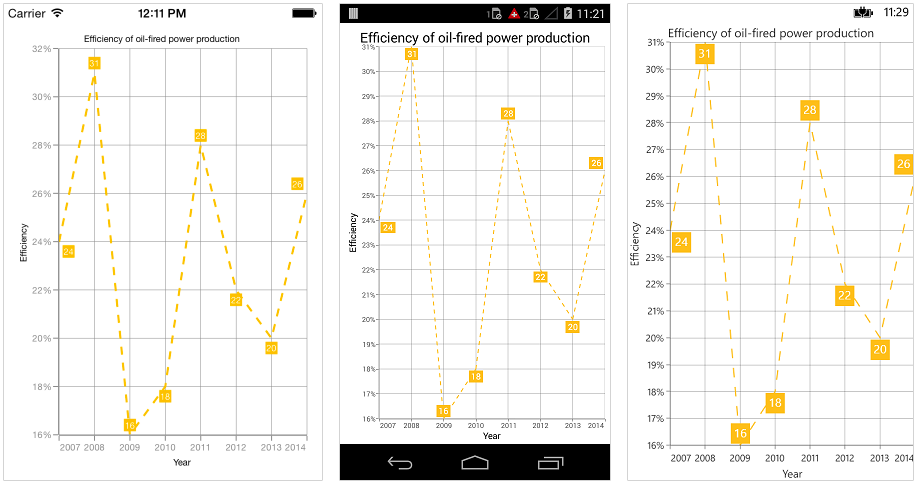

## Bubble Chart

To render a bubble chart, create an instance of `BubbleSeries` and add to the `Series` collection property of `SfChart`. 

Bubble chart requires 3 fields (X, Y and Size) to plot a point. Here `‘Size’` is used to specify the size of each bubble segment. 

There are two ways you can provide data to bubble chart,

1.You can use [ChartDataPoint's](http://help.syncfusion.com/cr/cref_files/xamarin/sfchart/topic654.html) three parameter constructor to pass x, y and size values to  `BubbleSeries`,


[C#]

SfChart chart = new SfChart();
...

ObservableCollection<ChartDataPoint> data = new ObservableCollection<ChartDataPoint>()
{    
	new ChartDataPoint(64, 14.4, 20),
	new ChartDataPoint(71, 2, 15),
	new ChartDataPoint(74, 7, 30),
	new ChartDataPoint(80, 4, 22),
	new ChartDataPoint(82, 10.3, 28),
	new ChartDataPoint(94, 1, 8),
	new ChartDataPoint(96, 6, 18),
	new ChartDataPoint(98, 12.3, 28),                       
};
   
BubbleSeries bubbleSeries = new BubbleSeries() 
{ 
	ItemsSource = data 
};

chart.Series.Add(bubbleSeries);



2.Or else you can use `YBindingPath` and `Size` properties of `BubbleSeries`to map the Y value and size from custom object to chart. 


[XAML]

<chart:SfChart>
...

	<chart:BubbleSeries ItemsSource ="{Binding Data}" XBindingPath="XValue" YBindingPath="YValue" Size="Size"/>

</chart:SfChart>




[C#]

SfChart chart = new SfChart();
...

BubbleSeries bubbleSeries = new BubbleSeries() 
{ 
	ItemsSource = Data, 
	XBindingPath = "XValue", 
	BindingPath = "YValue", 
	XBindingPath = "Size” 
};
chart.Series.Add(bubbleSeries);



Following properties are used to customize the bubble segment appearance.

* `Color` – used to change the color of the series.
* `StrokeWidth` – used to change the stroke width of the series.
* `StrokeColor` – used to change the stroke color of the series.
* `MinimumRadius` – used to change the minimum size of the series.
* `MaximumRadius` – used to change the maximum size of the series.

## Scatter Chart	

To render a scatter chart, create an instance of `ScatterSeries` and add to the `Series` collection property of `SfChart`. You can use the following properties to customize the scatter segment appearance.

* `Color` – used to change the color of the series.
* `StrokeWidth` – used to change the stroke width of the series.
* `StrokeColor` – used to change the stroke color of the series.
* `ScatterWidth` – used to change the width of the series.
* `ScatterHeight` – used to change the height of the series.


[XAML]

<chart:SfChart>
...

	<chart:ScatterSeries ScatterHeight="15" ScatterWidth="15" ItemsSource ="{Binding Data}" XBindingPath="Year" YBindingPath="Value"/>

</chart:SfChart>




[C#]

SfChart chart = new SfChart();
...

ScatterSeries scatterSeries = new ScatterSeries ()
{ 
	ItemsSource = Data, 	
	ScatterHeight = 15, 
	ScatterWidth = 15, 
	XBindingPath = "Year", 
	YBindingPath = "Value" 
};
chart.Series.Add(scatterSeries);



## OHLC Chart

To render an OHLC chart, create an instance of `HiLoOpenCloseSeries` and add to the `Series` collection property of `SfChart`.

OHLC chart requires five values (X, Open, High, Low and Close) to plot a point. 

There are two ways you can provide data to an OHLC chart,

1.You can use [ChartDataPoint's](http://help.syncfusion.com/cr/cref_files/xamarin/sfchart/topic654.html#) five parameter constructor to pass x, open, high, low and close values to  `HiLoOpenCloseSeries`,


[C#]

SfChart chart = new SfChart();
...

ObservableCollection<ChartDataPoint> data = new ObservableCollection<ChartDataPoint>()
{
	new ChartDataPoint("2010", 873.8, 878.85, 855.5, 860.5),
	new ChartDataPoint("2011", 861, 868.4, 835.2, 843.45),
	new ChartDataPoint("2012", 846.15, 853, 838.5, 847.5),
	new ChartDataPoint("2013", 846, 860.75, 841, 855),
	new ChartDataPoint("2014", 841, 845, 827.85, 838.65)
};
	
HiLoOpenCloseSeries hiLoOpenCloseSeries = new HiLoOpenCloseSeries() 
{ 
	ItemsSource = data
};
	
chart.Series.Add(hiLoOpenCloseSeries);


2.Or else you can use `Open`,`High`,`Low` and `Close` properties of `HiLoOpenCloseSeries` to map Open, High, Low and Close values from custom object to chart.


[XAML]

<chart:SfChart>
...

	<chart:HiLoOpenCloseSeries ItemsSource ="{Binding Data}" XBindingPath="Month" High="Value1" Low="Value2" Open="Value3" Close="Value4"/>

</chart:SfChart>




[C#]

SfChart chart = new SfChart();
...

HiLoOpenCloseSeries hiLoOpenCloseSeries = new HiLoOpenCloseSeries() 
{ 
	ItemsSource = Data, 
	XBindingPath = "Year", 
	Open = "Value1", 
	High = "Value2", 
	Low = "Value3", 
	Close = "Value4" 
};
chart.Series.Add(hiLoOpenCloseSeries);



You can use the following properties to customize the HiLoOpenCloseSeries segment appearance.

* `Color` – used to change the color of the series.
* `StrokeWidth` – used to change the stroke width of the series.
* `StrokeColor` – used to change the stroke color of the series.

### Bull and Bear Color	

In OHLC chart, `BullFillColor` property is used to specify a fill color for the segments that indicates an increase in stock price in the measured time interval and `BearFillColor` property is used to specify a fill color for the segments that indicates a decrease in stock price in the measured time interval.


[XAML]

...

<chart:HiLoOpenCloseSeries BearFillColor="Blue" BullFillColor="Purple" ItemsSource ="{Binding Data}" XBindingPath="Month" High="Value1" Low="Value2" Open="Value3" Close="Value4"/>




[C#]

...

HiLoOpenCloseSeries hiLoOpenCloseSeries = new HiLoOpenCloseSeries() 
{ 
	ItemsSource = Data, 
	XBindingPath = "Year", 
	Open = "Value1", 
	High = "Value2", 
	Low = "Value3", 
	Close = "Value4",
	BearFillColor = Color.Blue,
	BullFillColor = Color.Purple
};



## Candle Chart

To render a candle chart, create an instance of `CandleSeries` and add to the `Series` collection property of `SfChart`.

Candle chart requires five values (X, Open, High, Low and Close) to plot a point. 

There are two ways you can provide data to an candle chart,

1.You can use [ChartDataPoint's](http://help.syncfusion.com/cr/cref_files/xamarin/sfchart/topic654.html#) five parameter constructor to pass x, open, high, low and close values to  `CandleSeries`,


[C#]

SfChart chart = new SfChart();
...

ObservableCollection<ChartDataPoint> data = new ObservableCollection<ChartDataPoint>()
{
	new ChartDataPoint("2010", 873.8, 878.85, 855.5, 860.5),
	new ChartDataPoint("2011", 861, 868.4, 835.2, 843.45),
	new ChartDataPoint("2012", 846.15, 853, 838.5, 847.5),
	new ChartDataPoint("2013", 846, 860.75, 841, 855),
	new ChartDataPoint("2014", 841, 845, 827.85, 838.65)
};

CandleSeries candleSeries = new CandleSeries () 
{ 
	ItemsSource = data
};

chart.Series.Add(candleSeries);



2.Or else you can use `Open`,`High`,`Low` and `Close` property of `CandleSeries` to map Open, High, Low and Close values from custom object to chart.

  
[XAML]

<chart:SfChart>
...

	<chart:CandleSeries ItemsSource ="{Binding Data}" XBindingPath="Month" High="Value1" Low="Value2" Open="Value3" Close="Value4"/>

</chart:SfChart>



 
[C#]

SfChart chart = new SfChart();
...

CandleSeries candleSeries = new CandleSeries() 
{ 
	ItemsSource = Data, 
	XBindingPath = "Year", 
	Open = "Value1", 
	High = "Value2", 
	Low = "Value3", 
	Close = "Value4"
};
chart.Series.Add(candleSeries);



   
You can use the following properties to customize the candle segment appearance.

* `Color` – used to change the color of the series.
* `StrokeWidth` – used to change the stroke width of the series.
* `StrokeColor` – used to change the stroke color of the series.

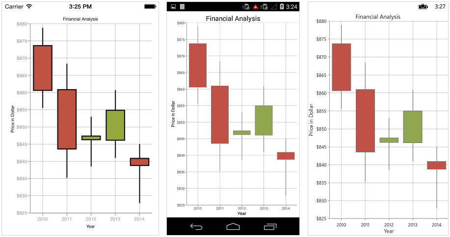

### Bull and Bear Color

In Candle chart, `BullFillColor` property is used to specify a fill color for the segments that indicates an increase in stock price in the measured time interval and `BearFillColor` property is used to specify a fill color for the segments that indicates a decrease in stock price in the measured time interval.


[XAML]

<chart:CandleSeries BearFillColor="Blue" BullFillColor="Purple" ItemsSource ="{Binding Data}" XBindingPath="Year" YBindingPath="Value" />




[C#]

CandleSeries candleSeries = new CandleSeries() 
{ 
	ItemsSource = Data, 
	XBindingPath = "Year", 
	Open = "Value1", 
	High = "Value2", 
	Low = "Value3", 
	Close = "Value4",
	BearFillColor = Color.Blue,
	BullFillColor = Color.Purple
};



## Pie Chart

To render a pie chart, create an instance of `PieSeries` and add to the `Series` collection property of `SfChart`. You can use the following properties to customize the pie segment appearance.

* `Color` – used to change the color of the series.
* `StrokeWidth` – used to change the stroke width of the series.
* `StrokeColor` – used to change the stroke color of the series.


[XAML]

<chart:SfChart>
...

	<chart:PieSeries ItemsSource ="{Binding Data}" XBindingPath="Expense" YBindingPath="Value"/>

</chart:SfChart>




[C#]

SfChart chart = new SfChart();
...

PieSeries pieSeries = new PieSeries() 
{ 
	ItemsSource = Data, 
	XBindingPath = "Expense", 
	YBindingPath = "Value" 
};
chart.Series.Add(pieSeries);



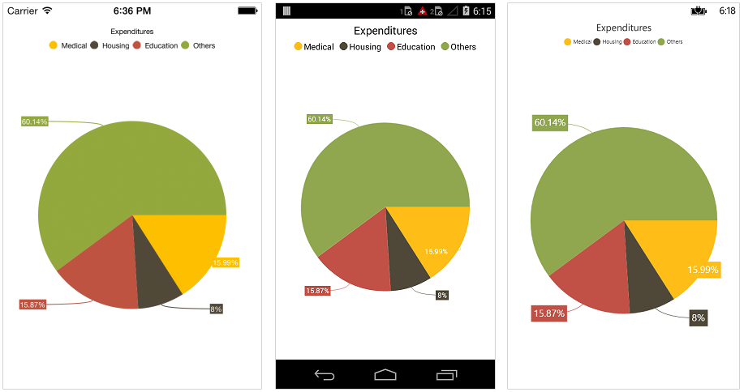

### Changing the pie size

You can use `CircularCoefficient` property to change the diameter of the pie chart with respect to the plot area. It ranges from 0 to 1 and the default value is `0.8`.


[XAML]

<chart:PieSeries CircularCoefficient="0.5" ItemsSource ="{Binding Data}" XBindingPath="Expense" YBindingPath="Value"/>




[C#]

PieSeries pieSeries = new PieSeries() 
{ 
	ItemsSource = Data, 
	XBindingPath = "Expense", 
	YBindingPath = "Value",
	CircularCoefficient = 0.5
};



### Exploding a pie segment

You can explode a pie segment using `ExplodeIndex` property and specify the explode radius using `ExplodeRadius` property of `PieSeries`.


[XAML]

<chart:PieSeries ExplodeIndex="1" ItemsSource ="{Binding Data}" XBindingPath="Expense" YBindingPath="Value"/>




[C#]

PieSeries pieSeries = new PieSeries() 
{ 
	ItemsSource = Data, 
	XBindingPath = "Expense", 
	YBindingPath = "Value",
	ExplodeIndex = 1
};



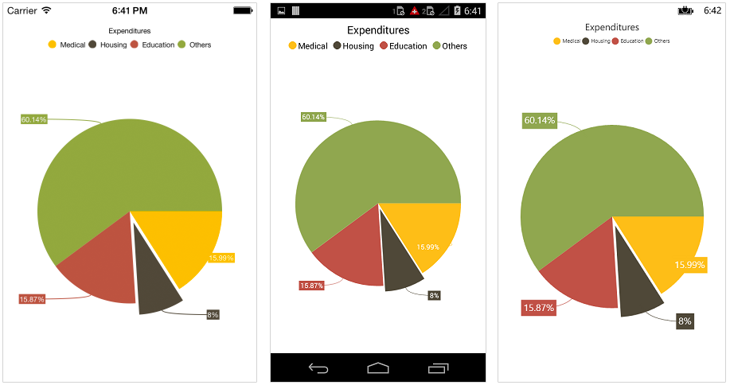

### Exploding all the segments

Using `ExplodeAll` property of `PieSeries`, you can explode all the pie segments.


[XAML]

<chart:PieSeries ExplodeAll="True" ItemsSource ="{Binding Data}" XBindingPath="Expense" YBindingPath="Value"/>




[C#]

PieSeries pieSeries = new PieSeries() 
{ 
	ItemsSource = Data, 
	XBindingPath = "Expense", 
	YBindingPath = "Value",
	ExplodeAll = true	
};



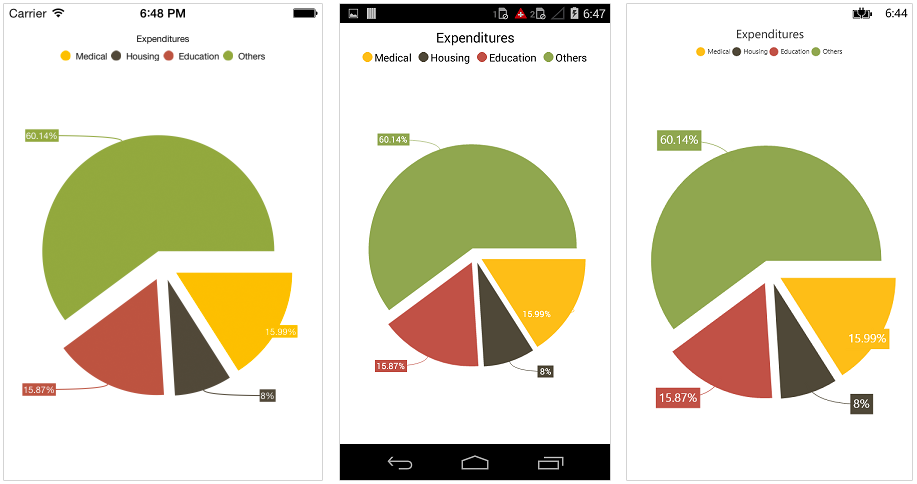

### Sector of Pie

SfChart allows you to render all the data points/segments in semi-pie, quarter-pie or in any sector using `StartAngle` and `EndAngle` properties.


[XAML]

<chart:PieSeries StartAngle="180" EndAngle="360" ItemsSource ="{Binding Data}" XBindingPath="Expense" YBindingPath="Value"/>




[C#]

PieSeries pieSeries = new PieSeries() 
{ 
	ItemsSource = Data, 
	XBindingPath = "Expense", 
	YBindingPath = "Value",
	StartAngle = 180,
	EndAngle = 360
};



## Doughnut Chart

To render a doughnut chart, create an instance of `DoughnutSeries` and add to the `Series` collection property of `SfChart`. You can use the following properties to customize the doughnut segment appearance.

* `Color` – used to change the color of the series.
* `StrokeWidth` – used to change the stroke width of the series.
* `StrokeColor` – used to change the stroke color of the series.


[XAML]

<chart:SfChart>
...

	<chart:DoughnutSeries ItemsSource ="{Binding Data}" XBindingPath="Expense" YBindingPath="Value"/>

</chart:SfChart>




[C#]

SfChart chart = new SfChart();
...

DoughnutSeries doughnutSeries = new DoughnutSeries() 
{ 
	ItemsSource = Data, 
	XBindingPath = "Expense", 
	YBindingPath = "Value" 
};
chart.Series.Add(doughnutSeries);



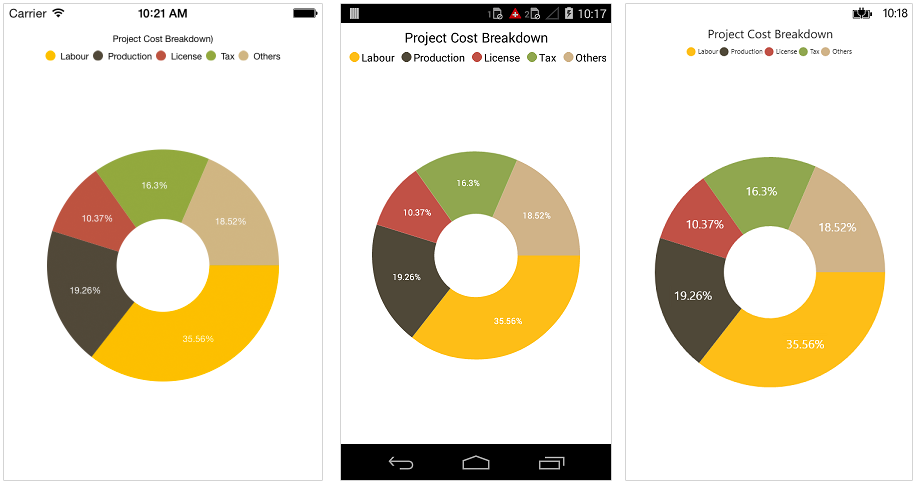

### Changing Doughnut inner radius

You can change the doughnut chart inner radius using `DoughnutCoefficient` with respect to the plot area. It ranges from 0 to 1 and the default value is `0.4`.


[XAML]

<chart:DoughnutSeries DoughnutCoefficient="0.6" ItemsSource ="{Binding Data}" XBindingPath="Expense" YBindingPath="Value" />




[C#]

DoughnutSeries doughnutSeries = new DoughnutSeries() 
{ 
	ItemsSource = Data, 
	XBindingPath = "Expense", 
	YBindingPath = "Value", 
	DoughnutCoefficient = 0.6 
};



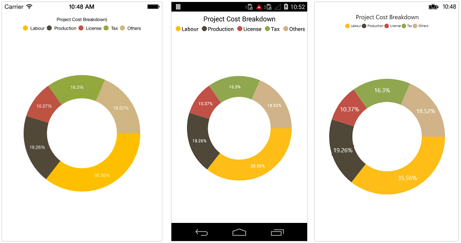

### Changing the doughnut size

You can use the `CircularCoefficient` property to change the diameter of the doughnut chart with respect to the plot area. It ranges from 0 to 1 and the default value is 0.8.


[XAML]

<chart:DoughnutSeries CircularCoefficient="0.5"  ItemsSource ="{Binding Data}" XBindingPath="Expense" YBindingPath="Value" />




[C#]

DoughnutSeries doughnutSeries = new DoughnutSeries() 
{ 
	ItemsSource = Data, 
	XBindingPath = "Expense", 
	YBindingPath = "Value", 
	CircularCoefficient = 0.5 
};



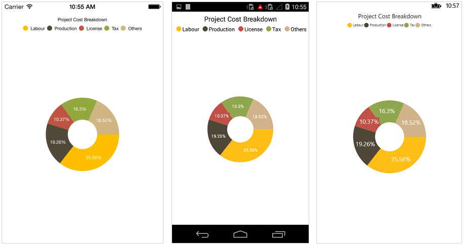

### Exploding a doughnut segment

Exploding a specific doughnut segment, you have to set the index to be exploded using `ExplodeIndex` property of the series.


[XAML]

<chart:DoughnutSeries ExplodeIndex="1" ItemsSource ="{Binding Data}" XBindingPath="Expense" YBindingPath="Value" />




[C#]

DoughnutSeries doughnutSeries = new DoughnutSeries() 
{ 
	ItemsSource = Data, 
	XBindingPath = "Expense", 
	YBindingPath = "Value",
	ExplodeIndex = 1
};



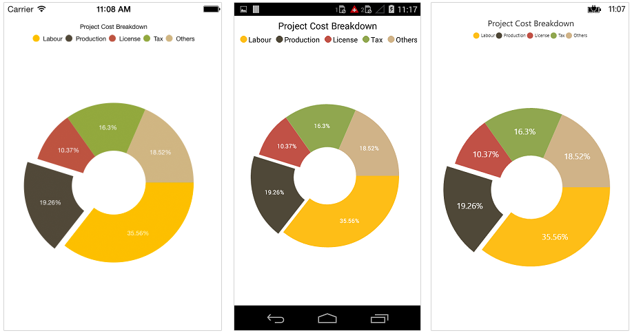

### Exploding all the segments

To explode all the segments, you have to enable `ExplodeAll` property of the series.


[XAML]

<chart:DoughnutSeries ExplodeAll="True" ItemsSource ="{Binding Data}" XBindingPath="Expense" YBindingPath="Value" />




[C#]

DoughnutSeries doughnutSeries = new DoughnutSeries() 
{ 
	ItemsSource = Data, 
	XBindingPath = "Expense", 
	YBindingPath = "Value",
	ExplodeAll = true
};



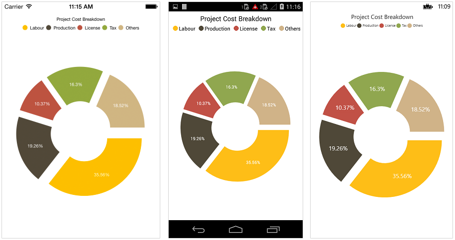

### Sector of Doughnut

SfChart allows you to render all the data points/segments in semi-doughnut, quarter- doughnut or in any sector using `StartAngle` and `EndAngle` properties.


[XAML]

<chart:DoughnutSeries StartAngle="180" EndAngle="360" ItemsSource ="{Binding Data}" XBindingPath="Expense" YBindingPath="Value" />




[C#]

DoughnutSeries doughnutSeries = new DoughnutSeries() 
{ 
	ItemsSource = Data, 
	XBindingPath = "Expense", 
	YBindingPath = "Value",
	StartAngle = 180,
	EndAngle = 360
};



## Pyramid Chart

To render a pyramid chart, create an instance of `PyramidSeries` and add to the `Series` collection property of `SfChart`. You can use the following properties to customize the pyramid segment appearance.

* `Color` – used to change the color of the series.
* `StrokeWidth` – used to change the stroke width of the series.
* `StrokeColor` – used to change the stroke color of the series.


[XAML]

<chart:SfChart>
...

	<chart:PyramidSeries ItemsSource ="{Binding Data}" XBindingPath="Country" YBindingPath="Value"/>

</chart:SfChart>




[C#]

SfChart chart = new SfChart();
...

PyramidSeries pyramidSeries = new PyramidSeries() 
{ 
	ItemsSource = Data, 
	XBindingPath = "Country", 
	YBindingPath = "Value" 
};
chart.Series.Add(pyramidSeries);



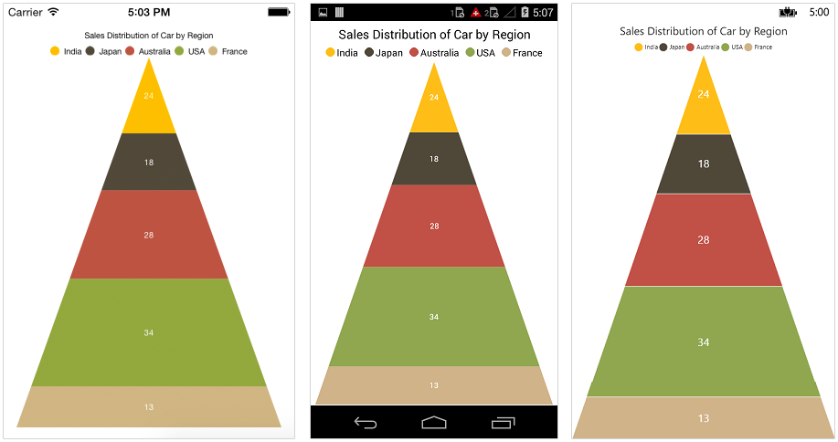

### Pyramid Mode

You can render the pyramid series as linear or surface mode. In linear mode, height of the pyramid segment is based on the Y value and in surface mode, area of the pyramid segment is based on the Y values. The default value of `PyramidMode` property is `Linear`.


[XAML]

<chart:PyramidSeries ItemsSource ="{Binding Data}" PyramidMode="Surface" XBindingPath="Country" YBindingPath="Value"/>




[C#]

PyramidSeries pyramidSeries = new PyramidSeries ()
{ 
	ItemsSource = Data, 
	XBindingPath = "Country", 
	YBindingPath = "Value",
	PyramidMode = ChartPyramidMode.Surface 
};



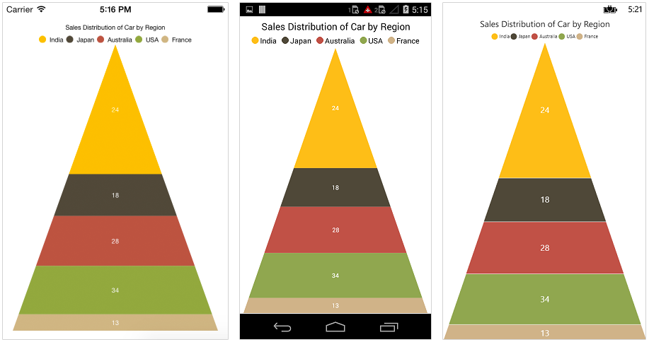

### Gap between the segments

You can control the gap between the two segments using `GapRatio` property. Its ranges from 0 to 1.


[XAML]

<chart:PyramidSeries ItemsSource ="{Binding Data}" GapRatio="0.1" XBindingPath="Country" YBindingPath="Value"/>




[C#]

PyramidSeries pyramidSeries = new PyramidSeries() 
{ 
	ItemsSource = Data, 
	XBindingPath = "Country", 
	YBindingPath = "Value",
	GapRatio = 0.1
};



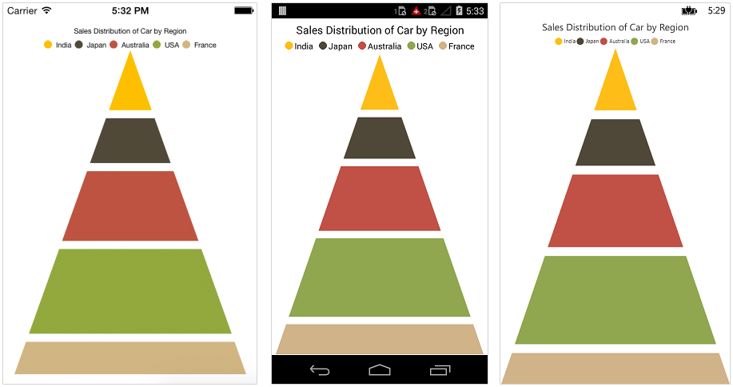

### Exploding a pyramid segment

You can explode a pyramid segment using `ExplodeIndex` property, and `ExplodeOffset` property is used to specify the exploded segment’s distance.


[XAML]

<chart:PyramidSeries ItemsSource ="{Binding Data}" ExplodeIndex="2" XBindingPath="Country" YBindingPath="Value" />




[C#]

PyramidSeries pyramidSeries = new PyramidSeries() 
{ 
	ItemsSource = Data, 
	XBindingPath = "Country", 
	YBindingPath = "Value",
	ExplodeIndex = 2
};



## Funnel Chart

To render a funnel chart, create an instance of `FunnelSeries` and add to the `Series` collection property of `SfChart`. You can use the following properties to customize the funnel segment appearance.

* `Color` – used to change the color of the series.
* `StrokeWidth` – used to change the stroke width of the series.
* `StrokeColor` – used to change the stroke color of the series.


[XAML]

<chart:SfChart>
...

	<chart:FunnelSeries ItemsSource ="{Binding Data}" XBindingPath="Status" YBindingPath="Value"/>

</chart:SfChart>




[C#]

SfChart chart = new SfChart();
...

FunnelSeries funnelSeries = new FunnelSeries() 
{ 
	ItemsSource = Data, 
	XBindingPath = "Status", 
	YBindingPath = "Value" 
};
chart.Series.Add(funnelSeries);



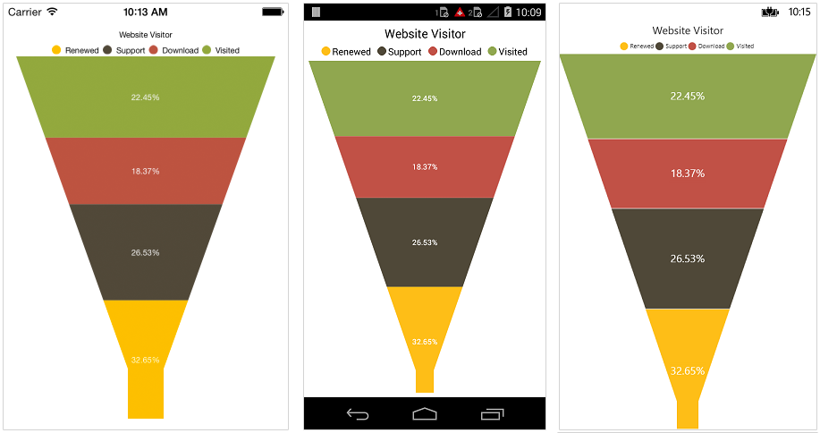

### Gap between the segments

You can control the gap between the two segments using `GapRatio` property. Its ranges from 0 to 1.


[XAML]

<chart:FunnelSeries ItemsSource ="{Binding Data}" GapRatio="0.1" XBindingPath="Year" YBindingPath="Value"/>




[C#]

FunnelSeries funnelSeries = new FunnelSeries() 
{ 
	ItemsSource = Data, 
	XBindingPath = "Year", 
	YBindingPath = "Value",
	GapRatio = 0.1
};



### Exploding a funnel segment

You can explode a pyramid segment using `ExplodeIndex` property and `ExplodeOffset` property is used to specify the exploded segment’s distance.


[XAML]

<chart:FunnelSeries ItemsSource ="{Binding Data}" ExplodeIndex="1" XBindingPath="Status" YBindingPath="Value" />




[C#]

FunnelSeries funnelSeries = new FunnelSeries() 
{ 
	ItemsSource = Data, 
	XBindingPath = "Status", 
	YBindingPath = "Value", 
	ExplodeIndex = 1 
};



### Changing the minimum width of the funnel

You can change the minimum width of the funnel neck using `MinWidth` property of `FunnelSeries`. Default value of `MinWidth` is `40`.


[XAML]

<chart:FunnelSeries ItemsSource ="{Binding Data}" MinWidth="20" XBindingPath="Year" YBindingPath="Value"/>




[C#]

FunnelSeries funnelSeries = new FunnelSeries() 
{ 
	ItemsSource = Data, 
	XBindingPath = "Year", 
	YBindingPath = "Value",
	MinWidth = 20 
};



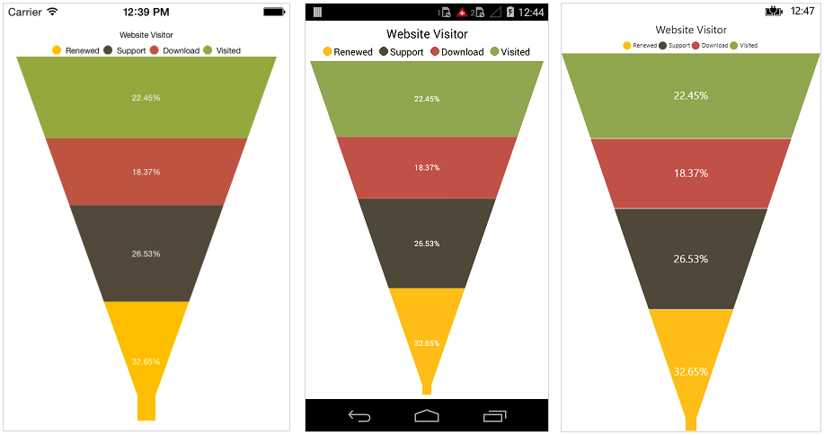