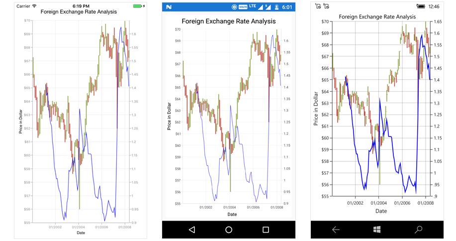
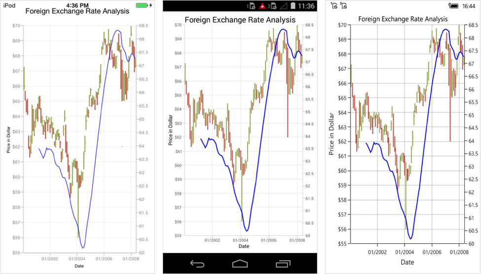
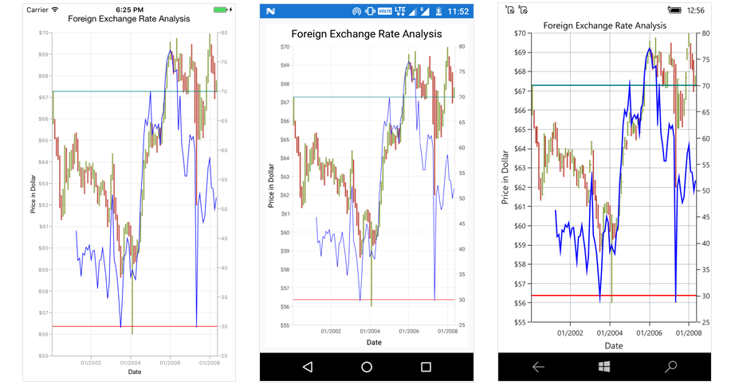
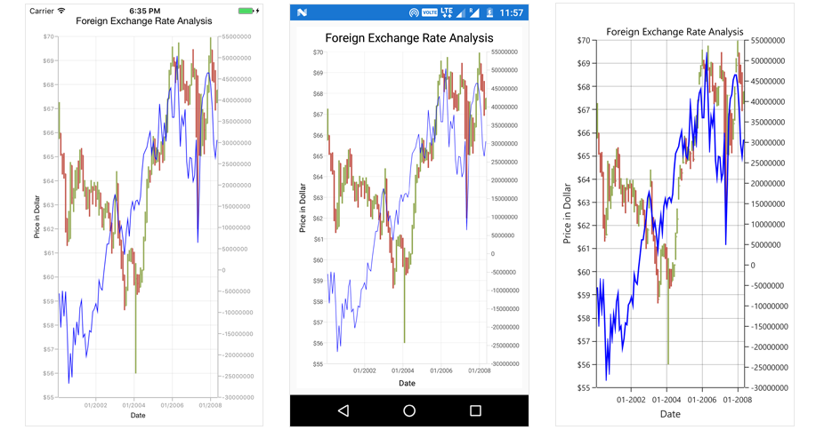

# Technical Indicators

Following are the different types of technical indicators available in chart.

* [`AverageTrueIndicator`](http://help.syncfusion.com/cr/cref_files/xamarin/sfchart/Syncfusion.SfChart.XForms~Syncfusion.SfChart.XForms.AverageTrueIndicator.html)
* [`SimpleMovingAverageIndicator`](http://help.syncfusion.com/cr/cref_files/xamarin/sfchart/Syncfusion.SfChart.XForms~Syncfusion.SfChart.XForms.SimpleMovingAverageIndicator.html)
* [`RSITechnicalIndicator`](http://help.syncfusion.com/cr/cref_files/xamarin/sfchart/Syncfusion.SfChart.XForms~Syncfusion.SfChart.XForms.RSIIndicator.html)
* [`AccumulationDistributionIndicator`](http://help.syncfusion.com/cr/cref_files/xamarin/sfchart/Syncfusion.SfChart.XForms~Syncfusion.SfChart.XForms.AccumulationDistributionIndicator.html)
* [`MomentumIndicator`](http://help.syncfusion.com/cr/cref_files/xamarin/sfchart/Syncfusion.SfChart.XForms~Syncfusion.SfChart.XForms.MomentumIndicator.html) 
* [`StochasticIndicator`](http://help.syncfusion.com/cr/cref_files/xamarin/sfchart/Syncfusion.SfChart.XForms~Syncfusion.SfChart.XForms.StochasticIndicator.html)
* [`ExponentialMovingAverageIndicator`](https://help.syncfusion.com/cr/cref_files/xamarin/sfchart/Syncfusion.SfChart.XForms~Syncfusion.SfChart.XForms.ExponentialMovingAverageIndicator.html)
* [`TriangularMovingAverageIndicator`](http://help.syncfusion.com/cr/cref_files/xamarin/sfchart/Syncfusion.SfChart.XForms~Syncfusion.SfChart.XForms.TriangularMovingAverageIndicator.html)
* [`BollingerBandIndicator`](http://help.syncfusion.com/cr/cref_files/xamarin/sfchart/Syncfusion.SfChart.XForms~Syncfusion.SfChart.XForms.BollingerBandIndicator.html)
* [`MACDIndicator`](http://help.syncfusion.com/cr/cref_files/xamarin/sfchart/Syncfusion.SfChart.XForms~Syncfusion.SfChart.XForms.MACDIndicator.html)

## Adding technical indicators to the chart

The following steps illustrates how to add the technical indicators to the chart.

**Initializing Indicator**

Create the instance for any technical indicator and add it to the [`TechnicalIndicators`](https://help.syncfusion.com/cr/cref_files/xamarin/sfchart/Syncfusion.SfChart.XForms~Syncfusion.SfChart.XForms.SfChart~TechnicalIndicators.html) collection.

Here for instance, the [`AccumulationDistributionIndicator`](http://help.syncfusion.com/cr/cref_files/xamarin/sfchart/Syncfusion.SfChart.XForms~Syncfusion.SfChart.XForms.AccumulationDistributionIndicator.html) is added.

 



<chart:SfChart>
    ...	
    <chart:SfChart.TechnicalIndicators>
        <chart:AccumulationDistributionIndicator />
    </chart:SfChart.TechnicalIndicators>

</chart:SfChart>





SfChart chart = new SfChart();
...
AccumulationDistributionIndicator indicator= new AccumulationDistributionIndicator();

chart.TechnicalIndicators.Add(indicator);





**Binding the Data**

Set the items source and binding paths ([`Open`](https://help.syncfusion.com/cr/cref_files/xamarin/sfchart/Syncfusion.SfChart.XForms~Syncfusion.SfChart.XForms.FinancialTechnicalIndicator~Open.html), [`High`](https://help.syncfusion.com/cr/cref_files/xamarin/sfchart/Syncfusion.SfChart.XForms~Syncfusion.SfChart.XForms.FinancialTechnicalIndicator~High.html), [`Low`](https://help.syncfusion.com/cr/cref_files/xamarin/sfchart/Syncfusion.SfChart.XForms~Syncfusion.SfChart.XForms.FinancialTechnicalIndicator~Low.html), [`Close`](https://help.syncfusion.com/cr/cref_files/xamarin/sfchart/Syncfusion.SfChart.XForms~Syncfusion.SfChart.XForms.FinancialTechnicalIndicator~Close.html) and [`XBindingPath`](https://help.syncfusion.com/cr/cref_files/xamarin/sfchart/Syncfusion.SfChart.XForms~Syncfusion.SfChart.XForms.FinancialTechnicalIndicator~XBindingPath.html)) to fetch the values from model.

 



<chart:SfChart>
    ...	
        <chart:SfChart.TechnicalIndicators>
            <chart:AccumulationDistributionIndicator ItemsSource="{Binding TechnicalIndicatorData}" XBindingPath="XValue" Open="Open" High="High" Low="Low" Close="Close" Volume="Volume"/>
        </chart:SfChart.TechnicalIndicators>

</chart:SfChart>





SfChart chart = new SfChart()
{
      ...                
      TechnicalIndicators =
      {
          new AccumulationDistributionIndicator()
          {
              ItemsSource = viewModel.TechnicalIndicatorData,
              XBindingPath = "XValue",
              Open = "Open",
              High = "High",
              Low = "Low",
              Close = "Close"
          }
    }
};





**Binding the ItemsSource of ChartSeries**

Using the [`SeriesName`](http://help.syncfusion.com/cr/cref_files/xamarin/sfchart/Syncfusion.SfChart.XForms~Syncfusion.SfChart.XForms.FinancialTechnicalIndicator~SeriesName.html) property of `FinancialTechnicalIndicator` you can bind the items source of chart series to technical indicators, including x and y axis.
 



<chart:SfChart>
    ...	
        <chart:SfChart.Series>
            <chart:HiLoOpenCloseSeries Name="HLOC" ItemsSource="{Binding TechnicalIndicatorData}" XBindingPath="XValue" Open="Open" High="High" Low="Low" Close="Close"/>
        </chart:SfChart.Series>
        <chart:SfChart.TechnicalIndicators>
            <chart:AccumulationDistributionIndicator SeriesName="HLOC"/>
        </chart:SfChart.TechnicalIndicators>

</chart:SfChart>





SfChart chart = new SfChart()
{
    ...        
    Series =
      {
          new HiLoOpenCloseSeries()
          {
              ItemsSource = viewModel.TechnicalIndicatorData,
              XBindingPath = "XValue",
              Open = "Open",
              High = "High",
              Low = "Low",
              Close = "Close",
              Name = "HLOC"
          }
    },

    TechnicalIndicators =
      {
          new AccumulationDistributionIndicator()
          {
              SeriesName = "HLOC"              
          }
    }
};





[`AverageTrueIndicator`](http://help.syncfusion.com/cr/cref_files/xamarin/sfchart/Syncfusion.SfChart.XForms~Syncfusion.SfChart.XForms.AverageTrueIndicator.html), [`SimpleMovingAverageIndicator`](http://help.syncfusion.com/cr/cref_files/xamarin/sfchart/Syncfusion.SfChart.XForms~Syncfusion.SfChart.XForms.SimpleMovingAverageIndicator.html) and [`RSITechnicalIndicator`](http://help.syncfusion.com/cr/cref_files/xamarin/sfchart/Syncfusion.SfChart.XForms~Syncfusion.SfChart.XForms.RSIIndicator.html) are having the Period and SignalLineColor properties as common, in which Period property indicates the moving average period and SignalLineColor defines the color for the respective indicator line.

**Adding Axis**

[`XAxis`](http://help.syncfusion.com/cr/cref_files/xamarin/sfchart/Syncfusion.SfChart.XForms~Syncfusion.SfChart.XForms.FinancialTechnicalIndicator~XAxis.html) and [`YAxis`](http://help.syncfusion.com/cr/cref_files/xamarin/sfchart/Syncfusion.SfChart.XForms~Syncfusion.SfChart.XForms.FinancialTechnicalIndicator~YAxis.html) property of Technical Indicator is used to set XAxis and YAxis for Technical Indicators.

You can define the axis using the following code example.

 



<chart:SfChart>
 ...	
   <chart:SfChart.TechnicalIndicators>
        <chart:AccumulationDistributionIndicator SeriesName="HLOC">
            <chart:AccumulationDistributionIndicator.XAxis>
                <chart:NumericalAxis/>
            </chart:AccumulationDistributionIndicator.XAxis>
         </chart:AccumulationDistributionIndicator>
     </chart:SfChart.TechnicalIndicators>

</chart:SfChart>





SfChart chart = new SfChart()
{
    ...        
    TechnicalIndicators =
      {
          new AccumulationDistributionIndicator()
          {
              SeriesName = "HLOC",
              XAxis = new NumericalAxis()
          }
      }
};





**Animation**

[`SfChart`](http://help.syncfusion.com/cr/cref_files/xamarin/sfchart/Syncfusion.SfChart.XForms~Syncfusion.SfChart.XForms.SfChart.html) provides animation support for technical indicators. [`TechnicalIndicators`](https://help.syncfusion.com/cr/cref_files/xamarin/sfchart/Syncfusion.SfChart.XForms~Syncfusion.SfChart.XForms.SfChart~TechnicalIndicators.html) will be animated whenever the ItemsSource changes. Animation can be enabled by setting the [`EnableAnimation`](http://help.syncfusion.com/cr/cref_files/xamarin/sfchart/Syncfusion.SfChart.XForms~Syncfusion.SfChart.XForms.FinancialTechnicalIndicator~EnableAnimation.html) property to true. You can also control the duration of the animation using [`AnimationDuration`](http://help.syncfusion.com/cr/cref_files/xamarin/sfchart/Syncfusion.SfChart.XForms~Syncfusion.SfChart.XForms.FinancialTechnicalIndicator~AnimationDuration.html) property.

 



<chart:SfChart>
 ...	
      <chart:SfChart.TechnicalIndicators>
          <chart:AccumulationDistributionIndicator SeriesName="HLOC" EnableAnimation="True" AnimationDuration="0.8"/>
       </chart:SfChart.TechnicalIndicators>

</chart:SfChart>





SfChart chart = new SfChart()
{
    ...        
    TechnicalIndicators =
      {
          new AccumulationDistributionIndicator()
          {
              SeriesName = "HLOC",
              EnableAnimation = true,
              AnimationDuration = 0.8      
          }
      }
};





## Average True Indicator

Average true range (ATR) is a technical analysis volatility indicator. The indicator does not provide an indication of price trend, simply the degree of price volatility. The average true range is an N-day smoothed moving average (SMMA) of the true range values.
You can define the [`AverageTrueIndicator`](http://help.syncfusion.com/cr/cref_files/xamarin/sfchart/Syncfusion.SfChart.XForms~Syncfusion.SfChart.XForms.AverageTrueIndicator.html) using the following code example.

 



<chart:SfChart>
...	
        <chart:SfChart.TechnicalIndicators>
            <chart:AverageTrueIndicator ItemsSource="{Binding TechnicalIndicatorData}" Period="3" XBindingPath="Date" SignalLineColor="Purple" High="High" Low="Low" Open="Open" Close="Close"/>
         </chart:SfChart.TechnicalIndicators>

</chart:SfChart>





SfChart chart = new SfChart()
{
    ...        
    TechnicalIndicators =
      {
          new AverageTrueIndicator()
          {
              Period = 3,
              SignalLineColor = Color.Purple,
              ItemsSource = viewModel.TechnicalIndicatorData,
              XBindingPath = "Date",
              Open = "Open",
              High = "High",
              Low = "Low",
              Close = "Close",
          }
      }
};





In the following screenshot, Average True type technical indicators is shown,

## Simple Moving Average Indicator

A Simple Moving Average (SMA) is a simple, arithmetic moving average that is calculated by adding the closing price for number of time periods and then dividing this total by the number of time periods.

The following code example demonstrates the usage of [`SimpleMovingAverageIndicator`](http://help.syncfusion.com/cr/cref_files/xamarin/sfchart/Syncfusion.SfChart.XForms~Syncfusion.SfChart.XForms.SimpleMovingAverageIndicator.html).

 



<chart:SfChart>
...	
       <chart:SfChart.TechnicalIndicators>
           <chart:SimpleMovingAverageIndicator ItemsSource="{Binding TechnicalIndicatorData}" Period="14" SignalLineColor="Purple" XBindingPath="XValue" High="High" Low="Low" Open="Open" Close="Close"/> 
        </chart:SfChart.TechnicalIndicators>

</chart:SfChart>





SfChart chart = new SfChart()
{
    ...        
    TechnicalIndicators =
      {
          new SimpleMovingAverageIndicator()
          {
              Period = 14,
              SignalLineColor = Color.Purple,
              ItemsSource = viewModel.TechnicalIndicatorData,
              XBindingPath = "XValue",
              Open = "Open",
              High = "High",
              Low = "Low",
              Close = "Close",
          }
      }
};





In the following screenshot, Simple Moving Average type technical indicators is shown,

## RSI Indicator

The Relative Strength Index (RSI) indicators are having additional two lines other than signal line, which indicate the overbought and oversold region.

The [`UpperLineColor`](http://help.syncfusion.com/cr/cref_files/xamarin/sfchart/Syncfusion.SfChart.XForms~Syncfusion.SfChart.XForms.RSIIndicator~UpperLineColor.html) property is used to define the color for the line indicating overbought region and the [`LowerLineColor`](http://help.syncfusion.com/cr/cref_files/xamarin/sfchart/Syncfusion.SfChart.XForms~Syncfusion.SfChart.XForms.RSIIndicator~LowerLineColor.html) property is used to define the color for the line indicating oversold region.

To define the [`RSITechnicalIndicator`](http://help.syncfusion.com/cr/cref_files/xamarin/sfchart/Syncfusion.SfChart.XForms~Syncfusion.SfChart.XForms.RSIIndicator.html), you can use the following code example.

 



<chart:SfChart>
...	
        <chart:SfChart.TechnicalIndicators>
            <chart:RSIIndicator ItemsSource="{Binding TechnicalIndicatorData}" Period="14" SignalLineColor="Purple" UpperLineColor="Blue" LowerLineColor="Red" XBindingPath="XValue" High="High" Low="Low" Open="Open" Close="Close"/>
        </chart:SfChart.TechnicalIndicators>

</chart:SfChart>





SfChart chart = new SfChart()
{
    ...        
    TechnicalIndicators =
      {
          new RSIIndicator()
          {
              Period = 14,
              SignalLineColor = Color.Purple,
              UpperLineColor = Color.Blue,
              LowerLineColor = Color.Red,
              ItemsSource = viewModel.TechnicalIndicatorData,
              XBindingPath = "XValue",
              Open = "Open",
              High = "High",
              Low = "Low",
              Close = "Close",
          }
      }
};





In the following screenshot, Relative Strength Index type technical indicators is shown,

## Accumulation Distribution Indicator

Accumulation Distribution Indicator is a volume-based indicator designed to measure the accumulative flow of money into and out of a security. 

The following code example help you to add [`AccumulationDistributionIndicator`](http://help.syncfusion.com/cr/cref_files/xamarin/sfchart/Syncfusion.SfChart.XForms~Syncfusion.SfChart.XForms.AccumulationDistributionIndicator.html).

 



<chart:SfChart>
...	
          <chart:SfChart.TechnicalIndicators>
            <chart:AccumulationDistributionIndicator ItemsSource="{Binding TechnicalIndicatorData}" SignalLineColor="Purple" XBindingPath="XValue" Open="Open" High="High" Low="Low" Close="Close" Volume="Volume"/>
        </chart:SfChart.TechnicalIndicators>

</chart:SfChart>





SfChart chart = new SfChart()
{
    ...        
    TechnicalIndicators =
      {
          new AccumulationDistributionIndicator()
          {
              SignalLineColor = Color.Purple,
              ItemsSource = viewModel.TechnicalIndicatorData,
              XBindingPath = "XValue",
              Open = "Open",
              High = "High",
              Low = "Low",
              Close = "Close",
              Volume = "Volume"
          }
      }
};





In the following screenshot, Accumulation Distribution type technical indicators is shown,

