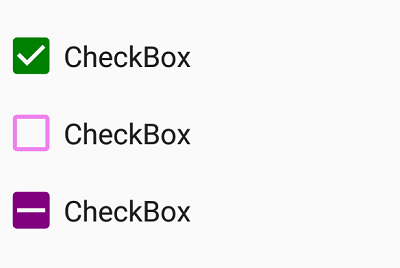

# Visual Customization

## Customizing shape
The check box shape can be customized using the `CornerRadius` property. This property specifies uniform radius value for every corner of the check box.



<syncfusion:SfCheckBox x:Name="checkBox" Text="CheckBox" IsChecked="True" CornerRadius="5.0"/>            


SfCheckBox checkBox = new SfCheckBox();
checkBox.Text = "CheckBox";
checkBox.IsChecked = true;
checkBox.CornerRadius = 5.0f;



## Customizing state color
The default state colors can be customized using the `CheckedColor` and `UncheckedColor` properties. The checked/indeterminate state color is updated to the `CheckedColor` property value when the state is changed to the checked/indeterminate.The unchecked state color is updated to `UncheckedColor` property value when the state is changed to unchecked. 


<syncfusion:SfCheckBox x:Name="check" Text="CheckBox" IsChecked="True" CheckedColor="Green"/>
<syncfusion:SfCheckBox x:Name="uncheck" Text="CheckBox" UncheckedColor="Violet"/>
<syncfusion:SfCheckBox x:Name="indeterminate " Text="CheckBox" IsThreeState="True" IsChecked="{x:Null}" CheckedColor="Purple"/> 


SfCheckBox check= new SfCheckBox();
check.Text = "CheckBox";
check.IsChecked = true;
check.CheckedColor = Color.Green;
SfCheckBox uncheck = new SfCheckBox();
uncheck.Text = "CheckBox";
uncheck.UncheckedColor = Color.Violet;
SfCheckBox indeterminate = new SfCheckBox();
indeterminate.IsChecked = null;
indeterminate.IsThreeState = true;
indeterminate.Text = "CheckBox";
indeterminate.CheckedColor = Color.Purple;



## Setting caption text appearance 
You can customize the display text appearance of the `SfCheckBox` control using the following properties:

* `TextColor`: Changes the color of the text.
* `HorizontalTextAlignment`: Changes the horizontal alignment of the caption text.
* `FontFamily`: Changes the font family of the caption text.
* `FontAttributes`: Sets font attributes(bold/italic/none) of the caption text.
* `FontSize`: Sets font size of the caption text.



<syncfusion:SfCheckBox x:Name="caption" Text="CheckBox" IsChecked="True" TextColor="Violet" HorizontalTextAlignment="Center" FontFamily="Arial" FontAttributes="Bold" FontSize="20"/>           


SfCheckBox caption = new SfCheckBox();
caption.IsChecked = true;
caption.Text = "CheckBox";
caption.TextColor = Color.Violet;
caption.HorizontalTextAlignment = TextAlignment.Center;
caption.FontFamily = "Arial";
caption.FontAttributes = FontAttributes.Bold;
caption.FontSize = 20;



This demo can be downloaded from this [link](http://www.syncfusion.com/downloads/support/directtrac/general/ze/CheckBox_VisualCustomization881578223).