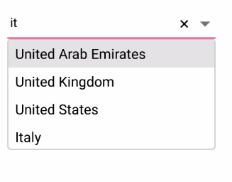
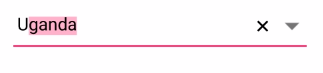

# Filtering
ComboBox provides enable the filer option for filtering the suggestions in drop down. 

	



<StackLayout VerticalOptions="Start" HorizontalOptions="Start" Padding="30"> 
<combobox:SfComboBox HeightRequest="40" x:Name="comboBox" IsEditableMode="true" AllowFiltering="true" MaximumDropDownHeight="150" /> 
</StackLayout>


	

	
List<String> countryNames = new List<String>();
countryNames.Add("Afghanistan"); 
countryNames.Add("Akrotiri"); 
countryNames.Add("Albania");
countryNames.Add("Algeria");
countryNames.Add("American Samoa");
countryNames.Add("Andorra");
countryNames.Add("Angola");
countryNames.Add("Anguilla");
countryNames.Add("Antarctica");
countryNames.Add("Antigua and Barbuda");
countryNames.Add("Argentina");
comboBox.DataSource = countryNames; 
comboBox.IsEditableMode = true;
comboBox.AllowFiltering = true;
	 




## Types of Filtering Options

The phenomenon of string comparison for filtering suggestions can be changed using the `SuggestionMode` property. The default filtering strategy is “StartsWith” and it is case insensitive. The available filtering modes are

* StartsWith

* StartsWithCaseSensitive

* Contains

* ContainsWithCaseSensitive

* Equals

* EqualsWithCaseSensitive

* EndsWith

* EndsWithCaseSensitive

* Custom

### Filtering Words that Starts with Input Text

Displays all the matches that starts with the typed characters in control. This strategy is case in-sensitive.
	
	



<StackLayout VerticalOptions="Start" HorizontalOptions="Start" Padding="30">
	<combobox:SfComboBox HeightRequest="40" x:Name="comboBox" IsEditableMode="true" AllowFiltering="true" SuggestionMode="StartsWith"/>
</StackLayout>


	

	
List<String> countryNames = new List<String>();
countryNames.Add("Uganda");
countryNames.Add("Ukraine");
countryNames.Add("United Arab Emirates");
countryNames.Add("United Kingdom");
countryNames.Add("United States");
comboBox.DataSource = countryNames;
comboBox.IsEditableMode = true;
comboBox.AllowFiltering = true;
comboBox.SuggestionMode = SuggestionMode.StartsWith;
	 




#### Filtering Words that Starts with Input Text - CaseSensitive

Displays all the matches that starts with the typed characters in control. This strategy is case sensitive.





<StackLayout VerticalOptions="Start" HorizontalOptions="Start" Padding="30">
	<comboBox:SfComboBox HeightRequest="40" x:Name="comboBox" IsEditableMode="true" AllowFiltering="true" SuggestionMode="StartsWithCaseSensitive"/> 
</StackLayout>




	
List<String> countryNames = new List<String>();
countryNames.Add("Uganda");
countryNames.Add("Ukraine");
countryNames.Add("United Arab Emirates");
countryNames.Add("United Kingdom");
countryNames.Add("United States");
comboBox.DataSource = countryNames;
comboBox.IsEditableMode = true;
comboBox.AllowFiltering = true;
comboBox.SuggestionMode= SuggestionMode.StartsWithCaseSensitive;





### Filtering Words that Contains the Input Text

Displays all the matches that contains the typed characters in control. This strategy is case in-sensitive.
	




<StackLayout VerticalOptions="Start" HorizontalOptions="Start" Padding="30">
	<combobox:SfComboBox HeightRequest="40" x:Name="comboBox" IsEditableMode="true" AllowFiltering="true" SuggestionMode="Contains"/>                            
</StackLayout>




	
List<String> countryNames = new List<String>();
countryNames.Add("Uganda");
countryNames.Add("Ukraine");
countryNames.Add("United Arab Emirates");
countryNames.Add("United Kingdom");
countryNames.Add("United States");
countryNames.Add("Italy");
comboBox.DataSource = countryNames;
comboBox.IsEditableMode = true;
comboBox.AllowFiltering = true;
comboBox.SuggestionMode= SuggestionMode.Contains;
	 




#### Filtering Words that Contains the Input Text - CaseSensitive

Displays all the matches that contains the typed characters in control. This strategy is case sensitive.





<StackLayout VerticalOptions="Start" HorizontalOptions="Start" Padding="30">
	<combobox:SfComboBox HeightRequest="40" x:Name="comboBox" IsEditableMode="true" AllowFiltering="true" SuggestionMode="ContainsWithCaseSensitive"/>                            
</StackLayout>





List<String> countryNames = new List<String>();
countryNames.Add("Uganda");
countryNames.Add("Ukraine");
countryNames.Add("United Arab Emirates");
countryNames.Add("United Kingdom");
countryNames.Add("United States");
countryNames.Add("Italy");
comboBox.DataSource = countryNames;
comboBox.IsEditableMode = true;
comboBox.AllowFiltering = true;
comboBox.SuggestionMode= SuggestionMode.ContainsWithCaseSensitive;





### Filtering Words that Equals the Input Text

Displays all the words that completely matches with the typed characters in control. This strategy is case in-sensitive.
	




<StackLayout VerticalOptions="Start" HorizontalOptions="Start" Padding="30">
	<combobox:SfCpomboBox HeightRequest="40" x:Name="comboBox" IsEditableMode="true" AllowFiltering="true" SuggestionMode="Equals"/>        
</StackLayout>




	
List<String> countryNames = new List<String>();
countryNames.Add("Uganda");
countryNames.Add("Ukraine");
countryNames.Add("United Arab Emirates");
countryNames.Add("United Kingdom");
countryNames.Add("United States");
comboBox.DataSource = countryNames;
comboBox.IsEditableMode = true;
comboBox.AllowFiltering = true;
comboBox.SuggestionMode= SuggestionMode.Equals;





#### Filtering Words that Equals the Input Text - CaseSensitive

Displays all the words that completely matches with the typed characters in control. This strategy is case sensitive.
	




<StackLayout VerticalOptions="Start" HorizontalOptions="Start" Padding="30">
	<combobox:SfComboBox HeightRequest="40" x:Name="comboBox" IsEditableMode="true" AllowFiltering="true" SuggestionMode="EqualsWithCaseSensitive"/>             
</StackLayout>




	
List<String> countryNames = new List<String>();
countryNames.Add("Uganda");
countryNames.Add("Ukraine");
countryNames.Add("United Arab Emirates");
countryNames.Add("United Kingdom");
countryNames.Add("United States");
comboBox.DataSource = countryNames;
comboBox.IsEditableMode = true;
comboBox.AllowFiltering = true;
comboBox.SuggestionMode= SuggestionMode.EqualsWithCaseSensitive;





### Custom

Filter items in the suggestion list based on a custom search by the user. This will help to apply our typo toleration functionality to the control.





<StackLayout VerticalOptions="Start" HorizontalOptions="Start" Padding="30">
	<combobox:SfComboBox HeightRequest="40" DropDownTextSize="20" x:Name="comboBox" IsEditableMode="true" AllowFiltering="true" ComboBoxMode="Suggest" MaximumDropDownHeight="200" SuggestionMode="Custom"/>
</StackLayout>





    public ComboBoxPage()
    {
        InitializeComponent();
        List<string> list = new List<string>();
        list.Add("Albania");
        list.Add("Algeria");
        list.Add("American Samoa");
        list.Add("Andorra");
        list.Add("Angola");
        list.Add("Anguilla");
        comboBox.ComboBoxSource = list;
        comboBox.IsEditableMode = true;
        comboBox.AllowFiltering = true;
        comboBox.Filter = ContainingSpaceFilter;
    }
    public bool ContainingSpaceFilter(string search, object item)
    {
        string text = item.ToString().ToLower();
        if (item != null)
        {
            try
            {
                var split = search.Split(' ');
                foreach (var results in split)
                {
                    if (!text.Contains(results.ToLower()))
                    {
                        return true;
                    }
                    else
                        return false;
                }
                return true;
            }
            catch (Exception)
            {
                return (text.Contains(search));
            }
        }
        else
            return false;
    }

	

    

### Filtering Words that Ends with the Input Text

Displays all the matches that ends with the typed characters in control. This strategy is case in-sensitive.


	


<StackLayout VerticalOptions="Start" HorizontalOptions="Start" Padding="30">
	<combobox:SfComboBox HeightRequest="40" WidthRequest="180" x:Name="comboBox" IsEditableMode="true" AllowFiltering="true" SuggestionMode="EndsWith"/>                            
</StackLayout>




	
List<String> countryNames = new List<String>();
countryNames.Add("Uganda");
countryNames.Add("Ukraine");
countryNames.Add("United Arab Emirates");
countryNames.Add("United Kingdom");
countryNames.Add("United States");
comboBox.DataSource = countryNames;
comboBox.IsEditableMode = true;
comboBox.AllowFiltering = true;
comboBox.SuggestionMode= SuggestionMode.EndsWith;
 




#### Filtering Words that Ends with the Input Text - CaseSensitive 

Displays all the matches that ends with the typed characters in control. This strategy is case sensitive.
	




<StackLayout VerticalOptions="Start" HorizontalOptions="Start" Padding="30">
	<combobox:SfComboBox HeightRequest="40" x:Name="comboBox" IsEditableMode="true" AllowFiltering="true"  SuggestionMode="EndsWithCaseSensitive"/>           
</StackLayout>




	
List<String> countryNames = new List<String>();
countryNames.Add("Uganda");
countryNames.Add("Ukraine");
countryNames.Add("United Arab Emirates");
countryNames.Add("United Kingdom");
countryNames.Add("United States");
comboBox.DataSource = countryNames;
comboBox.IsEditableMode = true;
comboBox.AllowFiltering = true;
comboBox.SuggestionMode= SuggestionMode.EndsWithCaseSensitive;





## ComboBox Modes

ComboBox provides three different ways to display the filtered suggestions. They are 

* Suggest - displaying suggestion in drop down list

* Append - appending the first suggestion to text

* SuggestAppend - Both of these

`ComboBoxeMode` property is used to choose the suggestion display mode in SfComboBox control. The default value is Suggest.

## Suggesting Choices in List

The filtered suggestions are displayed in a drop down list. User can pick an item from the list.





<StackLayout VerticalOptions="Start" HorizontalOptions="Start" Padding="30">
	<combobox:SfComboBox HeightRequest="40" x:Name="comboBox" IsEditableMode="true" AllowFiltering="true"  ComboBoxMode="Suggest"/>                      
</StackLayout> 
		  



	
List<String> countryNames = new List<String>();
countryNames.Add("Uganda");
countryNames.Add("Ukraine");
countryNames.Add("United Arab Emirates");
countryNames.Add("United Kingdom");
countryNames.Add("United States");
comboBox.DataSource = countryNames;
comboBox.IsEditableMode = true;
comboBox.AllowFiltering = true;
comboBox.ComboBoxMode = ComboBoxMode.Suggest;
	 




## Appending Suggestion to Text

The first item in filtered suggestions is appended to SfComboBox text. In this mode, drop down remains closed.





<StackLayout VerticalOptions="Start" HorizontalOptions="Start" Padding="30">
	<combobox:SfComboBox HeightRequest="40" x:Name="comboBox" IsEditableMode="true" AllowFiltering="true"  ComboBoxMode="Append"/>                       
</StackLayout> 
		  



	
List<String> countryNames = new List<String>();
countryNames.Add("Uganda");
countryNames.Add("Ukraine");
countryNames.Add("United Arab Emirates");
countryNames.Add("United Kingdom");
countryNames.Add("United States");
comboBox.DataSource = countryNames;
comboBox.IsEditableMode = true;
comboBox.AllowFiltering = true;
comboBox.ComboBoxMode = ComboBoxMode.Append;
	 




## Suggesting Choices and Appending Suggestions to Text

The text is appended to the first matched item in the suggestions collection and filtered suggestions are displayed in a drop down list. The user can pick from a list directly or use up and down keys for browsing the list.
	
	



<StackLayout VerticalOptions="Start" HorizontalOptions="Start" Padding="30">
	<combobox:SfComboBox HeightRequest="40" x:Name="comboBox" IsEditableMode="true" AllowFiltering="true"  ComboBoxMode="SuggestAppend"/>                
</StackLayout> 
		  

	

	
List<String> countryNames = new List<String>();
countryNames.Add("Uganda");
countryNames.Add("Ukraine");
countryNames.Add("United Arab Emirates");
countryNames.Add("United Kingdom");
countryNames.Add("United States");
comboBox.DataSource = countryNames;
comboBox.IsEditableMode = true;
comboBox.AllowFiltering = true;
comboBox.ComboBoxMode = ComboBoxMode.SuggestAppend;





