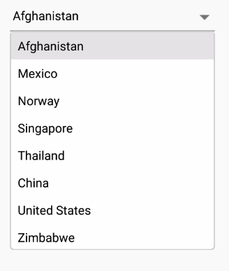

# Getting Started

This section explains the steps to create ComboBox, populate it with data and filter the suggestions. This section covers only the minimal features that are needed to get started with the ComboBox.

## Adding ComboBox References

Refer [this](https://help.syncfusion.com/xamarin/introduction/download-and-installation) section to know the steps for obtaining Essential Studio components in your solution; then refer this [link](https://help.syncfusion.com/xamarin/introduction/control-dependencies#sfcombobox) to know the dependency assembly details for adding ComboBox to your project.
After adding the assembly reference, an additional step is required for iOS and UWP projects.

### Additional Step for iOS

Create an instance of `SfComboBoxRenderer` in FinishedLaunching overridden method of an AppDelegate class in iOS project as shown below:



public override bool FinishedLaunching(UIApplication app, NSDictionary options)
{
new Syncfusion.XForms.ComboBox.iOS.SfComboBoxRenderer();

global::Xamarin.Forms.Forms.Init();

LoadApplication(new App());

return base.FinishedLaunching(app, options);
}	



### Additional Step for UWP

This step is required only if the application is deployed in Release mode with .NET native tool chain enabled and it is for resolving the known Framework issue “Custom controls not rendering in Release mode” in UWP platform. Initializing the SfComboBox assembly at OnLaunched overridden method of the App class in UWP project is the suggested workaround. And the code example is shown below:



protected override void OnLaunched(LaunchActivatedEventArgs e)
{
#if DEBUG
if (System.Diagnostics.Debugger.IsAttached)
{
	this.DebugSettings.EnableFrameRateCounter = true;
}
#endif

Frame rootFrame = Window.Current.Content as Frame; 
if (rootFrame == null)
{
	rootFrame = new Frame();
	rootFrame.NavigationFailed += OnNavigationFailed;                
	List<System.Reflection.Assembly> assembliesToInclude = new List<System.Reflection.Assembly>();
	// Add all the renderer assemblies your app uses 
	assembliesToInclude.Add(typeof(Syncfusion.XForms.ComboBox.UWP.SfComboBoxRenderer).GetTypeInfo().Assembly);
	// Replace the Xamarin.Forms.Forms.Init(e);        
	Xamarin.Forms.Forms.Init(e, assembliesToInclude);
	if (e.PreviousExecutionState == ApplicationExecutionState.Terminated)
	{
		//TODO: Load state from previously suspended application
	}
	// Place the frame in the current Window
	Window.Current.Content = rootFrame;
}
if (rootFrame.Content == null)
{
	// When the navigation stack isn't restored navigate to the first page,
	// configuring the new page by passing required information as a navigation
	// parameter
	rootFrame.Navigate(typeof(MainPage), e.Arguments);
}
// Ensure the current window is active
Window.Current.Activate();
}



## Initializing ComboBox 

Import the SfComboBox namespace in respective Page as shown below:





xmlns:combobox="clr-namespace:Syncfusion.XForms.ComboBox;assembly=Syncfusion.SfComboBox.XForms"





using Syncfusion.XForms.ComboBox;





Then initialize an empty combobox as shown below,





<StackLayout VerticalOptions="Start" HorizontalOptions="Start" Padding="30">
	<combobox:SfComboBox HeightRequest="40" x:Name="comboBox"/>
</StackLayout>
	




StackLayout layout = new StackLayout()
{ 
VerticalOptions = LayoutOptions.Start, 
HorizontalOptions = LayoutOptions.Start,
Padding = new Thickness(30) 
};
SfComboBox comboBox = new SfComboBox() 
{
HeightRequest = 40 
};
layout.Children.Add(comboBox);
Content = layout;





## Populating ComboBox with Data

Now, let us create a simple list of country names and set it as the `DataSource` of ComboBox.





<StackLayout VerticalOptions="Start" HorizontalOptions="Start" Padding="30">
	<combobox:SfComboBox HeightRequest="40" x:Name="comboBox"/>
</StackLayout>
	




List<String> countryNames = new List<String>();
countryNames.Add("Afghanistan"); 
countryNames.Add("Akrotiri"); 
countryNames.Add("Mexico"); 
countryNames.Add("Norway"); 
countryNames.Add("Singapore"); 
countryNames.Add("Thailand"); 
countryNames.Add("China"); 
countryNames.Add("United States"); 
countryNames.Add("Zimbabwe"); 
comboBox.DataSource = countryNames;





Refer [this](https://help.syncfusion.com/xamarin/sfcombobox/populating-data) link to learn more about the options available in SfComboBox to populate data.

