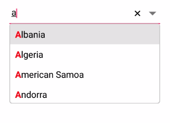
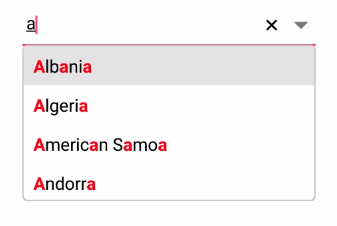

# Highlighting matched text

Highlight matching characters in a suggestion list to pick an item with more clarity. There are two ways to highlight the matching text:

* First Occurrence

* Multiple Occurrence

The text highlight can be indicated with various customizing styles by enabling the below properties. They are

* HighlightedTextColor -  sets the color of the highlighted text for differentiating the highlighted characters.

* HighlightTextFontAttributes - sets the FontAttributes of the highlighted text.

## First Occurrence

It highlights the first position of the matching characters in the suggestion list.





<StackLayout VerticalOptions="Start" HorizontalOptions="Start" Padding="30">
    <combobox:SfComboBox HeightRequest="40" x:Name="comboBox" IsEditableMode="true" AllowFiltering="true" TextHighlightMode="FirstOccurrence" HighlightedTextColor="Red" HighlightedTextFontAttributes="Bold" SuggestionMode="StartsWith"/>    
</StackLayout> 





comboBox.IsEditableMode = true;
comboBox.AllowFiltering = true;
comboBox.SuggestionMode = SuggestionMode.StartsWith;
comboBox.TextHighlightMode = OccurrenceMode.FirstOccurrence;
comboBox.HighlightedTextColor = Color.Red;
comboBox.HighlightedTextFontAttributes = FontAttributes.Bold;





## Multiple Occurrence

It highlights the matching character that are present everywhere in the suggestion list for Contains case in SuggestionMode.





<StackLayout VerticalOptions="Start" HorizontalOptions="Start" Padding="30">
    <combobox:SfComboBox HeightRequest="40" x:Name="comboBox" IsEditableMode="true" AllowFiltering="true" TextHighlightMode="MultipleOccurrence" HighlightedTextColor="Red" HighlightedTextFontAttributes="Bold" SuggestionMode="Contains"/>                    
</StackLayout> 





comboBox.IsEditableMode = true;
comboBox.AllowFiltering = true;
comboBox.SuggestionMode = SuggestionMode.Contains;
comboBox.TextHighlightMode = OccurrenceMode.MultipleOccurrence;
comboBox.HighlightedTextColor = Color.Red;
comboBox.HighlightedTextFontAttributes = FontAttributes.Bold;




