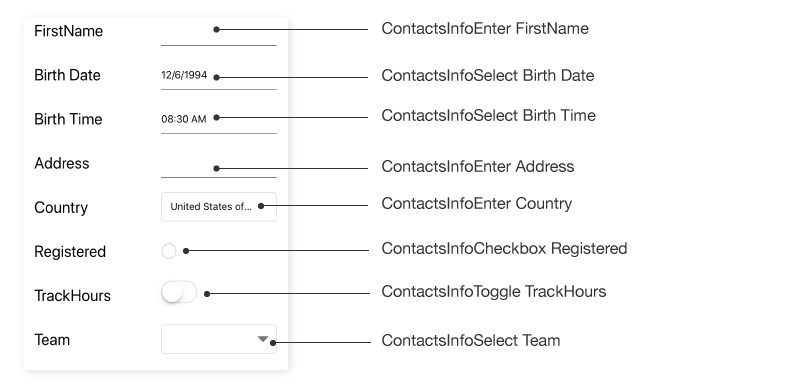
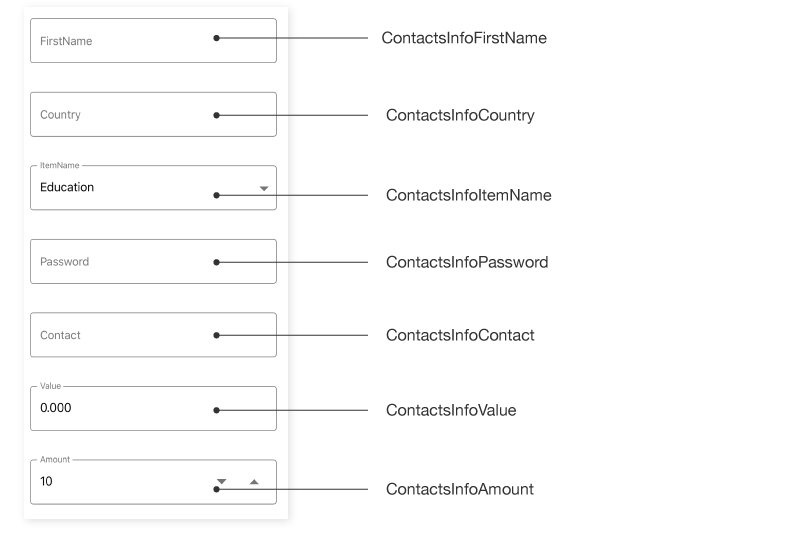

## AutomationId

The `SfDataForm`control has built-in `AutomationId` support for inner elements. Please find the following table of Automation IDs for inner elements. To keep unique `AutomationId`, these inner elements’ AutomationIds are updated based on the control’s `AutomationId`.  For example, if you set `SfDataForm` `AutomationId` as `SfDataForm.AutomationId = ContactsInfo`, then the Automation framework will interact with the text editor as `ContactsInfoEnter  FirstName`. The following screenshots denote the AutomationIds for inner elements.

### Default Layout

<table>
<tr>
<th align="center" >Editor</th>
<th align="center" >AutomationId Format</th>
<th align="center" >Example</th>
</tr>

<tr>
<td>Text editor</td>
<td>“Enter ” + LabelText</td>
<td>Enter FirstName</td>
</tr>

<tr>
<td>Multiline text editor</td>
<td>“Enter ” + LabelText</td>
<td>Enter Address</td>
</tr>

<tr>
<td>Password Editor</td>
<td>“Enter ” + LabelText</td>
<td>Enter Password</td>
</tr>

<tr>
<td>Switch Editor</td>
<td>"Toggle ” + LabelText</td>
<td>Toggle TrackHours</td>
</tr>

<tr>
<td>Picker</td>
<td>"Select ” + LabelText</td>
<td>Select Name</td>
</tr>

<tr>
<td>Date Editor</td>
<td>"Select ” + LabelText</td>
<td>Select Birth Date</td>
</tr>

<tr>
<td>Time editor</td>
<td>"Select ” + LabelText</td>
<td>Select Birth Time</td>
</tr>

<tr>
<td>Dropdown Editor</td>
<td>"Select ” + LabelText</td>
<td>Select  Team</td>
</tr>

<tr>
<td>AutoComplete Editor</td>
<td>“Enter ” + LabelText</td>
<td>Enter Country Input Field</td>
</tr>

<tr>
<td>Numeric Editor</td>
<td>“Enter ” + LabelText</td>
<td>Enter Value</td>
</tr>

<tr>
<td>NumericUpDown Editor</td>
<td>“Enter ” + LabelText</td>
<td>Enter Amount</td>
</tr>

<tr>
<td>Checkbox Editor</td>
<td>"Checkbox ” + LabelText</td>
<td>Checkbox Registered</td>
</tr>

<tr>
<td>Masked Editor</td>
<td>“Enter ” + LabelText</td>
<td>Enter Contact</td>
</tr>

</table>

### TextInput Layout

<table>
<tr>
<th align="center" >Editor</th>
<th align="center" >AutomationId Format</th>
<th align="center" >Example</th>
</tr>

<tr>
<td>Text editor</td>
<td>LabelText</td>
<td>FirstName</td>
</tr>

<tr>
<td>Multiline text editor</td>
<td>LabelText</td>
<td>Address</td>
</tr>

<tr>
<td>Password Editor</td>
<td>LabelText</td>
<td>Password</td>
</tr>

<tr>
<td>Date Editor</td>
<td>LabelText</td>
<td>Birth Date</td>
</tr>

<tr>
<td>Time editor</td>
<td>LabelText</td>
<td>Birth Time</td>
</tr>

<tr>
<td>Dropdown Editor</td>
<td>LabelText</td>
<td>ItemName</td>
</tr>

<tr>
<td>AutoComplete Editor</td>
<td>LabelText</td>
<td>Country  Input Field</td>
</tr>

<tr>
<td>Numeric Editor</td>
<td>LabelText</td>
<td>Value</td>
</tr>

<tr>
<td>NumericUpDown Editor</td>
<td>LabelText</td>
<td>Amount</td>
</tr>

<tr>
<td>Masked Editor</td>
<td>LabelText</td>
<td>Contact</td>
</tr>

<tr>
<td>Picker</td>
<td>LabelText</td>
<td>Name</td>
</tr>

</table>

