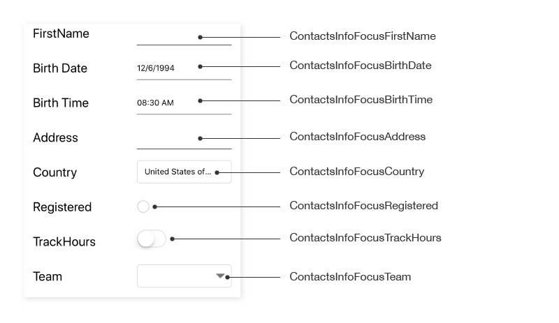
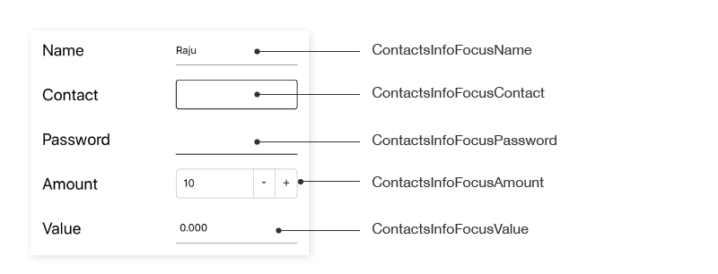

# AutomationId

The `SfDataForm`control has built-in `AutomationId` support for inner elements. Please find the following table of Automation IDs for inner elements.

<table>
<tr>
<th align="center" >Editor</th>
<th align="center" >AutomationId Format</th>
<th align="center" >Example</th>
</tr>

<tr>
<td>Text editor</td>
<td>“Focus” + LabelText</td>
<td>FocusFirstName</td>
</tr>

<tr>
<td>Multiline text editor</td>
<td>“Focus” + LabelText</td>
<td>FocusAddress</td>
</tr>

<tr>
<td>Password Editor</td>
<td>“Focus” + LabelText</td>
<td>FocusPassword</td>
</tr>

<tr>
<td>Switch Editor</td>
<td>“Focus” + LabelText</td>
<td>FocusRegistered</td>
</tr>

<tr>
<td>Picker</td>
<td>“Focus” + LabelText</td>
<td>FocusName</td>
</tr>

<tr>
<td>Date Editor</td>
<td>“Focus” + LabelText</td>
<td>FocusBirth Date</td>
</tr>

<tr>
<td>Time editor</td>
<td>“Focus” + LabelText</td>
<td>FocusBirth Time</td>
</tr>

<tr>
<td>Dropdown Editor</td>
<td>“Focus” + LabelText</td>
<td>FocusTeam</td>
</tr>

<tr>
<td>AutoComplete Editor</td>
<td>“Focus” + LabelText</td>
<td>FocusCountry</td>
</tr>

<tr>
<td>Numeric Editor</td>
<td>“Focus” + LabelText</td>
<td>FocusNumeric</td>
</tr>

<tr>
<td>NumericUpDown Editor</td>
<td>“Focus” + LabelText</td>
<td>FocusValue</td>
</tr>

<tr>
<td>Checkbox Editor</td>
<td>“Focus” + LabelText</td>
<td>FocusCheckBox</td>
</tr>

<tr>
<td>Masked Editor</td>
<td>“Focus” + LabelText</td>
<td>FocusContact</td>
</tr>

</table>

To keep unique `AutomationID`, these inner elements’ AutomationIds are updated based on the control’s `AutomationId`.  For example, if you set `SfDataForm` `AutomationId` as “SfDataForm.AutomationId = “ContactsInfo””, then the Automation framework will interact with the text editor as “ContactsInfoFocus FirstName”. The following screenshots denote the AutomationIds for inner elements.

