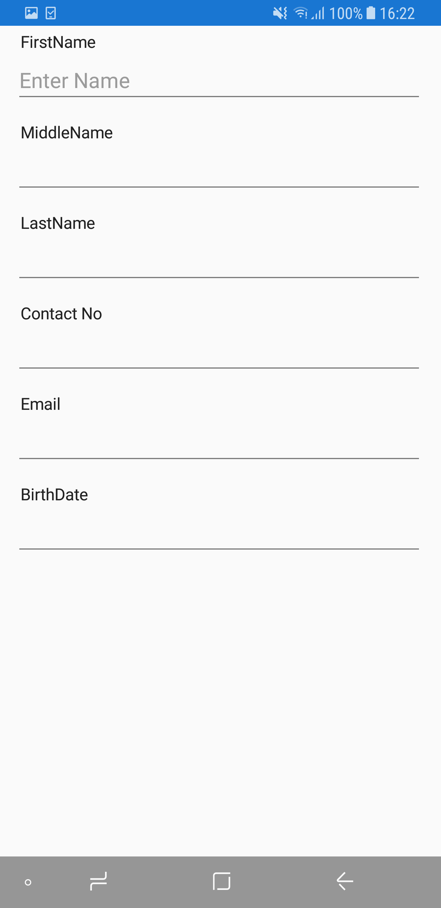

# Layout

## Overview

The data form supports linear and grid layouts. The DataFormLayoutManager creates the [DataFormItemView](https://help.syncfusion.com/cr/cref_files/xamarin/Syncfusion.SfDataForm.XForms~Syncfusion.XForms.DataForm.DataFormItemView.html), [DataFormGroupItemView](https://help.syncfusion.com/cr/cref_files/xamarin/Syncfusion.SfDataForm.XForms~Syncfusion.XForms.DataForm.DataFormGroupItemView.html), and manages layout of label, editor, and validation label.

## Grid layout support

By default, the data form arranges one data field per row. It is possible to have more than one date fields per row by setting the [ColumnCount](https://help.syncfusion.com/cr/cref_files/xamarin/Syncfusion.SfDataForm.XForms~Syncfusion.XForms.DataForm.SfDataForm~ColumnCount.html) property which provides grid like layout for the data form.



<?xml version="1.0" encoding="utf-8" ?>
<ContentPage xmlns="http://xamarin.com/schemas/2014/forms"
             xmlns:x="http://schemas.microsoft.com/winfx/2009/xaml"
             xmlns:local="clr-namespace:GettingStarted"
             xmlns:dataForm ="clr-namespace:Syncfusion.XForms.DataForm;assembly=Syncfusion.SfDataForm.XForms"
             x:Class="GettingStarted.MainPage">
    <ContentPage.Content>        
            <dataForm:SfDataForm x:Name="dataForm" ColumnCount="2"/>                    
    </ContentPage.Content>    
</ContentPage>


dataForm.ColumnCount = 2;



When the label position is Left, the grid layout is shown as follows:

When the label position is Top, the grid layout is shown as follows:

## Label visibility

You can hide the label by defining the [DisplayOptions](https://help.syncfusion.com/cr/cref_files/xamarin/Syncfusion.SfDataForm.XForms~Syncfusion.XForms.DataForm.DisplayOptionsAttribute.html) attribute or by handling `AutoGeneratingDataFormItem` event. In this case, only the editor will be loaded.

### Using attributes



private double? percentage;

[DisplayOptions(ShowLabel = false)]
[Display(Prompt = "Enter percentage")]
public double? Percentage
{
    get
    {
        return percentage;
    }
    set
    {
        percentage = value;
        RaisePropertyChanged("Percentage");
    }
}



### Using event



private void DataForm_AutoGeneratingDataFormItem(object sender, AutoGeneratingDataFormItemEventArgs e)
{
    if (e.DataFormItem != null && e.DataFormItem.Name == "Percentage")
    {
        e.DataFormItem.PlaceHolderText = "Enter percentage";
        e.DataFormItem.ShowLabel = false;
    }
}



## Label position

Labels can be positioned either top or left side of the editor. By using the [LabelPosition](https://help.syncfusion.com/cr/cref_files/xamarin/Syncfusion.SfDataForm.XForms~Syncfusion.XForms.DataForm.SfDataForm~LabelPosition.html) property, you can layout the label associated with editor.

By default, the label will be positioned at left side of the editor.



<?xml version="1.0" encoding="utf-8" ?>
<ContentPage xmlns="http://xamarin.com/schemas/2014/forms"
             xmlns:x="http://schemas.microsoft.com/winfx/2009/xaml"
             xmlns:local="clr-namespace:GettingStarted"
             xmlns:dataForm ="clr-namespace:Syncfusion.XForms.DataForm;assembly=Syncfusion.SfDataForm.XForms"
             x:Class="GettingStarted.MainPage">
    <ContentPage.Content>        
            <dataForm:SfDataForm x:Name="dataForm" LabelPosition="Top"/>                    
    </ContentPage.Content>    
</ContentPage>


dataForm.LabelPosition = LabelPosition.Top;



## Loading images for label

You can load image instead of label by defining attribute or by handling the `AutoGeneratingDataFormItem` event.

### Using attributes

To show the image as label, use the [ImageName](https://help.syncfusion.com/cr/cref_files/xamarin/Syncfusion.SfDataForm.XForms~Syncfusion.XForms.DataForm.DisplayOptionsAttribute~ImageName.html) property in [DisplayOptions](https://help.syncfusion.com/cr/cref_files/xamarin/Syncfusion.SfDataForm.XForms~Syncfusion.XForms.DataForm.DisplayOptionsAttribute.html) attribute. Images will be taken from …\Resources\drawable folder in Xamarin.Forms.Android, …\Resources folder in Xamarin.Forms.iOS.



private string firstName;
[DisplayOptions(ImageName = "ContactInfo.png")]
public string FirstName
{
    get { return this.firstName; }
    set
    {
        this.firstName = value;
    }
}



### Using event

By using the [ImageSource](https://help.syncfusion.com/cr/cref_files/xamarin/Syncfusion.SfDataForm.XForms~Syncfusion.XForms.DataForm.DataFormItem~ImageSource.html) property in the `DataFormItem`, you can load the image as label.



dataForm.AutoGeneratingDataFormItem += DataForm_AutoGeneratingDataFormItem;
private void DataForm_AutoGeneratingDataFormItem(object sender, AutoGeneratingDataFormItemEventArgs e)
{
    if (e.DataFormItem != null)
    {        
        if (e.DataFormItem.Name == "FirstName")
            e.DataFormItem.ImageSource = ImageSource.FromFile("ContactInfo.png");
    }
}



## Changing order of the DataFormItem

You can change the order of the `DataFormItem` by using attributes or by handling `AutoGeneratingDataFormItem` event.

### Using attributes

You can set the order by using the `Order` property in display attribute.



public class ContactsInfo
{
    private string lastName;
    private string contactNo;       
    public ContactsInfo()
    {

    }

    [Display(Order = 2)]
    public string ContactNumber
    {
        get { return contactNo; }
        set
        {
            this.contactNo = value;
        }
    }

    private string firstName;
    [Display(Order = 0)]
    public string FirstName
    {
        get { return this.firstName; }
        set
        {
            this.firstName = value;
        }
    }

    [Display(Order = 1)]
    public string LastName
    {
        get { return this.lastName; }
        set
        {
            this.lastName = value;
        }
    }
}



### Using event

You can change the fields order by using the [Order](https://help.syncfusion.com/cr/cref_files/xamarin/Syncfusion.SfDataForm.XForms~Syncfusion.XForms.DataForm.DataFormItem~Order.html) property in the `DataFormItem`.



dataForm.AutoGeneratingDataFormItem += DataForm_AutoGeneratingDataFormItem;

private void DataForm_AutoGeneratingDataFormItem(object sender, AutoGeneratingDataFormItemEventArgs e)
{
    if (e.DataFormItem != null)
    {
        if (e.DataFormItem.Name == "FirstName")
            e.DataFormItem.Order = 0;
    }
}



## Grouping data fields

It is possible to group some fields and set group name in the data form. You can expand or collapse the group by tapping the group item.

Grouping can be achieved by defining attributes or by handling the `AutoGeneratingDataFormItem` event.

### Using attributes



public class ContactsInfo
{
    private string lastName;
    private string contactNo;
    private string email;   
    private DateTime? birthDate;

    public ContactsInfo()
    {

    }

    private string firstName;
    [Display(GroupName = "Name")]
    public string FirstName
    {
        get { return this.firstName; }
        set
        {
            this.firstName = value;
        }
    }
        
    private string middleName;
    [Display(GroupName = "Name")]
    public string MiddleName
    {
        get { return this.middleName; }
        set
        {
            this.middleName = value;
        }
    }
    [Display(GroupName = "Name")]
    public string LastName
    {
        get { return this.lastName; }
        set
        {
            this.lastName = value;
        }
    }
    [Display(GroupName ="Details", ShortName = "ContactNo.")]
    public string ContactNumber
    {
        get { return contactNo; }
        set
        {
            this.contactNo = value;
        }
    }

    [Display(GroupName = "Details")]
    public string Email
    {
        get { return email; }
        set
        {
            email = value;
        }
    }

    [Display(GroupName = "Details")]
    public DateTime? BirthDate
    {
        get { return birthDate; }
        set
        {
            birthDate = value;
        }
    }
}



### Using event



dataForm.AutoGeneratingDataFormItem += DataForm_AutoGeneratingDataFormItem;
private void DataForm_AutoGeneratingDataFormItem(object sender, AutoGeneratingDataFormItemEventArgs e)
{
    if (e.DataFormItem != null)
    {
        if (e.DataFormItem.Name == "FirstName" || e.DataFormItem.Name == "MiddleName" || e.DataFormItem.Name == "LastName")
            e.DataFormItem.GroupName = "Name";
        else
            e.DataFormItem.GroupName = "Details";
    }
}



### Changing group name for group

You can change the `GroupName` for the group in the `AutoGeneratingDataFormItem` event.



dataForm.AutoGeneratingDataFormItem += DataForm_AutoGeneratingDataFormItem;
private void DataForm_AutoGeneratingDataFormItem(object sender, AutoGeneratingDataFormItemEventArgs e)
{
    if (e.DataFormGroupItem != null && e.DataFormGroupItem.GroupName == "Name")
        e.DataFormGroupItem.GroupName = "Name Group";
}



### Loading different layout for group

You can load linear or grid layout for the particular group by handling the `AutoGeneratingDataFormItem` event.
By setting the `ColumnCount` property in the data form, non-grouped items only will be arranged in the grid layout. To load the grid layout, set the [ColumnCount](https://help.syncfusion.com/cr/cref_files/xamarin/Syncfusion.SfDataForm.XForms~Syncfusion.XForms.DataForm.SfDataForm~ColumnCount.html) for the [DataFormGroupItem](https://help.syncfusion.com/cr/cref_files/xamarin/Syncfusion.SfDataForm.XForms~Syncfusion.XForms.DataForm.DataFormGroupItem.html).



dataForm.AutoGeneratingDataFormItem += DataForm_AutoGeneratingDataFormItem;

private void DataForm_AutoGeneratingDataFormItem(object sender, AutoGeneratingDataFormItemEventArgs e)
{
    if (e.DataFormGroupItem != null && e.DataFormGroupItem.GroupName == "Name")
        e.DataFormGroupItem.ColumnCount = 2;
}



#### Loading linear and grid layout for the group



public class ContactsInfo
{
    private string lastName;
    private string contactNo;
    private string email;   
    private DateTime? birthDate;

    public ContactsInfo()
    {

    }

    private string firstName;
    [Display(GroupName = "Name")]
    public string FirstName
    {
        get { return this.firstName; }
        set
        {
            this.firstName = value;
        }
    }
        
    [Display(GroupName = "Name")]
    public string LastName
    {
        get { return this.lastName; }
        set
        {
            this.lastName = value;
        }
    }
    [Display(GroupName ="Details", ShortName = "ContactNo.")]
    public string ContactNumber
    {
        get { return contactNo; }
        set
        {
            this.contactNo = value;
        }
    }

    [Display(GroupName = "Details")]
    public string Email
    {
        get { return email; }
        set
        {
            email = value;
        }
    }

    [Display(GroupName = "Details")]
    public DateTime? BirthDate
    {
        get { return birthDate; }
        set
        {
            birthDate = value;
        }
    }
}


dataForm.AutoGeneratingDataFormItem += DataForm_AutoGeneratingDataFormItem;

private void DataForm_AutoGeneratingDataFormItem(object sender, AutoGeneratingDataFormItemEventArgs e)
{
    if (e.DataFormGroupItem != null && e.DataFormGroupItem.GroupName == "Name")
        e.DataFormGroupItem.ColumnCount = 2;
}



In the following image, for the `Name` group, the grid layout is loaded and for the `Details` group, linear layout is loaded:

#### Setting different column count

You can also set different `ColumnCount` for each group.



dataForm.AutoGeneratingDataFormItem += DataForm_AutoGeneratingDataFormItem;

private void DataForm_AutoGeneratingDataFormItem(object sender, AutoGeneratingDataFormItemEventArgs e)
{
    if (e.DataFormGroupItem != null)
    {
        if (e.DataFormGroupItem.GroupName == "Name")
            e.DataFormGroupItem.ColumnCount = 2;
        else if (e.DataFormGroupItem.GroupName == "Details")
            e.DataFormGroupItem.ColumnCount = 3;
    }
}




### Loading group in collapsed state

By default, the group will be loaded in expanded state. You can collapse the group by setting the [IsExpanded](https://help.syncfusion.com/cr/cref_files/xamarin/Syncfusion.SfDataForm.XForms~Syncfusion.XForms.DataForm.DataFormGroupItem~IsExpanded.html) property to false in the [DataFormGroupItem](https://help.syncfusion.com/cr/cref_files/xamarin/Syncfusion.SfDataForm.XForms~Syncfusion.XForms.DataForm.DataFormGroupItem.html).



dataForm.AutoGeneratingDataFormItem += DataForm_AutoGeneratingDataFormItem;

private void DataForm_AutoGeneratingDataFormItem(object sender, AutoGeneratingDataFormItemEventArgs e)
{
    if (e.DataFormGroupItem != null && e.DataFormGroupItem.GroupName == "Name")
        e.DataFormGroupItem.IsExpanded = false;
}



### Restricting the group expanding and collapsing

You can set restrict the group being expanded or collapsed by setting the [AllowExpandCollapse](https://help.syncfusion.com/cr/cref_files/xamarin/Syncfusion.SfDataForm.XForms~Syncfusion.XForms.DataForm.DataFormGroupItem~AllowExpandCollapse.html) to `false` in the [DataFormGroupItem](https://help.syncfusion.com/cr/cref_files/xamarin/Syncfusion.SfDataForm.XForms~Syncfusion.XForms.DataForm.DataFormGroupItem.html).

In this case, the group will be shown without expander.

### Programmatically expand or collapse group

You can expand or collapse the group programmatically by using [ExpandGroup](https://help.syncfusion.com/cr/cref_files/xamarin/Syncfusion.SfDataForm.XForms~Syncfusion.XForms.DataForm.SfDataForm~ExpandGroup.html) and [CollapseGroup](https://help.syncfusion.com/cr/cref_files/xamarin/Syncfusion.SfDataForm.XForms~Syncfusion.XForms.DataForm.SfDataForm~CollapseGroup.html) methods respectively.



dataForm.ExpandGroup("Group1");

dataForm.CollapseGroup("Group1");



## Customizing DataFormLayoutManager

To customize the layout, override the [DataFormLayoutManager](https://help.syncfusion.com/cr/cref_files/xamarin/Syncfusion.SfDataForm.XForms~Syncfusion.XForms.DataForm.DataFormLayoutManager.html) and assign to the [SfDataForm.LayoutManager](https://help.syncfusion.com/cr/cref_files/xamarin/Syncfusion.SfDataForm.XForms~Syncfusion.XForms.DataForm.SfDataForm~LayoutManager.html) property.



public class DataFormLayoutManagerExt : DataFormLayoutManager
{
    public DataFormLayoutManagerExt(SfDataForm dataForm) : base(dataForm)
    {

    }
}
dataForm.LayoutManager = new DataFormLayoutManagerExt(dataForm);



### Changing editor padding

You can change the editor padding by overriding the `GetLeftPaddingForEditor` method.



public class ContactsInfo
{
    private string lastName;
    public ContactsInfo()
    {

    }

    private string firstName;
    [DisplayOptions(ImageSource = Resource.Drawable.Name)]
    public string FirstName
    {
        get { return this.firstName; }
        set
        {
            this.firstName = value;
        }
    }

    [Display(Prompt = "Enter last name")]
    [DisplayOptions(ShowLabel = false)]
    public string LastName
    {
        get { return this.lastName; }
        set
        {
            this.lastName = value;
        }
    }

}


dataForm.LayoutManager = new DataFormLayoutManagerExt(dataForm);

public class DataFormLayoutManagerExt : DataFormLayoutManager
{
    public DataFormLayoutManagerExt(SfDataForm dataForm) : base(dataForm)
    {

    }

    protected override int GetLeftPaddingForEditor(DataFormItem dataFormItem)
    {
        if (dataFormItem.Name == "LastName")
            return 35;
        return base.GetLeftPaddingForEditor(dataFormItem);
    }
}



Here, the LastName padding is customized.

### Customizing label and editor

By using DataFormLayoutManager class , you can customize the generated label by overriding the `GenerateViewForLabel` method and also you can customize the editor by overriding the `OnEditorCreated` method.Here, BackgroundColor and TextColor of label and editor is customized.




public class ContactsInfo
{
    public ContactsInfo()
    {

    }

    private string firstName = "Iris";
    public string FirstName
    {
        get { return this.firstName; }
        set
        {
            this.firstName = value;
        }
    }

    private string lastName;
    public string LastName
    {
        get { return this.lastName; }
        set
        {
            this.lastName = value;
        }
    }
}



dataForm.LayoutManager = new DataFormLayoutManagerExt(dataForm);

public class DataFormLayoutManagerExt : DataFormLayoutManager
{
    public DataFormLayoutManagerExt(SfDataForm dataForm) : base(dataForm)
    {

    }

    protected override View GenerateViewForLabel(DataFormItem dataFormItem)
    {
        var label = base.GenerateViewForLabel(dataFormItem);
        if (label is Label)
        { 
            (label as Label).BackgroundColor = Color.Red; 
            (label as Label).TextColor = Color.Blue;
        }
        return label;
    }
    
    protected override void OnEditorCreated(DataFormItem dataFormItem, View editor)
    { 
        if (editor is Entry)
            (editor as Entry).TextColor = Color.Orange;
        editor.BackgroundColor = Color.Blue; 
    }
}



## Label width customization

You can set label and editor width proportionally by using [LabelWidth](https://help.syncfusion.com/cr/cref_files/xamarin/Syncfusion.SfDataForm.XForms~Syncfusion.XForms.DataForm.SfDataForm~LabelWidth.html) and [EditorWidth](https://help.syncfusion.com/cr/cref_files/xamarin/Syncfusion.SfDataForm.XForms~Syncfusion.XForms.DataForm.SfDataForm~EditorWidth.html) properties.



<?xml version="1.0" encoding="utf-8" ?>
<ContentPage xmlns="http://xamarin.com/schemas/2014/forms"
             xmlns:x="http://schemas.microsoft.com/winfx/2009/xaml"
             xmlns:local="clr-namespace:GettingStarted"
             xmlns:dataForm ="clr-namespace:Syncfusion.XForms.DataForm;assembly=Syncfusion.SfDataForm.XForms"
             x:Class="GettingStarted.MainPage">
    <ContentPage.Content>        
            <dataForm:SfDataForm x:Name="dataForm" LabelWidth="1" EditorWidth="2"/>                    
    </ContentPage.Content>    
</ContentPage>


dataForm.LabelWidth = 1;
dataForm.EditorWidth = 2;



Here, the available width is divided into proportionally for editor (2) and label (1).

N> It is applicable only when `LabelPosition` is Left.

By default, the available width is divided equally for editor and label.

## Spanning rows and columns

You can increase row height and column width by defining the `DisplayOptions` attribute.

### Row span

You can increase the row height by using the [RowSpan](https://help.syncfusion.com/cr/cref_files/xamarin/Syncfusion.SfDataForm.XForms~Syncfusion.XForms.DataForm.DisplayOptionsAttribute~RowSpan.html) property in the`DisplayOptions` attribute.



private string firstName;
[DisplayOptions(RowSpan = 2)]
public string FirstName
{
    get { return this.firstName; }
    set
    {
        this.firstName = value;
    }
}



Here, `FirstName` field’s row height is increased.

### Column span

When the grid layout is used, you can increase the column width by using the [ColumnSpan](https://help.syncfusion.com/cr/cref_files/xamarin/Syncfusion.SfDataForm.XForms~Syncfusion.XForms.DataForm.DisplayOptionsAttribute~ColumnSpan.html) property in the `DisplayOptions `attribute.



dataForm.ColumnCount = 2;


private string firstName;
[DisplayOptions(ColumnSpan = 2)]
public string FirstName
{
    get { return this.firstName; }
    set
    {
        this.firstName = value;
    }
}



## Change DataFormItem visibility at runtime

You can change the field visibility by using the [IsVisible](https://help.syncfusion.com/cr/cref_files/xamarin/Syncfusion.SfDataForm.XForms~Syncfusion.XForms.DataForm.DataFormItemBase~IsVisible.html) property in the `DataFormItem`.



var dataFormItem = dataForm.ItemManager.DataFormItems["Name"];
if (dataFormItem.Name == "Name")
{
    dataFormItem.IsVisible = false;
}


Here, the `Name` field will be hidden.
