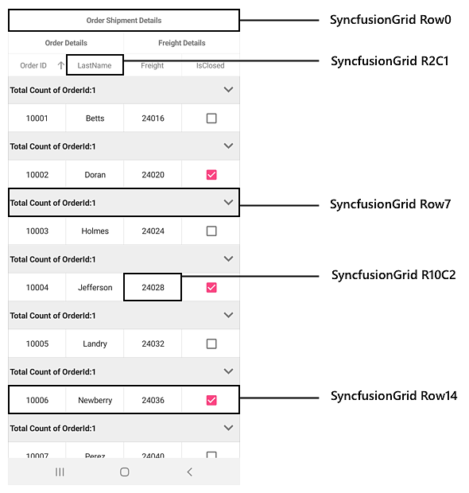

# Automation Id

SfDataGrid and SfDataPager supports built in [AutomationId](https://docs.microsoft.com/en-gb/dotnet/api/xamarin.forms.element.automationid?view=xamarin-forms#Xamarin_Forms_Element_AutomationId) for all its inner elements. These `AutomationId` values allows the automation framework to find and interact with the inner elements when the test scripts are run. A unique `AutomationId` is maintained for each inner element by prefixing the control's `AutomationId` with the inner element's Id.

## DataGrid

Refer the below image to know the AutomationId values of the grid cells, rows and other inner elements of the SfDataGrid.

Refer the below code snippet to set the AutomationId to the datagrid.




<syncfusion:SfDataGrid x:Name="dataGrid"
                        ItemsSource="{Binding OrdersInfo,Mode=TwoWay}"
                        AutomationId="SyncfusionGrid"
                        AllowGroupExpandCollapse="True">

                <sfgrid:SfDataGrid.GroupColumnDescriptions>
                    <sfgrid:GroupColumnDescription ColumnName="OrderID" />
                </sfgrid:SfDataGrid.GroupColumnDescriptions>
                
                <sfgrid:SfDataGrid.CaptionSummaryRow>
                    <sfgrid:GridGroupSummaryRow Title="Total Count of OrderId:{OrderID}"
                           ShowSummaryInRow="True">
                        <sfgrid:GridGroupSummaryRow.SummaryColumns>
                            <sfgrid:GridSummaryColumn Name="OrderID"
                                      MappingName="OrderID"
                                      Format="{}{Count}"
                                      SummaryType="CountAggregate" />
                        </sfgrid:GridGroupSummaryRow.SummaryColumns>
                    </sfgrid:GridGroupSummaryRow>
                </sfgrid:SfDataGrid.CaptionSummaryRow>
                          
    </syncfusion:SfDataGrid>





ViewModel viewModel = new ViewModel();
SfDataGrid dataGrid = new SfDataGrid();
dataGrid.ItemsSource = viewModel.OrderInfoCollection;
dataGrid.AutomationId = "SyncfusionGrid";
dataGrid.AllowGroupExpandCollapse = true;

this.sfGrid.GroupColumnDescriptions.Add(new GroupColumnDescription()
            {
                ColumnName = "OrderID",
            });

GridGroupSummaryRow summaryRow = new GridGroupSummaryRow();
summaryRow.Title = "Total Count of OrderId:{OrderID}";
summaryRow.ShowSummaryInRow = true;
summaryRow.SummaryColumns.Add(new GridSummaryColumn()
            {
                Name = "OrderID",
                MappingName = "OrderID",
                Format = "{Count}",
                SummaryType = SummaryType.CountAggregate
            });
sfGrid.CaptionSummaryRow = summaryRow;







[Test]
[Description("SfDataGrid Automation Id")]
public void SfDataGrid_AutomationId()
{
   // To enter in to edit mode at fourth row and second column cell
   App.DoubleTap("SyncfusionGrid R4C1");

   // To tap group expand and collapse icon
   App.Tap("SyncfusionGrid Row5");

   // To apply sorting 
   App.Tap("SyncfusionGrid R2C1");

   // To click on LoadMoreView for loading more items
   App.Tap("SyncfusionGrid LOAD MORE ITEMS");
}




## DataPager

Refer the below image to know the AutomationId values of the pager buttons in SfDatapager.

Refer the below code snippet to set the AutomationId to the dataPager.




<Grid> 
      <Grid.RowDefinitions>
        <RowDefinition Height="Auto" />
        <RowDefinition Height="*" />
      </Grid.RowDefinitions>
      <sfPager:SfDataPager x:Name ="dataPager"
                           Grid.Row="0"           
                           PageSize="10" 
                           HeightRequest ="50"
                           NumericButtonCount="20"
                           Source="{Binding OrdersInfo}"
                           AutomationId="SyncfusionPager">
      </sfPager:SfDataPager>
       
      <sfgrid:SfDataGrid x:Name="dataGrid"
                         Grid.Row="1"
                         ItemsSource="{Binding PagedSource, Source={x:Reference dataPager}}" >                   
      </sfgrid:SfDataGrid>
</Grid> 
                      




SfDataGrid sfGrid = new SfDataGrid();
SfDataPager sfPager = new SfDataPager();
ViewModel viewModel = new ViewModel();
sfPager.PageSize = 15; 
sfPager.Source = viewModel.Info; 
sfGrid.ItemsSource = sfPager.PagedSource;  
sfPager.AutomationId = "SyncfusionPager";

Grid gridLayout = new Grid();
gridLayout.HorizontalOptions = LayoutOptions.FillAndExpand;
gridLayout.RowDefinitions = new RowDefinitionCollection
        {
          new RowDefinition { Height = 50 },
          new RowDefinition {},    
        };
gridLayout.Children.Add(sfPager, 0, 0);
gridLayout.Children.Add(sfGrid, 0, 1);
this.Content = gridLayout;







[Test]
[Description("SfDataPager Automation Id")]
public void SfDataPager_AutomationId()
{
   // To tap the first page numeric button
   App.Tap("SyncfusionPager FirstPage");

   // To tap the previous page numeric button
   App.Tap("SyncfusionPager PreviousPage");

   // To tap the next page numeric button
   App.Tap("SyncfusionPager NextPage");

   // To tap the next last page numeric button
   App.Tap("SyncfusionPager LastPage");

   // To tap the second numeric button
   App.Tap("SyncfusionPager NumericButton2");
}


