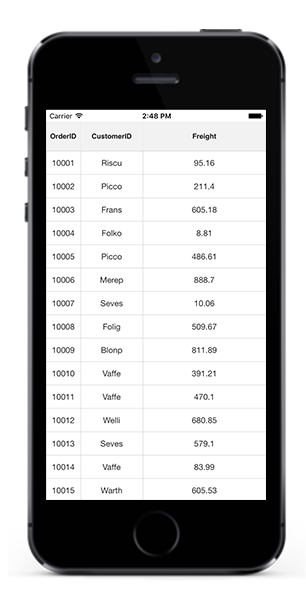

# Column Sizer

SfDataGrid allows you to apply `ColumnSizer` for the [GridColumn](http://help.syncfusion.com/cr/cref_files/xamarin/sfdatagrid/Syncfusion.SfDataGrid.XForms~Syncfusion.SfDataGrid.XForms.GridColumn.html) by setting the [SfDataGrid.ColumnSizer](http://help.syncfusion.com/cr/cref_files/xamarin/sfdatagrid/Syncfusion.SfDataGrid.XForms~Syncfusion.SfDataGrid.XForms.SfDataGrid~ColumnSizer.html) property. 

The following code example illustrates how to apply `ColumnSizer` in SfDataGrid.



<sfgrid:SfDataGrid x:Name="dataGrid"
                   AutoGenerateColumns="True"
                   ColumnSizer="None">


dataGrid.ColumnSizer = ColumnSizer.None;



SfDataGrid applies width for all the `GridColumns` in the [SfDataGrid.Columns](http://help.syncfusion.com/cr/cref_files/xamarin/sfdatagrid/Syncfusion.SfDataGrid.XForms~Syncfusion.SfDataGrid.XForms.SfDataGrid~Columns.html) collection based on the `SfDataGrid.ColumnSizer` property. Following are the lists of options available to set width of the columns.

* None
* LastColumnFill
* Star
* Auto

## ColumnSizer.None

No column sizing is applied when the [SfDataGrid.ColumnSizer](http://help.syncfusion.com/cr/cref_files/xamarin/sfdatagrid/Syncfusion.SfDataGrid.XForms~Syncfusion.SfDataGrid.XForms.SfDataGrid~ColumnSizer.html) is set to [None](http://help.syncfusion.com/cr/cref_files/xamarin/sfdatagrid/Syncfusion.SfDataGrid.XForms~Syncfusion.SfDataGrid.XForms.ColumnSizer.html). Columns are arranged in view based on the [SfDataGrid.DefaultColumnWidth](http://help.syncfusion.com/cr/cref_files/xamarin/sfdatagrid/Syncfusion.SfDataGrid.XForms~Syncfusion.SfDataGrid.XForms.SfDataGrid~DefaultColumnWidth.html) property. This is the default value of the `SfDataGrid.ColumnSizer` property.

## ColumnSizer.LastColumnFill

When the [SfDataGrid.ColumnSizer](http://help.syncfusion.com/cr/cref_files/xamarin/sfdatagrid/Syncfusion.SfDataGrid.XForms~Syncfusion.SfDataGrid.XForms.SfDataGrid~ColumnSizer.html) is [LastColumnFill](http://help.syncfusion.com/cr/cref_files/xamarin/sfdatagrid/Syncfusion.SfDataGrid.XForms~Syncfusion.SfDataGrid.XForms.ColumnSizer.html), the column width of the `GridColumns` are adjusted with respect to `SfDataGrid.DefaultColumnWidth` property. In case if the columns does not fill the entire view space, then the last column’s width fills the unoccupied space in the view.



<sfgrid:SfDataGrid x:Name="dataGrid"
                   AutoGenerateColumns="True"
                   ColumnSizer="LastColumnFill">


dataGrid.ColumnSizer = ColumnSizer.LastColumnFill;



## ColumnSizer.Star

When the [SfDataGrid.ColumnSizer](http://help.syncfusion.com/cr/cref_files/xamarin/sfdatagrid/Syncfusion.SfDataGrid.XForms~Syncfusion.SfDataGrid.XForms.SfDataGrid~ColumnSizer.html) is [Star](http://help.syncfusion.com/cr/cref_files/xamarin/sfdatagrid/Syncfusion.SfDataGrid.XForms~Syncfusion.SfDataGrid.XForms.ColumnSizer.html), all the `GridColumns` are adjusted an equal column width to fit within the view. Setting `ColumnSizer` to `Star` will disable the `HorizontalScrolling` in SfDataGrid.



<sfgrid:SfDataGrid x:Name="dataGrid"
                   AutoGenerateColumns="True"
                   ColumnSizer="Star">


dataGrid.ColumnSizer = ColumnSizer.Star;



## ColumnSizer.Auto

When the [SfDataGrid.ColumnSizer](http://help.syncfusion.com/cr/cref_files/xamarin/sfdatagrid/Syncfusion.SfDataGrid.XForms~Syncfusion.SfDataGrid.XForms.SfDataGrid~ColumnSizer.html) is [Auto](http://help.syncfusion.com/cr/cref_files/xamarin/sfdatagrid/Syncfusion.SfDataGrid.XForms~Syncfusion.SfDataGrid.XForms.ColumnSizer.html), the width of the `GridColumns` are adjusted based on the header text or cell contents.



<sfgrid:SfDataGrid x:Name="dataGrid"
                   AutoGenerateColumns="True"
                   ColumnSizer="Auto">


dataGrid.ColumnSizer = ColumnSizer.Auto;



N> If any column is specified a width explicitly using the [GridColumn.Width](http://help.syncfusion.com/cr/cref_files/xamarin/sfdatagrid/Syncfusion.SfDataGrid.XForms~Syncfusion.SfDataGrid.XForms.GridColumn~Width.html) property then that column is not considered ColumnSizing width and skipped while applying the ColumnSizer for grid columns.

## How to 

### Apply ColumnSizer for a particular column

You can apply column sizing to individual columns by using the [GridColumn.ColumnSizer](http://help.syncfusion.com/cr/cref_files/xamarin/sfdatagrid/Syncfusion.SfDataGrid.XForms~Syncfusion.SfDataGrid.XForms.GridColumn~ColumnSizer.html) property. The `GridColumn.ColumnSizer` property is also type of [ColumnSizer](http://help.syncfusion.com/cr/cref_files/xamarin/sfdatagrid/Syncfusion.SfDataGrid.XForms~Syncfusion.SfDataGrid.XForms.ColumnSizer.html). If the `GridColumn.ColumnSizer` is not explicitly set to a value, then it takes the value of the [SfDataGrid.ColumnSizer](http://help.syncfusion.com/cr/cref_files/xamarin/sfdatagrid/Syncfusion.SfDataGrid.XForms~Syncfusion.SfDataGrid.XForms.SfDataGrid~ColumnSizer.html) and applies the width to the columns accordingly.

The following code example illustrates how to apply `ColumnSizer` for a particular column.



<sfgrid:SfDataGrid x:Name="dataGrid"
                   AutoGenerateColumns="True"
                   ColumnSizer="None">

<syncfusion:GridTextColumn MappingName="OrderID"
                           ColumnSizer = "Auto" />


GridTextColumn textColumn = new GridTextColumn();
textColumn.MappingName = "CustomerID";
textColumn.HeaderText = "Full Name";
textColumn.ColumnSizer = ColumnSizer.Auto;  



### Fill Remaining width for any column

SfDataGrid allows to fill the remaining width for any column by using [GridColumn.ColumnSizer](http://help.syncfusion.com/cr/cref_files/xamarin/sfdatagrid/Syncfusion.SfDataGrid.XForms~Syncfusion.SfDataGrid.XForms.GridColumn~ColumnSizer.html) property.
The `GridColumn.ColumnSizer` property is also type of [ColumnSizer](http://help.syncfusion.com/cr/cref_files/xamarin/sfdatagrid/Syncfusion.SfDataGrid.XForms~Syncfusion.SfDataGrid.XForms.ColumnSizer.html) and If we want to fill any columns accordingly in the view, then follow the below code example to acheive it.

The following example shows how to fill the remaining width for any column in `SfDataGrid`



<sfgrid:SfDataGrid x:Name="dataGrid"
                   AutoGenerateColumns="False"
                   ItemsSource="{Binding OrdersInfo}">

<sfgrid:SfDataGrid.Columns x:TypeArguments="sfgrid:Columns">
    <sfgrid:GridTextColumn HeaderFontAttribute="Bold"
                        HeaderText="OrderID"
                        HeaderTextAlignment="Start"
                        MappingName="OrderID"
                        TextAlignment="End">
        <sfgrid:GridTextColumn.HeaderCellTextSize>
            <OnPlatform x:TypeArguments="x:Double"
                    Android="14"
                    WinPhone="12"
                    iOS="12" />
        </sfgrid:GridTextColumn.HeaderCellTextSize>
        <sfgrid:GridTextColumn.CellTextSize>
            <OnPlatform x:TypeArguments="x:Double"
                    Android="14"
                    WinPhone="12"
                    iOS="12" />
        </sfgrid:GridTextColumn.CellTextSize>
    </sfgrid:GridTextColumn>

<sfgrid:GridTextColumn HeaderFontAttribute="Bold"
                    HeaderText="CustomerID"
                    HeaderTextAlignment="Center"
                    MappingName="CustomerID"
                    TextAlignment="Center"
                    ColumnSizer="LastColumnFill">
    <sfgrid:GridTextColumn.HeaderCellTextSize>
        <OnPlatform x:TypeArguments="x:Double"
                Android="14"
                WinPhone="12"
                iOS="12" />
    </sfgrid:GridTextColumn.HeaderCellTextSize>
    <sfgrid:GridTextColumn.CellTextSize>
        <OnPlatform x:TypeArguments="x:Double"
                Android="14"
                WinPhone="12"
                iOS="12" />
    </sfgrid:GridTextColumn.CellTextSize>
</sfgrid:GridTextColumn>

<sfgrid:GridTextColumn HeaderFontAttribute="Bold"
                    HeaderText="Salary"
                    HeaderTextAlignment="Start"
                    MappingName="Salary"
                    TextAlignment="Start">
    <sfgrid:GridTextColumn.HeaderCellTextSize>
        <OnPlatform x:TypeArguments="x:Double"
                Android="14"
                WinPhone="12"
                iOS="12" />
    </sfgrid:GridTextColumn.HeaderCellTextSize>
    <sfgrid:GridTextColumn.CellTextSize>
        <OnPlatform x:TypeArguments="x:Double"
                    Android="14"
                    WinPhone="12"
                    iOS="12" />
    </sfgrid:GridTextColumn.CellTextSize>
</sfgrid:GridTextColumn>

<sfgrid:GridTextColumn HeaderFontAttribute="Bold"
                    HeaderText="Country"
                    HeaderTextAlignment="Start"
                    MappingName="Country"
                    TextAlignment="Start">
    <sfgrid:GridTextColumn.HeaderCellTextSize>
        <OnPlatform x:TypeArguments="x:Double"
                Android="14"
                WinPhone="12"
                iOS="12" />
    </sfgrid:GridTextColumn.HeaderCellTextSize>
    <sfgrid:GridTextColumn.CellTextSize>
        <OnPlatform x:TypeArguments="x:Double"
                Android="14"
                WinPhone="12"
                iOS="12" />
    </sfgrid:GridTextColumn.CellTextSize>
</sfgrid:GridTextColumn>
</sfgrid:SfDataGrid.Columns> 
</sfgrid:SfDataGrid> 

 
GridTextColumn orderIDColumn = new GridTextColumn();
orderIDColumn.MappingName = "OrderID";
orderIDColumn.HeaderText = "OrderID";

GridTextColumn customerIDColumn = new GridTextColumn();
customerIDColumn.MappingName = "CustomerID";
customerIDColumn.HeaderText = "CustomerID";
customerIDColumn.ColumnSizer = ColumnSizer.LastColumnFill;

GridTextColumn salaryColumn = new GridTextColumn();
salaryColumn.MappingName = "Salary";
salaryColumn.HeaderText = "Salary";

GridTextColumn countryColumn = new GridTextColumn();
countryColumn.MappingName = "Country";
countryColumn.HeaderText = "Country";

dataGrid.Columns.Add(orderIDColumn);
dataGrid.Columns.Add(customerIDColumn);
dataGrid.Columns.Add(salaryColumn);
dataGrid.Columns.Add(countryColumn);

   

### Refreshing ColumnSizer at runtime

You can refresh the column sizing for SfDataGrid columns by using [GridColumn.ColumnSizer](http://help.syncfusion.com/cr/cref_files/xamarin/sfdatagrid/Syncfusion.SfDataGrid.XForms~Syncfusion.SfDataGrid.XForms.GridColumn~ColumnSizer.html) property.

The following code example guides how to refresh `ColumnSizer` at runtime in SfDataGrid.


    
<Grid RowSpacing="10">
    <Grid.RowDefinitions>
        <RowDefinition Height="Auto"/>
        <RowDefinition Height="*"/>
    </Grid.RowDefinitions>
<StackLayout Grid.Row="0"
             HorizontalOptions="Center" 
             Orientation="Horizontal">
    <Button x:Name="button"
            Text="ColumnSizer"
            WidthRequest="250"
            HorizontalOptions="Center"
            Clicked="ColumnSizerChanged"/>
</StackLayout>
<sfgrid:SfDataGrid x:Name="dataGrid"
                   Grid.Row="1"
                   AutoGenerateColumns="True"
                   ColumnSizer="LastColumnFill"
                   ItemsSource="{Binding OrdersInfo}">
</sfgrid:SfDataGrid>
</Grid>   

  
private void ColumnSizerChanged(object sender, EventArgs e)
{
    dataGrid.GridColumnSizer.Refresh(true);
}    

  

### Resetting column width to apply ColumnSizer   

You can reset and apply the `ColumnSizer` for any column by using the below way.


GridTextColumn orderIDColumn = new GridTextColumn();
orderIDColumn.MappingName = "OrderID";
orderIDColumn.HeaderText = "OrderID";
orderIDColumn.Width = 20;

GridTextColumn customerIDColumn = new GridTextColumn();
customerIDColumn.MappingName = "CustomerID";
customerIDColumn.HeaderText = "CustomerID";

GridTextColumn salaryColumn = new GridTextColumn();
salaryColumn.MappingName = "Salary";
salaryColumn.HeaderText = "Salary";

GridTextColumn countryColumn = new GridTextColumn();
countryColumn.MappingName = "Country";
countryColumn.HeaderText = "Country";

dataGrid.Columns.Add(orderIDColumn);
dataGrid.Columns.Add(customerIDColumn);
dataGrid.Columns.Add(salaryColumn);
dataGrid.Columns.Add(countryColumn);

RetsetColumns(dataGrid.Columns);



private void RetsetColumns(IEnumerable<GridColumn>columns)
{
    foreach(var column in columns)
    {
        if(column.MappingName =="OrderID")
        {
            dataGrid.Columns[0].Width = dataGrid.Columns[1].Width;
            dataGrid.Columns[0].ColumnSizer = ColumnSizer.LastColumnFill;
        }
    }
}


## Star column sizer ratio support

You can customize the ColumnSizer.Star width calculation by setting the [SfDataGrid.ColumnSizer](http://help.syncfusion.com/cr/cref_files/xamarin/sfdatagrid/Syncfusion.SfDataGrid.XForms~Syncfusion.SfDataGrid.XForms.SfDataGrid~ColumnSizer.html) property which is processed in [GridColumnSizer](http://help.syncfusion.com/cr/cref_files/xamarin/sfdatagrid/Syncfusion.SfDataGrid.XForms~Syncfusion.SfDataGrid.XForms.GridColumnSizer.html) class. If you want to divide the columns width in different ratio,you need to override the [SetStarWidthForColumns](http://help.syncfusion.com/cr/cref_files/xamarin/sfdatagrid/Syncfusion.SfDataGrid.XForms~Syncfusion.SfDataGrid.XForms.GridColumnSizer~SetStarWidthForColumns.html) method in `GridColumnSizer` class.  

The following code example shows how to add column sizer ratio for columns.



<sfgrid:SfDataGrid.Columns >
<sfgrid:GridTextColumn HeaderText="OrderID"  MappingName="OrderID" local:ColumnSizerAttachedProperty.ColumnRatio="2"/>
<sfgrid:GridTextColumn HeaderText="CustomerID" MappingName="CustomerID" local:ColumnSizerAttachedProperty.ColumnRatio="3"/>
<sfgrid:GridTextColumn HeaderText="Salary" MappingName="Salary"/>
<sfgrid:GridTextColumn HeaderText="Country" MappingName="Country"/>
</sfgrid:SfDataGrid.Columns>


The following code example demonstrates how the width is calculated for column, based on the `ColumnSizerAttachedProperty.ColumnSizer` property in `SetStarWidthForColumns` method.

   
// Assign custom GridColumnSizer to datagrid GridColumnSizer
dataGrid.GridColumnSizer = new ColumnSizerExt(this.dataGrid);
public class ColumnSizerExt : GridColumnSizer
{
    public ColumnSizerExt(SfDataGrid grid) : base(grid)
    {
    }
    protected override void SetStarWidthForColumns(double columnsWidth, IEnumerable<GridColumn> columns)
    {
        var removedColumn = new List<GridColumn>();
        var column = columns.ToList();
        var totalRemainingStarValue = columnsWidth;
        double removedWidth = 0;
        bool isremoved;
        while (column.Count > 0)
        {
            isremoved = false;
            removedWidth = 0;
            var columnsCount = 0;
            foreach (var data in column)
            {
                columnsCount += ColumnSizerAttachedProperty.GetColumnRatio(data);
            }
            double starWidth = Math.Floor((totalRemainingStarValue / columnsCount));
            var getColumn = column.First();

            starWidth *= ColumnSizerAttachedProperty.GetColumnRatio(getColumn);
            var columnSizer = DataGrid.GridColumnSizer;
            var method = columnSizer.GetType().GetRuntimeMethods().FirstOrDefault(x => x.Name == "SetColumnWidth");
            var width = method.Invoke(columnSizer, new object[] { getColumn, starWidth });
            double computeWidth = (double)width;

            if (starWidth != computeWidth && starWidth > 0)
            {
                isremoved = true;
                column.Remove(getColumn);
                foreach (var remColumn in removedColumn)
                {
                    if (!column.Contains(remColumn))
                    {
                        removedWidth += remColumn.ActualWidth;
                        column.Add(remColumn);
                    }
                }
                removedColumn.Clear();
                totalRemainingStarValue += removedWidth;
            }
            totalRemainingStarValue = totalRemainingStarValue - computeWidth;
            if (!isremoved)
            {
                column.Remove(getColumn);
                if (!removedColumn.Contains(getColumn))
                    removedColumn.Add(getColumn);
            }
        }
    }
}
   

The following code example explains the `ColumnSizerAttachedProperty` property. 

 
public static class ColumnSizerAttachedProperty
{
    public static int GetColumnRatio(BindableObject obj)
    {
        return (int)obj.GetValue(ColumnSizerProperty);
    }
    public static void SetColumnRatio(BindableObject obj, int value)
    {
        obj.SetValue(ColumnSizerProperty, value);
    }

    public static readonly BindableProperty ColumnSizerProperty =
        BindableProperty.Create("ColumnRatio", typeof(int), typeof(ColumnSizerAttachedProperty), 1, BindingMode.TwoWay);
    public static void OnColumnSizerChanged(BindableObject bindable, object oldValue, object newValue)
    {

    }
}  
   