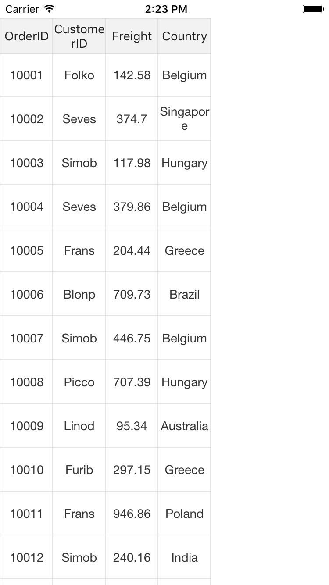
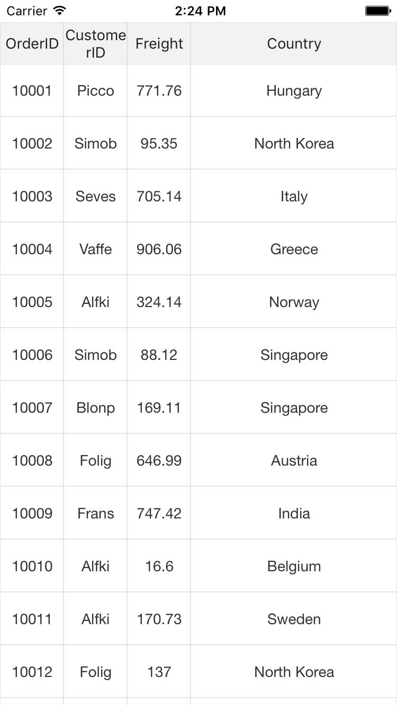
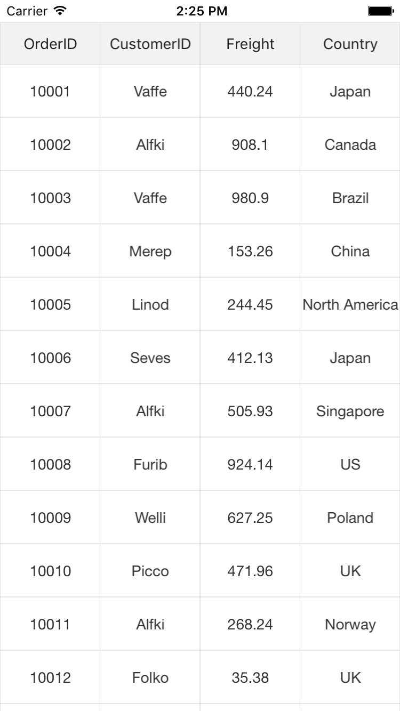
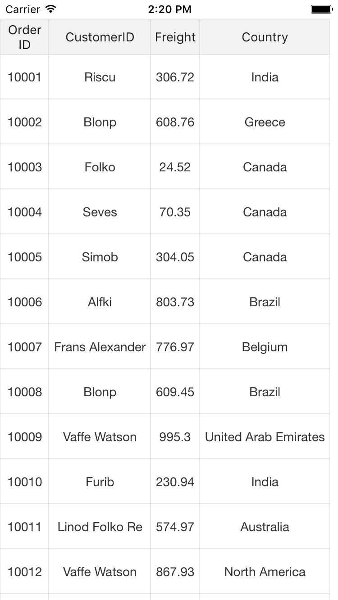

# Column Sizer

SfDataGrid allows you to apply `ColumnSizer` for the `GridColumns` by setting the [SfDataGrid.ColumnSizer](http://help.syncfusion.com/cr/cref_files/xamarin/sfdatagrid/Syncfusion.SfDataGrid.XForms~Syncfusion.SfDataGrid.XForms.SfDataGrid~ColumnSizer.html) property. 

The following code example illustrates how to apply `ColumnSizer` in SfDataGrid.



<sfgrid:SfDataGrid x:Name="dataGrid"
                   AutoGenerateColumns="True"
                   ColumnSizer="None">


dataGrid.ColumnSizer = ColumnSizer.None;



SfDataGrid applies width for all the `GridColumns` in the [SfDataGrid.Columns](http://help.syncfusion.com/cr/cref_files/xamarin/sfdatagrid/Syncfusion.SfDataGrid.XForms~Syncfusion.SfDataGrid.XForms.SfDataGrid~Columns.html) collection based on the `SfDataGrid.ColumnSizer` property. Following are the lists of options available to set width of the columns.

* None
* LastColumnFill
* Star
* Auto

## ColumnSizer.None

No column sizing is applied when the `SfDataGrid.ColumnSizer` is set to `None`. Columns are arranged in view based on the [SfDataGrid.DefaultColumnWidth](http://help.syncfusion.com/cr/cref_files/xamarin/sfdatagrid/Syncfusion.SfDataGrid.XForms~Syncfusion.SfDataGrid.XForms.SfDataGrid~DefaultColumnWidth.html) property. This is the default value of the `SfDataGrid.ColumnSizer` property.

## ColumnSizer.LastColumnFill

When the `SfDataGrid.ColumnSizer` is `LastColumnFill`, the column width of the `GridColumns` are adjusted with respect to `SfDataGrid.DefaultColumnWidth` property. In case if the columns does not fill the entire view space, then the last column’s width fills the unoccupied space in the view.



<sfgrid:SfDataGrid x:Name="dataGrid"
                   AutoGenerateColumns="True"
                   ColumnSizer="LastColumnFill">


dataGrid.ColumnSizer = ColumnSizer.LastColumnFill;



## ColumnSizer.Star

When the `SfDataGrid.ColumnSizer` is `Star`, all the `GridColumns` are adjusted an equal column width to fit within the view. Setting `ColumnSizer` to `Star` will disable the `HorizontalScrolling` in SfDataGrid.



<sfgrid:SfDataGrid x:Name="dataGrid"
                   AutoGenerateColumns="True"
                   ColumnSizer="Star">


dataGrid.ColumnSizer = ColumnSizer.Star;



N> If any column is specified a width explicitly using the [GridColumn.Width](http://help.syncfusion.com/cr/cref_files/xamarin/sfdatagrid/Syncfusion.SfDataGrid.XForms~Syncfusion.SfDataGrid.XForms.GridColumn~Width.html) property then that column is not considered `ColumnSizing` width and skipped while applying the `ColumnSizer` for grid columns.

## ColumnSizer.Auto

When the `SfDataGrid.ColumnSizer` is `Auto`, the width of the `GridColumns` are adjusted based on the header text or cell contents.



<sfgrid:SfDataGrid x:Name="dataGrid"
                   AutoGenerateColumns="True"
                   ColumnSizer="Auto">


dataGrid.ColumnSizer = ColumnSizer.Auto;



It is possible to apply auto width for selective column(s) by setting [GridColumn.ColumnSizer](https://help.syncfusion.com/cr/cref_files/xamarin/sfdatagrid/Syncfusion.SfDataGrid.XForms~Syncfusion.SfDataGrid.XForms.GridColumn~ColumnSizer.html) property to `Auto`. In order to achieve this, `SfDataGrid.ColumnSizer` must set to `None`.

