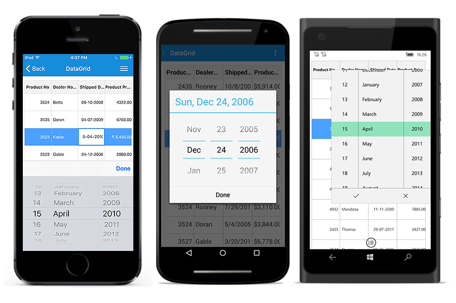
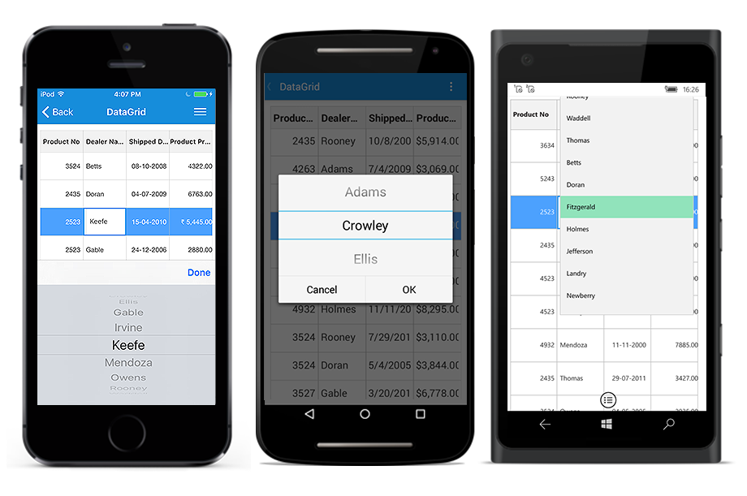
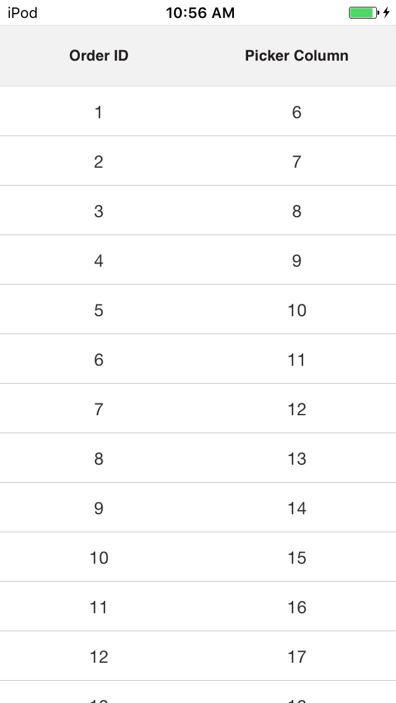
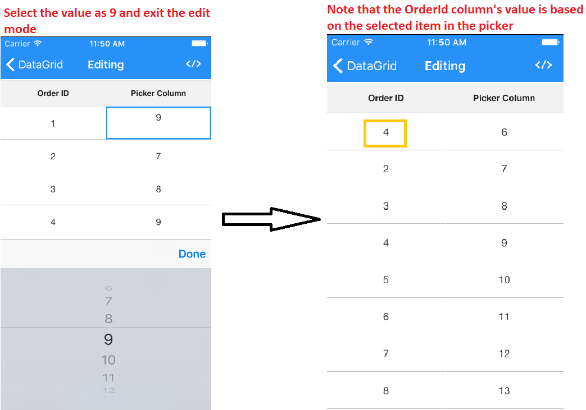

# Column Types 

SfDataGrid contains different types of column each with its own functionalities as implied by its name. You can use any column based on your requirements. 

The below table describes you the types of column and its purpose of usage in SfDataGrid.

<table>
<tr>
<th>Column Type</th>
<th>Description</th>
</tr>
<tr>
<td>GridColumn</td>
<td>Abstract class. Base column type of all the columns in the SfDataGrid.</td>
</tr>
<tr>
<td>GridTextColumn</td>
<td>To be used to display string or numbers in each row.</td>
</tr>
<tr>
<td>GridSwitchColumn</td>
<td>To be used when you want to display switch in each row.</td>
</tr>
<tr>
<td>GridImageColumn</td>
<td>To be used when you want to display an image in each row.</td>
</tr>
<tr>
<td>GridTemplateColumn</td>
<td>To be used when you want to customize your column based on your requirements.</td>
</tr>
<tr>
<td>GridNumericColumn</td>
<td>To be used when you want to display a numeric data.</td>
</tr>
<tr>
<td>GridPickerColumn</td>
<td>To be used when you want to display the IEnumerable data using Picker.</td>
</tr>
<tr>
<td>GridDateTimeColumn</td>
<td>To be used when you want to display the date time value.</td>
</tr>
</table>

## GridColumn

GridColumn is the base column type of all the columns in the SfDataGrid, hence GridColumn properties are used by all the columns. The following sub-sections explains you about the properties in the GridColumn and the customizations that can be done using those properties for all the types of GridColumns available in SfDataGrid.

### Binding options

The display content of GridColumn is determined from [GridColumn.DisplayBinding](http://help.syncfusion.com/cr/cref_files/xamarin/sfdatagrid/Syncfusion.SfDataGrid.XForms~Syncfusion.SfDataGrid.XForms.GridColumn~DisplayBinding.html) property. It gets and sets the binding that associates the GridColumn with a property in the data source. 

#### MappingName

[GridColumn.MappingName](http://help.syncfusion.com/cr/cref_files/xamarin/sfdatagrid/Syncfusion.SfDataGrid.XForms~Syncfusion.SfDataGrid.XForms.GridColumn~MappingName.html) associates the GridColumn with a property available in the underlying data source. While setting MappingName alone to the SfDataGrid the `GridColumn.DisplayBinding` will be automatically generated based on the MappingName. Data Manipulation operations like sorting, filtering, grouping will be done based on the MappingName property.

If you want to format the cell content, you can use the Converter of the `GridColumn.DisplayBinding` to customize the cell content. The following code example appends the text “Customer” along with the Customer ID.


<ContentPage.Resources>
    <ResourceDictionary>
        <local:DisplayBindingConverter x:Key="displayBindingConverter" />
    </ResourceDictionary>
</ContentPage.Resources> 

<syncfusion:SfDataGrid x:Name="dataGrid"
                       ItemsSource="{Binding OrdersInfo}">

    <syncfusion:SfDataGrid.Columns>
        <syncfusion:GridTextColumn MappingName="CustomerID" 
                                   DisplayBinding="{Binding CustomerID, 
                                   Converter={StaticResource displayBindingConverter}}" />
    </syncfusion:SfDataGrid.Columns>
</syncfusion:SfDataGrid> 



public class DisplayBindingConverter : IValueConverter
{
    public object Convert(object value, Type targetType, object parameter, CultureInfo culture)
    {
        if (value != null)
            return "Customer:" + value.ToString();
        return null;
    }

    public object ConvertBack(object value, Type targetType, object parameter, CultureInfo culture)
    {
        return value.ToString().Substring(9);
    }
}


### Header customizations

#### HeaderCellTextSize

The FontSize for the content of header cell in the GridColumn can be customized by using the [GridColumn.HeaderCellTextSize](http://help.syncfusion.com/cr/cref_files/xamarin/sfdatagrid/Syncfusion.SfDataGrid.XForms~Syncfusion.SfDataGrid.XForms.GridColumn~HeaderCellTextSize.html) property. The default font size of the header cells in SfDataGrid is 14.

#### HeaderFont

The FontFamily for the content of header cell in the GridColumn can be customized by using the [GridColumn.HeaderFont](http://help.syncfusion.com/cr/cref_files/xamarin/sfdatagrid/Syncfusion.SfDataGrid.XForms~Syncfusion.SfDataGrid.XForms.GridColumn~HeaderFont.html) property. The default value font used in SfDataGrid is `HelveticaNeue LT 55 Roman`.

#### HeaderFontAttribute

The FontAttribute for the content of the header cell in the GridColumn can be customized by using the [GridColumn.HeaderFontAttribute](http://help.syncfusion.com/cr/cref_files/xamarin/sfdatagrid/Syncfusion.SfDataGrid.XForms~Syncfusion.SfDataGrid.XForms.GridColumn~HeaderFontAttribute.html) property. The default value of this property is `None` and you can customize this to `Bold` or `Italic`.

#### HeaderText

SfDataGrid allows you to customize the display content of the header cell using the [GridColumn.HeaderText](http://help.syncfusion.com/cr/cref_files/xamarin/sfdatagrid/Syncfusion.SfDataGrid.XForms~Syncfusion.SfDataGrid.XForms.GridColumn~HeaderText.html) property. It specifies the text displayed in the column header. If header text is not defined, then `GridColumn.MappingName` will be assigned to the header text and will be displayed as column header.

#### HeaderTextAlignment

You can get or set the TextAlignment of the header cell in the GridColumn by using the [GridColumn.HeaderTextAlignment](http://help.syncfusion.com/cr/cref_files/xamarin/sfdatagrid/Syncfusion.SfDataGrid.XForms~Syncfusion.SfDataGrid.XForms.GridColumn~HeaderTextAlignment.html) property. The default alignment for the header cells in SfDataGrid is `Center` and you can customize this to `Start` or `End`.

#### HeaderTemplate

SfDataGrid allows you to customize the header cell based on your requirement by using the [GridColumn.HeaderTemplate](http://help.syncfusion.com/cr/cref_files/xamarin/sfdatagrid/Syncfusion.SfDataGrid.XForms~Syncfusion.SfDataGrid.XForms.GridColumn~HeaderTemplate.html) property. The following code example shows you how to customize the header cell by loading a template in the header cell.


<syncfusion:SfDataGrid.Columns>
    <syncfusion:GridTextColumn MappingName="OrderID">
        <syncfusion:GridTextColumn.HeaderTemplate>
            <DataTemplate>
                <Label x:Name="OrderID" Text="OrderID" TextColor="Black" 
                       BackgroundColor="Yellow" YAlign="Center" />
            </DataTemplate>
        </syncfusion:GridTextColumn.HeaderTemplate>
    </syncfusion:GridTextColumn>
</syncfusion:SfDataGrid.Columns> 


### Column Width

SfDataGrid allows you to customize the width of each GridColumn in the [SfDataGrid.Columns](http://help.syncfusion.com/cr/cref_files/xamarin/sfdatagrid/Syncfusion.SfDataGrid.XForms~Syncfusion.SfDataGrid.XForms.SfDataGrid~Columns.html) collection. You can customize the column width by using the [GridColumn.Width](http://help.syncfusion.com/cr/cref_files/xamarin/sfdatagrid/Syncfusion.SfDataGrid.XForms~Syncfusion.SfDataGrid.XForms.GridColumn~Width.html) property. By default this property will not be assigned any value and the GridColumn renders in view based on the value of [DefaultColumnWidth](http://help.syncfusion.com/cr/cref_files/xamarin/sfdatagrid/Syncfusion.SfDataGrid.XForms~Syncfusion.SfDataGrid.XForms.SfDataGrid~DefaultColumnWidth.html) property in SfDataGrid.

Customizing the width for auto generated columns in both XAML and code behind as shown below.



<sfgrid:SfDataGrid x:Name="dataGrid"
                   AutoGenerateColumns="false"
    <sfgrid:SfDataGrid.Columns x:TypeArguments="sfgrid:Columns">
      <sfgrid:GridTextColumn MappingName="OrderID"
                             Width="100"/>
      </sfgrid:SfDataGrid.Columns > 
  </sfgrid:SfDataGrid>


void dataGrid_AutoGeneratingColumn(object sender, AutoGeneratingColumnArgs e){
if (e.Column.MappingName == "OrderID") {
    e.Column.Width = 100;
    }
}



### IsHidden 
SfDataGrid allows you to hide a particular column using [GridColumn.IsHidden](http://help.syncfusion.com/cr/cref_files/xamarin/sfdatagrid/Syncfusion.SfDataGrid.XForms~Syncfusion.SfDataGrid.XForms.GridColumn~IsHidden.html) property. The default value of the IsHidden property is `False`. 

N> You can set the `IsHidden` property as `True` instead of setting column width as  `0`.

The following code example shows you how to hide the column using IsHidden property.

    
    <syncfusion:GridTextColumn MappingName="OrderID" IsHidden="True"/>


dataGrid.Columns.Add(new GridTextColumn() { MappingName = "OrderID", IsHidden = true});



## GridTextColumn

GridTextColumn is derived from GridColumn and hence it inherits all the properties of GridColumn. It is used to host the textual content in the record cells. Each of the record cells in GridTextColumn displays the text based on the `MappingName` that associates the column with a property in the data source.

The following code example creates GridTextColumn.



<syncfusion:GridTextColumn MappingName="OrderID" /> 


dataGrid.Columns.Add(new GridTextColumn() { MappingName = "OrderID" });



The below topics explain you about the customizations that can be done in the GridTextColumn in SfDataGrid.

### Formatting

SfDataGrid allows you to format the value displayed in the GridColumn by using the [GridColumn.Format](http://help.syncfusion.com/cr/cref_files/xamarin/sfdatagrid/Syncfusion.SfDataGrid.XForms~Syncfusion.SfDataGrid.XForms.GridColumn~Format.html) property. Assign the FormatString to this property based on the type of the property the GridColumn is associated with to format the value. You can use different [StringFormats](http://msdn.microsoft.com/en-us/library/fbxft59x(v=vs.90).aspx) to customize the value displayed in the record cells.

The following code example shows you how to apply formatting for a GridTextColumn.



<syncfusion:SfDataGrid.Columns>
    <syncfusion:GridTextColumn MappingName="Freight" Format="C" />
    <syncfusion:GridTextColumn MappingName="ShippingDate" Format="dd/MM/yyyy" />
</syncfusion:SfDataGrid.Columns> 


dataGrid.Columns.Add (new GridTextColumn () { 
    MappingName = "Freight",
    Format = "C"
});

dataGrid.Columns.Add (new GridTextColumn () { 
    MappingName = "ShippingDate",
    Format = "dd/MM/yyyy"
});



N> For AutoGenerated columns the Formatting can be applied by handling the [SfDataGrid.AutoGeneratingColumn](http://help.syncfusion.com/cr/cref_files/xamarin/sfdatagrid/Syncfusion.SfDataGrid.XForms~Syncfusion.SfDataGrid.XForms.SfDataGrid~AutoGeneratingColumn_EV.html) event.

#### Formatting GridTextColumn with different Culture

SfDataGrid allows you to apply different [CultureInfo](https://developer.xamarin.com/api/type/System.Globalization.CultureInfo/) for the GridColumns by using the [GridColumn.CultureInfo](http://help.syncfusion.com/cr/cref_files/xamarin/sfdatagrid/Syncfusion.SfDataGrid.XForms~Syncfusion.SfDataGrid.XForms.GridColumn~CultureInfo.html) property. Assign the FormatString to this property based on the type of the property the column is associated with to format the value. You can use different `StringFormats` to customize the value displayed in the record cells.

The following code example shows you how to apply different cultures for the GridColumns.


dataGrid.Columns.Add (new GridTextColumn () { 
    MappingName = "Freight",
    Format = "C",
    CultureInfo = new CultureInfo("en-US")
});

dataGrid.Columns.Add (new GridTextColumn () { 
    MappingName = "OrderID",
    Format = "C",
    CultureInfo = new CultureInfo("en-GB")
}); 


For auto generated columns this is achievable by handling the `SfDataGrid.AutoGeneratingColumn` event. The following code example shows you how to apply different cultures for auto generated GridColumns.


void GridAutoGeneratingColumns(object sender, AutoGeneratingColumnArgs e)
{
    if (e.Column.MappingName == "Freight") {
        e.Column.Format = "C";
        e.Column.CultureInfo = new CultureInfo ("en-US");
    } else if (e.Column.MappingName == "OrderID") {
        e.Column.Format = "C";
        e.Column.CultureInfo = new CultureInfo ("en-GB");
    }
} 


### Font and Alignment options

#### CellTextSize

The FontSize for the content of record cells in GridColumn can be customized by using the [GridColumn.CellTextSize](http://help.syncfusion.com/cr/cref_files/xamarin/sfdatagrid/Syncfusion.SfDataGrid.XForms~Syncfusion.SfDataGrid.XForms.GridColumn~CellTextSize.html) property. The default font size of the record cells in SfDataGrid is 14.

#### RecordFont

The FontFamily for the content of header cell in the GridColumn can be customized by using the [GridColumn.RecordFont](http://help.syncfusion.com/cr/cref_files/xamarin/sfdatagrid/Syncfusion.SfDataGrid.XForms~Syncfusion.SfDataGrid.XForms.GridColumn~RecordFont.html) property. The default value font used in SfDataGrid is `Helvetica Neue`.

#### TextAlignment

You can get or set the TextAlignment of the header cell in the GridColumn by using the [GridColumn.TextAlignment](http://help.syncfusion.com/cr/cref_files/xamarin/sfdatagrid/Syncfusion.SfDataGrid.XForms~Syncfusion.SfDataGrid.XForms.GridColumn~TextAlignment.html) property. The default alignment for the record cells in SfDataGrid is `Center` and you can customize this to `Start` or `End`.

#### LineBreakMode

You can wrap the record cell value when the text for the record cells exceeds the content area by setting [GridColumn.LineBreakMode](http://help.syncfusion.com/cr/cref_files/xamarin/sfdatagrid/Syncfusion.SfDataGrid.XForms~Syncfusion.SfDataGrid.XForms.GridColumn~LineBreakMode.html) as `LineBreakMode.WordWrap` 

The following code example shows how to use GridSwitchColumn.
 


dataGrid.Columns[0].LineBreakMode=LineBreakMode.WordWrap; 



## GridSwitchColumn

GridSwitchColumn is derived from GridColumn, and hence it inherits all the properties of GridColumn. It loads a switch as a content of record cells in the column and responds to value changes in it. You can change the underlying data source that toggles the values shown in the switch. The SfDataGrid automatically generates GridSwitchColumn if the property in the underlying collection of type bool.

The following code example shows how to use GridSwitchColumn.
 

<ContentPage.BindingContext>
    <local:ViewModel />
</ContentPage.BindingContext>

<sfGrid:SfDataGrid x:Name="dataGrid"
                   AutoGenerateColumns="True"
                   ItemsSource="{Binding OrdersInfo}">
    <sfGrid:SfDataGrid.Columns>
        <sfGrid:GridSwitchColumn MappingName="IsClosed" />
    </sfGrid:SfDataGrid.Columns>
</sfGrid:SfDataGrid> 



// Model class
public class Model
{
    private bool _isClosed;

    public bool IsClosed
    {
        get { return _isClosed; }
        set
        {
            this._isClosed = value;
        }
    }
}

// ViewModel class
public class ViewModel
{
    public ViewModel()
    {
        GetOrderDetails(50);
    }

    #region ItemsSource

    private ObservableCollection<OrderInfo> ordersInfo;

    public ObservableCollection<OrderInfo> OrdersInfo
    {
        get { return ordersInfo; }
        set { this.ordersInfo = value; }
    }

    #endregion

    #region ItemSource Generator

    public void GetOrderDetails(int count)
    {
        var orderDetails = new ObservableCollection<OrderInfo>();
        for (int i = 1; i <= count; i++)
        {
            var order = new OrderInfo()
            {
                IsClosed = (i % 2) == 0 ? true : false
            };
            orderDetails.Add(order);
        }
        ordersInfo = orderDetails;
    }

    #endregion
} 


## GridImageColumn

GridImageColumn is derived from GridColumn, and hence it inherits all the properties of GridColumn. It displays images as cell content of a column. To create GridImageColumn in SfDataGrid the property corresponding to the column in the underlying collection must be of type `ImageSource`.

In GridImageColumn, it is possible to load images in any of the below four ways,

* **FromFile** - Required to specify the path of the file
* **FromResource** - Required to set image as embedded resource
* **FromStream** -  Load image from byte[] array
* **FromURI** -  Get image from a web service or website

The following code example shows how to load image(embedded resource) in GridImageColumn.
 

<ContentPage.BindingContext>
    <local:ViewModel />
</ContentPage.BindingContext>

<sfGrid:SfDataGrid x:Name="dataGrid"
                   AutoGenerateColumns="True"
                   ItemsSource="{Binding OrdersInfo}">
    <sfGrid:SfDataGrid.Columns>
        <sfGrid:GridImageColumn MappingName="DealerImage" />
    </sfGrid:SfDataGrid.Columns>
</sfGrid:SfDataGrid>



// Model class
public class Model
{
    private ImageSource _dealer;

    public ImageSource DealerImage
    {
        get { return _dealer; }
        set
        {
            this._dealer = value;
        }
    }
}

// ViewModel class
public class ViewModel
{
    public ViewModel()
    {
        GetOrderDetails(50);
    }

    #region ItemsSource

    private ObservableCollection<OrderInfo> ordersInfo;

    public ObservableCollection<OrderInfo> OrdersInfo
    {
        get { return ordersInfo; }
        set { this.ordersInfo = value; }
    }

    #endregion

    #region ItemSource Generator

    public void GetOrderDetails(int count)
    {
        var orderDetails = new ObservableCollection<OrderInfo>();
        for (int i = 1; i <= count; i++)
        {
            var order = new OrderInfo()
            {
                DealerImage = ImageSource.FromResource("DataGridDemo.Buchanan.png") // Need to give the image path properly. Here, DataGridDemo denotes the project name and Buchanan denotes the image name.
            };
            orderDetails.Add(order);
        }
        ordersInfo = orderDetails;
    }

    #endregion
}


## GridTemplateColumn

GridTemplateColumn is derived from GridColumn, and hence it inherits all the properties of GridColumn. It allows you to extend the functionality of GridColumn with your own view by creating the `CellTemplate` of GridTemplateColumn.

The below table provides the list of properties in GridTemplateColumn.

<table>
<tr>
<th>Property</th>
<th>Type</th>
<th>Description</th>
<th>Default Value</th>
</tr>
<tr>
<td>CellTemplate</td>
<td>DataTemplate</td>
<td>Gets or sets the template that is used to display the contents of the record cells.</td>
<td>Null</td>
</tr>
</table>

### CellTemplate

The following code example shows templating of GridTemplateColumn. Underlying record will be the BindingContext for the `CellTemplate`.


<syncfusion:GridTemplateColumn MappingName="CustomerID">
    <syncfusion:GridTemplateColumn.CellTemplate>
        <DataTemplate>
            <Label Text="{Binding CustomerID}" TextColor="Black" 
                   XAlign="Center" YAlign="Center" />
        </DataTemplate>
    </syncfusion:GridTemplateColumn.CellTemplate>
</syncfusion:GridTemplateColumn> 


The following code example illustrates how template column can be used to load a stock cell inside it.


<ContentPage.Resources>
    <ResourceDictionary>
        <local:ImageConverter x:Key="imageConverter" /> 
    </ResourceDictionary>
</ContentPage.Resources>

<ContentPage.ContentView>
    <syncfusion:SfDataGrid x:Name="dataGrid"
                           ColumnSizer="Star">

        <syncfusion:SfDataGrid.Columns>
            <syncfusion:GridTemplateColumn HeaderText="Stock Change"
                                           MappingName="StockChange">
                <syncfusion:GridTemplateColumn.CellTemplate>
                    <DataTemplate>
                        <Grid>
                            <Grid.ColumnDefinitions>
                                <ColumnDefinition Width="Auto" />
                                <ColumnDefinition Width="*" />
                            </Grid.ColumnDefinitions>
                            <Image Grid.Column="0"
                                   Source="{Binding StockChange,
                                   Converter={StaticResource imageConverter}}" />
                            <Label x:Name="changeValue" Grid.Column="1"
                                   Text="{Binding StockChange}" TextColor="Black"
                                   XAlign="Center" YAlign="Center">
                            </Label>
                        </Grid>
                    </DataTemplate>
                </syncfusion:GridTemplateColumn.CellTemplate>
            </syncfusion:GridTemplateColumn>
        </syncfusion:SfDataGrid.Columns>
    </syncfusion:SfDataGrid>
</ContentPage.ContentView>


In order to get the above code example working, you need to write a converter to load the images inside GridCell based on the CellValue. The images that has to be loaded inside the GridCell must be added as EmbeddedResource.

The following code example shows you converter code for loading the images in a template column.


public class ImageConverter:IValueConverter
{
    public object Convert (object value, Type targetType, object parameter, CultureInfo culture)
    {
        var data = value as double?;
        if (data != null && data > 0)
            return ImageSource.FromResource("DataGridSample.Icons.Green.png");
        else
            return ImageSource.FromResource("DataGridSample.Icons.Red.png");
    }

    public object ConvertBack (object value, Type targetType, object parameter, CultureInfo culture)
    {
        throw new NotImplementedException ();
    }
} 


The following screenshot shows the different types of columns in SfDataGrid

## Row Header 

RowHeader is a special column which is placed as first cell of each row and it will always be frozen. To enable the row header in SfDataGrid, you need to set the `SfDataGrid.ShowRowHeader` as `true`.

Further, SfDataGrid allows you to customize the row header width using the `SfDataGrid.RowHeaderWidth property`. The default value of `SfDataGrid.RowHeaderWidth` is 20.

The below code example illustrates how to enable and customize the row header in SfDataGrid.



<sfgrid:SfDataGrid x:Name="dataGrid"
                   ColumnSizer="Star"
                   ShowRowHeader="True"
                   RowHeaderWidth="50"
                   ItemsSource="{Binding OrdersInfo}">
</sfgrid:SfDataGrid>




dataGrid.ShowRowHeader = true;
dataGrid.RowHeaderWidth = 50;




## GridDateTimeColumn

The [SfDatarGrid.GridDateTimeColumn](https://help.syncfusion.com/cr/cref_files/xamarin/sfdatagrid/Syncfusion.SfDataGrid.XForms~Syncfusion.SfDataGrid.XForms.GridDateTimeColumn.html) is derived from `SfDataGrid.GridColumn` thereby inheriting all the properties of `SfDataGrid.GridColumn`. It displays the date information as the content of a column. To create `SfDatarGrid.GridDateTimeColumn` in SfDataGrid, the property corresponding to the column in the underlying collection must be of type DateTime. You can enable or disable editing for the particular column by setting the [GridColumn.AllowEditing](https://help.syncfusion.com/cr/cref_files/xamarin/sfdatagrid/Syncfusion.SfDataGrid.XForms~Syncfusion.SfDataGrid.XForms.GridColumn~AllowEditing.html) property to true or false. In the editing mode it displays [SfDatePicker](https://help.syncfusion.com/cr/cref_files/xamarin/sfdatagrid/Syncfusion.SfDataGrid.XForms~Syncfusion.SfDataGrid.XForms.Renderers.SfDatePicker.html) element which is derived from the [Xamarin.Forms.DatePicker](https://developer.xamarin.com/api/type/Xamarin.Forms.DatePicker/). The `SfDatePicker` enables you to scroll through a list of dates between the [GridDateTimeColumn.MinimumDate](https://help.syncfusion.com/cr/cref_files/xamarin/sfdatagrid/Syncfusion.SfDataGrid.XForms~Syncfusion.SfDataGrid.XForms.GridDateTimeColumn~MinimumDate.html) and [GridDateTimeColumn.MaximumDate](https://help.syncfusion.com/cr/cref_files/xamarin/sfdatagrid/Syncfusion.SfDataGrid.XForms~Syncfusion.SfDataGrid.XForms.GridDateTimeColumn~MaximumDate.html) and select one from it.



<ContentPage.BindingContext>
    <local:ViewModel />
</ContentPage.BindingContext>

<sfGrid:SfDataGrid x:Name="dataGrid"                   
                   ItemsSource="{Binding OrdersInfo}">
    <sfGrid:SfDataGrid.Columns>
        <sfgrid:GridDateTimeColumn Format="d"
                                   HeaderText="Shipped Date"
                                   MappingName="ShippedDate" />
    </sfGrid:SfDataGrid.Columns>
</sfGrid:SfDataGrid>



dataGrid = new SfDataGrid();
GridDateTimeColumn dateColumn = new GridDateTimeColumn()
{
    Format = "d",
    HeaderText = "Shipped Date",
    MappingName = "ShippedDate"
};
data.Colum.Add(dateColumn);




// Model class
public class Model
{
    private DateTime shippedDate;

    public DateTime ShippedDate
    {
        get { return shippedDate; }
        set
        {
            shippedDate = value;
            RaisePropertyChanged("ShippedDate");
        }
    }
}

// ViewModel class
public class ViewModel
{
    private List<DateTime> OrderedDates;

    public ViewModel()
    {
        GetOrderDetails(50);
    }

    #region ItemsSource

    private ObservableCollection<OrderInfo> ordersInfo;

    public ObservableCollection<OrderInfo> OrdersInfo
    {
        get { return ordersInfo; }
        set { this.ordersInfo = value; }
    }

    #endregion

    #region ItemSource Generator

     private List<DateTime> GetDateBetween(int startYear, int endYear, int count)
     {
        List<DateTime> date = new List<DateTime>();
        Random d = new Random(1);
        Random m = new Random(2);
        Random y = new Random(startYear);
        for (int i = 0; i < count; i++)
        {
            int year = y.Next(startYear, endYear);
            int month = m.Next(3, 13);
            int day = d.Next(1, 31);

            date.Add(new DateTime(year, month, day));
        }
        return date;
     }

    public void GetOrderDetails(int count)
    {
        var orderDetails= new ObservableCollection<OrderInfo>();
        this.OrderedDates = GetDateBetween(2000, 2014, count);
        for (int i = 1; i <= count; i++)
        {
            var order = new OrderInfo()
            {
                ShippedDate = this.OrderedDates[i - 1],
            };
            orderDetails.Add(order);
        }
        ordersInfo = orderDetails;
    }

    #endregion
}


## GridPickerColumn

The [GridPickerColumn](https://help.syncfusion.com/cr/cref_files/xamarin/sfdatagrid/Syncfusion.SfDataGrid.XForms~Syncfusion.SfDataGrid.XForms.GridPickerColumn.html) is derived from `SfDataGrid.GridColumn` thereby inheriting all the properties of `SfDataGrid.GridColumn`. It displays a list of items in the form of a picker as the content of a column. You can enable or disable editing for the particular column by setting the GridColumn.AllowEditing property to true or false. In the editing mode it displays [SfPicker](https://help.syncfusion.com/cr/cref_files/xamarin/sfdatagrid/Syncfusion.SfDataGrid.XForms~Syncfusion.SfDataGrid.XForms.Renderers.SfPicker.html) element which is derived from the [Xamarin.Forms.Picker](https://developer.xamarin.com/api/type/Xamarin.Forms.Picker/). The data source to Picker can be set by using [GridPickerColumn.ItemsSource](https://help.syncfusion.com/cr/cref_files/xamarin/sfdatagrid/Syncfusion.SfDataGrid.XForms~Syncfusion.SfDataGrid.XForms.GridPickerColumn~ItemsSource.html) property. The picker column can be populated with data by the following ways.

* Collection of primitive types
* Collection of user defined types (Custom objects)

### Collection of primitive types

You can create a `GridPickerColumn` and set its `ItemsSource` property to a simple collection to display the collection items in the picker drop down.
The following code example shows you how to load the `GridPickerColumn` with a simple string collection.



<ContentPage.BindingContext>
    <local:ViewModel x:Name="viewModel"/>
</ContentPage.BindingContext>

<sfGrid:SfDataGrid x:Name="dataGrid"                   
                   ItemsSource="{Binding OrdersInfo}">
    <sfGrid:SfDataGrid.Columns>
        <sfgrid:GridPickerColumn BindingContext="{x:Reference viewModel}"
                                 HeaderText="Dealer Name"                                 
                                 ItemsSource="{Binding CustomerNames}"                                 
                                 MappingName="DealerName"/>
    </sfGrid:SfDataGrid.Columns>
</sfGrid:SfDataGrid>



dataGrid = new SfDataGrid();
GridPickerColumn pickerColumn = new GridPickerColumn()
{
    BindingContext = viewModel;
    ItemsSource = viewModel.CustomerNames;
    HeaderText = "Dealer Name",
    MappingName = "DealerName"
};
data.Colum.Add(pickerColumn);




// ViewModel class
public class ViewModel
{
    public ObservableCollection<string> CustomerNames { get; set; }

    public ViewModel()
    {
        this.CustomerNames = Customers.ToObservableCollection();
    }

    internal string[] Customers = new string[] {"Adams","Crowley","Ellis","Gable","Irvine","Keefe","Mendoza","Owens","Rooney","Waddell",};
    
}


### Collection of User Defined Types

You can create a `SfDataGrid.GridPickerColumn` and set its `ItemsSource` property to a user-defined collection to display a list of user defined items in the picker drop down. Initially the picker column will be displayed with the values from the [GridColumn.MappingName](https://help.syncfusion.com/cr/cref_files/xamarin/sfdatagrid/Syncfusion.SfDataGrid.XForms~Syncfusion.SfDataGrid.XForms.GridColumn~MappingName.html) property of the column if the [DisplayMemberPath](https://help.syncfusion.com/cr/cref_files/xamarin/sfdatagrid/Syncfusion.SfDataGrid.XForms~Syncfusion.SfDataGrid.XForms.GridPickerColumn~DisplayMemberPath.html) and [ValueMemberPath](https://help.syncfusion.com/cr/cref_files/xamarin/sfdatagrid/Syncfusion.SfDataGrid.XForms~Syncfusion.SfDataGrid.XForms.GridPickerColumn~ValueMemberPath.html) are not set.

#### DisplayMemberPath
 
 Displays a value by comparing the values of the properties set as `GridColumn.MappingName` and `ValueMemberPath` in their respective underlying collections. If the `ValueMeberPath` property's values contains the `MappingName` property's current value, then its corresponding `DisplayMemberPath` property's value is displayed in the `GridCell`. Else the `GridCell` appears blank. However in the edit mode the values of the `DisplayMemberPath` property are dispayed as the picker items.
 
#### ValueMemberPath
 
 Once editing is ended the column having the `MappingName` equal to the `ValueMeberPath` has its data changed to the corresponding `ValueMemberPath` value for the selected `DisplayMemberPath` value in the picker. 

### Customization of picker dropdown values

The following code example shows you how to customize the picker data using `DisplayMemberPath` and `ValueMemberPath`



<ContentPage.BindingContext>
    <local:ViewModel x:Name="viewModel"/>
</ContentPage.BindingContext>

<sfGrid:SfDataGrid x:Name="dataGrid"                   
                   ItemsSource="{Binding OrdersInfo}">
    <sfGrid:SfDataGrid.Columns>

        <sfgrid:GridTextColumn   HeaderText="Order ID"                                 
                                 MappingName="OrderID"/>

        <sfgrid:GridPickerColumn BindingContext="{x:Reference viewModel}"
                                 HeaderText="Picker Column"
                                 DisplayMemberPath="EmployeeID"
                                 ValueMemberPath="OrderID"                         
                                 ItemsSource="{Binding PickerInfo}"                                 
                                 MappingName="OrderID"/>
    </sfGrid:SfDataGrid.Columns>
</sfGrid:SfDataGrid>




sfGrid = new SfDataGrid(context);
viewModel = new ViewModel();
sfGrid.ItemsSource = viewmodel.OrdersInfo;

GridTextColumn orderIDColumn = new GridTextColumn();
orderIDColumn.MappingName = "OrderID";
orderIDColumn.HeaderText = "Order ID";

GridPickerColumn pickerColumn = new GridPickerColumn();
pickerColumn.MappingName = "OrderID";
pickerColumn.HeaderText = "Picker Column";
pickerColumn.DisplayMemberPath = "EmployeeID";
pickerColumn.ValueMemberPath = "OrderID";
pickerColumn.ItemsSource = viewmodel.PickerInfo;

sfGrid.Columns.Add(orderIDColumn);
sfGrid.Columns.Add(pickerColumn);

// ViewModel class
public class ViewModel
{
    public class ViewModel :INotifyPropertyChanged
	{
		public ViewModel ()
		{
			SetRowstoGenerate (100);
            this.PickerInfo = OrdersInfo.ToList();
		}

		#region ItemsSource

        private OrderInfoRepository order;

		private ObservableCollection<OrderInfo> ordersInfo;

		public ObservableCollection<OrderInfo> OrdersInfo 
        {
			get { return ordersInfo; }
			set { this.ordersInfo = value; RaisePropertyChanged("OrdersInfo"); }
		}

        public List<OrderInfo> PickerInfo 
        {
			get;
			set;
		}

		#endregion

		#region ItemSource Generator

		public void SetRowstoGenerate (int count)
		{
			order = new OrderInfoRepository ();
			ordersInfo = order.GetOrderDetails (count);
		}

		#endregion

        public ObservableCollection<OrderInfo> GetOrderDetails(int count)
		{
            ObservableCollection<OrderInfo> orderDetails = new ObservableCollection<OrderInfo> ();

			for (int i = 1; i <= count; i++)
			{
				var order = new OrderInfo ()
				{
					OrderID = i,
                    EmployeeID = i+5,
				};
				orderDetails.Add (order);
			}
			return orderDetails;
		}

        #region INotifyPropertyChanged implementation

        public event PropertyChangedEventHandler PropertyChanged;

        private void RaisePropertyChanged(String name)
        {
            if (PropertyChanged != null)
                this.PropertyChanged(this, new PropertyChangedEventArgs(name));
        }

        #endregion
    }
}



The following screenshots expalins the above code and shows the working of the `PickerColumn` with `ValueMemberPath` and `DisplayMemberPath` properties set.

Here in the above code example underlying collection has 2 properties (OrderID,EmployeeID). We have created a `GridPickerColumn` with MappingName = OrderID, DisplayMemberPath = EmployeeID, ValueMemberPath = OrderID. EmployeeId has the values 6,7,8,9,10.... and OrderID has the values 1,2,3,4,5.... Initially the GridCells of the `PickerColumn` will be displayed with the values 6,7,8,9,10.... in row wise order based on the `DisplayMemberPath`.

Upon entering the edit mode at RowColumnIndex(1,1) , the Picker pop up opens and with the picker items as 6,7,8,9,10.... again based on the `DisplayMemberPath`.

When edit mode is exited by selecting a value(9) from the Picker pop up, the `GridCell` at RowColumn index (0,1) displays the corresponding OrderID value for the selected EmployeeID value which is 4. Note that the PickerColumn's `GridCell` data is not changed and only the OrderID columns data is changed to 4. 

## GridNumericColumn

The [GridNumericColumn](https://help.syncfusion.com/cr/cref_files/xamarin/sfdatagrid/Syncfusion.SfDataGrid.XForms~Syncfusion.SfDataGrid.XForms.GridNumericColumn.html) is derived from `GridColumn` thereby inheriting all the properties of `GridColumn`. It is used to display numeric data. To create `GridNumericColumn` in SfDataGrid, the property corresponding to the column in the underlying collection must be a numeric type (int, double, float etc). You can enable or disable editing for the particular column by setting the `GridColumn.AllowEditing` property to true or false. In the editing mode it displays the [SfNumericTextBox](https://help.syncfusion.com/cr/xamarin/sfnumerictextbox) element which is derived from [View](https://developer.xamarin.com/api/type/Xamarin.Forms.View/). The below code example shows how to create a `GridNumericColumn` in SfDataGrid.



<ContentPage.BindingContext>
    <local:ViewModel />
</ContentPage.BindingContext>

<sfGrid:SfDataGrid x:Name="dataGrid"                   
                   ItemsSource="{Binding OrdersInfo}">
    <sfGrid:SfDataGrid.Columns>
        <sfgrid:GridNumericColumn NumberDecimalDigits="0"
                                  HeaderText="Product No"
                                  MappingName="ProductNo"/>
    </sfGrid:SfDataGrid.Columns>
</sfGrid:SfDataGrid>



dataGrid = new SfDataGrid();
GridNumericColumn numericColumn = new GridNumericColumn()
{
    numericColumn.MappingName = "ProductNo",
    numericColumn.HeaderText = "Product No",
    numericColumn.NumberDecimalDigits = 0
};
data.Colum.Add(numericColumn);



### Number Formatting

`GridNumericColumn` allows you to format the numeric data with culture-specific information.

* [NumberDecimalDigits](https://help.syncfusion.com/cr/cref_files/xamarin/sfdatagrid/Syncfusion.SfDataGrid.XForms~Syncfusion.SfDataGrid.XForms.GridNumericColumn~NumberDecimalDigits.html) - You can change the number of decimal digits to be displayed after the decimal point using `GridNumericColumn.NumberDecimalDigits` property.

* [NumberDecimalSeparator](https://help.syncfusion.com/cr/cref_files/xamarin/sfdatagrid/Syncfusion.SfDataGrid.XForms~Syncfusion.SfDataGrid.XForms.GridNumericColumn~NumberDecimalSeparator.html) - By default, the dot (.) operator separates the decimal part of numeric value .You can use any operator as decimal separator using `GridNumericColumn.NumberDecimalSeparator` property.

* [NumberGroupSeparator](https://help.syncfusion.com/cr/cref_files/xamarin/sfdatagrid/Syncfusion.SfDataGrid.XForms~Syncfusion.SfDataGrid.XForms.GridNumericColumn~NumberGroupSeparator.html) - By default, the comma (,) separates group of digits before the decimal point. You can use any operator as group separator using `GridNumericColumn.NumberGroupSeparator` property.

* [NumberGroupSizes](https://help.syncfusion.com/cr/cref_files/xamarin/sfdatagrid/Syncfusion.SfDataGrid.XForms~Syncfusion.SfDataGrid.XForms.GridNumericColumn~NumberGroupSizes.html) - You can change the number of digits in each group before the decimal point on numeric values using `GridNumericColumn.NumberGroupSizes` property.

* [NumberNegativePatter](https://help.syncfusion.com/cr/cref_files/xamarin/sfdatagrid/Syncfusion.SfDataGrid.XForms~Syncfusion.SfDataGrid.XForms.GridNumericColumn~NumberNegativePattern.html) - You can format the pattern of negative numeric values using `GridNumericColumn.NumberNegativePattern`.

