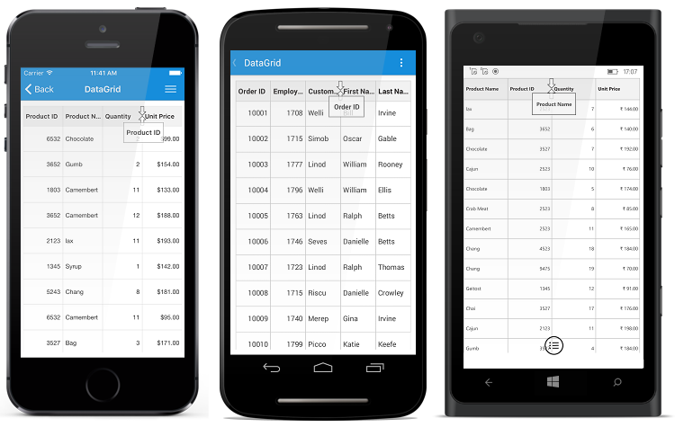

# Column Drag and Drop

SfDataGrid allows you to drag and drop a column header by setting the `SfDataGrid.AllowDraggingColumn` property to `true`. Drag view is displayed while dragging a column header. The drag and drop operation can be handled based on the requirement using `SfDataGrid QueryColumnDragging` event. 

## Column Drag and Drop Event

`QueryColumnDragging` event is fired upon starting to drag a column and will be continuously fired till the dragging ends. By handing the `SfDataGrid.QueryColumnDragging ` event you can also cancel the dragging of a particular column header.

The `QueryColumnDragging` event provides following properties in `QueryColumnDraggingEventArgs`:

* `From` - Returns the index of the column currently being dragged.
* `To` – Returns the dragging index where you try to drop the column.
* `Reason` - Returns column dragging details as `QueryColumnDraggingReason`.
* `DraggingPosition` – Returns the positions of the drag view during column drag and drop operations.
* [Cancel](https://msdn.microsoft.com/en-us/library/system.componentmodel.canceleventargs_properties(v=vs.110).aspx) – A Boolean property to cancel the event.

## How to 

### Disable dropping when dragging over particular columns

Dragging can be cancelled for particular column by handling `QueryColumnDragging` event and using conditions based on `QueryColumnDraggingReason`. Refer following code sample to disable dragging for particular column.



private void SfGrid_QueryColumnDragging(object sender, QueryColumnDraggingEventArgs e)
{
    //e.From returns the index of the dragged column.
    //e.Reason returns the dragging status of the column.
    if (e.From == 1 && e.Reason == QueryColumnDraggingReason.DragStarted)
        e.Cancel = true;
}



### Disable dropping when dragging over particular coulmns

Dropping can be disabled for particular columns while dragging a column.Refer following code sample to cancel dropping of particular column.



private void SfGrid_QueryColumnDragging(object sender, QueryColumnDraggingEventArgs e)
{
    //e.To returns the index of the current column.
    //e.Reason returns the dragging status of the column.
    if ((e.To > 5 || e.To < 10) &&
    (e.Reason == QueryColumnDraggingReason.DragEnded || e.Reason == QueryColumnDraggingReason.Dragging))
        e.Cancel = true;
} 



### Disable dropping of particular column 

Dropping can be cancelled for particular column by handling `QueryColumnDragging` event and using conditions based on `QueryColumnDraggingReason`. Refer following code sample to cancel dropping of particular column.



private void SfGrid_QueryColumnDragging(object sender, QueryColumnDraggingEventArgs e)
{
    //e.From returns the index of the dragged column.
    //e.Reason returns the dragging status of the column.
    if (e.From == 1 && e.Reason == QueryColumnDraggingReason.DragEnded)
        e.Cancel = true;
}



### Disable dropping at a particular position 

Dropping at a particular position can be cancelled by handling `QueryColumnDragging` event and using conditions based on `QueryColumnDraggingReason`. Refer following code sample to cancel dropping at particular position.



private void SfGrid_QueryColumnDragging(object sender, QueryColumnDraggingEventArgs e)
{
    //e.To returns the index of the current column.
    //e.Reason returns the dragging status of the column.
    if ((e.To == 5 || e.To == 7) && e.Reason == QueryColumnDraggingReason.DragEnded)
        e.Cancel = true;
}

