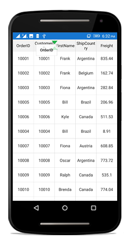

# Column Drag and Drop

SfDataGrid allows you to drag and drop a column header by setting the [SfDataGrid.AllowDraggingColumn](http://help.syncfusion.com/cr/cref_files/xamarin/sfdatagrid/Syncfusion.SfDataGrid.XForms~Syncfusion.SfDataGrid.XForms.SfDataGrid~AllowDraggingColumn.html) property to `true`. Drag view is displayed while dragging a column header. The drag and drop operation can be handled based on the requirement using [SfDataGrid.QueryColumnDragging](http://help.syncfusion.com/cr/cref_files/xamarin/sfdatagrid/Syncfusion.SfDataGrid.XForms~Syncfusion.SfDataGrid.XForms.SfDataGrid~QueryColumnDragging_EV.html) event. 

The following code example shows how to enable column drag and drop in SfDataGrid. 



<syncfusion:SfDataGrid AllowDraggingColumn="True" />


dataGrid.AllowDraggingColumn = true;



## Column drag and drop event

`QueryColumnDragging` event is fired upon starting to drag a column and will be continuously fired till the dragging ends. By handing the `SfDataGrid.QueryColumnDragging ` event you can also cancel the dragging of a particular column header.

The `QueryColumnDragging` event provides following properties in [QueryColumnDraggingEventArgs](http://help.syncfusion.com/cr/cref_files/xamarin/sfdatagrid/Syncfusion.SfDataGrid.XForms~Syncfusion.SfDataGrid.XForms.QueryColumnDraggingEventArgs.html):

* [From](http://help.syncfusion.com/cr/cref_files/xamarin/sfdatagrid/Syncfusion.SfDataGrid.XForms~Syncfusion.SfDataGrid.XForms.QueryColumnDraggingEventArgs~From.html) - Returns the index of the column currently being dragged.
* [To](http://help.syncfusion.com/cr/cref_files/xamarin/sfdatagrid/Syncfusion.SfDataGrid.XForms~Syncfusion.SfDataGrid.XForms.QueryColumnDraggingEventArgs~To.html) – Returns the dragging index where you try to drop the column.
* [Reason](http://help.syncfusion.com/cr/cref_files/xamarin/sfdatagrid/Syncfusion.SfDataGrid.XForms~Syncfusion.SfDataGrid.XForms.QueryColumnDraggingEventArgs~Reason.html) - Returns column dragging details as [QueryColumnDraggingReason](http://help.syncfusion.com/cr/cref_files/xamarin/sfdatagrid/Syncfusion.SfDataGrid.XForms~Syncfusion.SfDataGrid.XForms.QueryColumnDraggingReason.html).
* [DraggingPosition](http://help.syncfusion.com/cr/cref_files/xamarin/sfdatagrid/Syncfusion.SfDataGrid.XForms~Syncfusion.SfDataGrid.XForms.QueryColumnDraggingEventArgs~DraggingPosition.html) – Returns the positions of the drag view during column drag and drop operations.
* [Cancel](https://msdn.microsoft.com/en-us/library/system.componentmodel.canceleventargs_properties(v=vs.110).aspx) – A Boolean property to cancel the event.

## Customize column drag and drop indicators

SfDataGrid allows you to customize the column drag and drop indicators by writing a Style class overriding from DataGridStyle and assigning it to the [SfDataGrid.GridStyle](http://help.syncfusion.com/cr/cref_files/xamarin/sfdatagrid/Syncfusion.SfDataGrid.XForms~Syncfusion.SfDataGrid.XForms.SfDataGrid~GridStyle.html) property.

The following code example shows how to Customize column drag and drop indicators in SfDataGrid.



dataGrid.GridStyle = new CustomGridStyle();




// Custom style class
public class CustomGridStyle : DataGridStyle
{
    public CustomGridStyle()
    {
            
    }
    public override ImageSource GetColumnDragUpIndicator()
    {
        return ImageSource.FromResource("DataGridDemo.icons.GreenUp.png");
    }
             
    public override ImageSource GetColumnDragDownIndicator()
    {
        return ImageSource.FromResource("DataGridDemo.icons.GreenDown.png");
    }
}


## How to disable dragging for particular column?

Dragging can be canceled for particular column by handling `QueryColumnDragging` event and using conditions based on `QueryColumnDraggingReason`. Refer following code sample to disable dragging for particular column.



private void SfGrid_QueryColumnDragging(object sender, QueryColumnDraggingEventArgs e)
{
    //e.From returns the index of the dragged column.
    //e.Reason returns the dragging status of the column.
    if (e.From == 1 && e.Reason == QueryColumnDraggingReason.DragStarted)
        e.Cancel = true;
}



## How to disable dropping when dragging over particular columns?

Dropping can be disabled for particular columns while dragging a column.Refer following code sample to cancel dropping of particular column.



private void SfGrid_QueryColumnDragging(object sender, QueryColumnDraggingEventArgs e)
{
    //e.To returns the index of the current column.
    //e.Reason returns the dragging status of the column.
    if ((e.To > 5 || e.To < 10) &&
    (e.Reason == QueryColumnDraggingReason.DragEnded || e.Reason == QueryColumnDraggingReason.Dragging))
        e.Cancel = true;
} 



## How to disable dropping of particular column?

Dropping can be canceled for particular column by handling `QueryColumnDragging` event and using conditions based on `QueryColumnDraggingReason`. Refer following code sample to cancel dropping of particular column.



private void SfGrid_QueryColumnDragging(object sender, QueryColumnDraggingEventArgs e)
{
    //e.From returns the index of the dragged column.
    //e.Reason returns the dragging status of the column.
    if (e.From == 1 && e.Reason == QueryColumnDraggingReason.DragEnded)
        e.Cancel = true;
}



## How to disable dropping at a particular position? 

Dropping at a particular position can be canceled by handling `QueryColumnDragging` event and using conditions based on `QueryColumnDraggingReason`. Refer following code sample to cancel dropping at particular position.



private void SfGrid_QueryColumnDragging(object sender, QueryColumnDraggingEventArgs e)
{
    //e.To returns the index of the current column.
    //e.Reason returns the dragging status of the column.
    if ((e.To == 5 || e.To == 7) && e.Reason == QueryColumnDraggingReason.DragEnded)
        e.Cancel = true;
}

