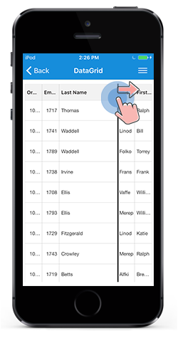
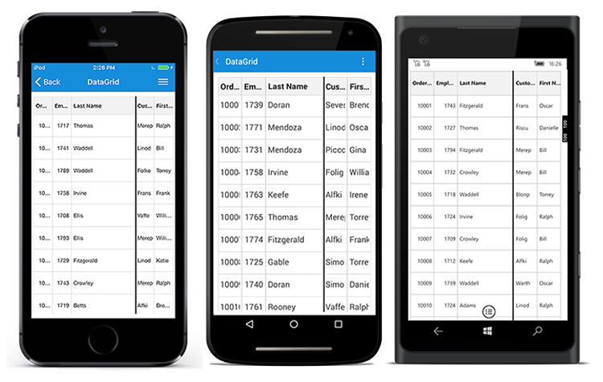
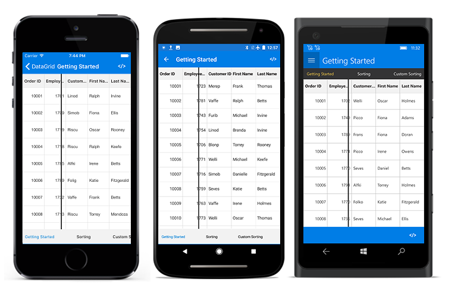

# Columns 

The SfDatagrid allows to create and add columns in the following two ways:

 * Automatic columns generation based on the underlying collection.
 * Manually defining columns in XAML or C#.

## Automatic columns generation

#Columns types

Automatic columns can be generated depends on the type of underlying model object.

#GridImageColumn: 
If underlying collection type as ImageSource, GridImageCoumn has been generated.


public ImageSource DealerImage;


#GridSwitchColumn:
If underlying collection type as bool, GridSwitchColumn has been generated.


public bool IsOnline;


#GridPickerColumn
If underlying collection type as IsEnum, GridPickerColumn has been generated.

To generate a GridPickerColumn add an enum.Generate a property for that created enum type.


// In OrderInfo.cs

public enum enumType
{
    Adams,
    Crowley,
    Ellis,
    Gable,
    Irvine
}

private enumType name;

public enumType Name
{
    get {return name;}
    set
    {
        name=value;
        RaisePropertyChanged("Name");
    }
}

// In OrderInfoRepository.cs

Name = OrderInfo.enumType.Adams,


#GridNumericColumn
If underlying collection type as int or Nullable<int>,double or Nullable<double>,float or Nullable<float> and decimal or Nullable<decimal>, GridNumericColumn has been generated.


public int EmployeeID;
public Nullable<int> CustomerID;


#GridDateTimeColumn
If underlying collection type as DateTime, GridDateTimeColumn has been generated.


public DateTime ShippingDate;


#GridTextColumn
Otherthan above all those type(example string) of underlying model obeject, GridTextColumn has been generated.


public string FirstName;


The SfDataGrid creates columns automatically based on the bindable property [SfDataGrid.AutoGenerateColumns](http://help.syncfusion.com/cr/cref_files/xamarin/sfdatagrid/Syncfusion.SfDataGrid.XForms~Syncfusion.SfDataGrid.XForms.SfDataGrid~AutoGenerateColumns.html). It decides column generation based on the [SfDataGrid.AutoGenerateColumnsMode](http://help.syncfusion.com/cr/cref_files/xamarin/sfdatagrid/Syncfusion.SfDataGrid.XForms~Syncfusion.SfDataGrid.XForms.SfDataGrid~AutoGenerateColumnsMode.html) property. 

`SfDataGrid.AutoGenerateColumnsMode` decides a way to create columns when `SfDataGrid.AutoGenerateColumns` is set to `true`. It also decides to retain grouping and sorting when the [ItemsSource](http://help.syncfusion.com/cr/cref_files/xamarin/sfdatagrid/Syncfusion.SfDataGrid.XForms~Syncfusion.SfDataGrid.XForms.SfDataGrid~ItemsSource.html) changed. 

The `SfDataGrid.AutoGenerateColumnsMode` is of [AutoGenerateColumnsMode](http://help.syncfusion.com/cr/cref_files/xamarin/sfdatagrid/Syncfusion.SfDataGrid.XForms~Syncfusion.SfDataGrid.XForms.SfDataGrid~AutoGenerateColumnsMode.html) type which has the following five options:

<table>
<tr>
<th> Modes </th>
<th> Description </th>
</tr>
<tr>
<td> {{'[None](http://help.syncfusion.com/cr/cref_files/xamarin/sfdatagrid/Syncfusion.SfDataGrid.XForms~Syncfusion.SfDataGrid.XForms.AutoGenerateColumnsMode.html)'| markdownify }} </td>
<td> Stores only the columns that are defined in SfDataGrid.Columns collection.  When changing the ItemsSource, the grouping and sorting for explicitly defined SfDataGrid.Columns alone will be retained. </td>
</tr>
<tr>
<td> {{'[Reset](http://help.syncfusion.com/cr/cref_files/xamarin/sfdatagrid/Syncfusion.SfDataGrid.XForms~Syncfusion.SfDataGrid.XForms.AutoGenerateColumnsMode.html)'| markdownify }} </td>
<td> Retains the columns defined explicitly in the application level and creates columns newly for all the other properties in a data source.  When changing the ItemsSource, the grouping and sorting for explicitly defined SfDataGrid.Columns alone will be retained. </td>
</tr>
<tr>
<td> {{'[ResetAll](http://help.syncfusion.com/cr/cref_files/xamarin/sfdatagrid/Syncfusion.SfDataGrid.XForms~Syncfusion.SfDataGrid.XForms.AutoGenerateColumnsMode.html)'| markdownify }}  </td>
<td> When changing the ItemsSource, the columns for the previous data source are cleared and the columns will be created newly for the new data source. Even when columns are explicitly defined it does not consider the defined columns and creates the column based on the underlying collection.  Further when changing the ItemsSource, the grouping and sorting for all the columns will be cleared. </td>
</tr>
<tr>
<td>  {{'[RetainOld](http://help.syncfusion.com/cr/cref_files/xamarin/sfdatagrid/Syncfusion.SfDataGrid.XForms~Syncfusion.SfDataGrid.XForms.AutoGenerateColumnsMode.html)'| markdownify }}  </td>
<td> When changing the ItemsSource, creates columns for all fields in a data source when the Grid does not have any explicit definition for columns. When columns are defined explicitly, then the defined columns alone are retained and new columns are not created. Similarly when changing the ItemsSource and when the Grid have any explicit definition for columns, the grouping and sorting are retained as it is. </td>
</tr>
<tr>
<td>  {{'[SmartReset](http://help.syncfusion.com/cr/cref_files/xamarin/sfdatagrid/Syncfusion.SfDataGrid.XForms~Syncfusion.SfDataGrid.XForms.AutoGenerateColumnsMode.html)'| markdownify }}  </td>
<td> Retains the columns defined explicitly in application level and the columns with MappingName identical to the properties in the new data source. Creates columns newly for all the other properties in the data source.  Similarly it retains the grouping and sorting of the columns that are defined explicitly in application level and the columns with MappingName identical to the properties in new data source. </td>
</tr>
</table>

The default value of `SfDatagrid.AutoGenerateColumns` property is `true` and `SfDatagrid.AutoGenerateColumnsMode` is `Reset`. By default, SfDatagrid creates columns automatically for every non-explicitly defined public property in the underlying collection bound to its `ItemsSource` property.

N> When you change items source for the SfDatagrid during run time, then the columns are generated on the basis of option set for `SfDataGrid.AutoGenerateColumnsMode`.

### Customize automatically generated columns

When `SfDatagrid.AutoGenerateColumns` is `true`, the [SfDataGrid.AutoGeneratingColumn](http://help.syncfusion.com/cr/cref_files/xamarin/sfdatagrid/Syncfusion.SfDataGrid.XForms~Syncfusion.SfDataGrid.XForms.SfDataGrid~AutoGeneratingColumn_EV.html) event is raised for each GridColumn. This event receives two arguments namely sender which is the SfDatagrid and the [AutoGeneratingColumnEventArgs](http://help.syncfusion.com/cr/cref_files/xamarin/sfdatagrid/Syncfusion.SfDataGrid.XForms~Syncfusion.SfDataGrid.XForms.AutoGeneratingColumnEventArgs.html).

The `AutoGeneratingColumnEventArgs` object contains the following properties:

 * Column:       This property returns the created column which can be customized.
 * Cancel:       This property cancels the column creation.
 * PropertyType: This property provides the type of underlying model object which has introduced newly.

You can skip generating a column by handling the `SfDataGrid.AutoGeneratingColumn` event as shown as follows:


dataGrid.AutoGeneratingColumn += GridAutoGeneratingColumns; 

void GridAutoGeneratingColumns(object sender, AutoGeneratingColumnEventArgs e)
{
    if (e.Column.MappingName == "EmployeeID")
        e.Cancel = true;
}


Formatting for auto generated columns can be applied as follows:


void GridAutoGeneratingColumns(object sender, AutoGeneratingColumnEventArgs e)
{
    if (e.Column.MappingName == "Freight") {
        e.Column.Format = "C";
        e.Column.CultureInfo = new CultureInfo ("en-US");
    } else if (e.Column.MappingName == "ShippingDate")
        e.Column.Format = "dd/MM/yyyy";
} 


You can get the propertytype of underlying model object as follows:


void GridAutoGeneratingColumns(object sender,AutoGeneratingColumnEventArgs e)
{
    if(e.PropertyType == typeof(string))
    {
        // your logic
        bool FirstColumn = true;
    }
}


You can also customize header text, sorting, alignment, padding, etc., of a column by handling the `SfDataGrid.AutoGeneratingEvent`.

## Manually generate columns

The SfDataGrid also allows to define the columns manually by adding the GridColumn objects to the [SfDatagrid.Columns](http://help.syncfusion.com/cr/cref_files/xamarin/sfdatagrid/Syncfusion.SfDataGrid.XForms~Syncfusion.SfDataGrid.XForms.Columns.html) collection. If you want only the manually defined columns to be in view, you can achieve it by setting the [SfDatagrid.AutoGenerateColumns](http://help.syncfusion.com/cr/cref_files/xamarin/sfdatagrid/Syncfusion.SfDataGrid.XForms~Syncfusion.SfDataGrid.XForms.SfDataGrid~AutoGeneratingColumn_EV.html) property to `false`. There are different types of columns available. Any column can be created based on the requirements from both XAML and code.
 
The following code example illustrates about creating columns manually:



<syncfusion:SfDataGrid x:Name="dataGrid"
            ColumnSizer="Star"
            AutoGenerateColumns="False"
            ItemsSource="{Binding OrderInfoCollection}">

    <syncfusion:SfDataGrid.Columns x:TypeArguments="syncfusion:Columns">
        <syncfusion:GridTextColumn HeaderText="Order ID" 
                                   MappingName="OrderID" />
        <syncfusion:GridTextColumn HeaderText="Customer ID"
                                   MappingName="CustomerID" />
        <syncfusion:GridTextColumn MappingName="Customer" />
        <syncfusion:GridTextColumn HeaderText="Ship Country"
                                   MappingName="ShipCountry" />
    </syncfusion:SfDataGrid.Columns>
</syncfusion:SfDataGrid>



dataGrid.AutoGenerateColumns = false;

GridTextColumn orderIdColumn = new GridTextColumn ();
orderIdColumn.MappingName = "OrderID";
orderIdColumn.HeaderText = "Order ID";

GridTextColumn customerIdColumn = new GridTextColumn ();
customerIdColumn.MappingName = "CustomerID";
customerIdColumn.HeaderText = "Customer ID";

GridTextColumn customerColumn = new GridTextColumn ();
customerColumn.MappingName = "Customer";

GridTextColumn countryColumn = new GridTextColumn ();
countryColumn.MappingName = "ShipCountry";
countryColumn.HeaderText = "Ship Country";

dataGrid.Columns.Add (orderIdColumn);
dataGrid.Columns.Add (customerIdColumn);
dataGrid.Columns.Add (customerColumn);
dataGrid.Columns.Add (countryColumn); 




## Resizing columns

The SfDataGrid allows to resize the columns by tapping and dragging the right border of the column headers. Resizing can be enabled or disabled by setting the [SfDataGrid.AllowResizingColumn](https://help.syncfusion.com/cr/cref_files/xamarin/sfdatagrid/Syncfusion.SfDataGrid.XForms~Syncfusion.SfDataGrid.XForms.SfDataGrid~AllowResizingColumn.html) property. A resizing indicator is displayed while resizing a column.

N> Resizing considers [GridColumn.MinimumWidth](https://help.syncfusion.com/cr/cref_files/xamarin/sfdatagrid/Syncfusion.SfDataGrid.XForms~Syncfusion.SfDataGrid.XForms.GridColumn~MinimumWidth.html) and [GridColumn.MaximumWidth](https://help.syncfusion.com/cr/cref_files/xamarin/sfdatagrid/Syncfusion.SfDataGrid.XForms~Syncfusion.SfDataGrid.XForms.GridColumn~MaximumWidth.html) of the column and will not resize the minimum and maximum width constraints.



<syncfusion:SfDataGrid  x:Name="dataGrid"
                        AllowResizingColumn="True"
                        AutoGenerateColumns="True"
                        ItemsSource="{Binding Orders}" />


dataGrid.AllowResizingColumn = true;



The column width can be changed by tapping and dragging the resizing indicator.

N> The resizing indicator appears while tapping the right corner of the column header.

To interactively hide a column, set the `GridColumn.MinimumWidth` property to zero. Resize the column to a width less than 0.

### Resizing modes

The SfDataGrid allows two modes of resizing by setting the [SfDataGrid.ResizingMode](https://help.syncfusion.com/cr/cref_files/xamarin/sfdatagrid/Syncfusion.SfDataGrid.XForms~Syncfusion.SfDataGrid.XForms.SfDataGrid~ResizingMode.html) property. The resizing modes are as follows:

 * OnMoved: The resizing indicator is moved based on the touch point. The width of the column is updated as the resizing indicator moves.
 * OnTouchUp: The resizing indicator is moved based on the touch point. However the width of the column is updated only on a touch up operation.

N> The default resizing mode is OnMoved.

The following image shows resizing mode OnMoved:

The following image shows resizing mode OnTouchUp:

### Resizing events

Based on the requirement resizing operation can be handled using the [SfDataGrid.ColumnResizing](https://help.syncfusion.com/cr/cref_files/xamarin/sfdatagrid/Syncfusion.SfDataGrid.XForms~Syncfusion.SfDataGrid.XForms.SfDataGrid~ColumnResizing_EV.html) event. The `SfDataGrid.ColumnResizing` event is fired while resizing a column. It will be continuously fired till the resizing operation ends.

By handling the `SfDataGrid.ColumnResizing` event, the resizing of a particular column can be canceled.

The `SfDataGrid.ColumnResizing` event provides the following properties through [GridResizingEventArgs](https://help.syncfusion.com/cr/cref_files/xamarin/sfdatagrid/Syncfusion.SfDataGrid.XForms~Syncfusion.SfDataGrid.XForms.GridResizingEventArgs.html).

* [Index](https://help.syncfusion.com/cr/cref_files/xamarin/sfdatagrid/Syncfusion.SfDataGrid.XForms~Syncfusion.SfDataGrid.XForms.GridResizingEventArgs~Index.html) - Returns the index of the column currently being resized.
* [NewValue](https://help.syncfusion.com/cr/cref_files/xamarin/sfdatagrid/Syncfusion.SfDataGrid.XForms~Syncfusion.SfDataGrid.XForms.GridResizingEventArgs~NewValue.html) - Returns the current width of the column being resized.
* [ResizingState](https://help.syncfusion.com/cr/cref_files/xamarin/sfdatagrid/Syncfusion.SfDataGrid.XForms~Syncfusion.SfDataGrid.XForms.GridResizingEventArgs~ResizingState.html) - Returns the current state of the user-interaction through a value from the ProgressStates enum.
* [Cancel](https://msdn.microsoft.com/query/dev10.query?appId=Dev10IDEF1&l=EN-US&k=k(System.ComponentModel.CancelEventArgs.Cancel)&rd=true) - A Boolean property to cancel the event and the resizing operation. 

### Cancel resizing for a column

To cancel resizing a particular column, use the `SfDataGrid.ColumnResizing` event. Based on the different arguments provided in the `GridResizingEventArgs`, the resizing operation of a column can be canceled.

To cancel resizing a column using the `SfDataGrid.ColumnResizing` event using the `Index` value, follow the code example:


    this.dataGrid.ResizingColumns += dataGrid_ResizingColumns;
    private void DataGrid_ColumnResizing(object sender, GridResizingEventArgs e)
        {
            //Code to end resizing if ColumnIndex is 2
            if (e.Index == 2)
                e.Cancel = true;
        }


To cancel resizing a column using the `SfDataGrid.ColumnResizing` event using the `NewValue` value, follow the code example:


    this.dataGrid.ResizingColumns += dataGrid_ResizingColumns;
    private void DataGrid_ColumnResizing(object sender, GridResizingEventArgs e)
        {
            //Code to end resizing if Column's Width is >= 100
            if (e.NewValue >= 100 ||)
                e.Cancel = true;
        }


To cancel resizing a column using the `SfDataGrid.ColumnResizing` event using the `ProgressStates` value, follow the code example:


    this.dataGrid.ResizingColumns += dataGrid_ResizingColumns;
    private void DataGrid_ColumnResizing(object sender, GridResizingEventArgs e)
        {
            //Code to end resizing if interaction state is Progressing
            if (e.ResizingState = ProgressStates.Progressing)
                e.Cancel = true;
        }

