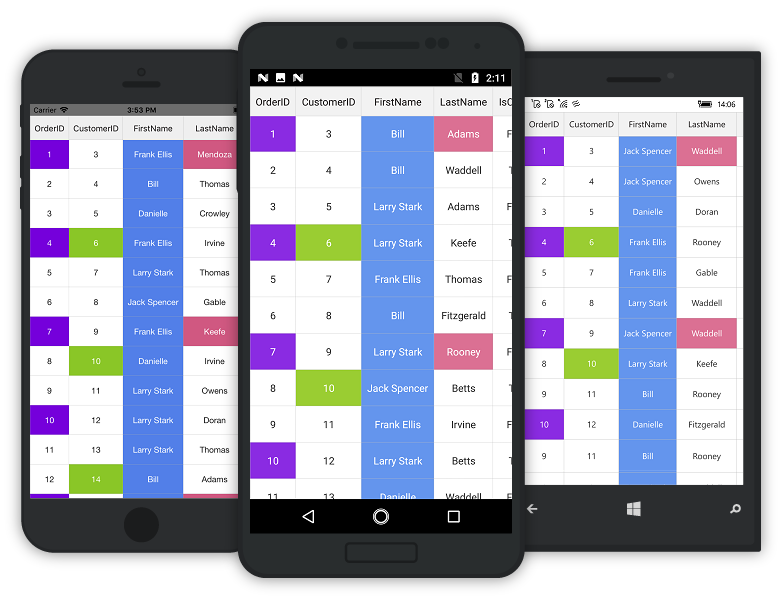
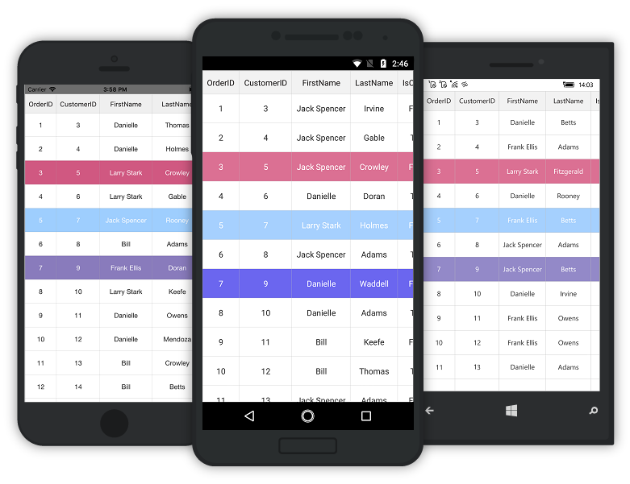

# Conditional Styles

The SfDataGrid allows to customize the style of the individual cells and rows based on the requirements. It can be customized in the following ways: 

* Using Column CellStyle
* Using QueryCellStyle Event
* Using QueryRowStyle Event

## Styling cells using column CellStyle

The SfDataGrid allows to apply cell style for a [GridColumn](http://help.syncfusion.com/cr/cref_files/xamarin/Syncfusion.SfDataGrid.XForms~Syncfusion.SfDataGrid.XForms.GridColumn.html) which is used to render the cells in that column. While applying cell style, the [GridCell](http://help.syncfusion.com/cr/cref_files/xamarin/Syncfusion.SfDataGrid.XForms~Syncfusion.SfDataGrid.XForms.GridCell.html) appears in the custom style should be the default one. To apply cell style for a GridColumn using the [CellStyle](http://help.syncfusion.com/cr/cref_files/xamarin/Syncfusion.SfDataGrid.XForms~Syncfusion.SfDataGrid.XForms.GridColumn~CellStyle.html), follow the code example:


<syncfusion:SfDataGrid x:Name="dataGrid"
                       ItemsSource="{Binding OrdersInfo}">
    <syncfusion:SfDataGrid.Columns>
        <syncfusion:GridTextColumn MappingName="Freight" Format="C">
            <syncfusion:GridTextColumn.CellStyle>
                
            </syncfusion:GridTextColumn.CellStyle>
        </syncfusion:GridTextColumn>
    </syncfusion:SfDataGrid.Columns>
</syncfusion:SfDataGrid> 


## Styling cells using converter

The SfDataGrid also allows to apply styles for the `GridCell` in a column based on conditions by writing a converter for the property in a `GridCell` for which conditional styles should be applied.

To apply conditional styling for a column by writing converter, follow the code example:


<ContentPage xmlns="http://xamarin.com/schemas/2014/forms"
             xmlns:x="http://schemas.microsoft.com/winfx/2009/xaml"
             xmlns:syncfusion="clr-namespace:Syncfusion.SfDataGrid.XForms;assembly=Syncfusion.SfDataGrid.XForms"
             xmlns:local ="clr-namespace:DataGridSample;assembly=DataGridSample"
             x:Class="DataGridSample.Sample">

    <ContentPage.Resources>
        <ResourceDictionary>
            <local:CellStyleConverter x:Key="cellStyleConverter" />
        </ResourceDictionary>
    </ContentPage.Resources>

    <ContentPage.BindingContext>
        <local:ViewModel x:Name="viewModel" />
    </ContentPage.BindingContext>

    <syncfusion:SfDataGrid x:Name="dataGrid"
                           ItemsSource="{Binding OrdersInfo}">
        <syncfusion:SfDataGrid.Columns>
            <syncfusion:GridTextColumn MappingName="Freight" Format="C">
                <syncfusion:GridTextColumn.CellStyle>
                    
                </syncfusion:GridTextColumn.CellStyle>
            </syncfusion:GridTextColumn>
        </syncfusion:SfDataGrid.Columns>
    </syncfusion:SfDataGrid>
</ContentPage>  



public class CellStyleConverter : IValueConverter
{
    public object Convert(object value, Type targetType, object parameter, CultureInfo culture)
    {
        if (System.Convert.ToDouble(value) < 300)
            return Color.White;
        return Color.Green;
    }

    public object ConvertBack(object value, Type targetType, object parameter, CultureInfo culture)
    {
        return null;
    }
}


## Styling cells using QueryCellStyle event

The conditional style can be applied for any cell using the [QueryCellStyle](https://help.syncfusion.com/cr/cref_files/xamarin/Syncfusion.SfDataGrid.XForms~Syncfusion.SfDataGrid.XForms.SfDataGrid~QueryCellStyle_EV.html) event based on any condition. This event will be fired for each cell. It provides the following properties through the [QueryCellStyleEventArgs](https://help.syncfusion.com/cr/cref_files/xamarin/Syncfusion.SfDataGrid.XForms~Syncfusion.SfDataGrid.XForms.QueryCellStyleEventArgs.html) in its `EventHandler`:
  
 * [RowIndex](https://help.syncfusion.com/cr/cref_files/xamarin/Syncfusion.SfDataGrid.XForms~Syncfusion.SfDataGrid.XForms.QueryConditionalStyleEventArgs~RowIndex.html): Provides the row index of current cell in iteration. 
 * [ColumnIndex](https://help.syncfusion.com/cr/cref_files/xamarin/Syncfusion.SfDataGrid.XForms~Syncfusion.SfDataGrid.XForms.QueryCellStyleEventArgs~ColumnIndex.html): Provides the column index of current cell in iteration. 
 * [CellValue](https://help.syncfusion.com/cr/cref_files/xamarin/Syncfusion.SfDataGrid.XForms~Syncfusion.SfDataGrid.XForms.QueryCellStyleEventArgs~CellValue.html): Provides the cell value of current cell in iteration.
 * [Column](https://help.syncfusion.com/cr/cref_files/xamarin/Syncfusion.SfDataGrid.XForms~Syncfusion.SfDataGrid.XForms.QueryCellStyleEventArgs~Column.html): Provides the [GridColumn](http://help.syncfusion.com/cr/cref_files/xamarin/Syncfusion.SfDataGrid.XForms~Syncfusion.SfDataGrid.XForms.GridColumn.html) which belongs to current cell in iteration. 
 * [e.Handled](https://help.syncfusion.com/cr/cref_files/xamarin/Syncfusion.SfDataGrid.XForms~Syncfusion.SfDataGrid.XForms.GridHandledEventArgs~Handled.html): Should set to true to apply the changes.
 * [Style](https://help.syncfusion.com/cr/cref_files/xamarin/Syncfusion.SfDataGrid.XForms~Syncfusion.SfDataGrid.XForms.QueryCellStyleEventArgs~Style.html): Sets style to the current cell in iteration.
 

this.dataGrid.QueryCellStyle += DataGrid_QueryCellStyle;
private void DataGrid_QueryCellStyle(object sender, QueryCellStyleEventArgs e)
{
    if (e.ColumnIndex == 0 && e.RowIndex % 3 == 1)
    {
        e.Style.BackgroundColor = Color.BlueViolet;
        e.Style.ForegroundColor = Color.White;

    }
    else if (e.Column.MappingName == "FirstName")
    {
        e.Style.BackgroundColor = Color.CornflowerBlue;
        e.Style.ForegroundColor = Color.White;
    }
    else if (e.ColumnIndex == 1 && e.RowIndex % 4 == 0)
    {
        e.Style.BackgroundColor = Color.YellowGreen;
        e.Style.ForegroundColor = Color.White;
    }
    else if (e.ColumnIndex == 3 && e.RowIndex % 6 == 1)
    {
        e.Style.BackgroundColor = Color.PaleVioletRed;
        e.Style.ForegroundColor = Color.White;
    }
    e.Handled = true;
}


## How to style a particular column

Based on the properties of the `Column` provided in the `QueryCellStyleEventArgs` of the `QueryCellStyle` event, style can be applied to a particular column.



private void DataGrid_QueryCellStyle(object sender, QueryCellStyleEventArgs e)
{
    if (e.Column.MappingName == "FirstName")
    {
        e.Style.BackgroundColor = Color.CornflowerBlue;
        e.Style.ForegroundColor = Color.White;
    }
    e.Handled = true;
}



## How to style a particular cell based on RowIndex and ColumnIndex
 
Styling can be applied to a particular cell based on the `RowIndex` and `ColumnIndex` properties in `QueryCellStyleEventArgs` of the `QueryCellStyle` event.



private void DataGrid_QueryCellStyle(object sender, QueryCellStyleEventArgs e)
{
    if (e.ColumnIndex == 0 && e.RowIndex == 1)
    {
        e.Style.BackgroundColor = Color.BlueViolet;
        e.Style.ForegroundColor = Color.White;
    }
    e.Handled = true;
}



## How to style a particular cell based on CellValue

Styling can be applied to a particular cell based on `CellValue` property in `QueryCellStyleEventArgs` of the `QueryCellStyle` event.



private void DataGrid_QueryCellStyle(object sender, QueryCellStyleEventArgs e)
{
    if (e.ColumnIndex == 1 && e.CellValue.ToString() == "4")
    {
        e.Style.BackgroundColor = Color.YellowGreen;
        e.Style.ForegroundColor = Color.White;
    }
    e.Handled = true;
}


## Styling cells using RowStyle event

The Conditional style can be applied for an entire row based on any condition using the [QueryRowStyle](https://help.syncfusion.com/cr/cref_files/xamarin/Syncfusion.SfDataGrid.XForms~Syncfusion.SfDataGrid.XForms.SfDataGrid~QueryRowStyle_EV.html) event. This event will be fired for each row. It provides the following properties through the [QueryRowStyleEventArgs](https://help.syncfusion.com/cr/cref_files/xamarin/Syncfusion.SfDataGrid.XForms~Syncfusion.SfDataGrid.XForms.QueryRowStyleEventArgs.html) in its `EventHandler`:

 * [RowData](https://help.syncfusion.com/cr/cref_files/xamarin/Syncfusion.SfDataGrid.XForms~Syncfusion.SfDataGrid.XForms.QueryConditionalStyleEventArgs~RowData.html): Provides the row data of current row in iteration.
 * [RowIndex](https://help.syncfusion.com/cr/cref_files/xamarin/Syncfusion.SfDataGrid.XForms~Syncfusion.SfDataGrid.XForms.QueryConditionalStyleEventArgs~RowIndex.html): Provides the row index of current row in iteration.
 * [e.Handled](https://help.syncfusion.com/cr/cref_files/xamarin/Syncfusion.SfDataGrid.XForms~Syncfusion.SfDataGrid.XForms.GridHandledEventArgs~Handled.html): Should set to true to apply the changes.
 * [Style](https://help.syncfusion.com/cr/cref_files/xamarin/Syncfusion.SfDataGrid.XForms~Syncfusion.SfDataGrid.XForms.QueryRowStyleEventArgs~Style.html): Sets style to the current row in iteration.


this.dataGrid.QueryRowStyle += DataGrid_QueryRowStyle;
private void DataGrid_QueryRowStyle(object sender, QueryRowStyleEventArgs e)
{
    if (e.RowIndex == 3)
    {
        e.Style.ForegroundColor = Color.White;
        e.Style.BackgroundColor = Color.BlueViolet;
    }
    else if (e.RowData  == viewModel.OrdersInfo[7])
    {
        e.Style.ForegroundColor = Color.White;
        e.Style.BackgroundColor = Color.PaleVioletRed;
    }
    e.Handled = true;
}


## How to style a particular row based on RowIndex

Styling can be applied to a particular row based on `RowIndex` property in `QueryRowStyleEventArgs` of the `QueryRowStyle` event.


private void DataGrid_QueryRowStyle(object sender, QueryRowStyleEventArgs e)
{
    if (e.RowIndex == 3)
    {
        e.Style.ForegroundColor = Color.White;
        e.Style.BackgroundColor = Color.PaleVioletRed;
    }
    e.Handled = true;
}



## How to style a particular row based on RowData

Styling can be applied to a particular row based on `RowData` property in `QueryRowStyleEventArgs` of the `QueryRowStyle` event.



private void DataGrid_QueryRowStyle(object sender, QueryRowStyleEventArgs e)
{
    if (e.RowData == viewModel.OrdersInfo[5])
    {
        e.Style.ForegroundColor = Color.White;
        e.Style.BackgroundColor = Color.BlueViolet;
    }
    e.Handled = true;
}



N> By default, only the selected background color will be applied for the selected row even if row style is applied for that row. If you want to apply selection color over while selecting row style, set the [ConditionalStylingPreference](http://help.syncfusion.com/cr/cref_files/xamarin/Syncfusion.SfDataGrid.XForms~Syncfusion.SfDataGrid.XForms.RowStyle~ConditionalStylingPreference.html) property to [StylePreference](http://help.syncfusion.com/cr/cref_files/xamarin/Syncfusion.SfDataGrid.XForms~Syncfusion.SfDataGrid.XForms.StylePreference.html).RowStyleAndSelection.


private void DataGrid_QueryRowStyle(object sender, QueryRowStyleEventArgs e)
{
    if (e.RowIndex == 3 || e.RowIndex == 7)
    {
        e.Style.ForegroundColor = Color.White;
        e.Style.BackgroundColor = Color.PaleVioletRed;
    }
    //Set the below code to display only selection
    //e.Style.ConditionalStylingPreference = StylePreference.Selection;
    e.Style.ConditionalStylingPreference = StylePreference.RowStyleAndSelection;
    e.Handled = true;
}


