# Exporting

SfDataGrid provides support for exporting the data to Excel with several customization options like custom appearance, excluding specific columns, excluding headers, setting custom row height, setting custom column width, etc. It also provides support for [Grouping](https://help.syncfusion.com/xamarin/sfdatagrid/getting-started#grouping), `Filtering` and [Sorting](https://help.syncfusion.com/xamarin/sfdatagrid/getting-started#sorting) when exporting.

The following assemblies needs to be added for exporting to Excel file.

<table>
<tr>
<th>Project</th>
<th>Required assembly</th>
</tr>
<tr>
<td>PCL</td>
<td>pcl\Syncfusion.SfGridConverter.XForms.dll pcl\Syncfusion.Compression.Portable.dll pcl\Syncfusion.Pdf.Portable.dll pcl\Syncfusion.XlsIO.Portable.dll </td>
</tr>
</table>

The below code illustrates how to create and display a SfDataGrid in view.



<Grid>
    <Grid.RowDefinitions>
        <RowDefinition Height="Auto"/>
        <RowDefinition />
    </Grid.RowDefinitions>

    <StackLayout Grid.Row="0" Orientation="Vertical">
        <Button x:Name="Excel" Text="ExportExcel" Clicked ="Excel_Clicked" HeightRequest="50" />
    </StackLayout>

    <sfgrid:SfDataGrid x:Name="dataGrid"  
                    AllowGroupExpandCollapse="True"
                    AllowSorting="True" 
                    Grid.Row="1"  
                    SelectionMode="Multiple"
                    ColumnSizer="None" 
                    ItemsSource="{Binding OrdersInfo}"
                    AutoGenerateColumns="False" >

        <sfgrid:SfDataGrid.Columns>
            <sfgrid:GridTextColumn HeaderText="Order ID"  MappingName="OrderID"/>
            <sfgrid:GridTextColumn HeaderText="FirstName" MappingName="FirstName"/>
            <sfgrid:GridTextColumn HeaderText="Employee ID" MappingName="EmployeeID"/>
            <sfgrid:GridNumericColumn HeaderText="Freight" MappingName="Freight"/>
            <sfgrid:GridTextColumn HeaderText="IsClosed" MappingName="IsClosed"/>
            <sfgrid:GridTextColumn HeaderText="ShipCity" MappingName="ShipCity"/>
            <sfgrid:GridDateTimeColumn HeaderText="ShippingDate" MappingName="ShippingDate" />
        </sfgrid:SfDataGrid.Columns>
    </sfgrid:SfDataGrid>
</Grid>


private void ExportToExcel_Clicked(object sender, EventArgs e)
{
    // Perform exporting to Excel sheet operations here.
}



You can export data to excel by using the [ExportToExcel](http://help.syncfusion.com/cr/cref_files/xamarin/sfgridconverter/Syncfusion.SfGridConverter.XForms~Syncfusion.SfDataGrid.XForms.Exporting.DataGridExcelExportingController~ExportToExcel.html) method by passing the SfDataGrid as an argument. The following code example illustrates exporting data to excel using the `ExportToExcel` method.


private void ExportToExcel(object sender, EventArgs e)
{
    DataGridExcelExportingController excelExport = new DataGridExcelExportingController();
    var excelEngine = excelExport.ExportToExcel(this.dataGrid);
    var workbook = excelEngine.Excel.Workbooks[0];
    MemoryStream stream = new MemoryStream();
    workbook.SaveAs(stream);
    workbook.Close();
    excelEngine.Dispose();

    Xamarin.Forms.DependencyService.Get<ISave>().Save("DataGrid.xlsx", "application/msexcel", stream);
}


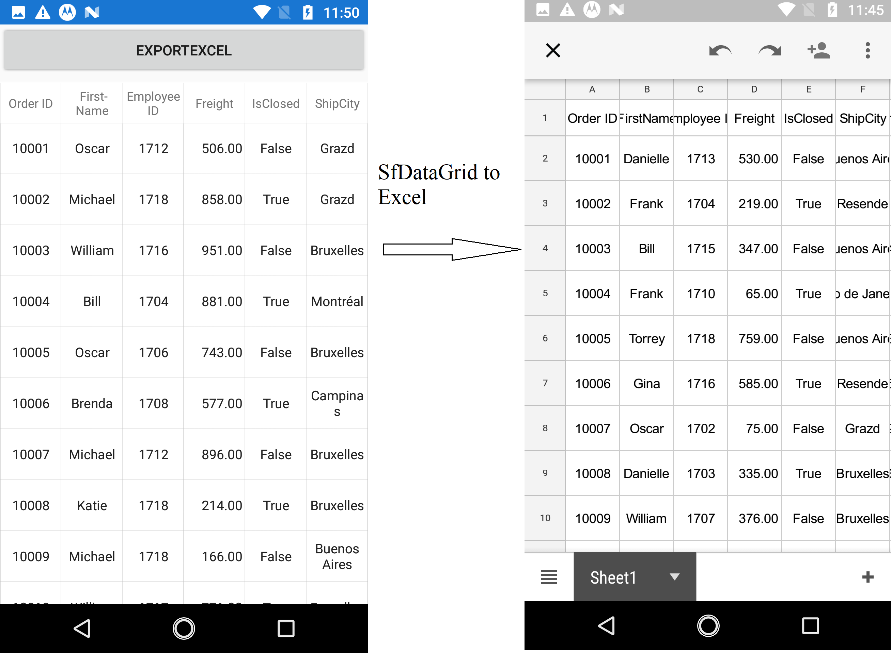

### Exporting Options

You can also export data to excel with various customizing options while exporting the SfDataGrid by passing the grid and [DataGridExcelExportingOption](http://help.syncfusion.com/cr/cref_files/xamarin/sfgridconverter/Syncfusion.SfGridConverter.XForms~Syncfusion.SfDataGrid.XForms.Exporting.DataGridExcelExportingOption.html) as arguments to the `ExportToExcel` method. The following code example illustrates this.


DataGridExcelExportingController excelExport = new DataGridExcelExportingController ();
DataGridExcelExportingOption exportOption = new DataGridExcelExportingOption ();
exportOption.ExportColumnWidth = false;
exportOption.DefaultColumnWidth = 150;
var excelEngine = excelExport.ExportToExcel (this.dataGrid, exportOption);


SfDataGrid provides you with several properties in `DataGridExcelExportingOption` class to customize the grid while exporting it to excel.

#### AllowOutlining

SfDataGrid allows to export the data to excel with enable the option for group expand and collapse in excel sheet, if you export the data grid with grouping. This has been achieve by setting `AllowOutlining` as `true`. This property default value is false so you cannot able to expand and collapse the group in excel sheet.


DataGridExcelExportingOption option = new DataGridExcelExportingOption();
option.AllowOutlining = true; 


#### AllowSortingAndFiltering

SfDataGrid allow you to export the data grid to excel with sorting and filter option enabled on column header in excel sheet by setting `DataGridExcelExportingOption.AllowSortingAndFiltering` as `true`. This property default value is false. 


DataGridExcelExportingOption option = new DataGridExcelExportingOption();
option.AllowSortingAndFiltering = true; 


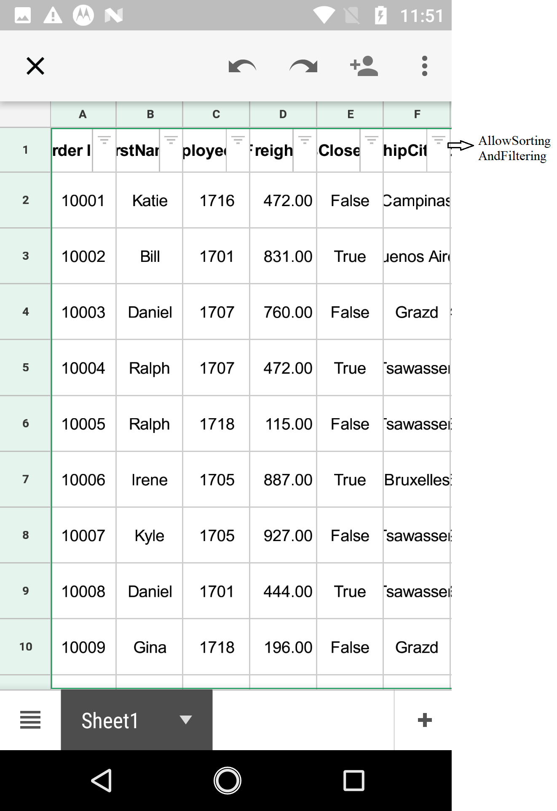

#### ApplyGridStyle

SfDataGrid allows to export the data with GridStyle by setting `ApplyGridStyle` as `true`. By default data has been export without the GridStyle. 


DataGridExcelExportingOption option = new DataGridExcelExportingOption();
option.ApplyGridStyle = true; 


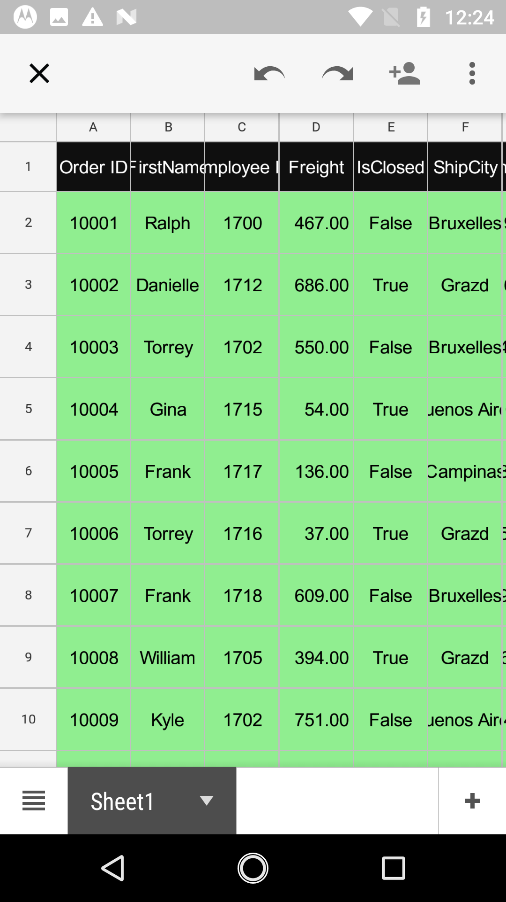

#### DefaultColumnWidth

SfDataGrid allow you to customize the column width in excel file based on our requirement by using `DefaultColumnWidth` property. 


DataGridExcelExportingOption option = new DataGridExcelExportingOption();
option.DefaultColumnWidth = 100; 


#### DefaultRowHeight

SfDataGrid allow you to customize the row height in excel file based on our requirement by using `DefaultRowHeight` property. 


DataGridExcelExportingOption option = new DataGridExcelExportingOption();
option.DefaultRowHeight = 50; 


#### ExcludedColumns

By default, all the columns (including hidden columns) in SfDataGrid will be exported to Excel. If you want to exclude some columns while exporting to excel, you can use `ExcludeColumns` property in [DataGridExcelExportingOption](http://help.syncfusion.com/cr/cref_files/xamarin/sfgridconverter/Syncfusion.SfGridConverter.XForms~Syncfusion.SfDataGrid.XForms.Exporting.DataGridExcelExportingOption.html).


DataGridExcelExportingOption option = new DataGridExcelExportingOption();
var list = new List<string>();
list.Add("OrderID");
list.Add("LastName");
option.ExcludedColumns = list;


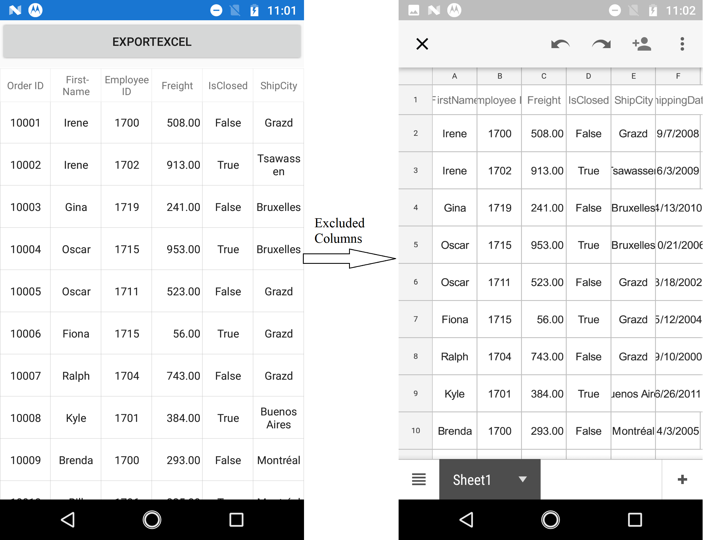

### ExportColumnWidth

By default data grid will be export to excel with excel sheet default column width. But you can also export the data grid to excel with same SfDataGrid column width value in excel file column width also by setting `ExportColumnWidth` as `true`. ExportColumnWidth property default value is false.


DataGridExcelExportingOption option = new DataGridExcelExportingOption();
option.ExportColumnWidth = true;


### ExportRowHeight

By default data grid will be export to excel with excel sheet default row height. But you can also export the data grid to excel with same SfDataGrid RowHeight value in excel sheet row height also by setting `ExportRowHeight` as `true`. ExportRowHeight property default value is false.


DataGridExcelExportingOption option = new DataGridExcelExportingOption();
option.ExportRowHeight = true;


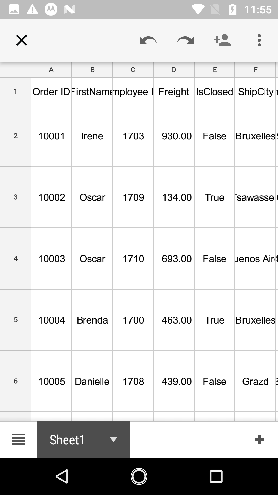

#### ExcelVersion

SfDataGrid allow to export the data to excel with different version based on our requirement by using `ExcelVersion` property.


DataGridExcelExportingOption option = new DataGridExcelExportingOption();
option.ExcelVersion = Syncfusion.XlsIO.ExcelVersion.Excel2013;


#### ExportGroups

By default, all the groups in data grid will be exported to Excel sheet. If you want to export the data grid without Groups, you need to set `ExportGroups` as `false`.


DataGridExcelExportingOption option = new DataGridExcelExportingOption();
option.ExportGroups = true;


* ExportGroups = true; 
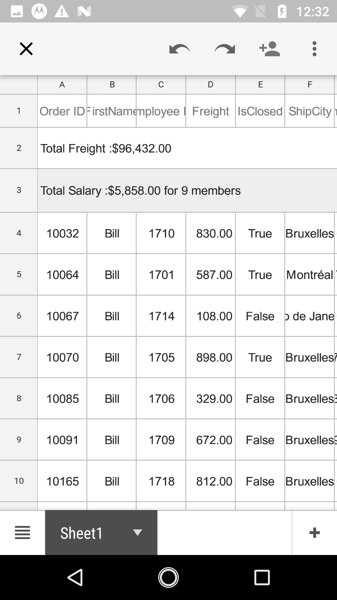

* ExportGroups = false;
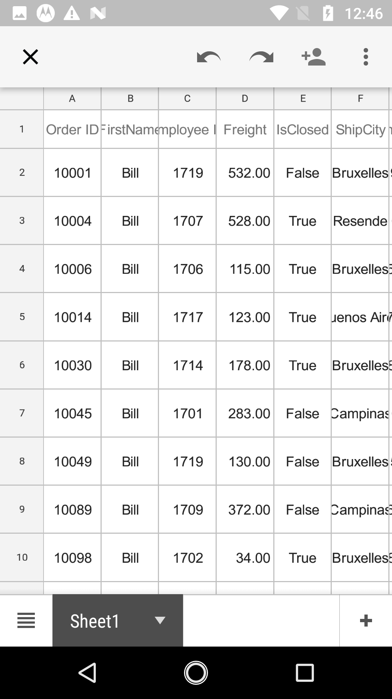 

#### ExportHeader

By default, column header will be exported to Excel sheet. If you want to export without column header, you need to set `ExportHeader` as `false`.


DataGridExcelExportingOption option = new DataGridExcelExportingOption();
option.ExportHeader = false;


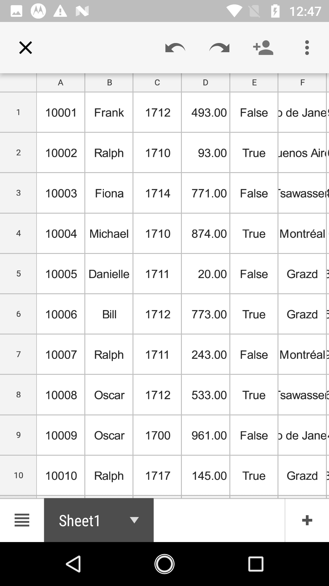

#### ExportTableSummary

By default, table summaries in data grid will be exported to excel. If you want to export without table summaries, you need to set `ExportTableSummary` property as `false`.


DataGridExcelExportingOption option = new DataGridExcelExportingOption();
option.ExportTableSummary = true;


* ExportTableSummary = true;

* ExportTableSummary = false;
 

#### BottomTableSummaryStyle

SfDataGrid provides support to export the bottom TableSummary with custom style by using `BottomTableSummaryStyle` property.


DataGridExcelExportingOption option = new DataGridExcelExportingOption();
option.BottomTableSummaryStyle = new ExportCellStyle()
{
    BackgroundColor = Xamarin.Forms.Color.Yellow,
    BorderColor = Xamarin.Forms.Color.Red,
    ForegroundColor = Xamarin.Forms.Color.Green,
};


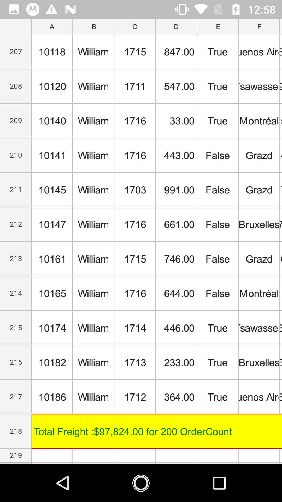  

#### GroupCaptionStyle

SfDataGrid provides support to export the group caption text with custom style by using `GroupCaptionStyle` property.


DataGridExcelExportingOption option = new DataGridExcelExportingOption();
option.GroupCaptionStyle = new ExportCellStyle()
{
    BackgroundColor = Xamarin.Forms.Color.Yellow,
    BorderColor = Xamarin.Forms.Color.Red,
    ForegroundColor = Xamarin.Forms.Color.Green,
};


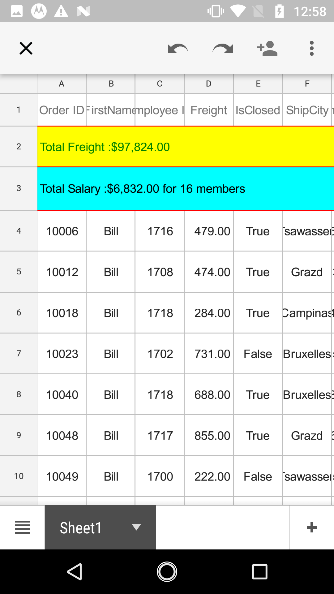 

#### HeaderStyle

SfDataGrid allow to export the column header with custom style by using `HeaderStyle` property.


DataGridExcelExportingOption option = new DataGridExcelExportingOption();
option.HeaderStyle = new ExportCellStyle()
{
    BackgroundColor = Xamarin.Forms.Color.Yellow,
    BorderColor = Xamarin.Forms.Color.Red,
    ForegroundColor = Xamarin.Forms.Color.Green,
};


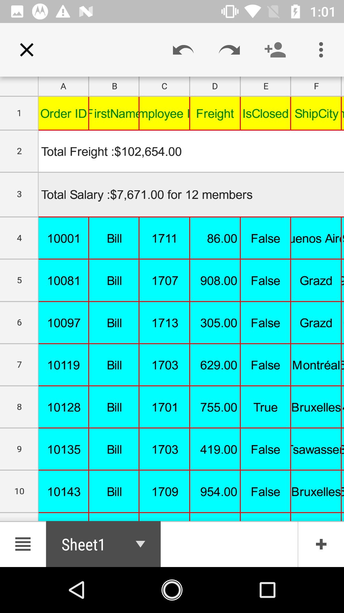 

#### RecordStyle

SfDataGrid allow to export the records with custom style by using `RecordStyle` property.


DataGridExcelExportingOption option = new DataGridExcelExportingOption();
option.RecordStyle = new ExportCellStyle()
{
    BackgroundColor = Xamarin.Forms.Color.Yellow,
    BorderColor = Xamarin.Forms.Color.Red,
    ForegroundColor = Xamarin.Forms.Color.Green,
};


 

#### TopTableSummaryStyle

SfDataGrid provides support to export the top TableSummary with custom style by using `TopTableSummaryStyle` property.


DataGridExcelExportingOption option = new DataGridExcelExportingOption();
option.TopTableSummaryStyle = new ExportCellStyle()
{
    BackgroundColor = Xamarin.Forms.Color.Yellow,
    BorderColor = Xamarin.Forms.Color.Red,
    ForegroundColor = Xamarin.Forms.Color.Green,
};


 

#### StartColumnIndex

By default SfDataGrid will be export to excel from the column index value 0. But it allow the user to export the data grid start column index in excel sheet based on our requirement by using `StartColumnIndex` property.


DataGridExcelExportingOption option = new DataGridExcelExportingOption();
option.StartColumnIndex = 4;


 

#### StartRowIndex

By default SfDataGrid will be export to excel from the row index value 0. But it allow the user to export the data grid start row index in excel sheet based on our requirement by using `StartRowIndex` property.


DataGridExcelExportingOption option = new DataGridExcelExportingOption();
option.StartRowIndex = 10;


 

#### ExportAllPages

When you are using SfDataPager inside the SfDataGrid and while exporting to excel, it will be export only the current page. Also you can export all the pages by setting the `ExportAllPages` to `true`. The default value for this property is false.


DataGridExcelExportingOption option = new DataGridExcelExportingOption();
option.ExportAllPages = true;


* ExportAllPages = true;
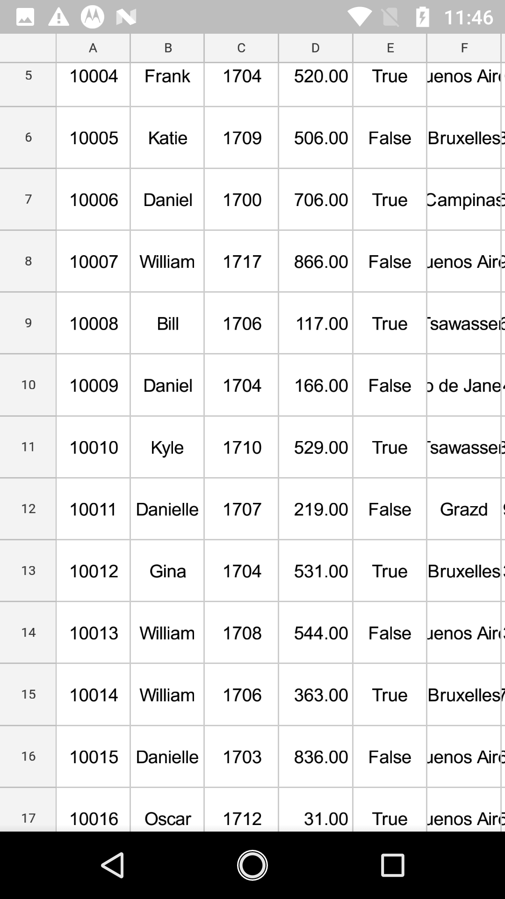 

* ExportAllPages = false;
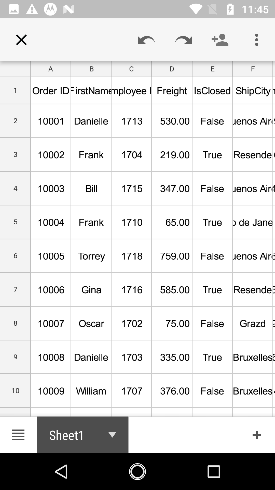 

### Events

The SfDataGrid provides you the following events for exporting to excel:

* [RowExporting](http://help.syncfusion.com/cr/cref_files/xamarin/sfgridconverter/Syncfusion.SfGridConverter.XForms~Syncfusion.SfDataGrid.XForms.Exporting.DataGridExcelExportingController~RowExporting_EV.html) – This event is raised while exporting a row at the execution time before the row is exported.
* [CellExporting](http://help.syncfusion.com/cr/cref_files/xamarin/sfgridconverter/Syncfusion.SfGridConverter.XForms~Syncfusion.SfDataGrid.XForms.Exporting.DataGridExcelExportingController~CellExporting_EV.html) – This event is raised while exporting a cell at the execution time before the cell is exported.

#### RowExporting

The [DataGridRowExcelExportingEventHandler](http://help.syncfusion.com/cr/cref_files/xamarin/sfgridconverter/Syncfusion.SfGridConverter.XForms~Syncfusion.SfDataGrid.XForms.Exporting.DataGridRowExcelExportingEventHandler.html) delegate allows you to customize the styles for record rows and group caption rows. The `RowExporting` event is triggered with [DataGridRowExcelExportingEventArgs](http://help.syncfusion.com/cr/cref_files/xamarin/sfgridconverter/Syncfusion.SfGridConverter.XForms~Syncfusion.SfDataGrid.XForms.Exporting.DataGridRowExcelExportingEventArgs.html) that contains the following properties:

* [Range](http://help.syncfusion.com/cr/cref_files/xamarin/sfgridconverter/Syncfusion.SfGridConverter.XForms~Syncfusion.SfDataGrid.XForms.Exporting.DataGridRowExcelExportingEventArgs~Range.html) – Specifies the excel range to be exported. It provides full access to the exporting cell in excel.
* [Record](http://help.syncfusion.com/cr/cref_files/xamarin/sfgridconverter/Syncfusion.SfGridConverter.XForms~Syncfusion.SfDataGrid.XForms.Exporting.DataGridRowExcelExportingEventArgs~Record.html) – Gets the collection of underlying data objects that are exported.
* [RowType](http://help.syncfusion.com/cr/cref_files/xamarin/sfgridconverter/Syncfusion.SfGridConverter.XForms~Syncfusion.SfDataGrid.XForms.Exporting.DataGridRowExcelExportingEventArgs~RowType.html) – Specifies the row type by using `ExportRowType` `Enum`. You can use this property to check the row type and apply different styles based on the row type.
* [Worksheet](http://help.syncfusion.com/cr/cref_files/xamarin/sfgridconverter/Syncfusion.SfGridConverter.XForms~Syncfusion.SfDataGrid.XForms.Exporting.DataGridRowExcelExportingEventArgs~WorkSheet.html) – Sets the `Worksheet` properties such as sheet protection, gridlines, and so on. 

You can use this event to customize the properties of the grid rows that are exported to excel. The following code example illustrates how to change the background color of the record rows and caption summary rows while exporting.


//HandlingRowExportingEvent for exporting to excel
DataGridExcelExportingController excelExport = new DataGridExcelExportingController ();
excelExport.RowExporting += excelExport_RowExporting; 

void excelExport_RowExporting (object sender, DataGridRowExcelExportingEventArgs e)
{
    if (e.RowType == ExportRowType.Record) {
        if ((e.Record.Data as OrderInfo).IsClosed)
            e.Range.CellStyle.ColorIndex = Syncfusion.XlsIO.ExcelKnownColors.Yellow;
        else
            e.Range.CellStyle.ColorIndex = Syncfusion.XlsIO.ExcelKnownColors.LightGreen;
    }

    if (e.RowType == ExportRowType.CaptionSummary) {
        e.Range.CellStyle.ColorIndex = Syncfusion.XlsIO.ExcelKnownColors.Grey_25_percent;
    }
}


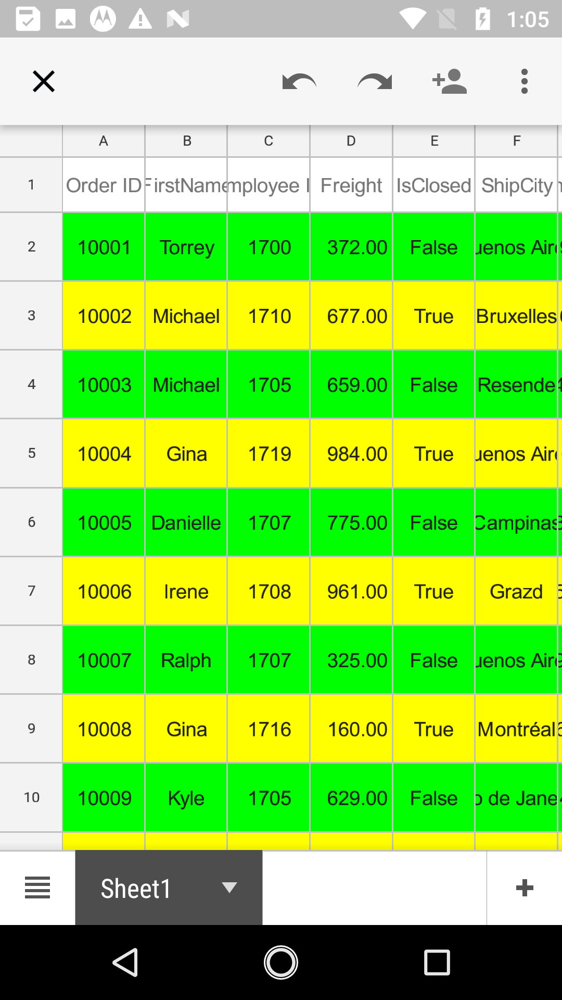

#### CellExporting

The [DataGridCellExcelExportingEventHandler](http://help.syncfusion.com/cr/cref_files/xamarin/sfgridconverter/Syncfusion.SfGridConverter.XForms~Syncfusion.SfDataGrid.XForms.Exporting.DataGridCellExcelExportingEventHandler.html) delegate allows you to customize the styles for header cells, record cells and group caption cells. The `CellExporting` event is triggered with [DataGridCellExcelExportingEventArgs](http://help.syncfusion.com/cr/cref_files/xamarin/sfgridconverter/Syncfusion.SfGridConverter.XForms~Syncfusion.SfDataGrid.XForms.Exporting.DataGridCellExcelExportingEventArgs.html) that contains the following properties:

* [CellType](http://help.syncfusion.com/cr/cref_files/xamarin/sfgridconverter/Syncfusion.SfGridConverter.XForms~Syncfusion.SfDataGrid.XForms.Exporting.DataGridCellExcelExportingEventArgs~CellType.html) – Specifies the cell type by using `ExportCellType` Enum. You can use this property to check the cell type and apply different cell styles based on the cell type.
* [CellValue](http://help.syncfusion.com/cr/cref_files/xamarin/sfgridconverter/Syncfusion.SfGridConverter.XForms~Syncfusion.SfDataGrid.XForms.Exporting.DataGridCellExcelExportingEventArgs~CellValue.html) – Contains the actual value that is exported to the excel. You can use this value to apply formatting in excel using `Range` property.
* [ColumnName](http://help.syncfusion.com/cr/cref_files/xamarin/sfgridconverter/Syncfusion.SfGridConverter.XForms~Syncfusion.SfDataGrid.XForms.Exporting.DataGridCellExcelExportingEventArgs~ColumnName.html) – Specifies the column name (MappingName) of the exporting cell. You can apply formatting for a particular column by checking the `ColumnName`.
* [Handled](http://help.syncfusion.com/cr/cref_files/xamarin/sfgridconverter/Syncfusion.SfGridConverter.XForms~Syncfusion.SfDataGrid.XForms.Exporting.DataGridCellExcelExportingEventArgs~Handled.html) – Determines whether the cell is exported to excel or not.
* [Range](http://help.syncfusion.com/cr/cref_files/xamarin/sfgridconverter/Syncfusion.SfGridConverter.XForms~Syncfusion.SfDataGrid.XForms.Exporting.DataGridCellExcelExportingEventArgs~Range.html) – Specifies the excel range to be exported. It provides full access to the exporting cell in excel.
* [Record](http://help.syncfusion.com/cr/cref_files/xamarin/sfgridconverter/Syncfusion.SfGridConverter.XForms~Syncfusion.SfDataGrid.XForms.Exporting.DataGridCellExcelExportingEventArgs~Record.html) – Gets the collection of underlying data objects that are exported. 

You can use this event to customize the properties of the grid cells that are exported to excel. The following code example illustrates how to customize the background color, foreground color and cell value of the header cells, record cells and caption summary cells while exporting.


//HandlingCellExportingEvent for exporting to Excel
DataGridExcelExportingController excelExport = new DataGridExcelExportingController ();
excelExport.CellExporting += excelExport_CellExporting;  

void excelExport_CellExporting(object sender, DataGridCellExcelExportingEventArgs e)
{
    if (e.CellType == ExportCellType.HeaderCell) {
        e.Range.CellStyle.ColorIndex = Syncfusion.XlsIO.ExcelKnownColors.Blue;
        e.Range.CellStyle.PatternColorIndex = Syncfusion.XlsIO.ExcelKnownColors.White;
        e.Range.CellStyle.BeginUpdate();
        e.Range.CellStyle.Borders.LineStyle = Syncfusion.XlsIO.ExcelLineStyle.Dash_dot;
        e.Range.CellStyle.Borders[ExcelBordersIndex.DiagonalDown].LineStyle = ExcelLineStyle.Dash_dot;
        e.Range.CellStyle.Borders[ExcelBordersIndex.DiagonalUp].LineStyle = ExcelLineStyle.Dash_dot_dot;
        e.Range.CellStyle.Borders.Color = ExcelKnownColors.Black;
        e.Range.CellStyle.EndUpdate();
    }

    if (e.CellType == ExportCellType.RecordCell) {
        e.Range.CellStyle.ColorIndex = Syncfusion.XlsIO.ExcelKnownColors.Yellow;
        e.Range.CellStyle.PatternColorIndex = Syncfusion.XlsIO.ExcelKnownColors.Black;
        e.Range.CellStyle.BeginUpdate();
        e.Range.CellStyle.Borders.LineStyle = Syncfusion.XlsIO.ExcelLineStyle.Dash_dot;
        e.Range.CellStyle.Borders[ExcelBordersIndex.DiagonalDown].LineStyle = ExcelLineStyle.Dash_dot;
        e.Range.CellStyle.Borders[ExcelBordersIndex.DiagonalUp].LineStyle = ExcelLineStyle.Dash_dot_dot;
        e.Range.CellStyle.Borders.Color = ExcelKnownColors.Black;
        e.Range.CellStyle.EndUpdate();
    }

    if (e.CellType == ExportCellType.GroupCaptionCell) {
        e.Range.CellStyle.ColorIndex = Syncfusion.XlsIO.ExcelKnownColors.Grey_25_percent;
        e.Range.CellStyle.PatternColorIndex = Syncfusion.XlsIO.ExcelKnownColors.Blue;
        e.Range.CellStyle.BeginUpdate();
        e.Range.CellStyle.Borders.LineStyle = Syncfusion.XlsIO.ExcelLineStyle.Dash_dot;
        e.Range.CellStyle.Borders[ExcelBordersIndex.DiagonalDown].LineStyle = ExcelLineStyle.Dash_dot;
        e.Range.CellStyle.Borders[ExcelBordersIndex.DiagonalUp].LineStyle = ExcelLineStyle.Dash_dot_dot;
        e.Range.CellStyle.Borders.Color = ExcelKnownColors.Black;
        e.Range.CellStyle.EndUpdate();
    }
}


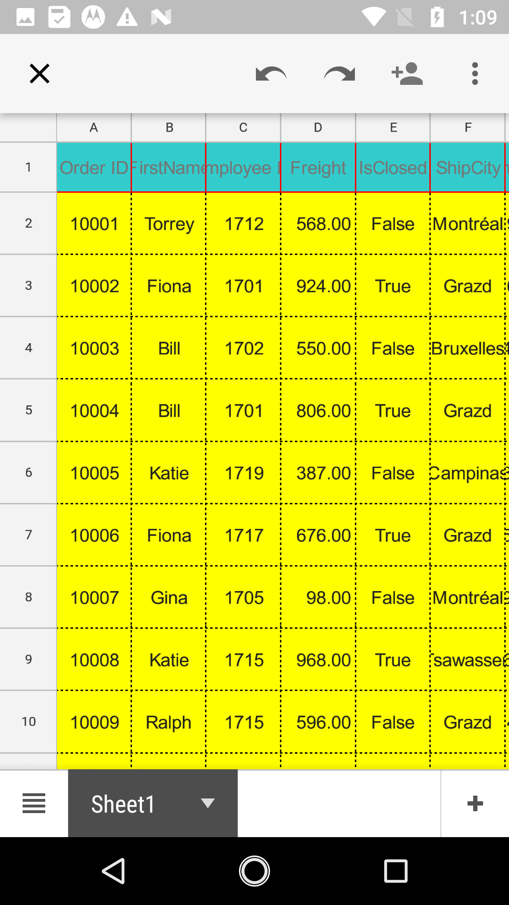

#### Custom Borders

SfDataGrid allow to export the data to excel with custom borders style in excel sheet. This has been achieve by handling `CellExporting` event. 


private void ExcelExport_CellExporting(object sender, DataGridCellExcelExportingEventArgs e)
{
    if (e.CellType == ExportCellType.RecordCell)
    {
        e.Range.CellStyle.BeginUpdate();
        e.Range.CellStyle.Borders.LineStyle = Syncfusion.XlsIO.ExcelLineStyle.Dash_dot;
        e.Range.CellStyle.Borders[ExcelBordersIndex.DiagonalDown].LineStyle = ExcelLineStyle.Dash_dot;
        e.Range.CellStyle.Borders[ExcelBordersIndex.DiagonalUp].LineStyle = ExcelLineStyle.Dash_dot_dot;
        e.Range.CellStyle.Borders.Color = ExcelKnownColors.Black;
        e.Range.CellStyle.EndUpdate();
    }
}


## Save a file

The below code snippet explains how to save the converted excel sheet in our local device.


// Need to define the Interfaces in-order to use it in platform wise using Dependency Service
public interface ISave
{
    void Save(string filename, string contentType, MemoryStream stream);
}
public interface ISaveWindows
{
    Task Save(string filename, string contentType, MemoryStream stream);
}

// In Android renderer project
public class SaveAndroid : ISave
{
    public void Save(string filename, string contentType, MemoryStream stream)
    {
        string exception = string.Empty;
        string root = null;
        if (Android.OS.Environment.IsExternalStorageEmulated)
        {
            root = Android.OS.Environment.ExternalStorageDirectory.ToString();
        }
        else
            root = Environment.GetFolderPath(Environment.SpecialFolder.MyDocuments);

        Java.IO.File myDir = new Java.IO.File(root + "/Syncfusion");
        myDir.Mkdir();
        Java.IO.File file = new Java.IO.File(myDir, filename);
        
        if (file.Exists()) file.Delete();
        
        try
        {
            FileOutputStream outs = new FileOutputStream(file);
            outs.Write(stream.ToArray());
            outs.Flush();
            outs.Close();
        }
        catch (Exception e)
        {
            exception = e.ToString();
        }
        if (file.Exists() && contentType != "application/html")
        {
            Android.Net.Uri path = Android.Net.Uri.FromFile(file);
            string extension = Android.Webkit.MimeTypeMap.GetFileExtensionFromUrl(Android.Net.Uri.FromFile(file).ToString());
            string mimeType = Android.Webkit.MimeTypeMap.Singleton.GetMimeTypeFromExtension(extension);
            Intent intent = new Intent(Intent.ActionView);
            intent.SetDataAndType(path, mimeType);
            Forms.Context.StartActivity(Intent.CreateChooser(intent, "Choose App"));
        }
    }
}

// In iOS renderer project
public class SaveIOS : ISave
{
    void ISave.Save(string filename, string contentType, MemoryStream stream)
    {
        string exception = string.Empty;
        string path = Environment.GetFolderPath(Environment.SpecialFolder.Personal);
        string filePath = Path.Combine(path, filename);
        try
        {
            FileStream fileStream = File.Open(filePath, FileMode.Create);
            stream.Position = 0;
            stream.CopyTo(fileStream);
            fileStream.Flush();
            fileStream.Close();
        }
        catch (Exception e)
        {
            exception = e.ToString();
        }
        
        if (contentType == "application/html" || exception != string.Empty)
            return;
        
        UIViewController currentController = UIApplication.SharedApplication.KeyWindow.RootViewController;
        while (currentController.PresentedViewController != null)
            currentController = currentController.PresentedViewController;
        UIView currentView = currentController.View;

        QLPreviewController previewController = new QLPreviewController();
        QLPreviewItem item = new QLPreviewItemBundle(filename, filePath);
        previewController.DataSource = new PreviewControllerDS(item);

        currentController.PresentViewController((UIViewController)previewController, true, (Action)null);
    }
}

public class PreviewControllerDS : QLPreviewControllerDataSource
{
    private QLPreviewItem _item;

    public PreviewControllerDS(QLPreviewItem item)
    {
        _item = item;
    }

    public override nint PreviewItemCount (QLPreviewController controller)
    {
        return (nint)1;
    }

    public override IQLPreviewItem GetPreviewItem (QLPreviewController controller, nint index)
    {
        return _item;
    }
}

public class QLPreviewItemFileSystem : QLPreviewItem
{
    string _fileName, _filePath;

    public QLPreviewItemFileSystem(string fileName, string filePath)
    {
        _fileName = fileName;
        _filePath = filePath;
    }

    public override string ItemTitle
    {
        get
        {
            return _fileName;
        }
    }
    public override NSUrl ItemUrl
    {
        get
        {
            return NSUrl.FromFilename(_filePath);
        }
    }
}

public class QLPreviewItemBundle : QLPreviewItem
{
    string _fileName, _filePath;
    public QLPreviewItemBundle(string fileName, string filePath)
    {
        _fileName = fileName;
        _filePath = filePath;
    }

    public override string ItemTitle
    {
        get
        {
            return _fileName;
        }
    }
    public override NSUrl ItemUrl
    {
        get
        {
            var documents = NSBundle.MainBundle.BundlePath;
            var lib = Path.Combine(documents, _filePath);
            var url = NSUrl.FromFilename(lib);
            return url;
        }
    }
}

// In UWP renderer project
public class SaveWindows : ISaveWindows
{
    public async Task Save(string filename, string contentType, MemoryStream stream)
    {
        if (Device.Idiom != TargetIdiom.Desktop)
        {
            StorageFolder local = Windows.Storage.ApplicationData.Current.LocalFolder;
            StorageFile outFile = await local.CreateFileAsync(filename, CreationCollisionOption.ReplaceExisting);
            using (Stream outStream = await outFile.OpenStreamForWriteAsync())
            {
                outStream.Write(stream.ToArray(), 0, (int)stream.Length);
            }
            if (contentType != "application/html")
                await Windows.System.Launcher.LaunchFileAsync(outFile);
        }
        else
        {
            StorageFile storageFile = null;
            FileSavePicker savePicker = new FileSavePicker();
            savePicker.SuggestedStartLocation = PickerLocationId.Desktop;
            savePicker.SuggestedFileName = filename;
            switch (contentType)
            {
                case "application/vnd.openxmlformats-officedocument.presentationml.presentation":
                    savePicker.FileTypeChoices.Add("PowerPoint Presentation", new List<string>() { ".pptx", });
                    break;

                case "application/msexcel":
                    savePicker.FileTypeChoices.Add("Excel Files", new List<string>() { ".xlsx", });
                    break;

                case "application/msword":
                    savePicker.FileTypeChoices.Add("Word Document", new List<string>() { ".docx" });
                    break;

                case "application/pdf":
                    savePicker.FileTypeChoices.Add("Adobe PDF Document", new List<string>() { ".pdf" });
                    break;
                
                case "application/html":
                    savePicker.FileTypeChoices.Add("HTML Files", new List<string>() { ".html" });
                    break;
            }
            storageFile = await savePicker.PickSaveFileAsync();

            using (Stream outStream = await storageFile.OpenStreamForWriteAsync())
            {
                outStream.Write(stream.ToArray(), 0, (int)stream.Length);
                outStream.Flush();
                outStream.Dispose();
            }
            stream.Flush();
            stream.Dispose();
            await Windows.System.Launcher.LaunchFileAsync(storageFile);
        }
    }
}


