# Exporting

SfDataGrid provides support for exporting the data to PDF with several customization options like custom appearance, excluding specific columns, excluding headers, setting custom row height, setting custom column width, etc. It also provides support for [Grouping](https://help.syncfusion.com/xamarin/sfdatagrid/getting-started#grouping), `Filtering` and [Sorting](https://help.syncfusion.com/xamarin/sfdatagrid/getting-started#sorting) when exporting.

The following assemblies needs to be added for exporting to PDF file.

<table>
<tr>
<th>Project</th>
<th>Required assembly</th>
</tr>
<tr>
<td>PCL</td>
<td>pcl\Syncfusion.SfGridConverter.XForms.dll pcl\Syncfusion.Compression.Portable.dll pcl\Syncfusion.Pdf.Portable.dll pcl\Syncfusion.XlsIO.Portable.dll </td>
</tr>
</table>

You can export SfDataGrid to PDF by using the following extension methods, its present in the Syncfusion.SfDataGrid.XForms.Exporting namespace.
* ExportToPdf
* ExportToPdfGrid

The below code illustrates how to create and display a SfDataGrid in view.



<Grid>
    <Grid.RowDefinitions>
        <RowDefinition Height="Auto"/>
        <RowDefinition />
    </Grid.RowDefinitions>

    <StackLayout Grid.Row="0" Orientation="Vertical">
        <Button x:Name="Export" Text="ExportPDF" Clicked ="PDFExport_Clicked" HeightRequest="50" />
    </StackLayout>

    <sfgrid:SfDataGrid x:Name="dataGrid"  
                    AllowGroupExpandCollapse="True"
                    AllowSorting="True" 
                    Grid.Row="1"  
                    SelectionMode="Multiple"
                    ColumnSizer="None" 
                    ItemsSource="{Binding OrdersInfo}"
                    AutoGenerateColumns="False" >

        <sfgrid:SfDataGrid.Columns>
            <sfgrid:GridTextColumn HeaderText="Order ID"  MappingName="OrderID"/>
            <sfgrid:GridTextColumn HeaderText="FirstName" MappingName="FirstName"/>
            <sfgrid:GridTextColumn HeaderText="Employee ID" MappingName="EmployeeID"/>
            <sfgrid:GridNumericColumn HeaderText="Freight" MappingName="Freight"/>
            <sfgrid:GridTextColumn HeaderText="IsClosed" MappingName="IsClosed"/>
            <sfgrid:GridTextColumn HeaderText="ShipCity" MappingName="ShipCity"/>
            <sfgrid:GridDateTimeColumn HeaderText="ShippingDate" MappingName="ShippingDate" />
        </sfgrid:SfDataGrid.Columns>
    </sfgrid:SfDataGrid>
</Grid>



## ExportToPdf

You can export data to PDF by using the [ExportToPdf](http://help.syncfusion.com/cr/cref_files/xamarin/sfgridconverter/Syncfusion.SfGridConverter.XForms~Syncfusion.SfDataGrid.XForms.Exporting.DataGridPdfExportingController~ExportToPdf.html) method by passing the SfDataGrid as an argument. The following code example illustrates exporting data to PDF using the `ExportToPdf` method.


private void PDFExport_Clicked(object sender, EventArgs e)
{
    DataGridPdfExportingController pdfExport = new DataGridPdfExportingController();
    MemoryStream stream = new MemoryStream();
    var exportToPdf = pdfExport.ExportToPdf(this.dataGrid, new DataGridPdfExportOption()
    {
        FitAllColumnsInOnePage = true,
    });
    exportToPdf.Save(stream);
    exportToPdf.Close(true);
    if (Device.OS == TargetPlatform.WinPhone || Device.OS == TargetPlatform.Windows)
        Xamarin.Forms.DependencyService.Get<ISaveWindowsPhone>().Save("DataGrid.pdf", "application/pdf", stream);
    else
        Xamarin.Forms.DependencyService.Get<ISave>().Save("DataGrid.pdf", "application/pdf", stream);
}


## ExportToPdfGrid

You can also export data to PDF by using the [ExportToPdfGrid](http://help.syncfusion.com/cr/cref_files/xamarin/sfgridconverter/Syncfusion.SfGridConverter.XForms~Syncfusion.SfDataGrid.XForms.Exporting.DataGridPdfExportingController~ExportToPdfGrid.html) method by passing the SfDataGrid as an argument. The following code example illustrates exporting data to PDF using the `ExportToPdfGrid` method.


private void PDFExport_Clicked(object sender, EventArgs e)
{
    DataGridPdfExportingController pdfExport = new DataGridPdfExportingController();
    MemoryStream stream = new MemoryStream();
    var pdfDoc = new PdfDocument();
    PdfPage page = pdfDoc.Pages.Add();
    var exportToPdfGrid = pdfExport.ExportToPdfGrid(this.dataGrid, this.dataGrid.View, new DataGridPdfExportOption()
    {
        FitAllColumnsInOnePage = true,

    }, pdfDoc);
    exportToPdfGrid.Draw(page, new PointF(10, 10));
    pdfDoc.Save(stream);
    pdfDoc.Close(true);
    if (Device.OS == TargetPlatform.WinPhone || Device.OS == TargetPlatform.Windows)
        Xamarin.Forms.DependencyService.Get<ISaveWindowsPhone>().Save("DataGrid.pdf", "application/pdf", stream);
    else
        Xamarin.Forms.DependencyService.Get<ISave>().Save("DataGrid.pdf", "application/pdf", stream);
}


### Exporting Options

#### Exclude columns while exporting

By default, all the columns (including hidden columns) in SfDataGrid will be exported to PDF. If you want to exclude some columns while exporting to PDF, you can use `ExcludeColumns` property in [DataGridPdfExportOption](http://help.syncfusion.com/cr/cref_files/xamarin/sfgridconverter/Syncfusion.SfGridConverter.XForms~Syncfusion.SfDataGrid.XForms.Exporting.DataGridPdfExportOption.html).


DataGridPdfExportingController pdfExport = new DataGridPdfExportingController ();
DataGridPdfExportOption exportOption = new DataGridPdfExportOption ();
exportOption.FitAllColumnsInOnePage = true;
var list = new List<string>();
list.Add("OrderID");
list.Add("LastName");
exportOption.ExcludedColumns = list;
var doc = pdfExport.ExportToPdf (this.dataGrid, exportOption); 


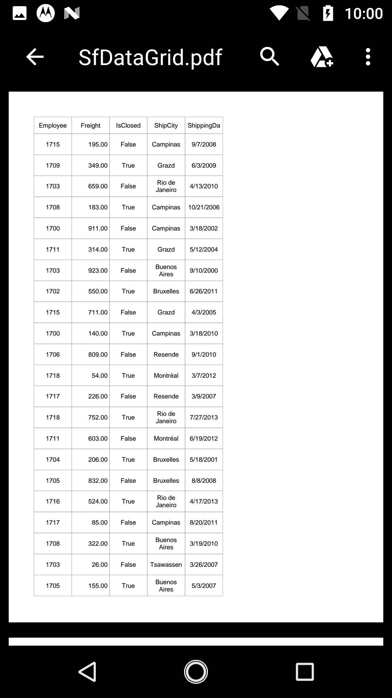

#### PdfDocument

`DataGridPdfExportOption.PdfDocument` allow to export the SfDataGrid with existing PdfDocument. 


DataGridPdfExportOption option = new DataGridPdfExportOption();
PdfDocument pdfDocument = new PdfDocument();
pdfDocument.Pages.Add();
pdfDocument.Pages.Add();
pdfDocument.Pages.Add();
option.StartPageIndex = 1;
option.PdfDocument = pdfDocument;


#### RepeatHeaders

You can export the column headers on each page by setting `RepeatHeaders` as `True`.


private void PDFExport_Clicked(object sender, EventArgs e)
{
    DataGridPdfExportingController pdfExport = new DataGridPdfExportingController();
    MemoryStream stream = new MemoryStream();
    DataGridPdfExportOption option = new DataGridPdfExportOption();
    option.RepeatHeaders = true;
    var exportToPdf = pdfExport.ExportToPdf(this.dataGrid, option);
    exportToPdf.Save(stream);
    exportToPdf.Close(true);
    Xamarin.Forms.DependencyService.Get<ISave>().Save("DataGrid.pdf", "application/pdf", stream);
}


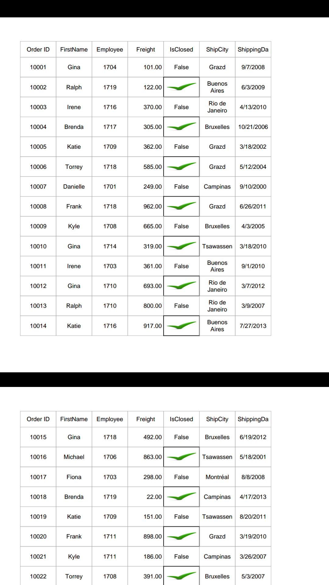

#### Exclude groups while exporting

By default, all the groups in data grid will be exported to PDF. If you want to export the data grid without Groups, you need to set `ExportGroups` property as `false`.


private void PDFExport_Clicked(object sender, EventArgs e)
{
    DataGridPdfExportingController pdfExport = new DataGridPdfExportingController();
    MemoryStream stream = new MemoryStream();
    DataGridPdfExportOption option = new DataGridPdfExportOption();
    option.ExportGroups = true;
    var exportToPdf = pdfExport.ExportToPdf(this.dataGrid, option);
    exportToPdf.Save(stream);
    exportToPdf.Close(true);
    Xamarin.Forms.DependencyService.Get<ISave>().Save("DataGrid.pdf", "application/pdf", stream);
}


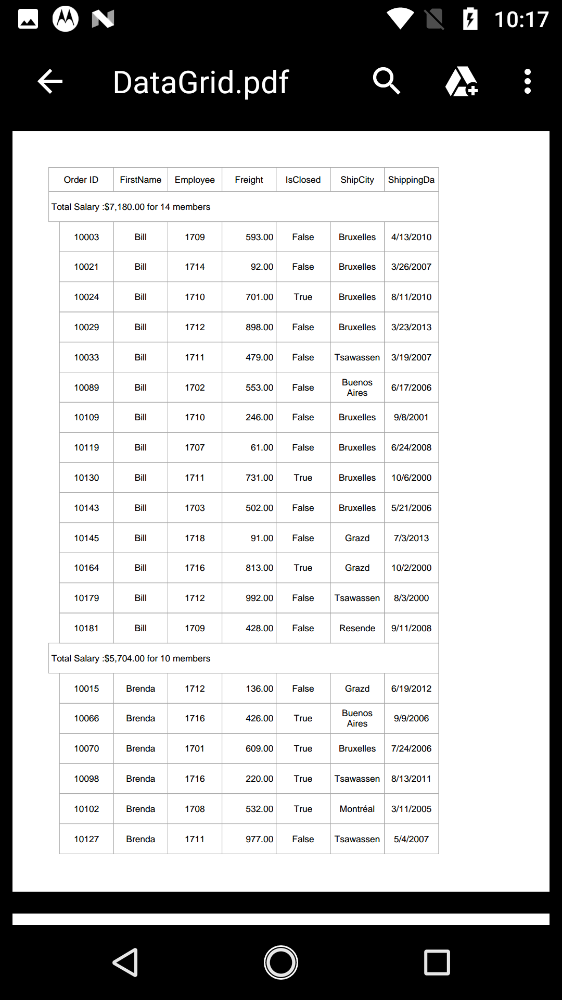

#### Exclude column header while exporting

By default, column header will be exported to PDF. If you want to export without column header, you need to set `ExportHeader` property as `false`.


private void PDFExport_Clicked(object sender, EventArgs e)
{
    DataGridPdfExportingController pdfExport = new DataGridPdfExportingController();
    MemoryStream stream = new MemoryStream();
    DataGridPdfExportOption option = new DataGridPdfExportOption();
    option.ExportHeader = false;
    var exportToPdf = pdfExport.ExportToPdf(this.dataGrid, option);
    exportToPdf.Save(stream);
    exportToPdf.Close(true);
    Xamarin.Forms.DependencyService.Get<ISave>().Save("DataGrid.pdf", "application/pdf", stream);
}


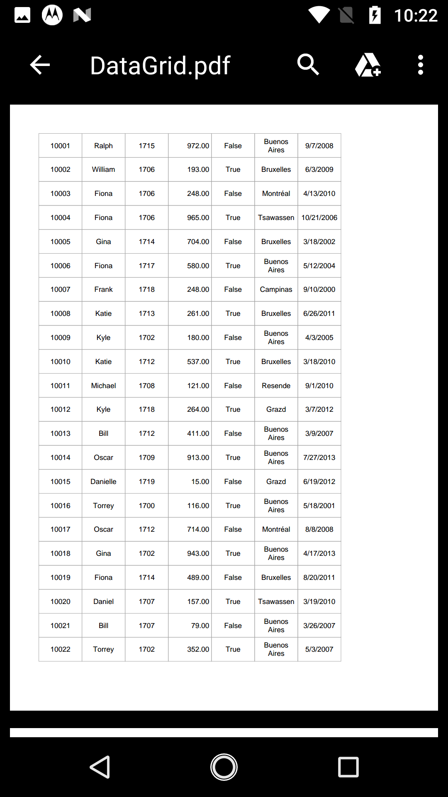

#### Exclude table Summaries while exporting

By default, table summaries in data grid will be exported to PDF. If you want to export without table summaries, you need to set `ExportTableSummary` property as `false`.


private void PDFExport_Clicked(object sender, EventArgs e)
{
    DataGridPdfExportingController pdfExport = new DataGridPdfExportingController();
    MemoryStream stream = new MemoryStream();
    DataGridPdfExportOption option = new DataGridPdfExportOption();
    option.ExportTableSummary = true;
    var exportToPdf = pdfExport.ExportToPdf(this.dataGrid, option);
    exportToPdf.Save(stream);
    exportToPdf.Close(true);
    Xamarin.Forms.DependencyService.Get<ISave>().Save("DataGrid.pdf", "application/pdf", stream);
}


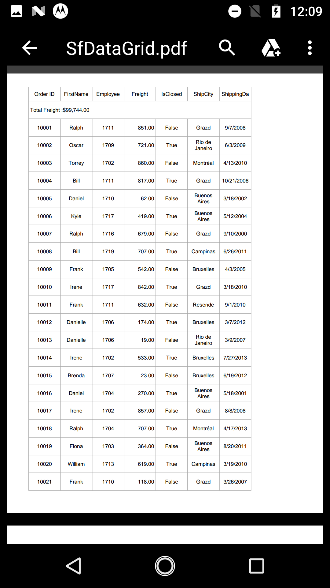

#### Exporting SfDataGrid from particular starting page

SfDataGrid allows to export the data from a particular staring position using the below option

* StartPageIndex
* StartPoint 

##### StartPageIndex 

SfDataGrid allows to export the data from a particular staring page by using the `StartPageIndex` property.


private void PDFExport_Clicked(object sender, EventArgs e)
{
    DataGridPdfExportingController pdfExport = new DataGridPdfExportingController();
    MemoryStream stream = new MemoryStream();
    PdfDocument pdfDocument = new PdfDocument();
    pdfDocument.Pages.Add();
    pdfDocument.Pages.Add();
    pdfDocument.Pages.Add();
    DataGridPdfExportOption option = new DataGridPdfExportOption();
    option.PdfDocument = pdfDocument;
    option.StartPageIndex = 1;
    var exportToPdf = pdfExport.ExportToPdf(this.dataGrid, option);
    exportToPdf.Save(stream);
    exportToPdf.Close(true);
    Xamarin.Forms.DependencyService.Get<ISave>().Save("DataGrid.pdf", "application/pdf", stream);
}

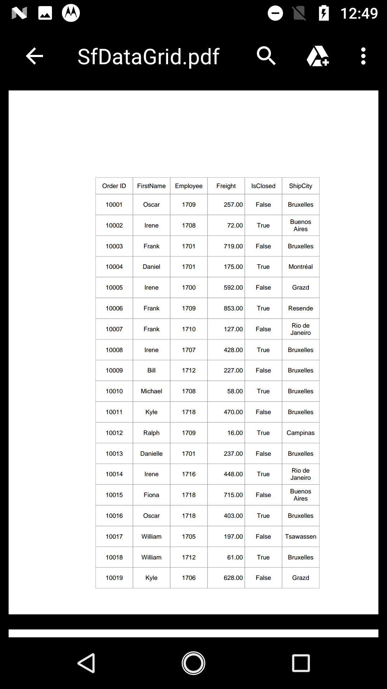

##### StartPoint

SfDataGrid allows to export the data from a particular staring point by using the `StartPoint` property.


private void PDFExport_Clicked(object sender, EventArgs e)
{
    DataGridPdfExportingController pdfExport = new DataGridPdfExportingController();
    MemoryStream stream = new MemoryStream();
    DataGridPdfExportOption option = new DataGridPdfExportOption();
    option.StartPoint = new PointF(0, 500);
    var exportToPdf = pdfExport.ExportToPdf(this.dataGrid, option);
    exportToPdf.Save(stream);
    exportToPdf.Close(true);
    Xamarin.Forms.DependencyService.Get<ISave>().Save("DataGrid1.pdf", "application/pdf", stream);
}


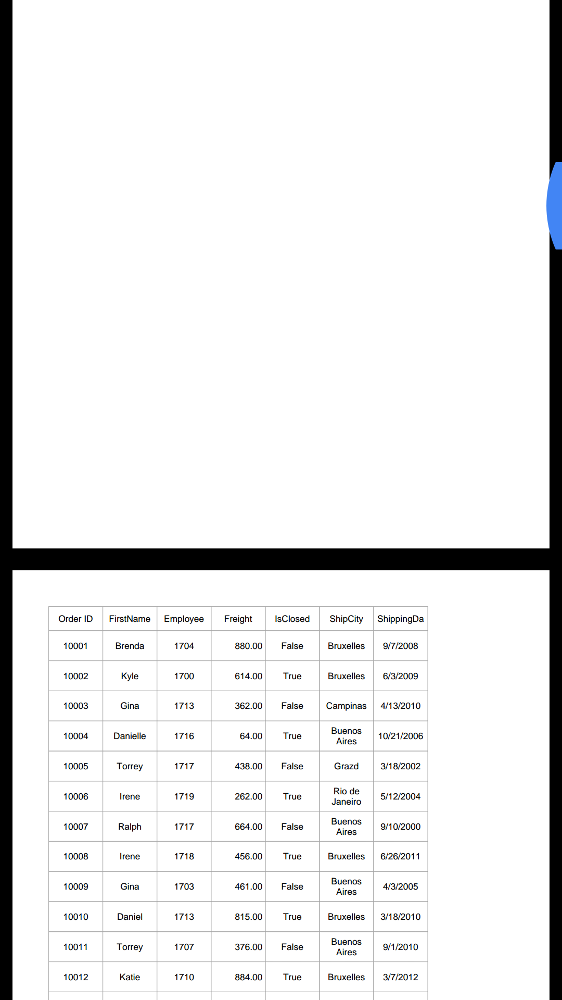

#### ApplyGridStyle

SfDataGrid allows to export the data with GridStyle by setting `ApplyGridStyle` as `true`. By default data has been export without the GridStyle. 


private void PDFExport_Clicked(object sender, EventArgs e)
{
    DataGridPdfExportingController pdfExport = new DataGridPdfExportingController();
    MemoryStream stream = new MemoryStream();
    DataGridPdfExportOption option = new DataGridPdfExportOption();
    option.ApplyGridStyle = true;
    var exportToPdf = pdfExport.ExportToPdf(this.dataGrid, option);
    exportToPdf.Save(stream);
    exportToPdf.Close(true);
    Xamarin.Forms.DependencyService.Get<ISave>().Save("DataGrid1.pdf", "application/pdf", stream);
}


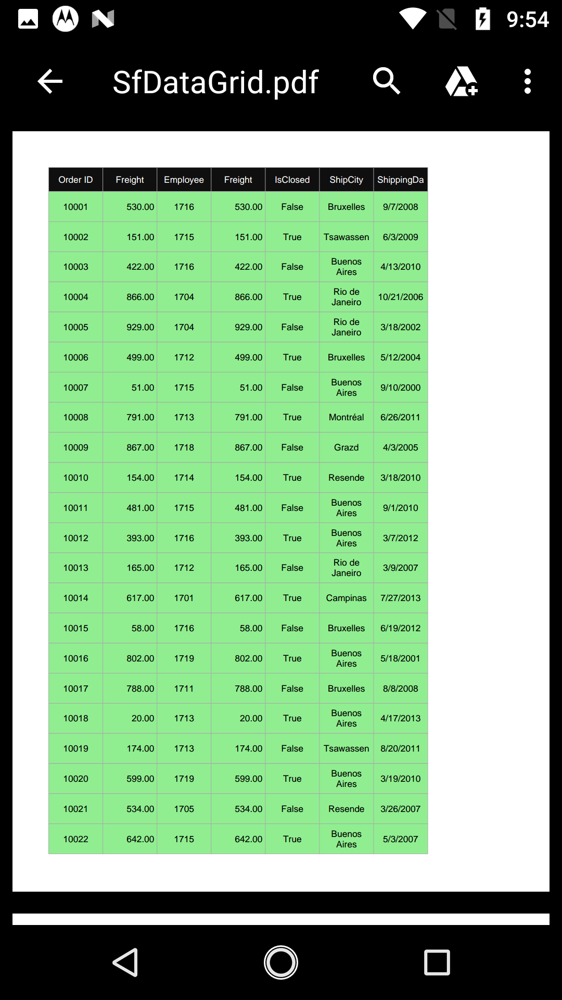

Also SfDataGrid allow to customize the below styles while exporting to PDF

* BottomTableSummaryStyle 
* GroupCaptionStyle
* HeaderStyle
* RecordStyle 
* TopTableSummaryStyle

#### BottomTableSummaryStyle

SfDataGrid provides support to export the bottom TableSummary with custom style by using `BottomTableSummaryStyle` property.


DataGridPdfExportOption option = new DataGridPdfExportOption();
option.BottomTableSummaryStyle = new PdfGridCellStyle()
{
    BackgroundBrush = PdfBrushes.Gray,
    Borders = new PdfBorders() { Bottom = PdfPens.Aqua, Left = PdfPens.AliceBlue, Right = PdfPens.Red, Top = PdfPens.RoyalBlue },
    CellPadding = new PdfPaddings(2, 2, 2, 2),
    TextBrush = PdfBrushes.Yellow,
    TextPen = PdfPens.Green,
    StringFormat = new PdfStringFormat() { Alignment = PdfTextAlignment.Right, CharacterSpacing = 3f, WordSpacing = 10f }
};


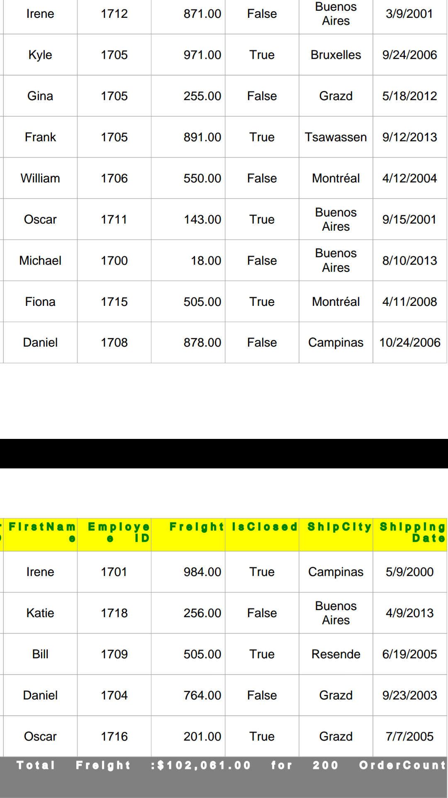

#### GroupCaptionStyle

SfDataGrid provides support to export the group caption text with custom style by using `GroupCaptionStyle` property.


DataGridPdfExportOption option = new DataGridPdfExportOption();
option.GroupCaptionStyle = new PdfGridCellStyle
{
    BackgroundBrush = PdfBrushes.White,
    Borders = new PdfBorders() { Bottom = PdfPens.Aqua, Left = PdfPens.AliceBlue, Right = PdfPens.Red, Top = PdfPens.RoyalBlue },
    CellPadding = new PdfPaddings(3, 3, 3, 3),
    TextBrush = PdfBrushes.Red,
    TextPen = PdfPens.Green,
    StringFormat = new PdfStringFormat() { Alignment = PdfTextAlignment.Right, CharacterSpacing = 3f, WordSpacing = 10f }
};


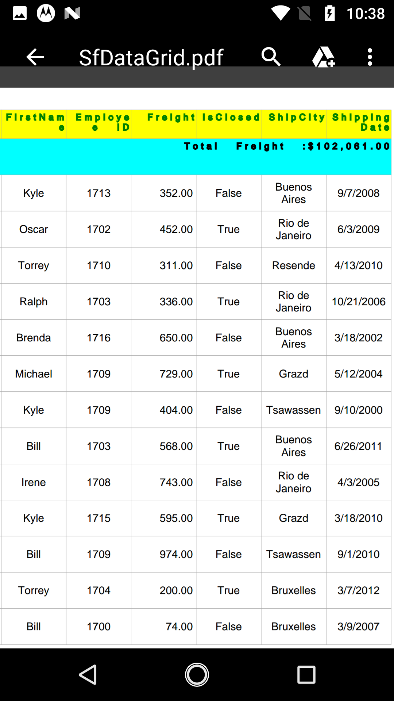

#### HeaderStyle

SfDataGrid allow to export the column header with custom style by using `HeaderStyle` property.


DataGridPdfExportOption option = new DataGridPdfExportOption();
option.HeaderStyle = new PdfGridCellStyle()
{
    BackgroundBrush = PdfBrushes.Yellow,
    Borders = new PdfBorders() { Bottom = PdfPens.Aqua, Left = PdfPens.AliceBlue, Right = PdfPens.Red, Top = PdfPens.RoyalBlue },
    CellPadding = new PdfPaddings(2, 2, 2, 2),
    TextBrush = PdfBrushes.Red,
    TextPen = PdfPens.Green,
    StringFormat = new PdfStringFormat() { Alignment = PdfTextAlignment.Right, CharacterSpacing = 3f, WordSpacing = 10f }
};


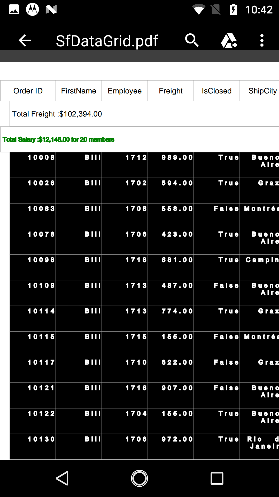

#### RecordStyle 

SfDataGrid allow to export the records with custom style by using `RecordStyle` property.


DataGridPdfExportOption option = new DataGridPdfExportOption();
option.RecordStyle = new PdfGridCellStyle()
{
    BackgroundBrush = PdfBrushes.Red,
    Borders = new PdfBorders() { Bottom = PdfPens.Aqua, Left = PdfPens.AliceBlue, Right = PdfPens.Red, Top = PdfPens.RoyalBlue },
    CellPadding = new PdfPaddings(2, 2, 2, 2),
    TextBrush = PdfBrushes.White,
    TextPen = PdfPens.Green,
    StringFormat = new PdfStringFormat() { Alignment = PdfTextAlignment.Right, CharacterSpacing = 3f, WordSpacing = 10f }
};


#### TopTableSummaryStyle

SfDataGrid provides support to export the top TableSummary with custom style by using `TopTableSummaryStyle` property.


DataGridPdfExportOption option = new DataGridPdfExportOption();
option.TopTableSummaryStyle = new PdfGridCellStyle()
{
    BackgroundBrush = PdfBrushes.Gray,
    Borders = new PdfBorders() { Bottom = PdfPens.Aqua, Left = PdfPens.AliceBlue, Right = PdfPens.Red, Top = PdfPens.RoyalBlue },
    CellPadding = new PdfPaddings(2, 2, 2, 2),
    TextBrush = PdfBrushes.Yellow,
    TextPen = PdfPens.Green,
    StringFormat = new PdfStringFormat() { Alignment = PdfTextAlignment.Right, CharacterSpacing = 3f, WordSpacing = 10f }
};


#### Customizing borders

SfDataGrid allows to customize the grid borders by using `GridLineType` property. Following are the lists of options available to customize the grid borders.

* Both
* Horizontal
* Vertical
* None

##### Both

`GridLineType.Both` allows you to export the data grid with both Horizontal and Vertical borders.


DataGridPdfExportOption option = new DataGridPdfExportOption();
option.GridLineType = GridLineType.Both;


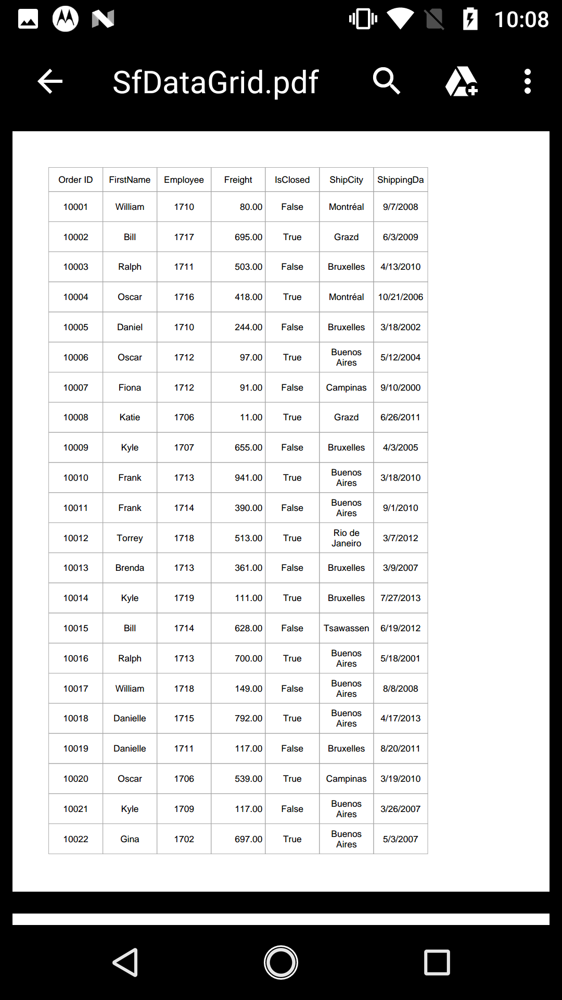

##### Horizontal

`GridLineType.Horizontal` allows you to export the data grid with Horizontal border only.


DataGridPdfExportOption option = new DataGridPdfExportOption();
option.GridLineType = GridLineType.Horizontal;


##### Vertical

`GridLineType.Vertical` allows you to export the data grid with Vertical border only.


DataGridPdfExportOption option = new DataGridPdfExportOption();
option.GridLineType = GridLineType.Vertical;


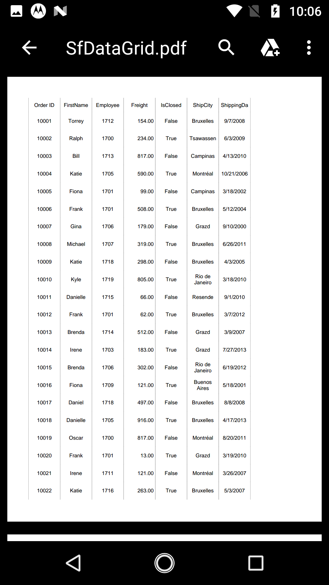

##### None

`GridLineType.None` allows you to export the data grid without borders.


DataGridPdfExportOption option = new DataGridPdfExportOption();
option.GridLineType = GridLineType.None;


#### ExportAllPages

When you are using SfDataPager inside the SfDataGrid and while exporting to PDF, it will be export only the current page. Also you can export all the pages by setting the `DataGridPdfExportOption.ExportAllPages` to true. The default value for this property is false.


DataGridPdfExportOption option = new DataGridPdfExportOption();
option.ExportAllPages = true;


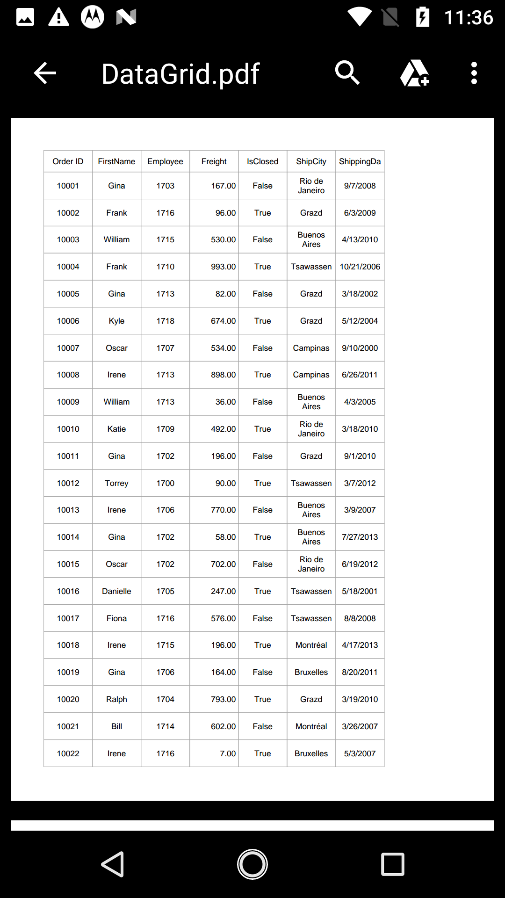

* ExportAllPages = true;

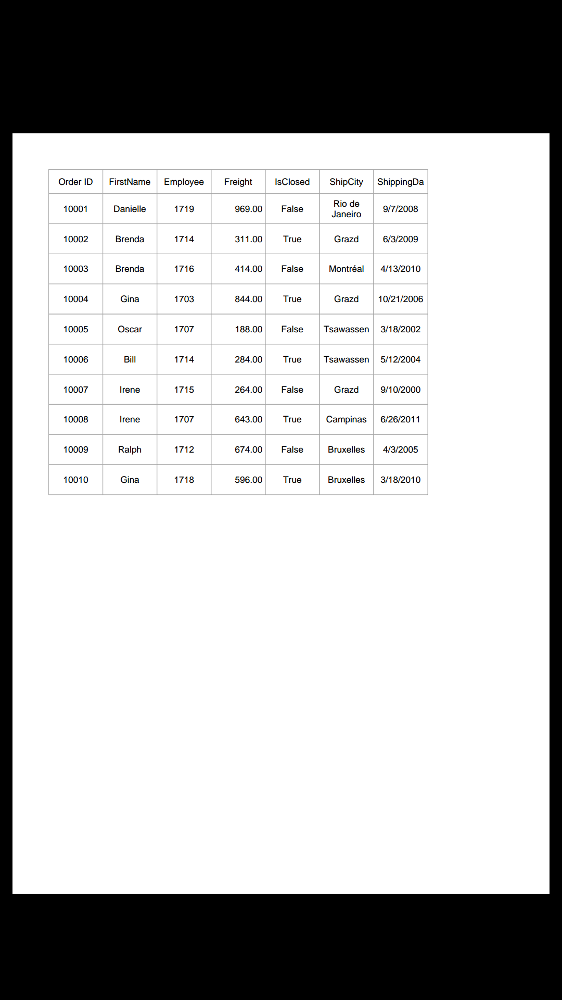

#### ExportColumnWidth

By default data grid will be export to PDF with PDF file default column width. But you can also export the data grid to PDF with same SfDataGrid column width value in PDF file column width also by setting `ExportColumnWidth` as `true`. ExportColumnWidth property default value is false.


DataGridPdfExportOption option = new DataGridPdfExportOption();
option.ExportColumnWidth = true;


#### ExportRowHeight

By default data grid will be export to PDF with PDF file default row height. But you can also export the data grid to PDF with same SfDataGrid RowHeight value in PDF file row height also by setting `ExportRowHeight` as `true`. ExportRowHeight property default value is false.


DataGridPdfExportOption option = new DataGridPdfExportOption();
option.ExportRowHeight = true;


#### DefaultColumnWidth

SfDataGrid allow you to customize the column width in PDF file based on our requirement by using `DefaultColumnWidth` property. 


DataGridPdfExportOption option = new DataGridPdfExportOption();
option.DefaultColumnWidth = 100;


### DefaultRowHeight

SfDataGrid allow you to customize the row height in PDF file based on our requirement by using `DefaultRowHeight` property. 


DataGridPdfExportOption option = new DataGridPdfExportOption();
option.DefaultRowHeight = 50;


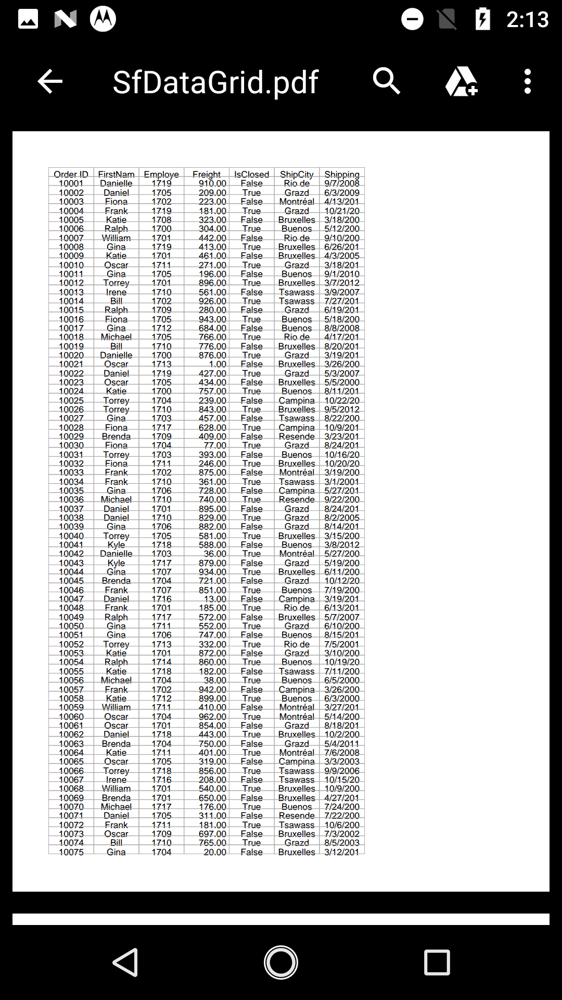

### PDF page orientation change

You can change the page orientation of PDF while exporting. The default page orientation is Portrait.

To change the page orientation, you need to get the exported PdfGrid by using ExportToPdfGrid method and then draw that PdfGrid into a PdfDocument by changing the PageSettings.Orientation property of PdfDocument.


DataGridPdfExportOption option = new DataGridPdfExportOption();
PdfDocument pdfDocument = new PdfDocument();
pdfDocument.PageSettings.Orientation = PdfPageOrientation.Landscape;
//pdfDocument.PageSettings.Orientation = PdfPageOrientation.Portrait;
option.PdfDocument = pdfDocument;


### Setting Header and Footer

SfDataGrid provides a way to display additional content at the top (Header) or bottom (Footer) of the page while exporting to PDF. This can be achieved by handling `DataGridPdfExportingController.HeaderAndFooterExporting` event.

You can insert the string in header and footer in PdfHeaderFooterEventHandler. Setting `PdfPageTemplateElement` to `PdfHeaderFooterEventArgs.PdfDocumentTemplate.Top` loads the content at top of the page and setting the `PdfPageTemplateElement` to  `PdfHeaderFooterEventArgs.PdfDocumentTemplate.Bottom` loads the content at bottom of the page.


DataGridPdfExportingController pdfExport = new DataGridPdfExportingController();
pdfExport.HeaderAndFooterExporting += PdfExport_HeaderAndFooterExporting;

private void PdfExport_HeaderAndFooterExporting(object sender, PdfHeaderFooterEventArgs e)
{
    PdfFont font = new PdfStandardFont(PdfFontFamily.TimesRoman, 20f, PdfFontStyle.Bold);
    var width = e.PdfPage.GetClientSize().Width;
    PdfPageTemplateElement header = new PdfPageTemplateElement(width, 38);
    header.Graphics.DrawString("Order Details", font, PdfPens.Black, 70, 3);
    e.PdfDocumentTemplate.Top = header;

    PdfPageTemplateElement footer = new PdfPageTemplateElement(width, 38);
    footer.Graphics.DrawString("Order Details", font, PdfPens.Black, 70, 3);
    e.PdfDocumentTemplate.Bottom = footer;
}


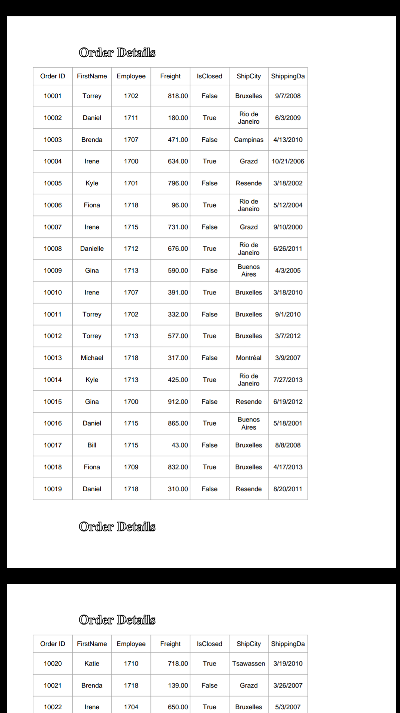

## Save a file

The below code snippet explains how to save the converted PDF document in our local device.


// Need to define the Interfaces in-order to use it in platform wise using Dependency Service
public interface ISave
{
    void Save(string filename, string contentType, MemoryStream stream);
}
public interface ISaveWindows
{
    Task Save(string filename, string contentType, MemoryStream stream);
}

// In Android renderer project
public class SaveAndroid : ISave
{
    public void Save(string filename, string contentType, MemoryStream stream)
    {
        string exception = string.Empty;
        string root = null;
        if (Android.OS.Environment.IsExternalStorageEmulated)
        {
            root = Android.OS.Environment.ExternalStorageDirectory.ToString();
        }
        else
            root = Environment.GetFolderPath(Environment.SpecialFolder.MyDocuments);

        Java.IO.File myDir = new Java.IO.File(root + "/Syncfusion");
        myDir.Mkdir();
        Java.IO.File file = new Java.IO.File(myDir, filename);
        
        if (file.Exists()) file.Delete();
        
        try
        {
            FileOutputStream outs = new FileOutputStream(file);
            outs.Write(stream.ToArray());
            outs.Flush();
            outs.Close();
        }
        catch (Exception e)
        {
            exception = e.ToString();
        }
        if (file.Exists() && contentType != "application/html")
        {
            Android.Net.Uri path = Android.Net.Uri.FromFile(file);
            string extension = Android.Webkit.MimeTypeMap.GetFileExtensionFromUrl(Android.Net.Uri.FromFile(file).ToString());
            string mimeType = Android.Webkit.MimeTypeMap.Singleton.GetMimeTypeFromExtension(extension);
            Intent intent = new Intent(Intent.ActionView);
            intent.SetDataAndType(path, mimeType);
            Forms.Context.StartActivity(Intent.CreateChooser(intent, "Choose App"));
        }
    }
}

// In iOS renderer project
public class SaveIOS : ISave
{
    void ISave.Save(string filename, string contentType, MemoryStream stream)
    {
        string exception = string.Empty;
        string path = Environment.GetFolderPath(Environment.SpecialFolder.Personal);
        string filePath = Path.Combine(path, filename);
        try
        {
            FileStream fileStream = File.Open(filePath, FileMode.Create);
            stream.Position = 0;
            stream.CopyTo(fileStream);
            fileStream.Flush();
            fileStream.Close();
        }
        catch (Exception e)
        {
            exception = e.ToString();
        }
        
        if (contentType == "application/html" || exception != string.Empty)
            return;
        
        UIViewController currentController = UIApplication.SharedApplication.KeyWindow.RootViewController;
        while (currentController.PresentedViewController != null)
            currentController = currentController.PresentedViewController;
        UIView currentView = currentController.View;

        QLPreviewController previewController = new QLPreviewController();
        QLPreviewItem item = new QLPreviewItemBundle(filename, filePath);
        previewController.DataSource = new PreviewControllerDS(item);

        currentController.PresentViewController((UIViewController)previewController, true, (Action)null);
    }
}

public class PreviewControllerDS : QLPreviewControllerDataSource
{
    private QLPreviewItem _item;

    public PreviewControllerDS(QLPreviewItem item)
    {
        _item = item;
    }

    public override nint PreviewItemCount (QLPreviewController controller)
    {
        return (nint)1;
    }

    public override IQLPreviewItem GetPreviewItem (QLPreviewController controller, nint index)
    {
        return _item;
    }
}

public class QLPreviewItemFileSystem : QLPreviewItem
{
    string _fileName, _filePath;

    public QLPreviewItemFileSystem(string fileName, string filePath)
    {
        _fileName = fileName;
        _filePath = filePath;
    }

    public override string ItemTitle
    {
        get
        {
            return _fileName;
        }
    }
    public override NSUrl ItemUrl
    {
        get
        {
            return NSUrl.FromFilename(_filePath);
        }
    }
}

public class QLPreviewItemBundle : QLPreviewItem
{
    string _fileName, _filePath;
    public QLPreviewItemBundle(string fileName, string filePath)
    {
        _fileName = fileName;
        _filePath = filePath;
    }

    public override string ItemTitle
    {
        get
        {
            return _fileName;
        }
    }
    public override NSUrl ItemUrl
    {
        get
        {
            var documents = NSBundle.MainBundle.BundlePath;
            var lib = Path.Combine(documents, _filePath);
            var url = NSUrl.FromFilename(lib);
            return url;
        }
    }
}

// In UWP renderer project
public class SaveWindows : ISaveWindows
{
    public async Task Save(string filename, string contentType, MemoryStream stream)
    {
        if (Device.Idiom != TargetIdiom.Desktop)
        {
            StorageFolder local = Windows.Storage.ApplicationData.Current.LocalFolder;
            StorageFile outFile = await local.CreateFileAsync(filename, CreationCollisionOption.ReplaceExisting);
            using (Stream outStream = await outFile.OpenStreamForWriteAsync())
            {
                outStream.Write(stream.ToArray(), 0, (int)stream.Length);
            }
            if (contentType != "application/html")
                await Windows.System.Launcher.LaunchFileAsync(outFile);
        }
        else
        {
            StorageFile storageFile = null;
            FileSavePicker savePicker = new FileSavePicker();
            savePicker.SuggestedStartLocation = PickerLocationId.Desktop;
            savePicker.SuggestedFileName = filename;
            switch (contentType)
            {
                case "application/vnd.openxmlformats-officedocument.presentationml.presentation":
                    savePicker.FileTypeChoices.Add("PowerPoint Presentation", new List<string>() { ".pptx", });
                    break;

                case "application/msexcel":
                    savePicker.FileTypeChoices.Add("Excel Files", new List<string>() { ".xlsx", });
                    break;

                case "application/msword":
                    savePicker.FileTypeChoices.Add("Word Document", new List<string>() { ".docx" });
                    break;

                case "application/pdf":
                    savePicker.FileTypeChoices.Add("Adobe PDF Document", new List<string>() { ".pdf" });
                    break;
                
                case "application/html":
                    savePicker.FileTypeChoices.Add("HTML Files", new List<string>() { ".html" });
                    break;
            }
            storageFile = await savePicker.PickSaveFileAsync();

            using (Stream outStream = await storageFile.OpenStreamForWriteAsync())
            {
                outStream.Write(stream.ToArray(), 0, (int)stream.Length);
                outStream.Flush();
                outStream.Dispose();
            }
            stream.Flush();
            stream.Dispose();
            await Windows.System.Launcher.LaunchFileAsync(storageFile);
        }
    }
}


## Events

The SfDataGrid provides you the following events for exporting:

* [RowExporting](http://help.syncfusion.com/cr/cref_files/xamarin/sfgridconverter/Syncfusion.SfGridConverter.XForms~Syncfusion.SfDataGrid.XForms.Exporting.DataGridPdfExportingController~RowExporting_EV.html) – This event is raised while exporting a row at the execution time before the row is exported.
* [CellExporting](http://help.syncfusion.com/cr/cref_files/xamarin/sfgridconverter/Syncfusion.SfGridConverter.XForms~Syncfusion.SfDataGrid.XForms.Exporting.DataGridPdfExportingController~CellExporting_EV.html) – This event is raised while exporting a cell at the execution time before the cell is exported.

### RowExporting

The [DataGridRowPdfExportingEventHandler](http://help.syncfusion.com/cr/cref_files/xamarin/sfgridconverter/Syncfusion.SfGridConverter.XForms~Syncfusion.SfDataGrid.XForms.Exporting.DataGridRowPdfExportingEventhandler.html) delegate allows you to customize the styles for record rows and group caption rows. The `RowExporting` event is triggered with [DataGridRowPdfExportingEventArgs](http://help.syncfusion.com/cr/cref_files/xamarin/sfgridconverter/Syncfusion.SfGridConverter.XForms~Syncfusion.SfDataGrid.XForms.Exporting.DataGridRowPdfExportingEventArgs.html) that contains the following properties:

* [PdfGrid](http://help.syncfusion.com/cr/cref_files/xamarin/sfgridconverter/Syncfusion.SfGridConverter.XForms~Syncfusion.SfDataGrid.XForms.Exporting.DataGridRowPdfExportingEventArgs~PdfGrid.html) – You can use this property to customize the PdfGrid’s properties such as `Background`, `CellPadding`, `CellSpacing` etc.
* [PdfRow](http://help.syncfusion.com/cr/cref_files/xamarin/sfgridconverter/Syncfusion.SfGridConverter.XForms~Syncfusion.SfDataGrid.XForms.Exporting.DataGridRowPdfExportingEventArgs~PdfRow.html) – Specifies the `PDFGridRow` to be exported. You can use this to customize the properties of particular row. 
* [Record](http://help.syncfusion.com/cr/cref_files/xamarin/sfgridconverter/Syncfusion.SfGridConverter.XForms~Syncfusion.SfDataGrid.XForms.Exporting.DataGridRowPdfExportingEventArgs~PdfRow.html) – Gets the collection of underlying data objects that are exported.
* [RowType](http://help.syncfusion.com/cr/cref_files/xamarin/sfgridconverter/Syncfusion.SfGridConverter.XForms~Syncfusion.SfDataGrid.XForms.Exporting.DataGridRowPdfExportingEventArgs~RowType.html) – Specifies the row type by using `ExportRowType` `Enum`. You can use this property to check the row type and apply different styles based on the row type.

You can use this event to customize the properties of the grid rows that are exported to PDF. The following code example illustrates how to change the background color of the record rows and caption summary rows while exporting.


//HandlingRowExportingEvent for exporting to PDF
DataGridPdfExportingController pdfExport = new DataGridPdfExportingController ();
pdfExport.RowExporting += pdfExport_RowExporting; 

void pdfExport_RowExporting (object sender, DataGridRowPdfExportingEventArgs e)
{
    if (e.RowType == ExportRowType.Record) {
        if ((e.Record.Data as OrderInfo).IsClosed)
            e.PdfRow.Style.BackgroundBrush = PdfBrushes.Yellow;
        else
        e.PdfRow.Style.BackgroundBrush = PdfBrushes.LightGreen;
    }

    if (e.RowType == ExportRowType.CaptionSummary) {
        e.PdfRow.Style.BackgroundBrush = PdfBrushes.LightGray;
    }
} 


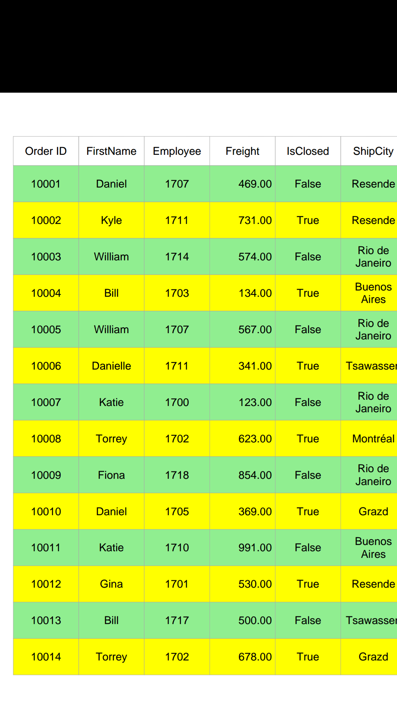

### CellExporting

The [DataGridCellPdfExportingEventHandler](http://help.syncfusion.com/cr/cref_files/xamarin/sfgridconverter/Syncfusion.SfGridConverter.XForms~Syncfusion.SfDataGrid.XForms.Exporting.DataGridCellPdfExportingEventhandler.html) delegate allows you to customize the styles for header cells, record cells and group caption cells. The `CellExporting` event is triggered with [DataGridCellPdfExportingEventArgs](http://help.syncfusion.com/cr/cref_files/xamarin/sfgridconverter/Syncfusion.SfGridConverter.XForms~Syncfusion.SfDataGrid.XForms.Exporting.DataGridCellPdfExportingEventArgs.html) that contains the following properties:

* [CellType](http://help.syncfusion.com/cr/cref_files/xamarin/sfgridconverter/Syncfusion.SfGridConverter.XForms~Syncfusion.SfDataGrid.XForms.Exporting.DataGridCellPdfExportingEventArgs~CellType.html) – Specifies the cell type by using `ExportCellType` `Enum`. You can use this property to check the cell type and apply different cell styles based on the cell type.
* [CellValue](http://help.syncfusion.com/cr/cref_files/xamarin/sfgridconverter/Syncfusion.SfGridConverter.XForms~Syncfusion.SfDataGrid.XForms.Exporting.DataGridCellPdfExportingEventArgs~CellValue.html) – Contains the actual value that is exported to the PDF. You can use this value to apply formatting in PDF using `Range` property.
* [ColumnName](http://help.syncfusion.com/cr/cref_files/xamarin/sfgridconverter/Syncfusion.SfGridConverter.XForms~Syncfusion.SfDataGrid.XForms.Exporting.DataGridCellPdfExportingEventArgs~CellValue.html ) – Specifies the column name (MappingName) of the exporting cell. You can apply formatting for a particular column by checking the `ColumnName`.
* [Handled](http://help.syncfusion.com/cr/cref_files/xamarin/sfgridconverter/Syncfusion.SfGridConverter.XForms~Syncfusion.SfDataGrid.XForms.Exporting.DataGridCellPdfExportingEventArgs~Handled.html) – Determines whether the cell is exported to PDF or not.
* [PdfGrid](http://help.syncfusion.com/cr/cref_files/xamarin/sfgridconverter/Syncfusion.SfGridConverter.XForms~Syncfusion.SfDataGrid.XForms.Exporting.DataGridCellPdfExportingEventArgs~Handled.html) – Specifies the `PDFGridCell` to be exported. You can use this to customize the properties (Background, Foreground, Font, Alignment etc.,) of particular cell.
* [Record](http://help.syncfusion.com/cr/cref_files/xamarin/sfgridconverter/Syncfusion.SfGridConverter.XForms~Syncfusion.SfDataGrid.XForms.Exporting.DataGridCellPdfExportingEventArgs~Record.html) – Gets the collection of underlying data objects that are exported.

You can use this event to customize the properties of the grid cells that are exported to PDF. The following code example illustrates how to customize the background color, foreground color and cell value of the header cells, record cells and caption summary cells while exporting.


//HandlingCellExportingEvent for exporting to PDF
DataGridPdfExportingController pdfExport = new DataGridPdfExportingController ();
pdfExport.CellExporting += pdfExport_CellExporting;  

void pdfExport_CellExporting(object sender, DataGridCellPdfExportingEventArgs e)
{
    if (e.CellType == ExportCellType.HeaderCell)
    {
        e.PdfGridCell.Style.BackgroundBrush = PdfBrushes.LightPink;
        e.PdfGridCell.Style.TextBrush = PdfBrushes.Blue;
    }

    if (e.CellType == ExportCellType.RecordCell)
    {
        e.PdfGridCell.Style.BackgroundBrush = PdfBrushes.LightGreen;
        e.PdfGridCell.Style.TextBrush = PdfBrushes.Red;
    }

    if (e.CellType == ExportCellType.GroupCaptionCell)
    {
        e.PdfGridCell.Style.BackgroundBrush = PdfBrushes.Gray;
        e.PdfGridCell.Style.TextBrush = PdfBrushes.White;
    }
}


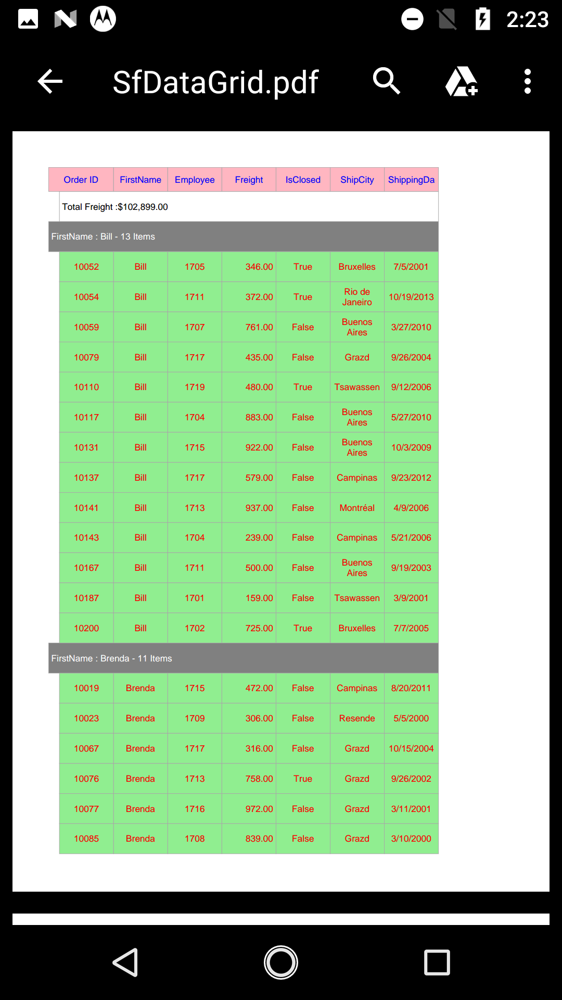

## Exporting unbound columns

`SfDataGrid.GridUnboundColumns` will be exported as like [SfDataGrid.GridTextColumns](http://help.syncfusion.com/cr/cref_files/xamarin/sfdatagrid/Syncfusion.SfDataGrid.XForms~Syncfusion.SfDataGrid.XForms.GridTextColumn.html) without any specific codes. You can customize the `SfDataGrid.GridUnboundColumns` as like `SfDataGrid.GridTextColumns` using `CellExporting` and `RowExporting` events.

The below code illustrates how to create and export unbound columns.


<sfgrid:GridUnboundColumn Expression="OrderID * 12"
                          HeaderFontAttribute="Bold"
                          HeaderText="Unbound"
                          HeaderTextAlignment="Start"
                          MappingName="Unbound"
                          Padding="5, 0, 0, 0"
                          TextAlignment="Start">
</sfgrid:GridUnboundColumn>


The below screenshot shows that the unbound column is exported to PDF document along with text columns.

The below screenshot shows that the unbound column is exported to excel sheet along with text columns.

## Embedding fonts in PDF file

By default, some fonts (such as Unicode font) are not supported in PDF. In this case, it is possible to embed the font in PDF document with the help of PdfTrueTypeFont.


Stream fontStream = typeof(App).GetTypeInfo().Assembly.GetManifestResourceStream("SfDataGridSample.Pacifico.ttf");
private void PdfExport_CellExporting(object sender, DataGridCellPdfExportingEventArgs e)
{
    if (e.CellValue != null)
    {
        PdfFont font = e.PdfGridCell.Style.Font;
        if (font != null)
        {
            PdfTrueTypeFont unicodeFont = new PdfTrueTypeFont(fontStream, font.Size, font.Style);
            e.PdfGridCell.Style.Font = unicodeFont;
        }
    }
}


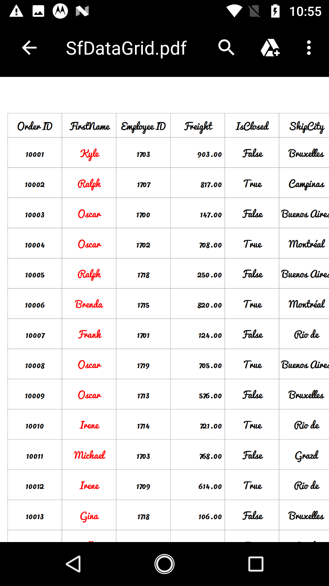

## Customize cell values while exporting

You can customize the call values while exporting to PDF by handling `CellExporting` event.


DataGridPdfExportingController pdfExport = new DataGridPdfExportingController();
pdfExport.CellExporting += PdfExport_CellExporting;
private void PdfExport_CellExporting(object sender, DataGridCellPdfExportingEventArgs e)
{
    if (e.CellType == ExportCellType.RecordCell && e.ColumnName == "IsClosed")
    {
        if ((bool)e.CellValue)
            e.CellValue = "Y";
        else
            e.CellValue = "N";
    }
}


In the below screenshot IsClosed column value has been changed based on the condition.

## Changing row style in PDF based on data

You can customize the row style based on the data while exporting to PDF by handling `RowExporting` event.


DataGridPdfExportingController pdfExport = new DataGridPdfExportingController();
pdfExport.RowExporting += PdfExport_RowExporting;
private void PdfExport_RowExporting(object sender, DataGridRowPdfExportingEventArgs e)
{
    if (!(e.Record.Data is OrderInfo))
        return;

    if (e.RowType == ExportRowType.Record)
    {
        if ((e.Record.Data as OrderInfo).IsClosed)
            e.PdfRow.Style.BackgroundBrush = PdfBrushes.Yellow;
        else
            e.PdfRow.Style.BackgroundBrush = PdfBrushes.LightGreen;
    }
}


## Customize the cells based on Column Name

You can customize the column style based on the data while exporting to PDF by handling `CellExporting` event.


DataGridPdfExportingController pdfExport = new DataGridPdfExportingController();
pdfExport.CellExporting += PdfExport_CellExporting;
private void PdfExport_CellExporting(object sender, DataGridCellPdfExportingEventArgs e)
{
    if (e.CellType == ExportCellType.RecordCell && e.ColumnName == "FirstName")
    {
        e.PdfGridCell.Style.TextBrush = PdfBrushes.Red;
    }
}


## Exporting images to PDF document

By default, images which is loaded in the GridTemplateColumn will not be exported to PDF. You can export it by handling CellExporting. In DataGridCellPdfExportingEventHandler, image is loaded in PdfGridCell.


private void PdfExport_CellExporting(object sender, DataGridCellPdfExportingEventArgs e)
{
    if (e.CellType == ExportCellType.RecordCell && e.ColumnName == "IsClosed")
    {
        var style = new PdfGridCellStyle();
        PdfPen normalBorder = new PdfPen(PdfBrushes.DarkGray, 0.2f);
        Xamarin.Forms.Image trueImage = new Xamarin.Forms.Image();
        Xamarin.Forms.Image falseImage = new Xamarin.Forms.Image();

        if ((bool)e.CellValue)
            trueImage.Source = ImageSource.FromResource("SfDataGridSample.True.jpg");
        else
            falseImage.Source = ImageSource.FromResource("SfDataGridSample.False.jpg");

        Assembly assembly = null;
        assembly = e.Record.Data.GetType().GetTypeInfo().Assembly;
        var streamImageSource = trueImage.Source as StreamImageSource;
        if (streamImageSource != null)
        {
            var imageStream = assembly.GetManifestResourceStream(ExportingHelper.GetImagePath(streamImageSource));
            if (imageStream != null)
            {
                PdfImage pdfImage = PdfImage.FromStream(imageStream);
                style.BackgroundImage = pdfImage;
                e.PdfGridCell.ImagePosition = PdfGridImagePosition.Fit;
                e.PdfGridCell.Style = style;
                imageStream.Flush();
                e.CellValue = null;
            }
        }
    }
}


