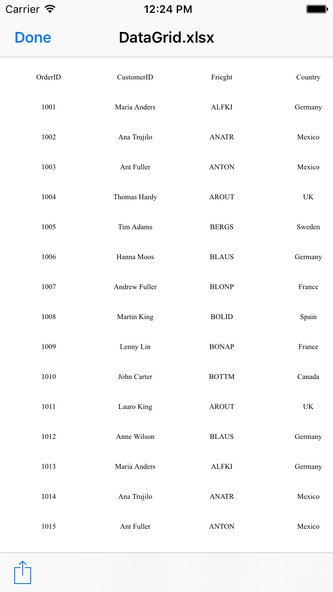
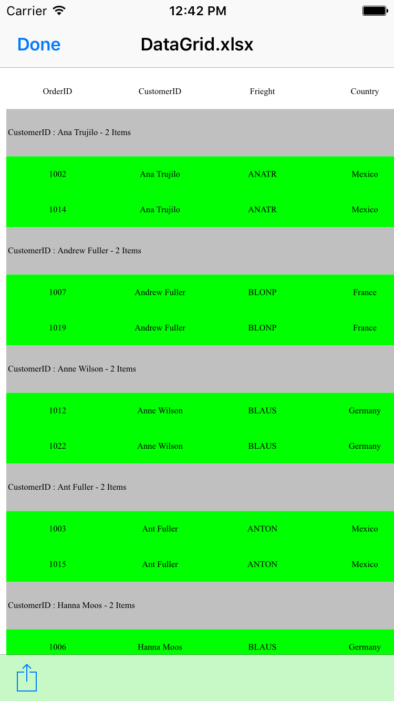
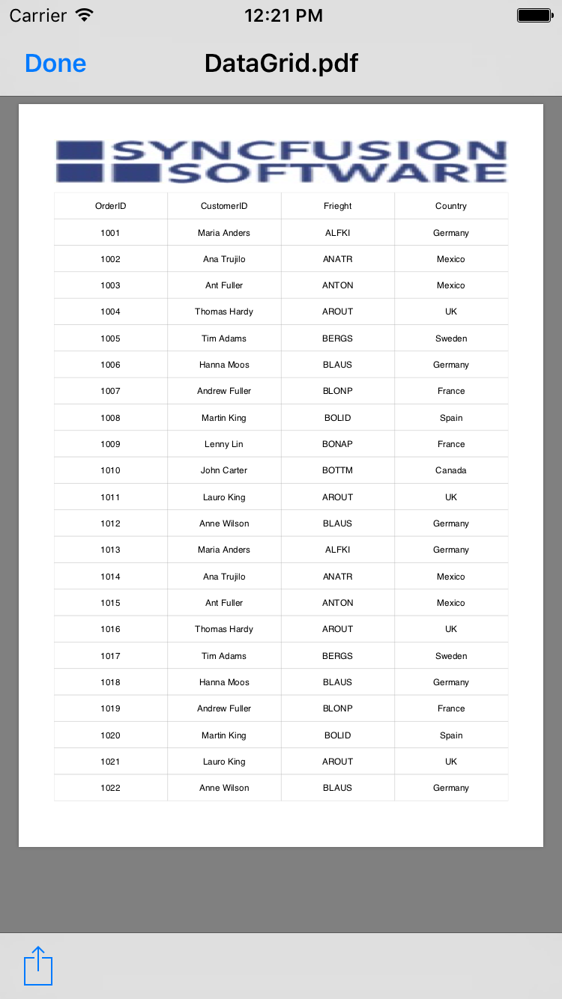
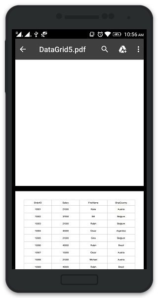
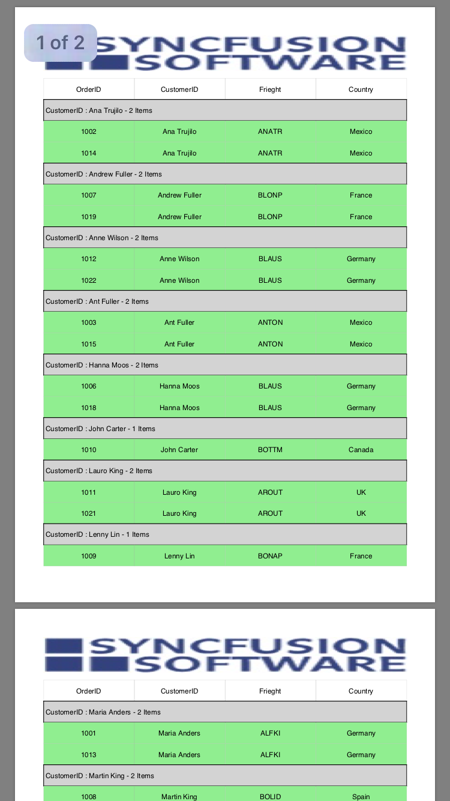
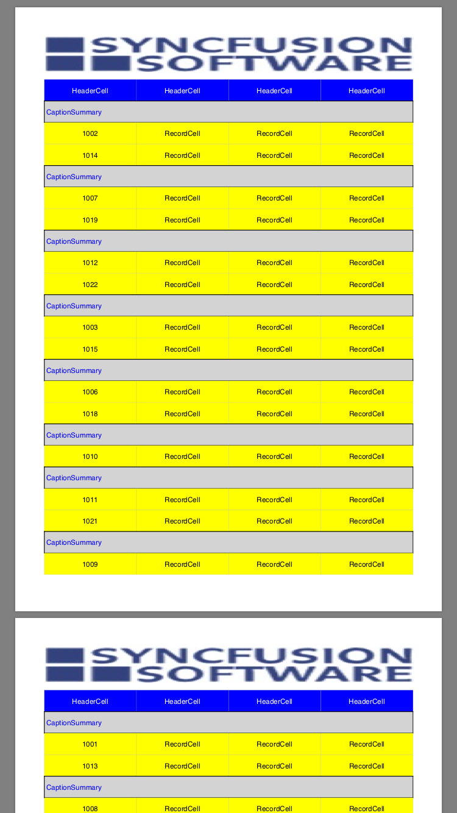
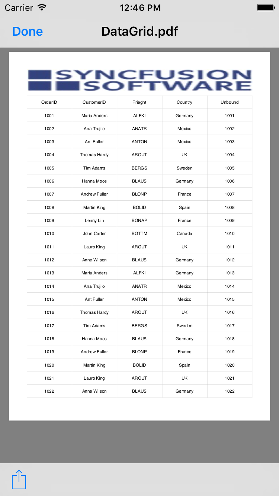
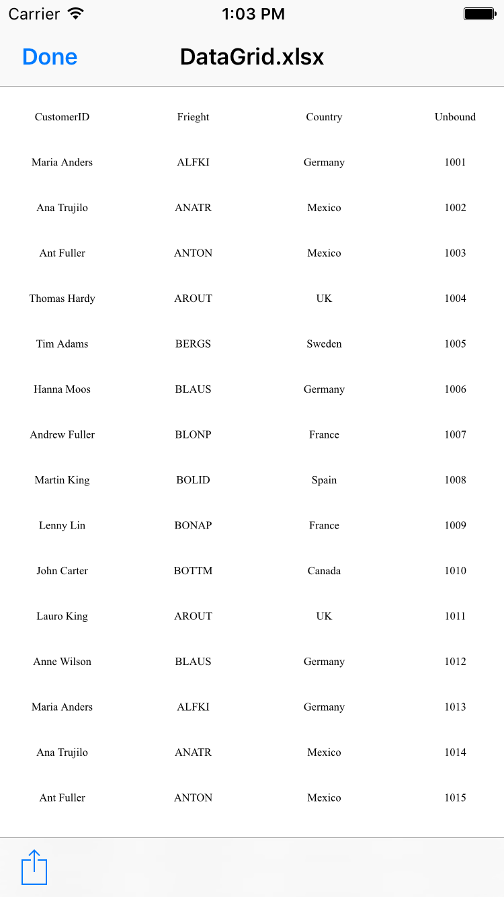

# Exporting

SfDataGrid provides support for exporting the data to excel and PDF with several customization options like custom appearance, excluding specific columns, excluding headers, setting custom row height, setting custom column width, etc. It also provides support for [Grouping](https://help.syncfusion.com/xamarin/sfdatagrid/getting-started#grouping), `Filtering` and [Sorting](https://help.syncfusion.com/xamarin/sfdatagrid/getting-started#sorting) when exporting.

In order to use export to excel and export to PDF functionalities of SfDataGrid, add the required assembly references to your application as discussed in the [Assembly deployment](/xamarin/sfdatagrid/getting-started#assembly-deployment) section.

The below code illustrates how to create and display a SfDataGrid in view.



<Grid RowSpacing="10">
    <Grid.RowDefinitions>
        <RowDefinition Height="Auto" />
        <RowDefinition Height="*" />
    </Grid.RowDefinitions>
    <StackLayout Grid.Row="0"
                 HorizontalOptions="Center"
                 Orientation="Horizontal">
        <Button BackgroundColor="Gray"
                Clicked="ExportToExcel"
                FontSize="12"
                Text="Export to Excel"
                TextColor="White"
                WidthRequest="110" />
        <Button BackgroundColor="Gray"
                Clicked="ExportToPdf"
                FontSize="12"
                Text="Export to PDF"
                TextColor="White"
                WidthRequest="110" />
    </StackLayout>

    <sfgrid:SfDataGrid x:Name="dataGrid"
                       Grid.Row="1"
                       AutoGenerateColumns="false"
                       ColumnSizer="Star"
                       SelectionMode="Single">

        <sfgrid:SfDataGrid.HeaderRowHeight>
            <OnPlatform x:TypeArguments="x:Double"
                        Android="40"
                        WinPhone="55"
                        iOS="40" />
        </sfgrid:SfDataGrid.HeaderRowHeight>

        <sfgrid:SfDataGrid.Columns x:TypeArguments="sfgrid:Columns">

            <sfgrid:GridTextColumn HeaderFontAttribute="Bold"
                                   HeaderText="OrderID"
                                   HeaderTextAlignment="Start"
                                   MappingName="OrderID"
                                   Padding="5,0,5,0"
                                   TextAlignment="End">
                <sfgrid:GridTextColumn.HeaderCellTextSize>
                    <OnPlatform x:TypeArguments="x:Double"
                                Android="14"
                                WinPhone="12"
                                iOS="12" />
                </sfgrid:GridTextColumn.HeaderCellTextSize>
                <sfgrid:GridTextColumn.CellTextSize>
                    <OnPlatform x:TypeArguments="x:Double"
                                Android="14"
                                WinPhone="12"
                                iOS="12" />
                </sfgrid:GridTextColumn.CellTextSize>
            </sfgrid:GridTextColumn>

            <sfgrid:GridTextColumn HeaderFontAttribute="Bold"
                                   HeaderText="CustomerID"
                                   HeaderTextAlignment="Start"
                                   MappingName="CustomerID"
                                   Padding="5,0,5,0"
                                   TextAlignment="End">
                <sfgrid:GridTextColumn.HeaderCellTextSize>
                    <OnPlatform x:TypeArguments="x:Double"
                                Android="14"
                                WinPhone="12"
                                iOS="12" />
                </sfgrid:GridTextColumn.HeaderCellTextSize>
                <sfgrid:GridTextColumn.CellTextSize>
                    <OnPlatform x:TypeArguments="x:Double"
                                Android="14"
                                WinPhone="12"
                                iOS="12" />
                </sfgrid:GridTextColumn.CellTextSize>
            </sfgrid:GridTextColumn>

            <sfgrid:GridTextColumn HeaderFontAttribute="Bold"
                                   HeaderText="Freight"
                                   HeaderTextAlignment="Start"
                                   MappingName="Freight"
                                   Padding="5, 0, 0, 0"
                                   TextAlignment="Start">
                <sfgrid:GridTextColumn.HeaderCellTextSize>
                    <OnPlatform x:TypeArguments="x:Double"
                                Android="14"
                                WinPhone="12"
                                iOS="12" />
                </sfgrid:GridTextColumn.HeaderCellTextSize>
                <sfgrid:GridTextColumn.CellTextSize>
                     <OnPlatform x:TypeArguments="x:Double"
                                 Android="14"
                                 WinPhone="12"
                                 iOS="12" />
                </sfgrid:GridTextColumn.CellTextSize>
            </sfgrid:GridTextColumn>

            <sfgrid:GridTextColumn HeaderFontAttribute="Bold"
                                   HeaderText="Country"
                                   HeaderTextAlignment="Start"
                                   MappingName="Country"
                                   Padding="5, 0, 0, 0"
                                   TextAlignment="Start">
                <sfgrid:GridTextColumn.HeaderCellTextSize>
                    <OnPlatform x:TypeArguments="x:Double"
                                Android="14"
                                WinPhone="12"
                                iOS="12" />
                </sfgrid:GridTextColumn.HeaderCellTextSize>
                <sfgrid:GridTextColumn.CellTextSize>
                    <OnPlatform x:TypeArguments="x:Double"
                                Android="14"
                                WinPhone="12"
                                iOS="12" />
                </sfgrid:GridTextColumn.CellTextSize>
            </sfgrid:GridTextColumn>

        </sfgrid:SfDataGrid.Columns>
    </sfgrid:SfDataGrid>
</Grid>


private void ExportToPdf(object sender, EventArgs e)
{
    // Perform exporting to PDF document operations here.
}

private void ExportToExcel_Clicked(object sender, EventArgs e)
{
    // Perform exporting to Excel sheet operations here.
}



## Export to Excel

You can export data to excel by using the [ExportToExcel](http://help.syncfusion.com/cr/cref_files/xamarin/sfgridconverter/Syncfusion.SfGridConverter.XForms~Syncfusion.SfDataGrid.XForms.Exporting.DataGridExcelExportingController~ExportToExcel.html) method by passing the SfDataGrid as an argument. The following code example illustrates exporting data to excel using the `ExportToExcel` method.


private void ExportToExcel(object sender, EventArgs e)
{
    DataGridExcelExportingController excelExport = new DataGridExcelExportingController();
    var excelEngine = excelExport.ExportToExcel(this.dataGrid);
    var workbook = excelEngine.Excel.Workbooks[0];
    MemoryStream stream = new MemoryStream();
    workbook.SaveAs(stream);
    workbook.Close();
    excelEngine.Dispose();

    Xamarin.Forms.DependencyService.Get<ISave>().Save("DataGrid.xlsx", "application/msexcel", stream);
}


### Exporting Options

You can also export data to excel with various customizing options while exporting the SfDataGrid by passing the grid and [DataGridExcelExportingOption](http://help.syncfusion.com/cr/cref_files/xamarin/sfgridconverter/Syncfusion.SfGridConverter.XForms~Syncfusion.SfDataGrid.XForms.Exporting.DataGridExcelExportingOption.html) as arguments to the `ExportToExcel` method. The following code example illustrates this.


DataGridExcelExportingController excelExport = new DataGridExcelExportingController ();
DataGridExcelExportingOption exportOption = new DataGridExcelExportingOption ();
exportOption.ExportColumnWidth = false;
exportOption.DefaultColumnWidth = 150;
var excelEngine = excelExport.ExportToExcel (this.dataGrid, exportOption);


SfDataGrid provides you with several properties in `DataGridExcelExportingOption` class to customize the grid while exporting it to excel.

### Events

The SfDataGrid provides you the following events for exporting to excel:

* [RowExporting](http://help.syncfusion.com/cr/cref_files/xamarin/sfgridconverter/Syncfusion.SfGridConverter.XForms~Syncfusion.SfDataGrid.XForms.Exporting.DataGridExcelExportingController~RowExporting_EV.html) – This event is raised while exporting a row at the execution time before the row is exported.
* [CellExporting](http://help.syncfusion.com/cr/cref_files/xamarin/sfgridconverter/Syncfusion.SfGridConverter.XForms~Syncfusion.SfDataGrid.XForms.Exporting.DataGridExcelExportingController~CellExporting_EV.html) – This event is raised while exporting a cell at the execution time before the cell is exported.

#### RowExporting

The [DataGridRowExcelExportingEventHandler](http://help.syncfusion.com/cr/cref_files/xamarin/sfgridconverter/Syncfusion.SfGridConverter.XForms~Syncfusion.SfDataGrid.XForms.Exporting.DataGridRowExcelExportingEventHandler.html) delegate allows you to customize the styles for record rows and group caption rows. The `RowExporting` event is triggered with [DataGridRowExcelExportingEventArgs](http://help.syncfusion.com/cr/cref_files/xamarin/sfgridconverter/Syncfusion.SfGridConverter.XForms~Syncfusion.SfDataGrid.XForms.Exporting.DataGridRowExcelExportingEventArgs.html) that contains the following properties:

* [Range](http://help.syncfusion.com/cr/cref_files/xamarin/sfgridconverter/Syncfusion.SfGridConverter.XForms~Syncfusion.SfDataGrid.XForms.Exporting.DataGridRowExcelExportingEventArgs~Range.html) – Specifies the excel range to be exported. It provides full access to the exporting cell in excel.
* [Record](http://help.syncfusion.com/cr/cref_files/xamarin/sfgridconverter/Syncfusion.SfGridConverter.XForms~Syncfusion.SfDataGrid.XForms.Exporting.DataGridRowExcelExportingEventArgs~Record.html) – Gets the collection of underlying data objects that are exported.
* [RowType](http://help.syncfusion.com/cr/cref_files/xamarin/sfgridconverter/Syncfusion.SfGridConverter.XForms~Syncfusion.SfDataGrid.XForms.Exporting.DataGridRowExcelExportingEventArgs~RowType.html) – Specifies the row type by using `ExportRowType` `Enum`. You can use this property to check the row type and apply different styles based on the row type.
* [Worksheet](http://help.syncfusion.com/cr/cref_files/xamarin/sfgridconverter/Syncfusion.SfGridConverter.XForms~Syncfusion.SfDataGrid.XForms.Exporting.DataGridRowExcelExportingEventArgs~WorkSheet.html) – Sets the `Worksheet` properties such as sheet protection, gridlines, and so on. 

You can use this event to customize the properties of the grid rows that are exported to excel. The following code example illustrates how to change the background color of the record rows and caption summary rows while exporting.


//HandlingRowExportingEvent for exporting to excel
DataGridExcelExportingController excelExport = new DataGridExcelExportingController ();
excelExport.RowExporting += excelExport_RowExporting; 

void excelExport_RowExporting (object sender, DataGridRowExcelExportingEventArgs e)
{
    if (e.RowType == ExportRowType.Record) {
        if ((e.Record.Data as OrderInfo).IsClosed)
            e.Range.CellStyle.ColorIndex = Syncfusion.XlsIO.ExcelKnownColors.Yellow;
        else
            e.Range.CellStyle.ColorIndex = Syncfusion.XlsIO.ExcelKnownColors.LightGreen;
    }

    if (e.RowType == ExportRowType.CaptionSummary) {
        e.Range.CellStyle.ColorIndex = Syncfusion.XlsIO.ExcelKnownColors.Grey_25_percent;
    }
}


#### CellExporting

The [DataGridCellExcelExportingEventHandler](http://help.syncfusion.com/cr/cref_files/xamarin/sfgridconverter/Syncfusion.SfGridConverter.XForms~Syncfusion.SfDataGrid.XForms.Exporting.DataGridCellExcelExportingEventHandler.html) delegate allows you to customize the styles for header cells, record cells and group caption cells. The `CellExporting` event is triggered with [DataGridCellExcelExportingEventArgs](http://help.syncfusion.com/cr/cref_files/xamarin/sfgridconverter/Syncfusion.SfGridConverter.XForms~Syncfusion.SfDataGrid.XForms.Exporting.DataGridCellExcelExportingEventArgs.html) that contains the following properties:

* [CellType](http://help.syncfusion.com/cr/cref_files/xamarin/sfgridconverter/Syncfusion.SfGridConverter.XForms~Syncfusion.SfDataGrid.XForms.Exporting.DataGridCellExcelExportingEventArgs~CellType.html) – Specifies the cell type by using `ExportCellType` Enum. You can use this property to check the cell type and apply different cell styles based on the cell type.
* [CellValue](http://help.syncfusion.com/cr/cref_files/xamarin/sfgridconverter/Syncfusion.SfGridConverter.XForms~Syncfusion.SfDataGrid.XForms.Exporting.DataGridCellExcelExportingEventArgs~CellValue.html) – Contains the actual value that is exported to the excel. You can use this value to apply formatting in excel using `Range` property.
* [ColumnName](http://help.syncfusion.com/cr/cref_files/xamarin/sfgridconverter/Syncfusion.SfGridConverter.XForms~Syncfusion.SfDataGrid.XForms.Exporting.DataGridCellExcelExportingEventArgs~ColumnName.html) – Specifies the column name (MappingName) of the exporting cell. You can apply formatting for a particular column by checking the `ColumnName`.
* [Handled](http://help.syncfusion.com/cr/cref_files/xamarin/sfgridconverter/Syncfusion.SfGridConverter.XForms~Syncfusion.SfDataGrid.XForms.Exporting.DataGridCellExcelExportingEventArgs~Handled.html) – Determines whether the cell is exported to excel or not.
* [Range](http://help.syncfusion.com/cr/cref_files/xamarin/sfgridconverter/Syncfusion.SfGridConverter.XForms~Syncfusion.SfDataGrid.XForms.Exporting.DataGridCellExcelExportingEventArgs~Range.html) – Specifies the excel range to be exported. It provides full access to the exporting cell in excel.
* [Record](http://help.syncfusion.com/cr/cref_files/xamarin/sfgridconverter/Syncfusion.SfGridConverter.XForms~Syncfusion.SfDataGrid.XForms.Exporting.DataGridCellExcelExportingEventArgs~Record.html) – Gets the collection of underlying data objects that are exported. 

You can use this event to customize the properties of the grid cells that are exported to excel. The following code example illustrates how to customize the background color, foreground color and cell value of the header cells, record cells and caption summary cells while exporting.


//HandlingCellExportingEvent for exporting to Excel
DataGridExcelExportingController excelExport = new DataGridExcelExportingController ();
excelExport.CellExporting += excelExport_CellExporting;  

void excelExport_CellExporting(object sender, DataGridCellExcelExportingEventArgs e)
{
    if (e.CellType == ExportCellType.HeaderCell) {
        e.Range.CellStyle.ColorIndex = Syncfusion.XlsIO.ExcelKnownColors.Blue;
        e.Range.CellStyle.PatternColorIndex = Syncfusion.XlsIO.ExcelKnownColors.White;
        e.CellValue = "HeaderCell";
        e.Range.CellStyle.BeginUpdate();
        e.Range.CellStyle.Borders.LineStyle = Syncfusion.XlsIO.ExcelLineStyle.Thin;
        e.Range.CellStyle.Borders[ExcelBordersIndex.DiagonalDown].LineStyle = ExcelLineStyle.None;
        e.Range.CellStyle.Borders[ExcelBordersIndex.DiagonalUp].LineStyle = ExcelLineStyle.None;
        e.Range.CellStyle.Borders.Color = ExcelKnownColors.Black;
        e.Range.CellStyle.EndUpdate();
    }

    if (e.CellType == ExportCellType.RecordCell) {
        e.Range.CellStyle.ColorIndex = Syncfusion.XlsIO.ExcelKnownColors.Yellow;
        e.Range.CellStyle.PatternColorIndex = Syncfusion.XlsIO.ExcelKnownColors.Black;
        if (e.CellValue is string)
            e.CellValue = "RecordCell";
        e.Range.CellStyle.BeginUpdate();
        e.Range.CellStyle.Borders.LineStyle = Syncfusion.XlsIO.ExcelLineStyle.Thin;
        e.Range.CellStyle.Borders[ExcelBordersIndex.DiagonalDown].LineStyle = ExcelLineStyle.None;
        e.Range.CellStyle.Borders[ExcelBordersIndex.DiagonalUp].LineStyle = ExcelLineStyle.None;
        e.Range.CellStyle.Borders.Color = ExcelKnownColors.Black;
        e.Range.CellStyle.EndUpdate();
    }

    if (e.CellType == ExportCellType.GroupCaptionCell) {
        e.Range.CellStyle.ColorIndex = Syncfusion.XlsIO.ExcelKnownColors.Grey_25_percent;
        e.Range.CellStyle.PatternColorIndex = Syncfusion.XlsIO.ExcelKnownColors.Blue;
        e.CellValue = "CaptionSummary";
        e.Range.CellStyle.BeginUpdate();
        e.Range.CellStyle.Borders.LineStyle = Syncfusion.XlsIO.ExcelLineStyle.Thin;
        e.Range.CellStyle.Borders[ExcelBordersIndex.DiagonalDown].LineStyle = ExcelLineStyle.None;
        e.Range.CellStyle.Borders[ExcelBordersIndex.DiagonalUp].LineStyle = ExcelLineStyle.None;
        e.Range.CellStyle.Borders.Color = ExcelKnownColors.Black;
        e.Range.CellStyle.EndUpdate();
    }
}


## Export to PDF

You can export data to PDF by using the [ExportToPdf](http://help.syncfusion.com/cr/cref_files/xamarin/sfgridconverter/Syncfusion.SfGridConverter.XForms~Syncfusion.SfDataGrid.XForms.Exporting.DataGridPdfExportingController~ExportToPdf.html) method by passing the SfDataGrid as an argument. The following code example illustrates exporting data to PDF using the `ExportToPdf` method.


private void ExportToPdf(object sender, EventArgs e)
{
    DataGridPdfExportingController pdfExport = new DataGridPdfExportingController();
    MemoryStream stream = new MemoryStream();
    var doc = pdfExport.ExportToPdf(this.dataGrid);
    doc.Save(stream);
    doc.Close(true);

    Xamarin.Forms.DependencyService.Get<ISave>().Save("DataGrid.pdf", "application/pdf", stream);
}


### Exporting Options

You can also export data to PDF with various customizing options while exporting the SfDataGrid by passing the grid and [DataGridPdfExportingOption](http://help.syncfusion.com/cr/cref_files/xamarin/sfgridconverter/Syncfusion.SfGridConverter.XForms~Syncfusion.SfDataGrid.XForms.Exporting.DataGridPdfExportOption.html) as arguments to the `ExportToPdf` method. The following code example illustrates this.


DataGridPdfExportingController pdfExport = new DataGridPdfExportingController ();
DataGridPdfExportOption exportOption = new DataGridPdfExportOption ();
exportOption.FitAllColumnsInOnePage = true;
var doc = pdfExport.ExportToPdf (this.dataGrid, exportOption); 


SfDataGrid provides you with several properties in `DataGridPdfExportingOption` class to customize the grid while exporting it to PDF. 

### Exporting SfDataGrid from particular starting point

SfDataGrid allows to export the data from a particular point in the PDf page by setting the [DataGridPdfExportingOption.StartPoint](http://help.syncfusion.com/cr/cref_files/xamarin/sfgridconverter/Syncfusion.SfGridConverter.XForms~Syncfusion.SfDataGrid.XForms.Exporting.DataGridPdfExportOption~StartPoint.html) property.

To export the DataGrid with particular starting point, follow the code example:



DataGridPdfExportingController pdfExport = new DataGridPdfExportingController();
DataGridPdfExportOption exportOption = new DataGridPdfExportOption()
{
    ExportColumnWidth = false,
    FitAllColumnsInOnePage = true,
    StartPoint = new PointF(0, 200)           
};
MemoryStream stream = new MemoryStream();
var doc = pdfExport.ExportToPdf(this.dataGrid,exportOption);



### Exporting SfDataGrid from particular starting page

SfDataGrid allows to export the data from a particular staring page by setting the [DataGridPdfExportingOption.StartPageIndex](http://help.syncfusion.com/cr/cref_files/xamarin/sfgridconverter/Syncfusion.SfGridConverter.XForms~Syncfusion.SfDataGrid.XForms.Exporting.DataGridPdfExportOption~StartPageIndex.html) property. 

To export the DataGrid with particular starting page, follow the code example:



PdfDocument pdfDocument = new PdfDocument();
pdfDocument.Pages.Add();
DataGridPdfExportingController pdfExport = new DataGridPdfExportingController();
DataGridPdfExportOption exportOption = new DataGridPdfExportOption()
{
ExportColumnWidth = false,
PdfDocument = pdfDocument,
FitAllColumnsInOnePage = true,
StartPageIndex = 1,
});


### Events

The SfDataGrid provides you the following events for exporting:

* [RowExporting](http://help.syncfusion.com/cr/cref_files/xamarin/sfgridconverter/Syncfusion.SfGridConverter.XForms~Syncfusion.SfDataGrid.XForms.Exporting.DataGridPdfExportingController~RowExporting_EV.html) – This event is raised while exporting a row at the execution time before the row is exported.
* [CellExporting](http://help.syncfusion.com/cr/cref_files/xamarin/sfgridconverter/Syncfusion.SfGridConverter.XForms~Syncfusion.SfDataGrid.XForms.Exporting.DataGridPdfExportingController~CellExporting_EV.html) – This event is raised while exporting a cell at the execution time before the cell is exported.

#### RowExporting

The [DataGridRowPdfExportingEventHandler](http://help.syncfusion.com/cr/cref_files/xamarin/sfgridconverter/Syncfusion.SfGridConverter.XForms~Syncfusion.SfDataGrid.XForms.Exporting.DataGridRowPdfExportingEventhandler.html) delegate allows you to customize the styles for record rows and group caption rows. The `RowExporting` event is triggered with [DataGridRowPdfExportingEventArgs](http://help.syncfusion.com/cr/cref_files/xamarin/sfgridconverter/Syncfusion.SfGridConverter.XForms~Syncfusion.SfDataGrid.XForms.Exporting.DataGridRowPdfExportingEventArgs.html) that contains the following properties:

* [PdfGrid](http://help.syncfusion.com/cr/cref_files/xamarin/sfgridconverter/Syncfusion.SfGridConverter.XForms~Syncfusion.SfDataGrid.XForms.Exporting.DataGridRowPdfExportingEventArgs~PdfGrid.html) – You can use this property to customize the PdfGrid’s properties such as `Background`, `CellPadding`, `CellSpacing` etc.
* [PdfRow](http://help.syncfusion.com/cr/cref_files/xamarin/sfgridconverter/Syncfusion.SfGridConverter.XForms~Syncfusion.SfDataGrid.XForms.Exporting.DataGridRowPdfExportingEventArgs~PdfRow.html) – Specifies the `PDFGridRow` to be exported. You can use this to customize the properties of particular row. 
* [Record](http://help.syncfusion.com/cr/cref_files/xamarin/sfgridconverter/Syncfusion.SfGridConverter.XForms~Syncfusion.SfDataGrid.XForms.Exporting.DataGridRowPdfExportingEventArgs~PdfRow.html) – Gets the collection of underlying data objects that are exported.
* [RowType](http://help.syncfusion.com/cr/cref_files/xamarin/sfgridconverter/Syncfusion.SfGridConverter.XForms~Syncfusion.SfDataGrid.XForms.Exporting.DataGridRowPdfExportingEventArgs~RowType.html) – Specifies the row type by using `ExportRowType` `Enum`. You can use this property to check the row type and apply different styles based on the row type.

You can use this event to customize the properties of the grid rows that are exported to PDF. The following code example illustrates how to change the background color of the record rows and caption summary rows while exporting.


//HandlingRowExportingEvent for exporting to PDF
DataGridPdfExportingController pdfExport = new DataGridPdfExportingController ();
pdfExport.RowExporting += pdfExport_RowExporting; 

void pdfExport_RowExporting (object sender, DataGridRowPdfExportingEventArgs e)
{
    if (e.RowType == ExportRowType.Record) {
        if ((e.Record.Data as OrderInfo).IsClosed)
            e.PdfRow.Style.BackgroundBrush = PdfBrushes.Yellow;
        else
        e.PdfRow.Style.BackgroundBrush = PdfBrushes.LightGreen;
    }

    if (e.RowType == ExportRowType.CaptionSummary) {
        e.PdfRow.Style.BackgroundBrush = PdfBrushes.LightGray;
    }
} 


#### CellExporting

The [DataGridCellPdfExportingEventHandler](http://help.syncfusion.com/cr/cref_files/xamarin/sfgridconverter/Syncfusion.SfGridConverter.XForms~Syncfusion.SfDataGrid.XForms.Exporting.DataGridCellPdfExportingEventhandler.html) delegate allows you to customize the styles for header cells, record cells and group caption cells. The `CellExporting` event is triggered with [DataGridCellPdfExportingEventArgs](http://help.syncfusion.com/cr/cref_files/xamarin/sfgridconverter/Syncfusion.SfGridConverter.XForms~Syncfusion.SfDataGrid.XForms.Exporting.DataGridCellPdfExportingEventArgs.html) that contains the following properties:

* [CellType](http://help.syncfusion.com/cr/cref_files/xamarin/sfgridconverter/Syncfusion.SfGridConverter.XForms~Syncfusion.SfDataGrid.XForms.Exporting.DataGridCellPdfExportingEventArgs~CellType.html) – Specifies the cell type by using `ExportCellType` `Enum`. You can use this property to check the cell type and apply different cell styles based on the cell type.
* [CellValue](http://help.syncfusion.com/cr/cref_files/xamarin/sfgridconverter/Syncfusion.SfGridConverter.XForms~Syncfusion.SfDataGrid.XForms.Exporting.DataGridCellPdfExportingEventArgs~CellValue.html) – Contains the actual value that is exported to the PDF. You can use this value to apply formatting in PDF using `Range` property.
* [ColumnName](http://help.syncfusion.com/cr/cref_files/xamarin/sfgridconverter/Syncfusion.SfGridConverter.XForms~Syncfusion.SfDataGrid.XForms.Exporting.DataGridCellPdfExportingEventArgs~CellValue.html ) – Specifies the column name (MappingName) of the exporting cell. You can apply formatting for a particular column by checking the `ColumnName`.
* [Handled](http://help.syncfusion.com/cr/cref_files/xamarin/sfgridconverter/Syncfusion.SfGridConverter.XForms~Syncfusion.SfDataGrid.XForms.Exporting.DataGridCellPdfExportingEventArgs~Handled.html) – Determines whether the cell is exported to PDF or not.
* [PdfGrid](http://help.syncfusion.com/cr/cref_files/xamarin/sfgridconverter/Syncfusion.SfGridConverter.XForms~Syncfusion.SfDataGrid.XForms.Exporting.DataGridCellPdfExportingEventArgs~Handled.html) – Specifies the `PDFGridCell` to be exported. You can use this to customize the properties (Background, Foreground, Font, Alignment etc.,) of particular cell.
* [Record](http://help.syncfusion.com/cr/cref_files/xamarin/sfgridconverter/Syncfusion.SfGridConverter.XForms~Syncfusion.SfDataGrid.XForms.Exporting.DataGridCellPdfExportingEventArgs~Record.html) – Gets the collection of underlying data objects that are exported.

You can use this event to customize the properties of the grid cells that are exported to PDF. The following code example illustrates how to customize the background color, foreground color and cell value of the header cells, record cells and caption summary cells while exporting.


//HandlingCellExportingEvent for exporting to PDF
DataGridPdfExportingController pdfExport = new DataGridPdfExportingController ();
pdfExport.CellExporting += pdfExport_CellExporting;  

void pdfExport_CellExporting(object sender, DataGridCellPdfExportingEventArgs e)
{
    if (e.CellType == ExportCellType.HeaderCell) {
        e.PdfGridCell.Style.BackgroundBrush = PdfBrushes.Blue;
        e.PdfGridCell.Style.TextBrush = PdfBrushes.White;
        e.CellValue = "HeaderCell";
    }

    if (e.CellType == ExportCellType.RecordCell) {
        e.PdfGridCell.Style.BackgroundBrush = PdfBrushes.Yellow;
        e.PdfGridCell.Style.TextBrush = PdfBrushes.Black;
        if (e.CellValue is string)
            e.CellValue = "RecordCell";
    }

    if (e.CellType == ExportCellType.GroupCaptionCell) {
        e.PdfGridCell.Style.BackgroundBrush = PdfBrushes.LightGray;
        e.PdfGridCell.Style.TextBrush = PdfBrushes.Blue;
        e.CellValue = "CaptionSummary";
    }
}


#### HeaderAndFooterExporting

The [PdfHeaderFooterEventHandler](https://help.syncfusion.com/cr/cref_files/xamarin/sfgridconverter/Syncfusion.SfGridConverter.XForms~Syncfusion.SfDataGrid.XForms.Exporting.PdfHeaderFooterEventHandler.html) delegate allows you to customize the header and footer of the exported PDF. The `HeaderAndFooterExporting` event is triggered with [PdfHeaderFooterEventArgs](https://help.syncfusion.com/cr/cref_files/xamarin/sfgridconverter/Syncfusion.SfGridConverter.XForms~Syncfusion.SfDataGrid.XForms.Exporting.PdfHeaderFooterEventArgs.html) that contains the following properties:

* **PdfDocumentTemplate** – Specifies the header and footer template for the exported PDF.

The following code example illustrates how to customize the header and footer of the exported PDF document.


private void ExportToPdf(object sender, EventArgs e)
{
    DataGridPdfExportingController pdfExport = new DataGridPdfExportingController();
    pdfExport.HeaderAndFooterExporting += pdfExport_HeaderAndFooterExporting;
}

private void pdfExport_HeaderAndFooterExporting(object sender, PdfHeaderFooterEventArgs e)
{
    var width = e.PdfPage.GetClientSize().Width;
    PdfPageTemplateElement header = new PdfPageTemplateElement(width, 60);
    var assembly = Assembly.GetExecutingAssembly();
    var imageStream = assembly.GetManifestResourceStream("GettingStarted.SyncfusionLogo.jpg");
    PdfImage pdfImage = PdfImage.FromStream(imageStream);
    header.Graphics.DrawImage(pdfImage, new RectangleF(0, 0, width, 50));
    e.PdfDocumentTemplate.Top = header;
}


## Save a file

The below code snippet explains how to save the converted PDF document and excel sheet in our local device.


// Need to define the Interfaces in-order to use it in platform wise using Dependency Service
public interface ISave
{
    void Save(string filename, string contentType, MemoryStream stream);
}
public interface ISaveWindows
{
    Task Save(string filename, string contentType, MemoryStream stream);
}

// In Android renderer project
public class SaveAndroid : ISave
{
    public void Save(string filename, string contentType, MemoryStream stream)
    {
        string exception = string.Empty;
        string root = null;
        if (Android.OS.Environment.IsExternalStorageEmulated)
        {
            root = Android.OS.Environment.ExternalStorageDirectory.ToString();
        }
        else
            root = Environment.GetFolderPath(Environment.SpecialFolder.MyDocuments);

        Java.IO.File myDir = new Java.IO.File(root + "/Syncfusion");
        myDir.Mkdir();
        Java.IO.File file = new Java.IO.File(myDir, filename);
        
        if (file.Exists()) file.Delete();
        
        try
        {
            FileOutputStream outs = new FileOutputStream(file);
            outs.Write(stream.ToArray());
            outs.Flush();
            outs.Close();
        }
        catch (Exception e)
        {
            exception = e.ToString();
        }
        if (file.Exists() && contentType != "application/html")
        {
            Android.Net.Uri path = Android.Net.Uri.FromFile(file);
            string extension = Android.Webkit.MimeTypeMap.GetFileExtensionFromUrl(Android.Net.Uri.FromFile(file).ToString());
            string mimeType = Android.Webkit.MimeTypeMap.Singleton.GetMimeTypeFromExtension(extension);
            Intent intent = new Intent(Intent.ActionView);
            intent.SetDataAndType(path, mimeType);
            Forms.Context.StartActivity(Intent.CreateChooser(intent, "Choose App"));
        }
    }
}

// In iOS renderer project
public class SaveIOS : ISave
{
    void ISave.Save(string filename, string contentType, MemoryStream stream)
    {
        string exception = string.Empty;
        string path = Environment.GetFolderPath(Environment.SpecialFolder.Personal);
        string filePath = Path.Combine(path, filename);
        try
        {
            FileStream fileStream = File.Open(filePath, FileMode.Create);
            stream.Position = 0;
            stream.CopyTo(fileStream);
            fileStream.Flush();
            fileStream.Close();
        }
        catch (Exception e)
        {
            exception = e.ToString();
        }
        
        if (contentType == "application/html" || exception != string.Empty)
            return;
        
        UIViewController currentController = UIApplication.SharedApplication.KeyWindow.RootViewController;
        while (currentController.PresentedViewController != null)
            currentController = currentController.PresentedViewController;
        UIView currentView = currentController.View;

        QLPreviewController previewController = new QLPreviewController();
        QLPreviewItem item = new QLPreviewItemBundle(filename, filePath);
        previewController.DataSource = new PreviewControllerDS(item);

        currentController.PresentViewController((UIViewController)previewController, true, (Action)null);
    }
}

public class PreviewControllerDS : QLPreviewControllerDataSource
{
    private QLPreviewItem _item;

    public PreviewControllerDS(QLPreviewItem item)
    {
        _item = item;
    }

    public override nint PreviewItemCount (QLPreviewController controller)
    {
        return (nint)1;
    }

    public override IQLPreviewItem GetPreviewItem (QLPreviewController controller, nint index)
    {
        return _item;
    }
}

public class QLPreviewItemFileSystem : QLPreviewItem
{
    string _fileName, _filePath;

    public QLPreviewItemFileSystem(string fileName, string filePath)
    {
        _fileName = fileName;
        _filePath = filePath;
    }

    public override string ItemTitle
    {
        get
        {
            return _fileName;
        }
    }
    public override NSUrl ItemUrl
    {
        get
        {
            return NSUrl.FromFilename(_filePath);
        }
    }
}

public class QLPreviewItemBundle : QLPreviewItem
{
    string _fileName, _filePath;
    public QLPreviewItemBundle(string fileName, string filePath)
    {
        _fileName = fileName;
        _filePath = filePath;
    }

    public override string ItemTitle
    {
        get
        {
            return _fileName;
        }
    }
    public override NSUrl ItemUrl
    {
        get
        {
            var documents = NSBundle.MainBundle.BundlePath;
            var lib = Path.Combine(documents, _filePath);
            var url = NSUrl.FromFilename(lib);
            return url;
        }
    }
}

// In UWP renderer project
public class SaveWindows : ISaveWindows
{
    public async Task Save(string filename, string contentType, MemoryStream stream)
    {
        if (Device.Idiom != TargetIdiom.Desktop)
        {
            StorageFolder local = Windows.Storage.ApplicationData.Current.LocalFolder;
            StorageFile outFile = await local.CreateFileAsync(filename, CreationCollisionOption.ReplaceExisting);
            using (Stream outStream = await outFile.OpenStreamForWriteAsync())
            {
                outStream.Write(stream.ToArray(), 0, (int)stream.Length);
            }
            if (contentType != "application/html")
                await Windows.System.Launcher.LaunchFileAsync(outFile);
        }
        else
        {
            StorageFile storageFile = null;
            FileSavePicker savePicker = new FileSavePicker();
            savePicker.SuggestedStartLocation = PickerLocationId.Desktop;
            savePicker.SuggestedFileName = filename;
            switch (contentType)
            {
                case "application/vnd.openxmlformats-officedocument.presentationml.presentation":
                    savePicker.FileTypeChoices.Add("PowerPoint Presentation", new List<string>() { ".pptx", });
                    break;

                case "application/msexcel":
                    savePicker.FileTypeChoices.Add("Excel Files", new List<string>() { ".xlsx", });
                    break;

                case "application/msword":
                    savePicker.FileTypeChoices.Add("Word Document", new List<string>() { ".docx" });
                    break;

                case "application/pdf":
                    savePicker.FileTypeChoices.Add("Adobe PDF Document", new List<string>() { ".pdf" });
                    break;
                
                case "application/html":
                    savePicker.FileTypeChoices.Add("HTML Files", new List<string>() { ".html" });
                    break;
            }
            storageFile = await savePicker.PickSaveFileAsync();

            using (Stream outStream = await storageFile.OpenStreamForWriteAsync())
            {
                outStream.Write(stream.ToArray(), 0, (int)stream.Length);
                outStream.Flush();
                outStream.Dispose();
            }
            stream.Flush();
            stream.Dispose();
            await Windows.System.Launcher.LaunchFileAsync(storageFile);
        }
    }
}


N> When you are using [SfDataPager](https://help.syncfusion.com/cr/cref_files/xamarin/sfdatagrid/Syncfusion.SfDataGrid.XForms~Syncfusion.SfDataGrid.XForms.DataPager_namespace.html) inside the SfDataGrid you can choose to export only the current page or all the pages by setting the [DataGridPdfExportOption.ExportAllPages](https://help.syncfusion.com/cr/cref_files/xamarin/sfgridconverter/Syncfusion.SfGridConverter.XForms~Syncfusion.SfDataGrid.XForms.Exporting.DataGridExcelExportingOption~ExportAllPages.html) and [DataGridExcelExportingOption.ExportAllPages](https://help.syncfusion.com/cr/cref_files/xamarin/sfgridconverter/Syncfusion.SfGridConverter.XForms~Syncfusion.SfDataGrid.XForms.Exporting.DataGridPdfExportOption~ExportAllPages.html) to true or false for PDF and Excel exporting respectively. The default value for this property is false.

## Exporting unbound columns

`SfDataGrid.GridUnboundColumns` will be exported as like [SfDataGrid.GridTextColumns](http://help.syncfusion.com/cr/cref_files/xamarin/sfdatagrid/Syncfusion.SfDataGrid.XForms~Syncfusion.SfDataGrid.XForms.GridTextColumn.html) without any specific codes. You can customize the `SfDataGrid.GridUnboundColumns` as like `SfDataGrid.GridTextColumns` using `CellExporting` and `RowExporting` events.

The below code illustrates how to create and export unbound columns.


<sfgrid:GridUnboundColumn Expression="OrderID * 12"
                          HeaderFontAttribute="Bold"
                          HeaderText="Unbound"
                          HeaderTextAlignment="Start"
                          MappingName="Unbound"
                          Padding="5, 0, 0, 0"
                          TextAlignment="Start">
</sfgrid:GridUnboundColumn>


The below screenshot shows that the unbound column is exported to PDF document along with text columns.

The below screenshot shows that the unbound column is exported to excel sheet along with text columns.

