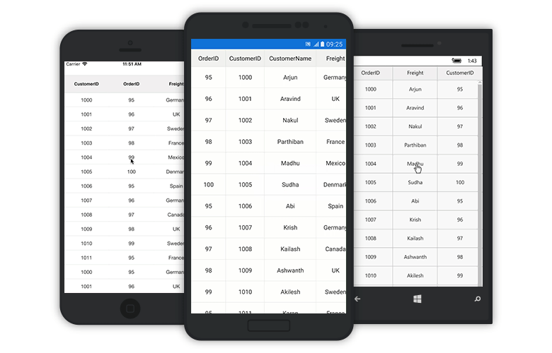

# Grid Events

## GridTapped event

The event will be triggered whenever you tap the SfDataGrid with [GridTappedEventsArgs](https://help.syncfusion.com/cr/cref_files/xamarin/sfdatagrid/Syncfusion.SfDataGrid.XForms~Syncfusion.SfDataGrid.XForms.GridTappedEventsArgs.html) that contains the following properties.

* [RowIndex](https://help.syncfusion.com/cr/cref_files/xamarin/sfdatagrid/Syncfusion.SfDataGrid.XForms~Syncfusion.SfDataGrid.XForms.GridTappedEventsArgs~RowColumnIndex.html) - Gets the row index of the row on which you tapped
* [ColumnIndex](https://help.syncfusion.com/cr/cref_files/xamarin/sfdatagrid/Syncfusion.SfDataGrid.XForms~Syncfusion.SfDataGrid.XForms.GridTappedEventsArgs~RowColumnIndex.html) - Gets the column index of the column on which you tapped
* [RowData](https://help.syncfusion.com/cr/cref_files/xamarin/sfdatagrid/Syncfusion.SfDataGrid.XForms~Syncfusion.SfDataGrid.XForms.GridTappedEventsArgs~RowData.html) - Gets the row data of the row on which you tapped

The following code illustrates how to hook the `GridTapped` event and get the row and column details based on where you tapped on SfDataGrid. 



<sfgrid:SfDataGrid x:Name="dataGrid"
                   AutoGenerateColumns="True"
                   GridTapped="DataGrid_GridTapped"
                   ItemsSource="{Binding OrdersInfo}" />


private void DataGrid_GridTapped(object sender, GridTappedEventsArgs e)
{
    var rowIndex = e.RowColumnIndex.RowIndex;
    var rowData = e.RowData;
    var columnIndex = e.RowColumnIndex.ColumnIndex;
}



## GridDoubleTapped event

The event will be triggered whenever you double tap the SfDataGrid with [GridDoubleTappedEventsArgs](https://help.syncfusion.com/cr/cref_files/xamarin/sfdatagrid/Syncfusion.SfDataGrid.XForms~Syncfusion.SfDataGrid.XForms.GridDoubleTappedEventsArgs.html) that contains the following properties. 

* [RowIndex](https://help.syncfusion.com/cr/cref_files/xamarin/sfdatagrid/Syncfusion.SfDataGrid.XForms~Syncfusion.SfDataGrid.XForms.GridDoubleTappedEventsArgs~RowColumnIndex.html) - Gets the row index of the row on which you double tapped
* [ColumnIndex](https://help.syncfusion.com/cr/cref_files/xamarin/sfdatagrid/Syncfusion.SfDataGrid.XForms~Syncfusion.SfDataGrid.XForms.GridDoubleTappedEventsArgs~RowColumnIndex.html) - Gets the column index of the column on which you double tapped
* [RowData](https://help.syncfusion.com/cr/cref_files/xamarin/sfdatagrid/Syncfusion.SfDataGrid.XForms~Syncfusion.SfDataGrid.XForms.GridDoubleTappedEventsArgs~RowData.html) - Gets the row data of the row on which you double tapped

The following code illustrates how to hook the `GridDoubleTapped` event and get the row and column details based on where you double tapped on SfDataGrid.  



<sfgrid:SfDataGrid x:Name="dataGrid"
                   AutoGenerateColumns="True"
                   GridDoubleTapped="DataGrid_GridDoubleTapped"
                   ItemsSource="{Binding OrdersInfo}" />


private void DataGrid_GridDoubleTapped(object sender, GridDoubleTappedEventsArgs e)
{
    var rowIndex = e.RowColumnIndex.RowIndex;
    var rowData = e.RowData;
    var columnIndex = e.RowColumnIndex.ColumnIndex;
}



## GridLongPressed event

The event will be triggered whenever you long press the SfDataGrid with [GridLongPressedEventsArgs](https://help.syncfusion.com/cr/cref_files/xamarin/sfdatagrid/Syncfusion.SfDataGrid.XForms~Syncfusion.SfDataGrid.XForms.GridLongPressedEventsArgs.html) that contains the following properties.

* [RowIndex](https://help.syncfusion.com/cr/cref_files/xamarin/sfdatagrid/Syncfusion.SfDataGrid.XForms~Syncfusion.SfDataGrid.XForms.GridLongPressedEventsArgs~RowColumnIndex.html) - Gets the row index of the row on which you long pressed
* [ColumnIndex](https://help.syncfusion.com/cr/cref_files/xamarin/sfdatagrid/Syncfusion.SfDataGrid.XForms~Syncfusion.SfDataGrid.XForms.GridLongPressedEventsArgs~RowColumnIndex.html) - Gets the column index of the column on which you long pressed
* [RowData](https://help.syncfusion.com/cr/cref_files/xamarin/sfdatagrid/Syncfusion.SfDataGrid.XForms~Syncfusion.SfDataGrid.XForms.GridLongPressedEventsArgs~RowData.html) - Gets the row data of the row on which you long pressed

The following code illustrates how to hook the `GridLongPressed` event and get the row and column details based on where you long pressed on SfDataGrid. 



<sfgrid:SfDataGrid x:Name="dataGrid"
                   AutoGenerateColumns="True"
                   GridLongPressed="DataGrid_GridLongPressed"
                   ItemsSource="{Binding OrdersInfo}" />


private void DataGrid_GridLongPressed(object sender, GridLongPressedEventsArgs e)
{
    var rowIndex = e.RowColumnIndex.RowIndex;
    var rowData = e.RowData;
    var columnIndex = e.RowColumnIndex.ColumnIndex;
}



## GridViewCreated event

The event will be triggered once the [SfDataGrid.View](https://help.syncfusion.com/cr/cref_files/xamarin/sfdatagrid/Syncfusion.SfDataGrid.XForms~Syncfusion.SfDataGrid.XForms.SfDataGrid~View.html) is created. You can give any operation in this event if it needs to happen once the `SfDataGrid.View` is created by handling [GridViewCreatedEventArgs](https://help.syncfusion.com/cr/cref_files/xamarin/sfdatagrid/Syncfusion.SfDataGrid.XForms~Syncfusion.SfDataGrid.XForms.GridViewCreatedEventArgs.html).

The following code illustrates how to hook the `GridViewCreated` event and how to set alternate row colors in SfDataGrid.



<sfgrid:SfDataGrid x:Name="dataGrid"
                   AutoGenerateColumns="True"
                   GridViewCreated="DataGrid_GridViewCreated"
                   ItemsSource="{Binding OrdersInfo}" />


private void DataGrid_GridViewCreated(object sender, GridViewCreatedEventArgs e)
{
    (sender as SfDataGrid).GridStyle = new CustomGridStyle();     
}

internal class CustomGridStyle : DataGridStyle
{
    public override Color GetAlternatingRowBackgroundColor()
    {
        return Color.Aqua;
    }
}



## GridLoaded event

The event will be triggered once the components in the SfDataGrid are initialized and rendered. You can give any operation in this event if it needs to happen once the grid is loaded by handling [GridLoadedEventArgs](https://help.syncfusion.com/cr/cref_files/xamarin/sfdatagrid/Syncfusion.SfDataGrid.XForms~Syncfusion.SfDataGrid.XForms.GridLoadedEventArgs.html).

The following code illustrates how to hook the `GridLoaded` event and how to show the `ActivityIndicator` until the grid comes to view.



<Grid x:Name="grid"
      HorizontalOptions="FillAndExpand"
      VerticalOptions="FillAndExpand">
    <sfgrid:SfDataGrid x:Name="dataGrid"
                       AutoGenerateColumns="True"
                       GridLoaded="DataGrid_GridLoaded"
                       HorizontalOptions="FillAndExpand"
                       ItemsSource="{Binding OrdersInfo}"
                       VerticalOptions="FillAndExpand" />


private void DataGrid_GridLoaded(object sender, GridLoadedEventArgs e)
{
    ActivityIndicator indicator = new ActivityIndicator();
    indicator.IsRunning = true;
    indicator.IsVisible = true;
    indicator.BackgroundColor = Color.Gray;
    grid.Children.Add(indicator);
    await Task.Delay(2000);
    indicator.IsRunning = false;
    indicator.IsVisible = false;
}



## Create custom Context Menu using Grid Events

SfDataGrid allows you to create a custom context menu by loading the number of buttons in different layouts in the `GridLongPressed` event. 

The following code illustrates how to create a custom context menu using Grid events.


<ContentPage xmlns="http://xamarin.com/schemas/2014/forms"
             xmlns:x="http://schemas.microsoft.com/winfx/2009/xaml"
             xmlns:local="clr-namespace:ContextMenuSupport"
             x:Class="ContextMenuSupport.MainPage"
             xmlns:sfgrid="clr-namespace:Syncfusion.SfDataGrid.XForms;assembly=Syncfusion.SfDataGrid.XForms">

  <ContentPage.BindingContext>
    <local:ViewModel />
  </ContentPage.BindingContext>
  <ContentPage.Content>
    <RelativeLayout x:Name="relativeLayout">
      <sfgrid:SfDataGrid x:Name="dataGrid"
                         ItemsSource="{Binding Collection}"
                         ColumnSizer="Star"
                         RelativeLayout.WidthConstraint="{ConstraintExpression
                                                      Type=RelativeToParent,Property=Width,Factor=1,Constant=0}"
                         RelativeLayout.HeightConstraint="{ConstraintExpression
                                                      Type=RelativeToParent,Property=Height,Factor=1,Constant=0}"
                         GridLongPressed="DataGrid_GridLongPressed"
                       />     
    </RelativeLayout>
  </ContentPage.Content>  
</ContentPage>



public partial class MainPage : ContentPage
    {

        StackLayout contextMenu;
        Button sortButton;
        Button clearSortButton;
        private bool isContextMenuDisplayed = false;
        private string currentColumnName;
        public MainPage()
        {
            InitializeComponent();
            CreateContextMenu();
            dataGrid.AllowSorting = true;
            dataGrid.GridTapped += DataGrid_GridTapped;           
        }

        private void DataGrid_GridTapped(object sender, GridTappedEventsArgs e)
        {
            relativeLayout.Children.Remove(contextMenu);
            isContextMenuDisplayed = false;
        }

        public void CreateContextMenu()
        {
            contextMenu = new StackLayout(); 
            sortButton = new Button();
            sortButton.Text = "Sort";           
            sortButton.BackgroundColor = Color.Black;
            sortButton.TextColor = Color.White;
            sortButton.Clicked += SortButton_Clicked;
            
            clearSortButton = new Button();
            clearSortButton.Text = "Clear sort";           
            clearSortButton.BackgroundColor = Color.Black;
            clearSortButton.TextColor = Color.White;
            clearSortButton.Clicked += ClearSortButton_Clicked;

            contextMenu.Children.Add(sortButton);
            contextMenu.Children.Add(clearSortButton);            
        }

        private void ClearSortButton_Clicked(object sender, EventArgs e)
        {
            relativeLayout.Children.Remove(contextMenu);
            isContextMenuDisplayed = false;
            dataGrid.SortColumnDescriptions.Clear();
        }

        private void SortButton_Clicked(object sender, EventArgs e)
        {
            relativeLayout.Children.Remove(contextMenu);
            isContextMenuDisplayed = false;
            dataGrid.SortColumnDescriptions.Clear();
            dataGrid.SortColumnDescriptions.Add(new SortColumnDescription()
            {
                ColumnName = currentColumnName
            });
        }

        public void DataGrid_GridLongPressed(object sender, GridLongPressedEventsArgs e)
        {
            if (!isContextMenuDisplayed)
            {
                currentColumnName = dataGrid.Columns[e.RowColumnIndex.ColumnIndex].MappingName;
                var point = dataGrid.RowColumnIndexToPoint(e.RowColumnIndex);
                relativeLayout.Children.Add(contextMenu, Constraint.Constant(point.X), Constraint.Constant(point.Y));
                isContextMenuDisplayed = true;
            }
            else
            {
                relativeLayout.Children.Remove(contextMenu);
                isContextMenuDisplayed = false;
            }
        }
    }


On executing the above code example, the below output will appear.

