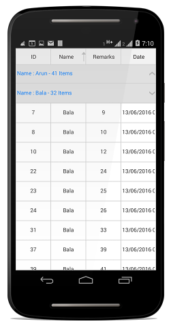
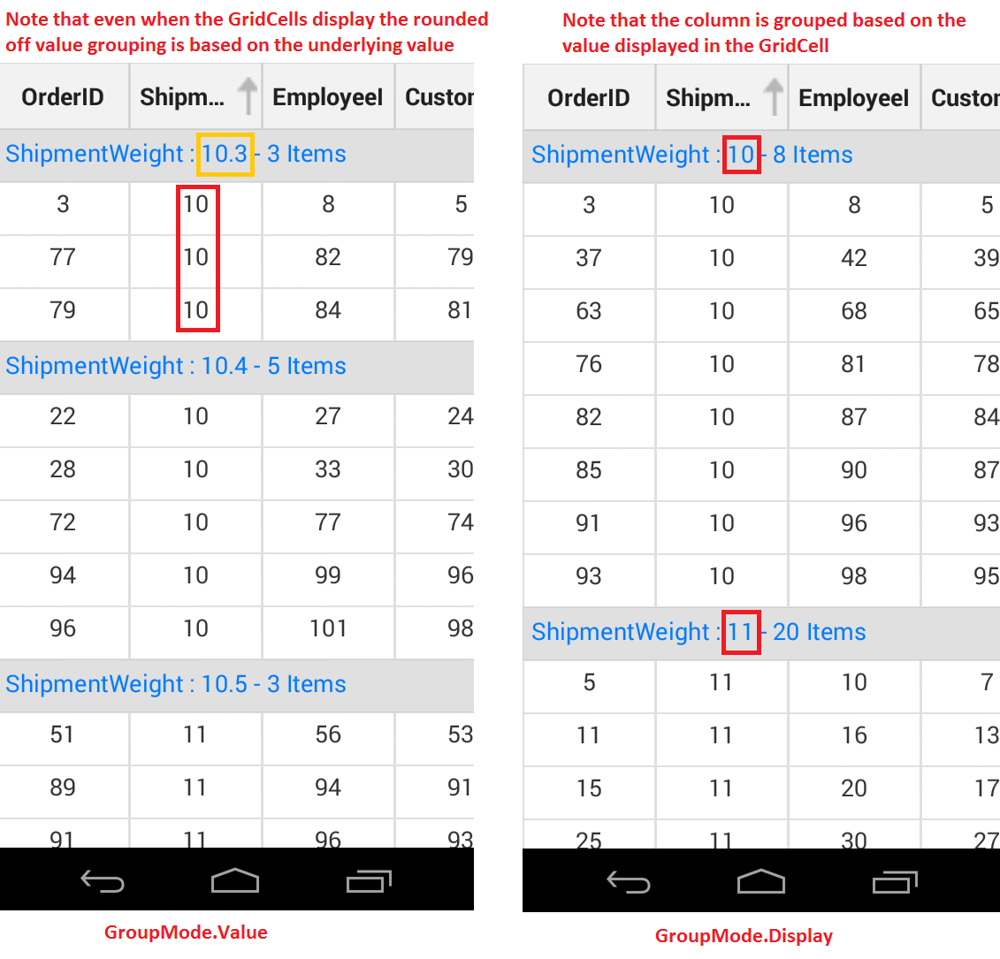
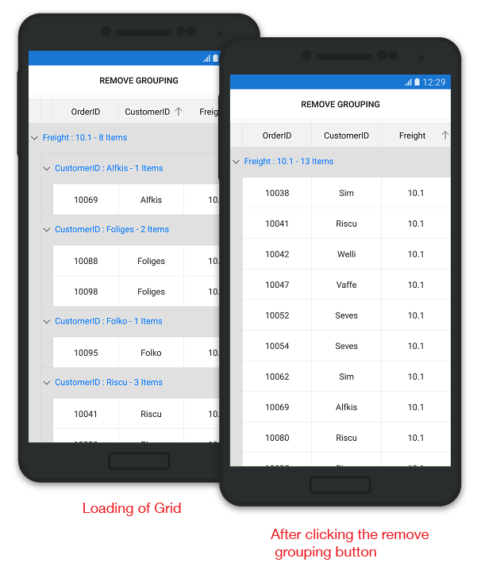

# Grouping 

A group represents a collection of records that belong to a particular category. When grouping is applied, the data is organized into a hierarchical structure based on matching field values. The records having identical values in the grouped column are combined to form a group. Each group is identified by its [CaptionSummaryRow](http://help.syncfusion.com/cr/cref_files/xamarin/sfdatagrid/Syncfusion.SfDataGrid.XForms~Syncfusion.SfDataGrid.XForms.SfDataGrid~CaptionSummaryRowProperty.html) to get the underlying records in view.

N> To update grouping for the newly added row or column, set the `SfDataGrid.View.LiveDataUpdateMode` to `LiveDataUpdateMode.AllowDataShaping`.

## Programmatic Grouping

SfDataGrid also allows to perform grouping from the code by defining the [GroupColumnDescription](http://help.syncfusion.com/cr/cref_files/xamarin/sfdatagrid/Syncfusion.SfDataGrid.XForms~Syncfusion.SfDataGrid.XForms.GroupColumnDescription.html) object and adding it in the [SfDataGrid.GroupColumnDescriptions](http://help.syncfusion.com/cr/cref_files/xamarin/sfdatagrid/Syncfusion.SfDataGrid.XForms~Syncfusion.SfDataGrid.XForms.SfDataGrid~GroupColumnDescriptions.html) collection. SfDataGrid groups the data based on the `GroupColumnDescription` object that is added to this collection.

`GroupColumnDescription` object holds following two properties:

* ColumnName: Name of the grouped column.
* Converter: Get the `IValueConverter` as input that helps to apply the custom grouping.

The following code example illustrates how to apply grouping by a column in SfDataGrid.



<syncfusion:SfDataGrid x:Name="dataGrid"
            ItemsSource="{Binding OrdersInfo}">

    <syncfusion:SfDataGrid.GroupColumnDescriptions>
        <syncfusion:GroupColumnDescription ColumnName="CustomerID" />
    </syncfusion:SfDataGrid.GroupColumnDescriptions>
</syncfusion:SfDataGrid> 


    dataGrid.GroupColumnDescriptions.Add (new GroupColumnDescription () {
    ColumnName = "CustomerID",
}); 



The following screenshot shows the output rendered when grouping is applied.

## Custom Grouping

SfDataGrid allows you to group a column based on custom logic when the standard grouping techniques do not meet the requirements. To achieve the custom grouping, you need to write a converter that implements `IValueConverter` with your custom grouping logic and assign that converter to the [GroupColumnDescription.Converter](http://help.syncfusion.com/cr/cref_files/xamarin/sfdatagrid/Syncfusion.SfDataGrid.XForms~Syncfusion.SfDataGrid.XForms.GroupColumnDescription~Converter.html) property.

The following code example illustrates how to set the custom grouping converter for the group description that is added to group the Freight column.



<ContentPage xmlns="http://xamarin.com/schemas/2014/forms"
             xmlns:x="http://schemas.microsoft.com/winfx/2009/xaml"
             xmlns:syncfusion="clr-namespace:Syncfusion.SfDataGrid.XForms;assembly=Syncfusion.SfDataGrid.XForms"
             xmlns:local ="clr-namespace:DataGridSample;assembly=DataGridSample"
             x:Class="DataGridSample.Sample">

    <ContentPage.Resources>
        <ResourceDictionary>
            <local:GroupConverter x:Key="groupConverter" />
        </ResourceDictionary>
    </ContentPage.Resources>

    <ContentPage.BindingContext>
        <local:ViewModel x:Name="viewModel" />
    </ContentPage.BindingContext>

    <syncfusion:SfDataGrid x:Name="dataGrid"
                           ItemsSource="{Binding OrdersInfo}">

        <syncfusion:SfDataGrid.GroupColumnDescriptions>
            <syncfusion:GroupColumnDescription ColumnName="Freight"
                                               Converter="{StaticResource groupConverter}" />
        </syncfusion:SfDataGrid.GroupColumnDescriptions>
    </syncfusion:SfDataGrid>
</ContentPage> 


dataGrid.GroupColumnDescriptions.Add (new GroupColumnDescription () {
    ColumnName = "Freight",
    Converter = new GroupConverter()
}); 



The following code example illustrates the converter used for applying custom grouping logic.


public class GroupConverter : IValueConverter
{
    public GroupConverter()
    {
        
    }

    public object Convert(object value, Type targetType, object parameter, CultureInfo culture)
    {
        var orderInfo = value as OrderInfo;
        if (orderInfo.Freight > 0 && orderInfo.Freight <= 250)
            return "<=250";
        else if (orderInfo.Freight > 250 && orderInfo.Freight <= 500)
            return ">250 & <=500";
        else if (orderInfo.Freight > 500 && orderInfo.Freight <= 750)
            return ">500 & <=750";
        else
            return ">1000";
    }

    public object ConvertBack(object value, Type targetType, object parameter, CultureInfo culture)
    {
        return null;
    }
}


## Expand groups while grouping
 
You can expand all the groups while grouping by setting [SfDataGrid.AutoExpandGroups](http://help.syncfusion.com/cr/cref_files/xamarin/sfdatagrid/Syncfusion.SfDataGrid.XForms~Syncfusion.SfDataGrid.XForms.SfDataGrid~AutoExpandGroups.html) to `true`. So, when user group any column, then all groups will be in expanded state. 



<syncfusion:SfDataGrid  x:Name="dataGrid"
                        AutoExpandGroups="True"
                        AllowGroupExpandCollapse="True"
                        ItemsSource="{Binding Orders}"/>


this.dataGrid.AutoExpandGroups = true;
this.dataGrid.AllowGroupExpandCollapse = true;



## Expand or collapse the groups

By default, the groups will be in expanded state in a SfDataGrid. However, you can expand or collapse a group in runtime by setting the [SfDataGrid.AllowGroupExpandCollapse](http://help.syncfusion.com/cr/cref_files/xamarin/sfdatagrid/Syncfusion.SfDataGrid.XForms~Syncfusion.SfDataGrid.XForms.SfDataGrid~AllowGroupExpandCollapse.html) as `true`.



<syncfusion:SfDataGrid  x:Name="dataGrid"
                        AllowGroupExpandCollapse="True"
                        ItemsSource="{Binding Orders}"/>
                       


this.dataGrid.AllowGroupExpandCollapse = true;



### Expand or collapse all the Groups

You can expand or collapse all the groups at programmatically at runtime by using [SfDataGrid.ExpandAllGroup](http://help.syncfusion.com/cr/cref_files/xamarin/sfdatagrid/Syncfusion.SfDataGrid.XForms~Syncfusion.SfDataGrid.XForms.SfDataGrid~ExpandAllGroup.html) and [SfDataGrid.CollapseAllGroup](http://help.syncfusion.com/cr/cref_files/xamarin/sfdatagrid/Syncfusion.SfDataGrid.XForms~Syncfusion.SfDataGrid.XForms.SfDataGrid~CollapseAllGroup.html) methods.



this.dataGrid.ExpandAllGroup();
this.dataGrid.CollapseAllGroup();



### Expand or Collapse the specific Group

You can expand or collapse specific group by using [SfDataGrid.ExpandGroup](http://help.syncfusion.com/cr/cref_files/xamarin/sfdatagrid/Syncfusion.SfDataGrid.XForms~Syncfusion.SfDataGrid.XForms.SfDataGrid~ExpandGroup.html) and [SfDataGrid.CollapseGroup](http://help.syncfusion.com/cr/cref_files/xamarin/sfdatagrid/Syncfusion.SfDataGrid.XForms~Syncfusion.SfDataGrid.XForms.SfDataGrid~CollapseGroup.html) methods.



var group = (dataGrid.View.Groups[0] as Group);
this.dataGrid.ExpandGroup(group);
this.dataGrid.CollapseGroup(group);



## Display based grouping using GroupMode property

By default column grouping occurs based on the value in the underlying collection thereby creating a new group for each new value of that column. However you can also group a column based on the Display value by setting the [GridColumn.GroupMode](https://help.syncfusion.com/cr/cref_files/xamarin/sfdatagrid/Syncfusion.SfDataGrid.XForms~Syncfusion.SfDataGrid.XForms.GridColumn~GroupMode.html) property as `Display`. In the below code example we have set [GridColumn.Format](https://help.syncfusion.com/cr/cref_files/xamarin/sfdatagrid/Syncfusion.SfDataGrid.XForms~Syncfusion.SfDataGrid.XForms.GridColumn~Format.html) property as "#" which displays only the rounded off value in the [GridCell](http://help.syncfusion.com/cr/cref_files/xamarin/sfdatagrid/Syncfusion.SfDataGrid.XForms~Syncfusion.SfDataGrid.XForms.GridCell.html).  



<syncfusion:GridTextColumn HeaderText="Shipment Weight" 
                           MappingName="ShipmentWeight"
                           GroupMode="Display"
                           Format="#" />


GridNumericColumn cargoWeight = new GridTextColumn();
cargoWeight.MappingName = "ShipmentWeight";
cargoWeight.GroupMode = Syncfusion.Data.DataReflectionMode.Display;
cargoWeight.Format = "#";
 


The below screenshot shows the comparison between the two Group modes. GroupMode.Value on the left and GroupMode.Display on the right.

## Clearing or Removing Group

### Clearing the Group

SfDataGrid allows you to clear the grouping by clearing the `SfDataGrid.GroupColumnDescriptions` in a button click.

The following code example illustrates how to clear grouping in SfDataGrid.


public partial class MainPage : ContentPage
{
    StackLayout stackLayout;
    SfDataGrid dataGrid;
    ViewModel viewModel;
    Button clearGroupingButton;
    public MainPage()
    {
        InitializeComponent();
        viewModel = new ViewModel();
        dataGrid = new SfDataGrid();
        clearGroupingButton = new Button();
        stackLayout = new StackLayout();
        dataGrid.ItemsSource = viewModel.OrdersInfo;
        clearGroupingButton.Text = "Remove Grouping";
        clearGroupingButton.TextColor = Color.Black;
        clearGroupingButton.BackgroundColor = Color.White;
        clearGroupingButton.Clicked += ClearGroupingButton_Click;
        stackLayout.Children.Add(clearGroupingButton);
        stackLayout.Children.Add(dataGrid);
        this.Content = stackLayout;       
    }

    private void ClearGroupingButton_Click(object sender, System.EventArgs e)
    {
        dataGrid.GroupColumnDescriptions.Clear();
    }
}


### Removing the Group based on group item

SfDataGrid allows you to remove the grouping by removing the groupcolumn from `SfDataGrid.GroupColumnDescriptions` in a button click.

The following code example illustrates how to remove grouping in SfDataGrid.


private void RemoveGroupingButton_Clicked(object sender, EventArgs e)
{
    var groupcolumn = dataGrid.GroupColumnDescriptions[0];
    dataGrid.GroupColumnDescriptions.Remove(groupcolumn);
}


### Removing the Group based on group index 

SfDataGrid allows you to remove the grouping by removing the groupcolumn index from `SfDataGrid.GroupColumnDescriptions` in a button click.

The following code example illustrates how to remove grouping in SfDataGrid.


private void RemoveGroupingButton_Clicked(object sender, EventArgs e)
{
   dataGrid.GroupColumnDescriptions.RemoveAt(0);
}


Run the application to render the following output. 

N> You can also clear or remove the grouping on [GridTapped](https://help.syncfusion.com/cr/cref_files/xamarin/sfdatagrid/Syncfusion.SfDataGrid.XForms~Syncfusion.SfDataGrid.XForms.SfDataGrid~GridTapped_EV.html), [GridDoubleTapped](https://help.syncfusion.com/cr/cref_files/xamarin/sfdatagrid/Syncfusion.SfDataGrid.XForms~Syncfusion.SfDataGrid.XForms.SfDataGrid~GridDoubleTapped_EV.html) or [GridLongPressed events](https://help.syncfusion.com/cr/cref_files/xamarin/sfdatagrid/Syncfusion.SfDataGrid.XForms~Syncfusion.SfDataGrid.XForms.SfDataGrid~GridLongPressed_EV.html).

## Events

### GroupExpanding event

The [SfDataGrid.GroupExpanding](http://help.syncfusion.com/cr/cref_files/xamarin/sfdatagrid/Syncfusion.SfDataGrid.XForms~Syncfusion.SfDataGrid.XForms.SfDataGrid~GroupExpanding_EV.html) event occurs when the group is being expanded.
 
The [GroupChangingEventArgs](http://help.syncfusion.com/cr/cref_files/xamarin/sfdatagrid/Syncfusion.SfDataGrid.XForms~Syncfusion.SfDataGrid.XForms.GroupChangingEventArgs.html) of the `GroupExpanding` event provides the information about the expanding group and it has the following members.

`Syncfusion.Data.Group` - Gets the group that’s being expanded.

`Cancel` – Decides whether to cancel the group expansion.
 
You can cancel the group expansion by setting [GroupChangingEventArgs.Cancel](http://msdn.microsoft.com/query/dev10.query?appId=Dev10IDEF1&l=EN-US&k=k(System.ComponentModel.CancelEventArgs.Cancel)&rd=true) to `true`.



this.dataGrid.GroupExpanding += dataGrid_GroupExpanding;

void dataGrid_GroupExpanding(object sender, Syncfusion.SfDataGrid.XForms.GroupChangingEventArgs e)
{
    if (e.Group.Key.Equals(1001))    
        e.Cancel = true;    
}       



### GroupExpanded event

The [SfDataGrid.GroupExpanded](http://help.syncfusion.com/cr/cref_files/xamarin/sfdatagrid/Syncfusion.SfDataGrid.XForms~Syncfusion.SfDataGrid.XForms.SfDataGrid~GroupExpanded_EV.html) event occurs after the group is expanded.

The [GroupChangedEventArgs](http://help.syncfusion.com/cr/cref_files/xamarin/sfdatagrid/Syncfusion.SfDataGrid.XForms~Syncfusion.SfDataGrid.XForms.GroupChangedEventArgs.html) of the `GroupExpanded` event provides the information about the expanded group and it has the following member.

`Syncfusion.Data.Group` - Gets the expanded group.

### GroupCollapsing event 

The [SfDataGrid.GroupCollapsing](http://help.syncfusion.com/cr/cref_files/xamarin/sfdatagrid/Syncfusion.SfDataGrid.XForms~Syncfusion.SfDataGrid.XForms.SfDataGrid~GroupCollapsing_EV.html) event occurs when the group is being collapsed.

The [GroupChangingEventArgs](http://help.syncfusion.com/cr/cref_files/xamarin/sfdatagrid/Syncfusion.SfDataGrid.XForms~Syncfusion.SfDataGrid.XForms.GroupChangingEventArgs.html)  of the `GroupCollapsing` event provides the information about the collapsing group and it contains the following member.

`Syncfusion.Data.Group` - Gets the group that’s being collapsed.

`Cancel` – Decides whether to cancel the group collapsing.

You can cancel the group is being collapsed by using [GroupChangingEventArgs.Cancel](http://msdn.microsoft.com/query/dev10.query?appId=Dev10IDEF1&l=EN-US&k=k(System.ComponentModel.CancelEventArgs.Cancel)&rd=true) of `GroupCollapsing` event.



this.dataGrid.GroupCollapsing += dataGrid_GroupCollapsing;

void dataGrid_GroupCollapsing(object sender, Syncfusion.SfDataGrid.XForms.GroupChangingEventArgs e)
{
    if (e.Group.Key.Equals(1001))    
        e.Cancel = true;    
}



### GroupCollapsed event
 
The [SfDataGrid.GroupCollapsed](http://help.syncfusion.com/cr/cref_files/xamarin/sfdatagrid/Syncfusion.SfDataGrid.XForms~Syncfusion.SfDataGrid.XForms.SfDataGrid~GroupCollapsed_EV.html) event occurs after the group is collapsed.
 
[GroupChangedEventArgs](http://help.syncfusion.com/cr/cref_files/xamarin/sfdatagrid/Syncfusion.SfDataGrid.XForms~Syncfusion.SfDataGrid.XForms.GroupChangedEventArgs.html) of the `GroupCollapsed` event  provides the information about collapsed group and it contains the following member.

`Syncfusion.Data.Group` - Gets the collapsed group.

## Animate group expand/collapse icon

SfDatagrid loads two different icons for denoting the group expanded and collapsed state. However, SfDataGrid allows you to rotate the expander icon animatedly for denoting the collapsed status by overriding the `DataGridStyle.GetGroupCollapseIcon` method and returning `null`.

The below code example illustrates how to enable the group/expand collapse icons animation by writing a custom style. 




//Apply custom style to SfDataGrid from code 

dataGrid.GridStyle = new CustomStyle ();

//Custom Style class

public class CustomStyle : DataGridStyle
{ 
   public CustomStyle ()
   {
       
   }
   public override ImageSource GetGroupCollapseIcon()
   {
       return null;
   }
}




## Hiding the column when grouped

In SfDataGrid a column will be generated with the default column width by default. In order to group by a column that should not be visible in view, add the column to the [SfDataGrid.Columns](http://help.syncfusion.com/cr/cref_files/xamarin/sfdatagrid/Syncfusion.SfDataGrid.XForms~Syncfusion.SfDataGrid.XForms.SfDataGrid~Columns.html) collection and set its width as 0. Thus the column will be grouped and will not be visually seen. Please refer the below code example.



<syncfusion:SfDataGrid.Columns>
    <syncfusion:GridTextColumn MappingName="ShippingDate" Width="0" />
</syncfusion:SfDataGrid.Columns>

<syncfusion:SfDataGrid.GroupColumnDescriptions>
    <syncfusion:GroupColumnDescription ColumnName="ShippingDate" />
</syncfusion:SfDataGrid.GroupColumnDescriptions> 


dataGrid.Columns.Add (new GridTextColumn () { 
    MappingName = "ShippingDate",
    Width = 0
});

dataGrid.GroupColumnDescriptions.Add (new GroupColumnDescription () { 
    ColumnName = "ShippingDate"
});


