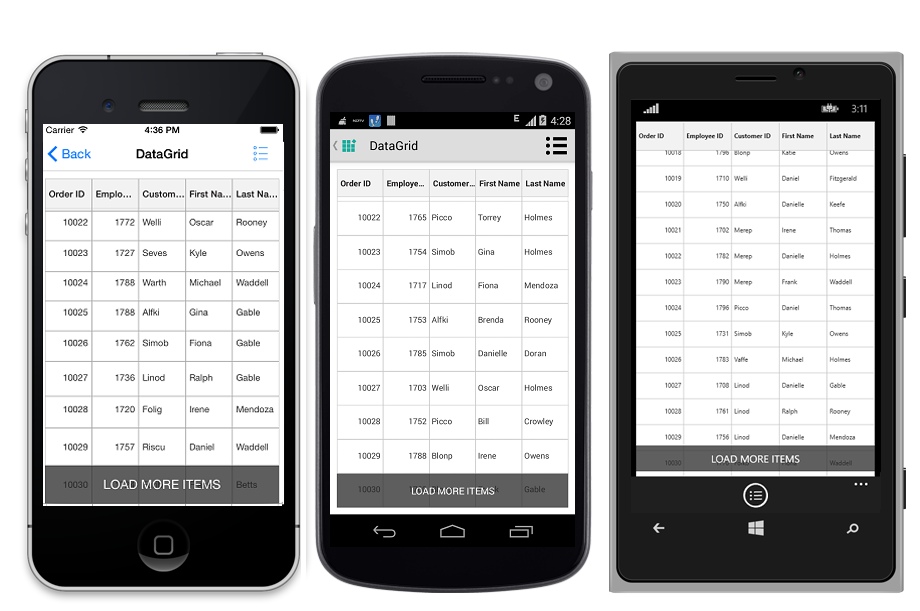

# Load More

SfDataGrid lets you to enable the LoadMore option by setting the [SfDataGrid.AllowLoadMore](http://help.syncfusion.com/cr/cref_files/xamarin/sfdatagrid/Syncfusion.SfDataGrid.XForms~Syncfusion.SfDataGrid.XForms.SfDataGrid~AllowLoadMore.html) property to `true` and by setting the [SfDataGrid.LoadMoreCommand](http://help.syncfusion.com/cr/cref_files/xamarin/sfdatagrid/Syncfusion.SfDataGrid.XForms~Syncfusion.SfDataGrid.XForms.SfDataGrid~LoadMoreCommand.html) property. When the LoadMore is enabled, the SfDataGrid provides an option of loading a subset of data to its data source in the runtime using the [LoadMoreView](http://help.syncfusion.com/cr/cref_files/xamarin/sfdatagrid/Syncfusion.SfDataGrid.XForms~Syncfusion.SfDataGrid.XForms.LoadMoreView.html). 

On scrolling down, when the grid reaches the maximum offset an interactive load more view is displayed in view. On tapping the load more view it triggers a command to add more data to the data source of the grid in runtime.

## LoadMoreCommand

SfDataGrid lets you load records to its data source in runtime by triggering an `ICommand` binded to the `SfDataGrid.LoadMoreCommand` property. When you tap the load more view, if the `CanExecute` of the `ICommand` returns true, then this command is triggered to load the records in runtime.
 
You need to set the [SfDataGrid.IsBusy](http://help.syncfusion.com/cr/cref_files/xamarin/sfdatagrid/Syncfusion.SfDataGrid.XForms~Syncfusion.SfDataGrid.XForms.SfDataGrid~IsBusy.html) property to true before loading the items to notify the grid that more items are loaded to it and set the property to false after loading the items to the grid. When loading the items, you can also alter the time for the LoadMore animation from the sample by setting a delay based on your requirement.

The following code example illustrates how to enable and load items in the runtime.


//Enable load more in SfDataGrid
dataGrid.AllowLoadMore = true;
dataGrid.LoadMoreCommand = new Command(ExecuteLoadMoreCommand);
 
private async void ExecuteLoadMoreCommand()
{
    this.dataGrid.IsBusy = true;
    await Task.Delay(new TimeSpan(0, 0, 5));
    viewModel.LoadMoreItems ();
    this.dataGrid.IsBusy = false;
} 

//ViewModel.cs
internal void LoadMoreItems()
{
    for (int i = 0; i < 20; i++)
    this.OrdersInfo.Add(order.GenerateOrder(OrdersInfo.Count + 1));
} 


## LoadMore Customizations

SfDataGrid also allows you to customize the LoadMore view, the text displayed on the LoadMore view and their positions to either top or bottom based on the requirements.

### Customize Load More Display Text

You can customize the text displayed in the load more view by setting the [SfDataGrid.LoadMoreText](http://help.syncfusion.com/cr/cref_files/xamarin/sfdatagrid/Syncfusion.SfDataGrid.XForms~Syncfusion.SfDataGrid.XForms.SfDataGrid~LoadMoreText.html) property as below.


//setting load more text in SfDataGrid
dataGrid.LoadMoreText = "Load More Items"; 


### Customize LoadMoreView Position

You can also customize the position in which the load more view is displayed to either `top` or `bottom` based on your requirements.
 

//Enable load more in SfDataGrid
dataGrid.LoadMorePosition = LoadMoreViewPosition.Bottom;  


### Customize LoadMoreView

SfDataGrid also allows you to customize the load more view based on your requirements. To do this you need to write your custom `LoadMoreView` class inheriting from the `LoadMoreView` and perform the LoadMoreOperation based on your requirement.

The following code example illustrates how to customize the `LoadMoreView` in SfDataGrid.
 

public class CustomLoadMoreView : LoadMoreView
{
    private Button loadMoreView;

    public CustomLoadMoreView()
    {
        this.BackgroundColor = Color.Red;
        loadMoreView = new Button ();
        loadMoreView.Text = "LoadItems";
        this.Children.Add(loadMoreView);
        loadMoreView.Clicked += loadMoreView_Tapped;
    }

    void loadMoreView_Tapped (object sender, EventArgs e)
    {
        if (this.LoadMoreCommand != null)
        {
            this.LoadMoreCommand.Execute(null);
        }
    }

    protected override void LayoutChildren(double x, double y, double width, double height)
    {
        loadMoreView.Layout(new Rectangle(x, y, width, height));
    }
}


Runnig the application renders the following output.

