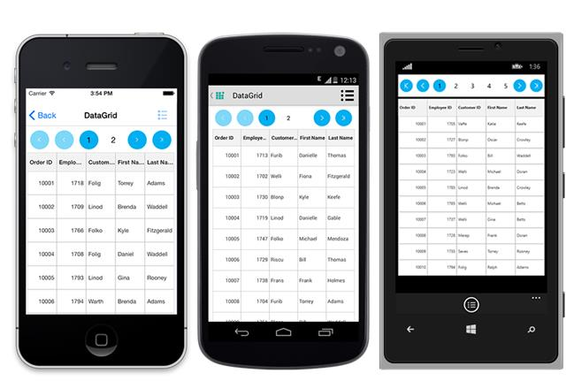
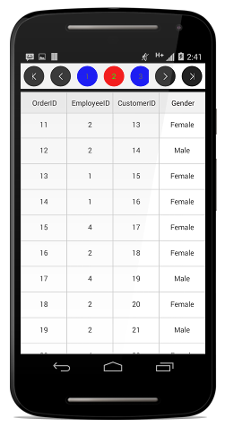
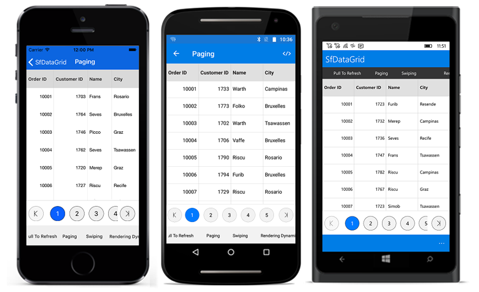

# Paging

The data grid interactively supports manipulation of data using [SfDataPager](http://help.syncfusion.com/cr/cref_files/xamarin/sfdatagrid/Syncfusion.SfDataGrid.XForms~Syncfusion.SfDataGrid.XForms.DataPager_namespace.html# “”) control. This provides built-in options to page data on demand when dealing with large volumes of data. `SfDataPager` can be placed above or below based on the requirement to easily manage data paging.

To use paging functionality in the data grid, add the following namespace to the project:
[Syncfusion.SfDataGrid.XForms.DataPager](http://help.syncfusion.com/cr/xamarin/sfdatagrid# “”)

There are two different modes in paging:

 * NormalPaging: NormalPaging loads the entire data collection to the `SfDataPager`.
 * OnDemandPaging: OnDemandPaging loads data to the current page dynamically in `SfDataPager`.

## Normal paging

The data grid performs paging of data using the `SfDataPager`. To enable paging, follow the procedure:

 * Create a new SfDataPager instance, and bind the data collection to the [SfDataPager.Source](http://help.syncfusion.com/cr/cref_files/xamarin/sfdatagrid/Syncfusion.SfDataGrid.XForms~Syncfusion.SfDataGrid.XForms.DataPager.SfDataPager~Source.html# “”) property based on which [SfDataPager.PagedSource](http://help.syncfusion.com/cr/cref_files/xamarin/sfdatagrid/Syncfusion.SfDataGrid.XForms~Syncfusion.SfDataGrid.XForms.DataPager.SfDataPager~PagedSource.html# “”) is created internally. 
 * Bind the `PagedSource` property to the [ItemsSource](http://help.syncfusion.com/cr/cref_files/xamarin/sfdatagrid/Syncfusion.SfDataGrid.XForms~Syncfusion.SfDataGrid.XForms.SfDataGrid~ItemsSource.html# “”) of the data grid. 
 * Set the number of rows to be displayed on a page by setting the [SfDataPager.PageSize](http://help.syncfusion.com/cr/cref_files/xamarin/sfdatagrid/Syncfusion.SfDataGrid.XForms~Syncfusion.SfDataGrid.XForms.DataPager.SfDataPager~PageSize.html# “”) property.
 * Set the number of buttons that should be displayed in view by setting the [SfDataPager.NumericButtonCount](http://help.syncfusion.com/cr/cref_files/xamarin/sfdatagrid/Syncfusion.SfDataGrid.XForms~Syncfusion.SfDataGrid.XForms.DataPager.SfDataPager~NumericButtonCount.html# “”) property.

N> The `SfDataPager.PageSize` property should not be assigned with value 0.

The following code example illustrates using `SfDataPager` with the data grid control:




<local:SamplePage x:Class="SampleBrowser.Paging"
                  xmlns="http://xamarin.com/schemas/2014/forms"
                  xmlns:x="http://schemas.microsoft.com/winfx/2009/xaml"
                  xmlns:local="clr-namespace:SampleBrowser;assembly=SampleBrowser"
                  xmlns:sfgrid="clr-namespace:Syncfusion.SfDataGrid.XForms;assembly=Syncfusion.SfDataGrid.XForms"
                  xmlns:sfPager="clr-namespace:Syncfusion.SfDataGrid.XForms.DataPager;
                                 assembly=Syncfusion.SfDataGrid.XForms">

  <local:SamplePage.BindingContext>
      <local:DataPagerViewModel x:Name="viewModel" />
  </local:SamplePage.BindingContext>
  
  <local:SamplePage.ContentView>
    <Grid> 
      <Grid.RowDefinitions>
        <RowDefinition Height="Auto" />
        <RowDefinition Height="*" />
      </Grid.RowDefinitions>

      <sfPager:SfDataPager x:Name ="dataPager"
                           Grid.Row="0"           
                           PageSize="15" 
                           HeightRequest ="50"
                           NumericButtonCount="20">
           
        <sfPager:SfDataPager.HeightRequest>
          <OnPlatform x:TypeArguments="x:Double"
                      iOS="50"
                      Android="50"
                      WinPhone="70"/>
        </sfPager:SfDataPager.HeightRequest>
      </sfPager:SfDataPager>
       
      <sfgrid:SfDataGrid x:Name="dataGrid"
                         Grid.Row="1"
                         AutoGenerateColumns="true"
                         ColumnSizer="Star"
                         SelectionMode="Single">             
      </sfgrid:SfDataGrid>
    </Grid> 
  </local:SamplePage.ContentView>
</local:SamplePage>




public partial class MainPage : ContentPage
{
    SfDataGrid sfGrid = new SfDataGrid();
    SfDataPager sfPager = new SfDataPager();
    ViewModel viewModel = new ViewModel();
    public MainPage()
    {
        InitializeComponent();
        sfPager.PageSize = 15;  //Setting the number of rows in a page        
        sfPager.Source = viewModel.Info;  //Setting data source to SfDataPager
        sfGrid.ItemsSource = sfPager.PagedSource;  //Setting ItemsSource to SfDataGrid
        sfGrid.ColumnSizer = ColumnSizer.Star;

        Grid myGrid = new Grid();
        myGrid.HorizontalOptions = LayoutOptions.FillAndExpand;

        myGrid.RowDefinitions = new RowDefinitionCollection
        {
          new RowDefinition { Height = 50 },
          new RowDefinition {},    
        };
        myGrid.Children.Add(sfPager, 0, 0);
        myGrid.Children.Add(sfGrid, 0, 1);
        this.Content = myGrid;
    }
}




The following screenshot shows the outcome upon execution of the above code:

N> The `SfDataPager` provides scrolling animation while tapping the [FirstPageButton](http://help.syncfusion.com/cr/cref_files/xamarin/sfdatagrid/Syncfusion.SfDataGrid.XForms~Syncfusion.SfDataGrid.XForms.DataPager.NavigationButtons.html) or [LastPageButton](http://help.syncfusion.com/cr/cref_files/xamarin/sfdatagrid/Syncfusion.SfDataGrid.XForms~Syncfusion.SfDataGrid.XForms.DataPager.NavigationButtons.html).

## OnDemandPaging	

In normal Paging, data collection is entirely loaded initially to the `SfDataPager`. However, the control also allows loading the data for the current page dynamically by setting the [SfDataPager.UseOnDemandPaging](http://help.syncfusion.com/cr/cref_files/xamarin/sfdatagrid/Syncfusion.SfDataGrid.XForms~Syncfusion.SfDataGrid.XForms.DataPager.SfDataPager~UseOnDemandPaging.html# “”) to `true`.

To load current page item dynamically, hook the [OnDemandLoading](http://help.syncfusion.com/cr/cref_files/xamarin/sfdatagrid/Syncfusion.SfDataGrid.XForms~Syncfusion.SfDataGrid.XForms.DataPager.SfDataPager~OnDemandLoading_EV.html# “”) event. In the `OnDemandLoading` event, use the[LoadDynamicItems](http://help.syncfusion.com/cr/cref_files/xamarin/sfdatagrid/Syncfusion.SfDataGrid.XForms~Syncfusion.SfDataGrid.XForms.DataPager.SfDataPager~LoadDynamicItems.html# “”) method to load data for the corresponding page in the `SfDataPager`.

The `OnDemandLoading` event is triggered when the pager moves to the corresponding page. It contains the following event arguments:

 * [StartIndex](http://help.syncfusion.com/cr/cref_files/xamarin/sfdatagrid/Syncfusion.SfDataGrid.XForms~Syncfusion.SfDataGrid.XForms.DataPager.OnDemandLoadingEventArgs~StartIndex.html# “”): Displays the corresponding page start index.
 * [PageSize](http://help.syncfusion.com/cr/cref_files/xamarin/sfdatagrid/Syncfusion.SfDataGrid.XForms~Syncfusion.SfDataGrid.XForms.DataPager.OnDemandLoadingEventArgs~PageSize.html# “”): Displays the number of items to be loaded for that page.

To load data for the DataPager control dynamically, follow the code example:


private void OnDemandPageLoading(object sender, OnDemandLoadingEventArgs args)
{
   sfDataPager.LoadDynamicItems(args.StartIndex, source.Skip(args.StartIndex).Take(args.PageSize));
}


N> In on demand paging, you cannot assign a value for the Source property.

When using `OnDemandPaging`, `SfDataPager.PagedSource` loads only the current page data. Upon navigation to another page, `OnDemandLoading` event is fired which loads another set of data, but maintains the previous page data also. When you navigate to the previous page again, OnDemandLoading event is not fired, and the required data maintained in the cache is loaded. However, for further performance enhancement if you do not want to maintain the previous page data, call [Syncfusion.Data.PagedCollectionView.ResetCache()](http://help.syncfusion.com/cr/cref_files/xamarin/data/Syncfusion.Data.Portable~Syncfusion.Data.PagedCollectionView~ResetCache.html# “”) in `OnDemandLoading` event. ResetCache method call resets the cache except the current page.

To use ResetCache method, follow the code example:


private void OnDemandPageLoading(object sender, OnDemandLoadingEventArgs args)
{
  sfDataPager.LoadDynamicItems(args.StartIndex, source.Skip(args.StartIndex).Take(args.PageSize));
  (sfDataPager.PagedSource as PagedCollectionView).ResetCache();
}


## AppearanceManager

The data grid allows changing the appearance by writing a style class overriding from the `AppearanceManager`, and assigning it to the [SfDataPager.AppearanceManager](http://help.syncfusion.com/cr/cref_files/xamarin/sfdatagrid/Syncfusion.SfDataGrid.XForms~Syncfusion.SfDataGrid.XForms.DataPager.SfDataPager~AppearanceManager.html) property.
  
To apply custom style, follow the code example:



<ContentPage xmlns="http://xamarin.com/schemas/2014/forms"
             xmlns:x="http://schemas.microsoft.com/winfx/2009/xaml"
             xmlns:sfgrid="clr-namespace:Syncfusion.SfDataGrid.XForms;assembly=Syncfusion.SfDataGrid.XForms"
             xmlns:local="clr-namespace:SfDataGrid_Sample;assembly=SfDataGrid_Sample"
             xmlns:sfDataPager="clr-namespace:Syncfusion.SfDataGrid.XForms.DataPager;assembly=Syncfusion.SfDataGrid.XForms"
             x:Class="SfDataGrid_Sample.Page1">

  <ContentPage.Resources>
    <ResourceDictionary>
      <local:CustomAppearance x:Key="customAppearance"/>
    </ResourceDictionary>
  </ContentPage.Resources>

  <ContentPage.BindingContext>
    <local:ViewModel x:Name="viewModel" />
  </ContentPage.BindingContext>
  
  <Grid>
    <Grid.RowDefinitions>
      <RowDefinition Height="Auto" />
      <RowDefinition Height="*"/>
    </Grid.RowDefinitions>

    <sfgrid:SfDataGrid x:Name="dataGrid" Grid.Row="1"
                       AutoGenerateColumns="True" />

    <sfDataPager:SfDataPager x:Name="sfDataPager"
                         Grid.Row="0"
                         PageCount="10"
                         PageSize="10"
                         NumericButtonCount="10"
                         AppearanceManager="{StaticResource customAppearance}"
                         Source="{Binding OrdersInfo}">
    </sfDataPager:SfDataPager>
  </Grid>
</ContentPage>


public partial class MainPage : ContentPage
{
    public MainPage()
    {
        InitializeComponent();
        this.dataGrid.ItemsSource = sfDataPager.PagedSource;
        // Apply the custom appearance to SfDataPager
        this.sfDataPager.AppearanceManager = new CustomAppearance();
    }
}




//Custom Appearance class
public class CustomAppearance: AppearanceManager
{
	public override Color GetNumericButtonSelectionBackgroundColor()
    {
        return Color.FromRgb(255, 0, 0);
    }

    public override Color GetNumericButtonSelectionForegroundColor()
    {
        return Color.FromRgb(0, 255, 0);
    }

	public override Color GetNumericButtonBackgroundColor()
    {
        return Color.FromRgb(0, 0, 255);
    }

	public override Color GetNumericButtonForegroundColor()
    {
        return Color.FromRgb(82, 82, 82);
    }

    public override Color GetNavigationButtonBackgroundColor()
    {
        return Color.FromRgb(34, 34, 34);
    }
    public override Color GetPagerButtonBorderColor()
    {
        return Color.Black;
    }

}


The following picture shows the customize appearance of data pager:

### Numeric button border color

Based on the requirement, customize the numeric button border color by overriding the [GetPagerButtonBorderColor](http://help.syncfusion.com/cr/cref_files/xamarin/sfdatagrid/Syncfusion.SfDataGrid.XForms~Syncfusion.SfDataGrid.XForms.DataPager.AppearanceManager~GetPagerButtonBorderColor.html) method.

To customize the numeric button border color, follow the code example:



 <Grid>
    <Grid.RowDefinitions>
      <RowDefinition Height="Auto" />
      <RowDefinition Height="*"/>
    </Grid.RowDefinitions>
    <sfgrid:SfDataGrid x:Name="dataGrid" Grid.Row="1"
                       AutoGenerateColumns="True" />

    <sfDataPager:SfDataPager x:Name="sfDataPager"
                         Grid.Row="0"
                         PageCount="10"
                         PageSize="10"
                         NumericButtonCount="10"
                         AppearanceManager="{StaticResource customAppearance}"
                         Source="{Binding OrdersInfo}">
    </sfDataPager:SfDataPager>
  </Grid>


 this.dataGrid.ItemsSource = sfDataPager.PagedSource;
 // Apply the custom appearance to SfDataPager
this.sfDataPager.AppearanceManager = new CustomAppearance();




public class CustomAppearance : AppearanceManager
{
    public override Color GetPagerButtonBorderColor()
    {
        return Color.Black;
    }
}


